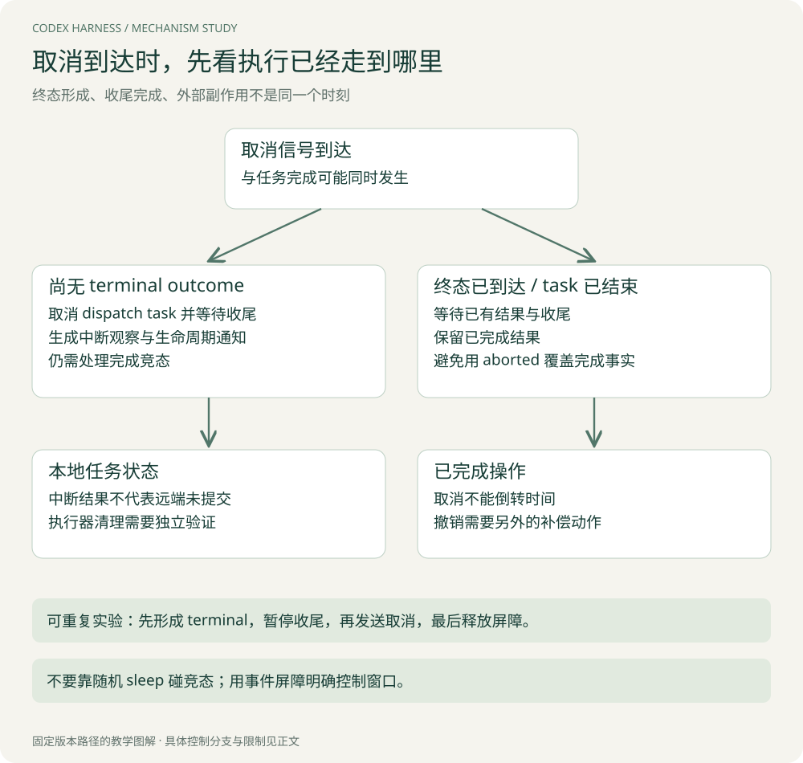
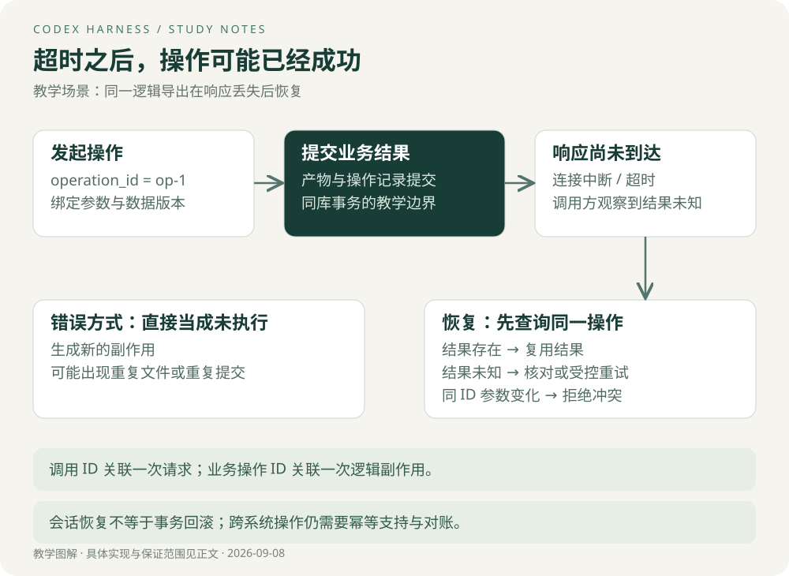

# 状态与可靠性：断流、取消、压缩之后如何继续

本章先解释 Codex 已读路径的记录与重试，再讨论外部副作用。顺序很重要：知道运行框架保存了什么，才能判断恢复时还有什么不确定。

## 1. 从一条已完成工具调用遭遇断流开始

延续 A 读取实现的例子：工具调用 item 已完整到达，A 已执行，但模型流在 Completed 事件之前断开。此时不能简单选择“整个响应作废，从头重来”。因为工具与历史可能已经前进。

本版 `handle_output_item_done` 在安排工具执行前记录完整调用；流消费退出后有 `drain_in_flight` 收集结果。中层 `run_sampling_request` 第一次使用给定输入，后续重试从当前历史重新构造 Prompt。[工具调用记录](https://github.com/openai/codex/blob/d6489472f3c15e87d2d7763a5fde033545c530f8/codex-rs/core/src/stream_events_utils.rs#L290) · [重试输入](https://github.com/openai/codex/blob/d6489472f3c15e87d2d7763a5fde033545c530f8/codex-rs/core/src/session/turn.rs#L1422)

教学时间线：

```text
H0 = 用户请求
收到 call A       → H1 = H0 + call A
A 完成，结果收集  → H2 = H1 + output A
本次模型流失败    → 错误分类
允许重试         → 基于当前 H2 准备输入，而非固定重发 H0
```

**设计收益是保留已发生工作的观察。** 这减少了模型完全不知道先前动作的情况，却仍不等于模型绝不会再次请求 A，也不构成任意副作用的去重保证。

## 2. 可重试错误与不可重试错误在哪划分

中层对上下文超限、用量限制有专门处理，其余错误检查 `is_retryable`；可重试路径受 provider 的重试配置与重试处理函数约束。不能把所有非成功响应套进无限 while 循环。

同一个 Turn 内重用 `ModelClientSession`，源码注释说明它保存连接及路由相关状态。与此同时，每次重试会清除当前存储的 ResponseId，避免新工具被错误归属到上一响应。[请求级处理](https://github.com/openai/codex/blob/d6489472f3c15e87d2d7763a5fde033545c530f8/codex-rs/core/src/session/turn.rs#L1446)

这体现一个重要区分：**可以复用连接上下文，但不能复用上一响应的身份。** “重试前把所有状态清空”会丢工作；“所有状态原样保留”又会误关联。要逐字段决定生命周期。

## 3. 记录调用，是否意味着已经安全落盘

`record_prepared_conversation_items` 先更新内存历史，再形成 rollout items 并调用持久化接口。`persist_rollout_items` 在存在 live thread 时调用 append，失败则记录错误；本层没有把该错误作为事务失败返回给调用者。[记录顺序](https://github.com/openai/codex/blob/d6489472f3c15e87d2d7763a5fde033545c530f8/codex-rs/core/src/session/mod.rs#L3382) · [append 边界](https://github.com/openai/codex/blob/d6489472f3c15e87d2d7763a5fde033545c530f8/codex-rs/core/src/session/mod.rs#L4173)

同一模块另有 `flush_rollout`，将 flush 的结果返回。这意味着静态阅读时必须区分：已加入内存、已交给记录组件、已经达到相应持久化屏障。看到一个 async append 不能直接推导每条工具调用在执行前都 fsync 到稳定介质。[flush 入口](https://github.com/openai/codex/blob/d6489472f3c15e87d2d7763a5fde033545c530f8/codex-rs/core/src/session/mod.rs#L1270)

本章未逐层证明记录器、文件系统与硬件的断电保证，因此只陈述这些边界。也不能据此直接判定 Codex 有持久化缺陷：不同产品可能有不同耐久性要求，完整结论需要阅读 flush 调用者与故障测试。

> **Tip｜不要把函数名当成保障级别**
> `persist`、`checkpoint`、`commit` 的真实含义由具体调用链决定。先检查成功条件、错误传播、flush 屏障和恢复读取，再说“不会丢”。

## 4. 压缩记录为什么包含替换历史与基线

压缩后内存中的工作窗口改变。如果恢复只重放一条“已经压缩”的文本，而没有知道历史如何替换、设置基线是什么，恢复出的请求可能与压缩后的真实请求不同。

本版 `replace_compacted_history` 构造含 replacement history 的 CompactedItem；获得设置持久化锁后替换历史，维护 retained context 与 world-state 基线，再按顺序记录相关项。设置锁注释强调避免后续更新越过当前设置快照。[实现](https://github.com/openai/codex/blob/d6489472f3c15e87d2d7763a5fde033545c530f8/codex-rs/core/src/session/mod.rs#L3778)

它解决的是“恢复所需记录与当前上下文迁移相协调”。不要把这扩大成与任意数据库副作用的分布式事务。运行框架内部状态一致与业务系统一致，仍然是两个问题。

## 5. 取消存在三个不同位置



[查看原图，可放大阅读](images/cancel-race.svg)

| 位置 | 可以确认的事实 | 不能据此确认的事实 |
| --- | --- | --- |
| 等待工具准入时 | handler 尚未通过该执行门 | 任意前置 readiness 都没有影响外部系统 |
| handler 运行中 | 本地执行任务可收到取消 / 被 abort | 外部服务已经撤销请求 |
| terminal outcome 已到达 | 运行时可能保留完成结果 | 后续展示、记录已全部成功 |

代码在后两种状态交汇处有终态检查与 join 收尾，避免把已经完成的工具盲目改成 aborted。自己实现时也应让完成和取消竞争同一个终态，而不是让两个回调随意覆盖 status。

特别注意，“任务取消”是停止继续工作；“业务补偿”是对已完成操作再执行一个撤销或清理动作。后者可能失败，也可能根本不存在。

## 6. 把只读 A 换成导出：新的不确定性出现了

只读任务重复一次主要增加成本；导出、发送消息或写数据库则可能产生重复结果。假设外部服务完成导出，但响应丢失，调用方只知道超时。



[查看原图，可放大阅读](images/recovery.svg)

这里需要独立的业务操作标识。call ID 关联模型这次请求；operation ID 标识“用户要求的这一次逻辑导出”。网络重试或模型重新发起调用时，前者可能变，后者应由应用语义决定是否复用。

一个具体协议可以是：

```text
调用 export(operation_id, normalized_parameters, data_version)
若 operation_id 已存在且参数相同：返回既有状态 / 结果
若 operation_id 已存在但参数不同：拒绝冲突
若不存在：创建这次逻辑操作，再执行或调度
结果未知：query_operation(operation_id)，避免直接创建另一次
```

这只是教学方案。若执行副作用在对象存储而状态在数据库，单库事务并不能覆盖两者；要继续设计临时对象、发布标记、外部幂等或核对流程。

## 7. “先记处理中”为什么仍然不够

假设 Worker 先写 RUNNING，然后崩溃。以后所有重试看到 RUNNING 都直接返回，就会永久卡住。要区分活跃执行和失效执行，可能需要租约、心跳、版本号以及恢复责任人。

假设租约过期后新 Worker 接管，但旧 Worker 又恢复运行。仅靠超时判断无法阻止旧 Worker 继续写；对受控存储可使用 fencing token 等版本约束，在真正提交端拒绝旧执行者。对于不支持这种约束的第三方接口，仍需接受并管理剩余风险。

因此幂等键、租约和 fencing 分别处理不同问题：重复逻辑请求、失效接管、过期执行者。不能用一个 Redis 锁同时宣称解决全部问题。

## 8. 故障表应覆盖观察与实际状态的差异

| 故障 | 调用方观察 | 真实状态候选 | 验证方式 |
| --- | --- | --- | --- |
| 模型流中断 | 本次请求错误 | 部分工具已执行 | 检查最新历史与调用结果 |
| 保存记录失败 | 内存仍可能有结果 | 重启后可能缺记录 | 注入 append / flush 失败并重启 |
| 导出响应超时 | 结果未知 | 未执行 / 执行中 / 已完成 | 按操作 ID 查询或核对产物 |
| 取消与完成同时发生 | 两个信号竞争 | 已完成或未完成 | 屏障控制时间线，不靠随机 sleep |
| 压缩后重启 | 加载替换历史 | 基线可能不匹配 | 比较恢复前后模型可见上下文 |

实验不是只断一次网，看 UI 有没有报错。要记录注入点，证明系统最终状态符合你声明的保证。

[下一章：源码与优化亮点](06-源码与优化亮点.md) · [专题目录](00-阅读指南.md)
