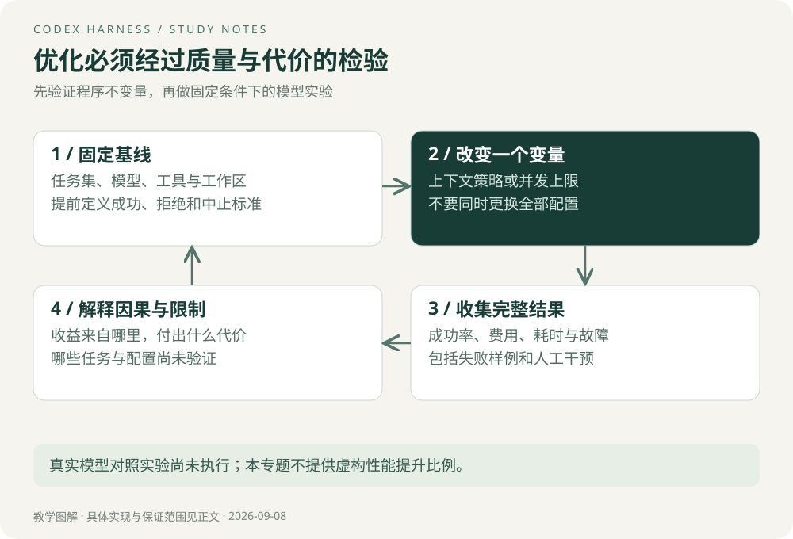

# 实验与评测

## 先验证不变量，再比较模型效果

学习分为两层：第一层不调用模型，验证历史配对、操作去重和失败恢复；第二层固定模型与任务，评估完整系统的质量、耗时与费用。前一层通过，不代表后一层也通过。

本专题附带 [harness_lab.py](code/harness_lab.py)，仅使用 Python 标准库，在临时 SQLite 数据库中运行，不调用模型、不修改实际业务数据。

```bash
python3 'content/notes/Codex Harness/code/harness_lab.py'
```

运行记录见 [verification.txt](code/verification.txt)。文件记录的是教学实验的实际输出，不是 Codex 性能或生产运行记录。

## 实验一：超长输出中的关键证据

脚本构造一条关键错误位于中间的日志，比较前缀截断与基于已知错误标识的保留策略。两种输出使用相同字符预算，检查关键行是否保留。

预期：单纯前缀裁剪可能丢失关键行，而针对该样例的策略能保留它。这个结果只说明裁剪方法会影响证据可见性；脚本知道错误标识，真实任务未必有这种先验。它不能证明通用检索策略更优。

扩展实验：把错误移到开头、中间、结尾；加入多个错误、没有 ERROR 标记的失败、错误标记出现在无关日志里的情况。真实评测还要测量模型是否正确利用保留的证据。

## 实验二：历史配对的边界

脚本构造缺少结果的调用，以及没有对应调用的孤立输出。教学规范化函数为前者补充“结果缺失”，删除后者，然后检查所有普通工具输出是否有对应调用。

关键点：不能补成“成功”。此实验只有普通 call/output 类型，未实现 Codex 的具名外部输出例外、多模态处理和其他协议类型。

## 实验三：提交成功后响应丢失

教学导出函数在同一 SQLite 事务里写业务产物记录与操作记录，提交后主动抛出超时，模拟响应丢失。重新打开数据库连接后，用相同操作 ID 重试，检查是否复用结果；再使用同 ID、不同参数，检查是否拒绝冲突。

这是一个真实执行的故障窗口实验，但覆盖范围严格限定在同一数据库。产物是数据库中的教学记录，不是真实导出文件；没有证明跨数据库与对象存储的原子性，也没有证明多个 Worker 的完整恢复。

> **Tip｜测试应观察外部结果**
> 不仅检查函数“返回成功”，还要查询产物数量、操作记录和参数一致性。这样才能发现重复副作用。

## 四组真实模型实验：后续实践计划

| 实验 | 固定条件 | 改变变量 | 主要指标与风险 |
| --- | --- | --- | --- |
| 输出策略 | 模型、任务、工具、预算 | 原始、截断、检索摘要 | 完成率、关键证据遗漏、输入 token |
| 压缩策略 | 相同长任务与资料 | 触发时点、保留字段 | 约束遗漏、恢复后正确率、压缩耗时 |
| 工具并行 | 相同无依赖调用集合 | 并发上限 | 端到端耗时、限流、冲突、重试 |
| 调用预算 | 相同任务集和工具 | 最大轮次或费用上限 | 成功率、预算中止率、费用分布 |

这些实验尚未执行。不要把预期收益写成已测结果，也不要同时更换模型、提示词、工具和并发后，把改善全部归因于 Harness。

## 评测口径怎么定义

任务集应包括正常任务、需要澄清的任务、应拒绝的越权请求、工具故障和无法完成的任务。为每类事先定义期望结果；该拒绝的任务正确拒绝可以算成功，不能都按“生成产物”打分。

分母使用预先确定的全部任务，基础设施失败单独标注，不能悄悄删除失败样本。每个策略使用同一任务集，隔离工作区并重置状态；多次运行以观察随机波动，记录模型标识、配置、时间与样本数。

费用/成功任务可定义为该批次全部运行费用除以成功任务数，包含失败运行费用；成功数为零时该指标无定义，不能填零。延迟同时报告全部运行与成功运行口径，避免预算中止让整体延迟看起来更好。



## 结果表与停止规则

```text
任务集版本 / 样本数 / 重复次数：
源码版本 / 模型标识 / 配置 / 运行时间：
唯一实验变量：
各类别成功数与总数：
总费用 / 输入输出 token / 缓存口径：
耗时分布 / 超时与取消 / 人工干预次数：
失败样例与根因：
结论适用范围 / 未验证条件：
```

优化只有在质量和安全边界满足预设要求后才有意义。不要只选一个最快样例展示；出现质量下降时应如实说明减少成本所付出的代价。

[下一章：面试与项目迁移](08-面试与项目迁移.md) · [专题目录](00-阅读指南.md)
