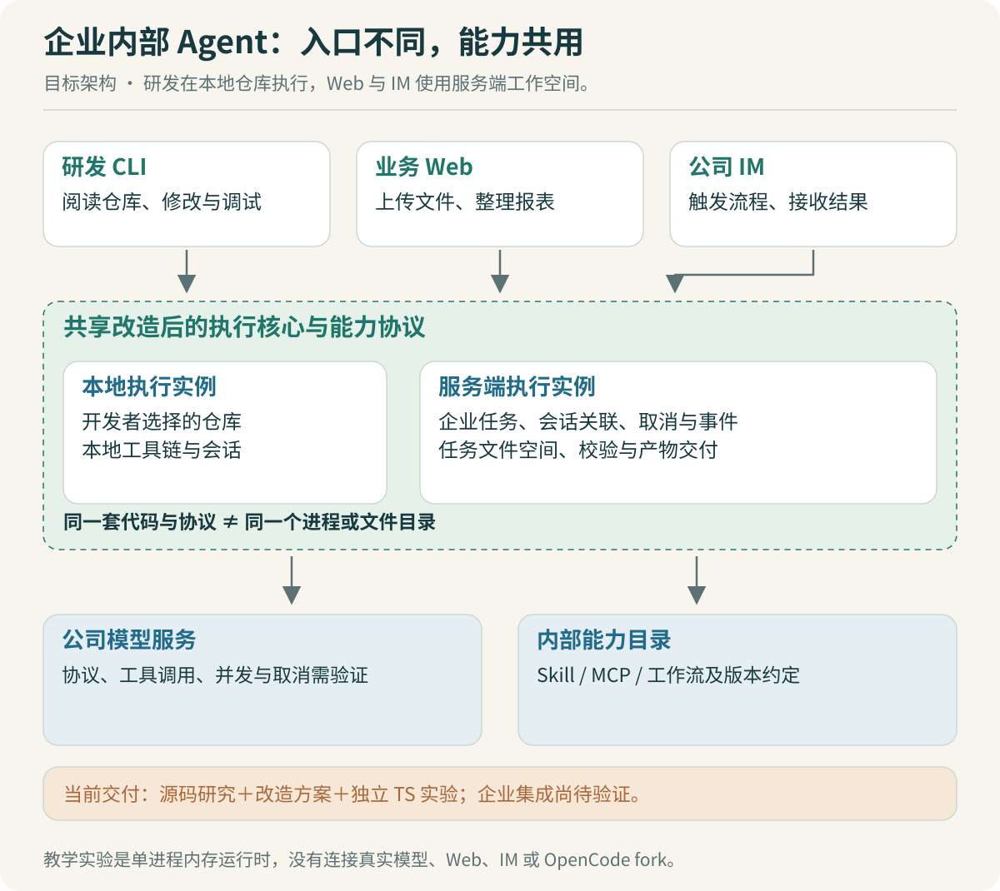

# 员工任务与架构：先确定系统边界

“给公司做一个 AI 工作台”还不足以让 Codex 开始可靠地开发。它可能生成一个聊天页面，也可能直接搭一套微服务。两者都能演示，都未必解决员工的问题。

先把第一位用户放进场景。某位运营同事拿到部门费用明细，希望合并成一张汇总表，下载后发给负责人。他关心字段含义、统计范围、金额是否正确、失败后能否继续。页面上流畅地显示一段解释，不能代替这张表。

## 三类任务有不同的完成标准

| 使用方式 | 一个具体请求 | 完成标准 |
|---|---|---|
| 研发 CLI | 阅读当前仓库，修改报表导出逻辑 | 改动可审查，相关检查通过，明确未验证项 |
| 非研发 Web | 上传明细，按部门汇总，生成下载文件 | 口径确认、校验通过、产物可以取回 |
| 公司 IM | 调用已发布的月度报表流程 | 身份对应正确，消息重投不重复建任务，结果能回到原会话 |

“做个小工具”还需要进一步限定。例如，把每周重复的 CSV 汇总做成一个上传页面，其范围可以是一个固定模板、一个输入格式、一套已确认的规则。若直接让模型生成任意应用并长期托管，依赖安装、运行隔离、网络访问、数据存储和维护都会进入项目范围。第一版先做受约束的小工具生成与预览，更容易形成能验收的成果。

IM 中的“数字人分身”在这里定义为岗位助手：有角色说明、可用能力、授权范围和会话记录。它可以用运营同事熟悉的方式解释报表，但调用业务 API 时仍使用经过授权的身份。提示词里写“我是财务负责人”，不会因此得到财务系统权限。

> [!TIP] 对齐需求时问结果
> 问“你最后要拿这个文件做什么”，往往比问“你想要什么 AI 功能”更有效。对方若要拿去付款，金额口径和审阅流程必须先明确；若只做探索分析，允许的交互和失败处理可以不同。

## 共用执行核心，分别安排运行位置

“Web 底层还是改造后的 CLI”可以落成共享 OpenCode 的执行核心和服务接口。CLI 是一种入口，Web 不必解析终端文字来猜任务状态。OpenCode 已经提供服务端与会话接口，具体源码路径见 [03](03-源码对照：从调用链找到改造位置.md)。企业改造应先复用这些接口，再补企业语义。

研发人员的代码任务通常需要本地仓库、开发工具链和用户选择的目录。非研发的 Web / IM 任务则应分配服务端工作空间，上传文件进入对应任务目录，产物由服务端保存与分发。两者可以共享执行代码、能力协议和事件模型，却不必共用一个进程，更不能默认共用一个可随意读写的目录。

这里提出的是目标架构，教学实验只实现其中单进程的任务语义。未来部署成多个 Worker 后，内存 Map 无法承担跨进程幂等、任务恢复和租约管理。那时需要持久化状态和原子状态更新；引入数据库是因为部署方式改变了正确性条件。

## 公司算力到应用之间还有一层接口

已有 GPU 和模型权重，不等于应用已经有可用的模型服务。本项目假设公司能提供一个受管理的推理端点，由模型平台负责部署、容量和模型版本。应用需要确认协议、鉴权、流式响应、工具调用、上下文限制、并发限额，以及请求取消后的计费和资源释放行为。

如果内部服务只能返回普通文本，不能直接假定 OpenCode 所需的工具调用行为会成立。模型可能输出看起来像 JSON 的内容，却没有稳定的工具调用 ID 和完成事件。05 会把这些差异拆成可复现的协议案例，再决定用 provider 配置、适配器还是受约束的替代路径。

在面试里，可以说自己负责应用接入与验证。只有实际负责过模型部署和性能优化，才继续展开推理服务层的贡献。

## 任务、会话和消息为什么要分开

一个会话可以先汇总八月报表，再处理九月报表。它们可以共享部分背景，但属于不同任务。一个任务内部又可能经历多轮模型调用和多个工具执行。

本专题实验使用 `actor + channel + conversation + messageId` 识别一次入口请求，并返回独立的 `taskId`。相同身份和消息标识下，内容相同就复用任务，内容不同就报幂等冲突。真实适配层负责从可信认证结果中取得这些字段，不能把模型生成的身份字符串直接交给任务服务。

| 标识 | 解决的问题 | 不能替代什么 |
|---|---|---|
| 员工身份 | 谁在调用、能使用哪些资源 | 模型推测的角色 |
| 会话标识 | 结果返回哪个会话、如何关联背景 | 每次任务的独立状态 |
| 消息标识 | 识别入口重投 | 外部业务接口的幂等键 |
| 任务标识 | 查询状态、取消、找产物 | 一次模型请求的 ID |
| 事件序号 | 重连后从哪里继续读 | 重新执行任务的指令 |

分清这些标识后，故障才有明确落点。浏览器断线但任务仍运行，应当重新订阅；IM 重推一条消息，应当查已有任务；业务 API 超时且结果未知，应当按业务幂等键查结果。把三种情况都处理成“再调用一次模型”，会扩大问题。

## 第一版的功能边界

先选择报表整理作为贯穿案例：固定输入格式，模型负责理解请求和选择工具，确定性代码负责金额计算，产物通过校验后交付。然后加入一次任务的去重、取消和事件读取。Skill / MCP 目录先验证发布版本和任务版本快照，目录页面、搜索推荐和运营排行可以后置。

小工具和 IM 复用这条已验证的路径。前者把确认过的规则做成可重复执行的界面；后者增加身份映射和回执，不复制一套 Agent 循环。第一版是否成功，应看同一报表任务能否解释、复现和排错。

> [!TIP] 架构图要能回答“哪一层拒绝”
> 员工没有权限读取某部门数据时，业务工具或授权服务应拒绝；金额格式错误时，解析器应拒绝；事件游标不合法时，事件接口应拒绝。每个判断都有明确执行位置，才方便写测试和定位故障。

交给 Codex 的第一个任务可以是：“列出这三类入口完成报表任务所需的最少接口，标记 OpenCode 原有接口、需要新增的企业约束、当前不知道的公司接口。给出一条最小调用路径及完成标准。”拿到答复后，先核对它是否偷偷增加了产品范围，再进入规格设计。

上一篇：[阅读指南](00-阅读指南：这个项目要证明什么.md) · 下一篇：[SDD 与 Codex](02-SDD与Codex：把做对写成可验收规格.md)。
