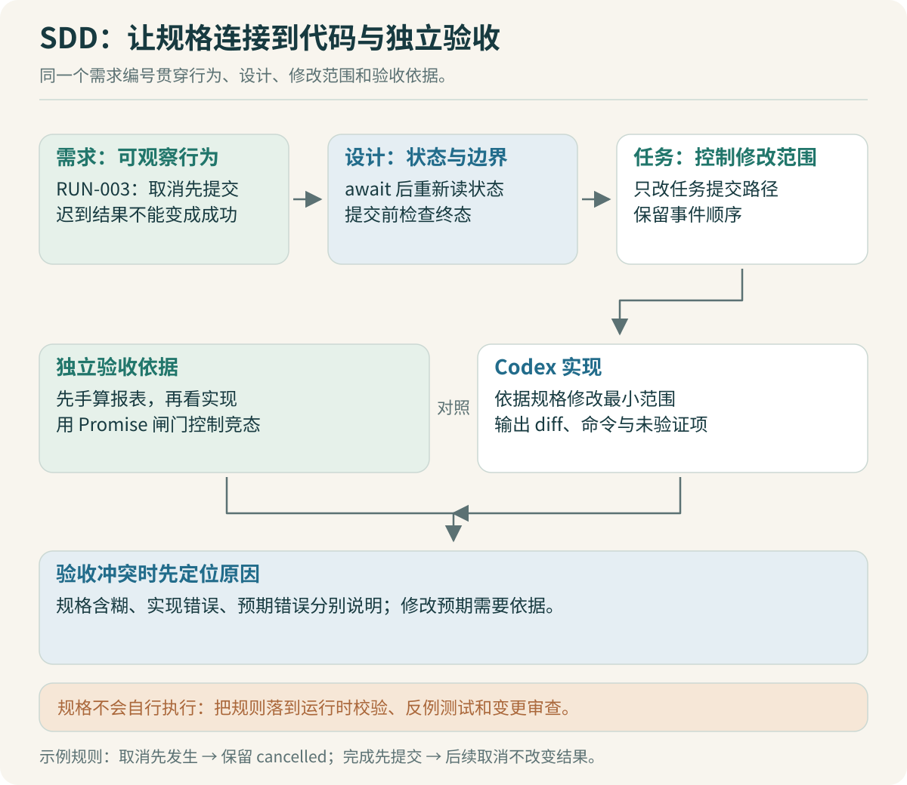

# SDD 与 Codex：把做对写成可验收规格

假设 Codex 已经写好了报表程序，演示也显示“汇总成功”。你打开文件，发现 100 元、50 元和 80 元被合成了 230 元。这一次结果正确，还不能回答下一次上传有重复记录会怎样，也不知道用户取消之后文件会不会照常发布。

SDD 在本专题中指规格驱动开发：先写下可观察的行为和约束，再让实现与验收围绕它们展开。采用哪套文档工具不影响这个基本做法。规格本身不会执行；只有规则进入运行时检查、测试和交付检查，它才真正约束结果。



## 先把业务歧义清出来

“按部门汇总金额”至少藏着这些问题：金额是哪种币种？空金额按零算还是报错？负数代表退款还是非法数据？同一个记录 ID 出现两次能否去重？输出保留几位小数？

这些都是业务语义。让 AI 自己选，可能得到看起来合理却不符合实际流程的结果。教学案例明确采用单一币种、非负金额、固定两位小数、重复记录 ID 整份拒绝。`100.00` 符合约定，`100` 和 `100.0` 都会失败。真实业务允许退款或其他金额格式时，应修改规格和样例，而不能为了让某个测试通过，私自把负数变成绝对值。

规格可以先写得很小。配套 [requirements.txt](specs/requirements.txt) 只围绕报表和任务机制，没有先设计一整套平台。

| 需求编号 | 可观察行为 | 必须保留的反例 |
|---|---|---|
| RPT-001 | 销售 150.00、研发 80.00、总计 230.00，金额用分计算 | 小数精度不得依赖浮点近似 |
| RPT-002 | 非法金额、重复记录 ID 明确失败 | 不能静默跳过坏行后宣称成功 |
| RUN-001 | 同一入口消息和相同内容返回同一任务 | 同键不同内容必须冲突 |
| RUN-002 | 游标之后的事件按序返回，不改变执行状态 | 重连不得再执行一遍工具 |
| RUN-003 | 先取消，迟到结果不能提交；先完成，取消无效 | 终态不可被另一个终态覆盖 |
| CAP-001 | 创建任务时固定能力版本标签 | 外部目录更新不改变进行中任务的标签 |

> [!TIP] 写“不能发生什么”时给出输入
> “不能重复执行”还不够具体。写成“同一员工、入口、会话、消息 ID，内容相同重投两次，返回同一个 taskId”，实现者才知道去重范围。换一个员工是否复用任务，也应有对应反例。

## 用状态转换解释最难的一条规格

RUN-003 看起来像一个取消按钮，实际涉及两个时间顺序。

第一种：工具还在等待时，用户取消。运行时先把状态设为 `cancelled`，再发出协作取消信号。某些工具不响应信号，仍可能返回结果，因此 `await` 之后必须重新检查任务状态。如果已经取消，结果不能进入产物。

第二种：工具已经返回，运行时把结果提交到内存，状态成为 `completed`，用户才点击取消。此时取消返回无效，完成状态和内存产物保留。实验信任已知工具的返回值，完整产物另由外部检查核对；接入生成代码或远程工具时，运行时还要增加结果校验。取消请求无法把已经完成的事情变成没发生。

对应的设计片段如下，完整实现见 [runtime.ts](code/runtime.ts)：

```ts
const report = await tool(request, snapshot, signal);
if (runtime.view(taskId).status !== 'running') return;
// 从状态检查到产物及终态提交之间不能插入 await。
// 配套实验的保证仅适用于同一个 JS 进程中的这段同步执行。
commitArtifactAndComplete(report);
```

这里的 `commitArtifactAndComplete` 是说明意图的伪代码名称，实验中对应 `TaskRuntime.run` 内的同步赋值。部署为多进程后，条件更新需要移到共同的状态存储中，不能照搬“中间没有 await 就安全”的结论。

## 四份文档各自回答一个问题

[需求](specs/requirements.txt) 写外部行为；[设计](specs/design.txt) 写数据和状态怎样支撑行为；[任务拆分](specs/tasks.txt) 写这次修改落在哪些文件；[验收](specs/acceptance.txt) 写用什么输入证明结果。小需求可以合在同一文档，职责仍要分清。

同一需求编号贯穿其中。例如，RUN-001 对应 `TaskRuntime.create` 中的去重键与请求哈希，验收同时检查相同消息复用、不同内容冲突、不同身份隔离。测试名称不必等于需求编号，但从规格应能找到对应验证位置。

文档不要预先把所有私有函数名写死。固定外部行为、状态语义与模块边界，让 Codex 自主选择局部实现；当实现必须改变业务口径或公共接口时，再提出具体差异并更新规格。这样既保留开发效率，也避免 AI 为了通过测试改掉需求。

## 一张可以直接使用的 Codex 任务卡

下面是用于本项目教学实验的任务卡，不是给企业平台的一次性总指令：

```text
目标：实现 RUN-001 的入口消息去重。

先读：specs/requirements.txt、specs/design.txt，检查现有 create 和测试。
实现范围：code/runtime.ts；必要的回归放在 code/lab.test.ts。
身份来源：可信入口适配层；此实验用合成身份，不实现登录。
业务约束：键包含 actor/channel/conversation/messageId。
同键同内容复用任务；同键不同 instruction 或 csv 报冲突。
创建后应保存请求和能力版本的副本。

先用最小输入验证去重，再完成改动。
常规局部实现由你判断；遇到口径冲突，先指出冲突和影响。
禁止用“总是返回第一个任务”满足正向样例。
完成后运行实验说明中的相关检查，报告实际命令、结果和未覆盖范围。
审查重点：身份隔离、请求内容变更、对象引用被外部修改。
```

这张任务卡给出了判断依据，也给出了合理的自主空间。目标、上下文与验证要求适合写在当前任务里；长期适用的项目约定可以放进 `AGENTS.md`。OpenAI 官方文档介绍了 Codex 如何读取全局与项目级 `AGENTS.md`，具体生效范围应按目录与运行方式核对。[官方说明](https://learn.chatgpt.com/docs/agent-configuration/agents-md)

配套 [AGENTS.example.txt](specs/AGENTS.example.txt) 是独立实验的示例，没有修改这个学习网站的实际开发约定。接入 OpenCode fork 时，应使用上游自己的依赖安装、类型检查和测试命令，不能把教学实验的 Node 命令当作上游验证。

## 独立验收要独立在哪里

如果 AI 同时写计算函数和测试，并在测试里再调用同一个计算函数生成期望值，两者可能一起算错。独立验收至少需要一个不依赖被测实现的结果来源。这里的三条记录可以人工核算，期望值作为固定样例保存。

取消竞态不能只靠 `sleep(10)` 赌时序。测试应使用可控制的 Promise：先让工具明确进入等待，执行取消，再释放工具结果；另一条测试则先提交结果再取消。这样验证的是两个确定顺序，机器快慢不会改变测试想表达的条件。

对 AI 生成的测试，还要读断言：它检查了金额，还是只检查结果非空？检查了没有产物，还是只检查状态是取消？异常样例是否真的走到目标分支？测试数量不能替代这些判断。

> [!TIP] 请另一次审查主动找反例
> 给审查任务提供规格、改动和运行结果，让它尝试构造“测试全绿但仍违背需求”的输入。例如相同消息 ID 来自两个员工，或任务创建后原始对象被修改。审查意见也要复现，不能把第二次模型回答当成最终裁决。

## 规格发生变化时怎么处理

假设业务后来允许负数退款。先确认总额和退款展示方式，再更新 RPT-001 / RPT-002 的口径、补负数样例、调整解析和展示，最后运行受影响的回归。旧的拒绝负数测试需要有理由地修改，而不是保留旧文档、只把测试改绿。

变更规模也要受控。做消息去重时顺手重写模型适配层，会让验证范围突然扩大。可以记录重构建议，当前变更先完成已约定行为。AI 容易迅速生成很多代码，开发者需要决定哪些代码此刻值得加入。

本章的任务卡和规格是本项目的设计方法。官方最佳实践也建议给 Codex 提供清晰上下文，并要求它运行检查、核对改动结果；本项目进一步把这些要求落到金额、去重和取消样例上。[Codex 最佳实践](https://learn.chatgpt.com/guides/best-practices)

上一篇：[员工任务与架构](01-员工任务与架构：先确定系统边界.md) · 下一篇：[源码对照](03-源码对照：从调用链找到改造位置.md)。
