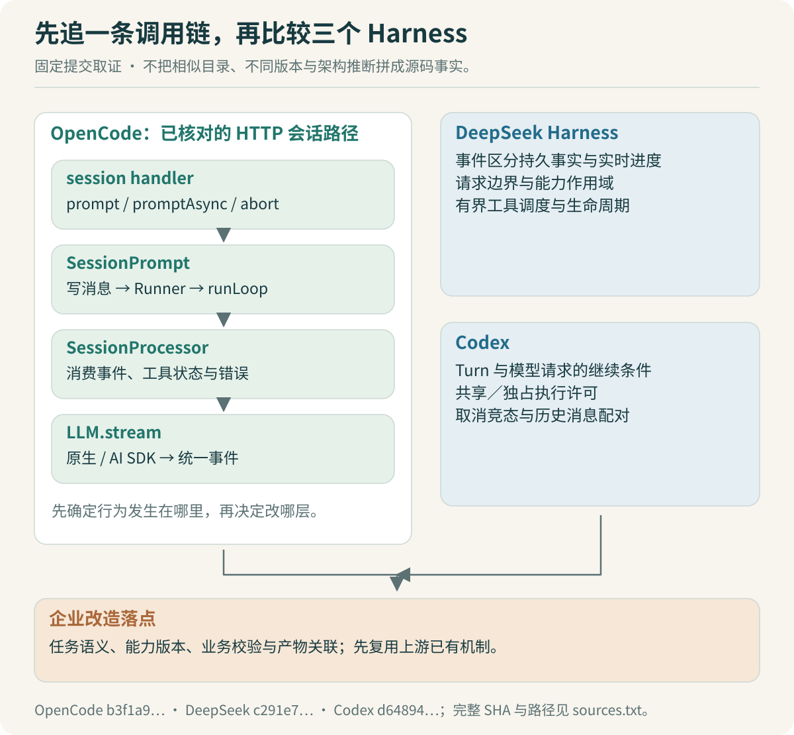

# 源码对照：从调用链找到改造位置

接到“把 OpenCode 改成内部 Agent 工作台”的任务，直接让 Codex 生成总体方案，通常很快就能得到一张漂亮的架构图。问题在于，图里可能把上游已有的能力重新设计了一遍，也可能使用当前版本根本不存在的接口。

这一篇先完成一件具体的事：沿着“上传报表，请按部门汇总金额”追踪请求，知道它在哪里进入执行循环，在哪里调用模型，又在哪里保存工具结果。然后带着明确的问题读另外两个 Harness，寻找值得迁移的机制。



## 先固定版本，避免读出一条不存在的调用链

本次取证日期是 2026-09-11，固定以下提交：

| 仓库 | 固定提交 | 这次阅读的重点 |
|---|---|---|
| OpenCode | `b3f1a96c6dd7adeb28b36dd11add1998fc84d67b` | HTTP 会话入口、执行循环、模型适配、取消、Skill/MCP、压缩 |
| DeepSeek Harness | `c291e7961a515f6d7af9304e7fd1d257929aef26` | Agent 作用域、事件、请求冻结、工具调度 |
| Codex | `d6489472f3c15e87d2d7763a5fde033545c530f8` | Turn 执行、工具并发与取消、历史整理、压缩 |

这里的 Codex 指开源仓库中可读的实现。本专题不会据此推断桌面产品未公开的内部机制。

OpenCode 的这个版本同时存在 `packages/core` 与 `packages/opencode` 中的会话代码。路径相似，不代表它们可以随意拼成调用链。本篇选择已核对的兼容 HTTP 会话处理路径：`packages/opencode/src/server/routes/instance/httpapi/handlers/session.ts` 调用 `SessionPrompt.Service`，再进入该包中的 `session/prompt.ts`。

> [!TIP] 让 Codex 带着证据回答
> 阅读任务里写明提交 SHA，并要求输出“文件路径、函数名、调用者、被调用者、待确认项”。只有文件名的概括还不足以证明调用关系；至少打开关键调用位置核对参数与返回值。

完整取证文件清单保存在 [sources.txt](sources.txt)。它记录实际读取范围，方便升级上游版本后重新核对。

## 一次请求到底经过哪里

在 HTTP handler 中，`prompt` 调用 `promptSvc.prompt` 并返回结果；`promptAsync` 把执行工作交给对应 Scope 中的 Fiber 后返回。`abort` 则转给 `promptSvc.cancel`。这说明上游已经有同步与异步提交、取消入口。异步入口存在，并不能单独证明进程重启后任务可恢复。[会话入口源码](https://github.com/anomalyco/opencode/blob/b3f1a96c6dd7adeb28b36dd11add1998fc84d67b/packages/opencode/src/server/routes/instance/httpapi/handlers/session.ts#L295)

`SessionPrompt.prompt` 先找到会话、整理 revert 状态、写入用户消息，再按参数决定是否进入循环。`loop` 通过 `SessionRunState.ensureRunning` 使用该会话的 Runner。到这里，用户消息已经成为会话的一部分，“正在执行”与“等待新的模型响应”开始有了独立的生命周期。

接下来是 `runLoop`：读取压缩后的消息视图，找到最近用户消息、助手消息和待处理任务，决定继续、结束或先压缩；准备 Agent、模型、工具、系统信息；创建 Processor 并处理这一轮模型事件。工具结果写回之后，下一轮模型可以据此继续工作。[Prompt 与循环源码](https://github.com/anomalyco/opencode/blob/b3f1a96c6dd7adeb28b36dd11add1998fc84d67b/packages/opencode/src/session/prompt.ts#L1052)

下面是根据上述调用关系写的教学伪代码，省略 Effect 依赖与错误类型，不能粘贴回上游运行：

```ts
async function handleReportRequest(input: UserInput) {
  const session = await appendUserMessage(input);
  return sessionRunner.ensureRunning(session.id, async () => {
    while (true) {
      const history = await readVisibleHistory(session.id);
      const next = decideContinuation(history);
      if (next === "finish") return readFinalResult(session.id);
      if (next === "compact") {
        await compactHistory(session.id);
        continue;
      }
      const request = await assembleRequest(history);
      await consumeModelAndToolEvents(request);
    }
  });
}
```

报表里的“销售 100 元、销售 50 元、研发 80 元”并不应该由这个循环直接相加。循环负责决定调用什么能力、接收结果和继续执行；金额解析、按部门聚合、总额校验交给确定性代码。本专题的 TypeScript 实验用这个小输入验证业务结果，模型采用固定计划替身，尚未完成 OpenCode fork 的真实联调。

## Processor 与模型适配层分别管什么

`SessionProcessor.process` 消费统一的 `LLMEvent`，处理文本、推理片段、工具状态和完成原因；同时负责错误收敛、重试后的清理，以及返回 `continue`、`compact` 或 `stop`。外层循环不需要理解每家模型服务的流式事件差异。[Processor 源码](https://github.com/anomalyco/opencode/blob/b3f1a96c6dd7adeb28b36dd11add1998fc84d67b/packages/opencode/src/session/processor.ts#L640)

`LLM.stream` 中则有原生运行路径和 AI SDK 路径。两条路径最终提供相同的事件类型，AI SDK 的事件由适配器转换后交给 Processor。接入公司模型时，应优先检查 provider 与这一层能否满足需求，再决定是否改执行循环。[模型运行层](https://github.com/anomalyco/opencode/blob/b3f1a96c6dd7adeb28b36dd11add1998fc84d67b/packages/opencode/src/session/llm.ts#L357)

例如，内部模型把工具参数分成五个增量片段。如果问题是参数拼装错误，应该在适配与工具参数边界查；如果工具已经执行成功却再次执行，需要追消息状态、继续条件与业务幂等。两个现象都表现为“Agent 不稳定”，改动位置却完全不同。

## 读 DeepSeek Harness：把事件按职责分清

DeepSeek Harness 的架构文档区分持久的 Session 事件、运行中的 Agent 事件和能力扩展事件。源码里的 `ReactLoopAgent` 又把 `preStep`、`turn`、`step` 和 `prepareRequest` 拆开，准备请求后从 Session 投影出模型消息，并冻结请求边界使用的数据。[架构说明](https://github.com/deepseek-ai/deepseek-harness/blob/c291e7961a515f6d7af9304e7fd1d257929aef26/docs/architecture.md)、[Agent 实现](https://github.com/deepseek-ai/deepseek-harness/blob/c291e7961a515f6d7af9304e7fd1d257929aef26/packages/core/agent-loop/src/agent.ts#L501)

对内部工作台的启发很具体：

- “正在读取第 2 个文件”可以是实时进度；“报表产物校验通过”是后续任务依赖的事实，需要保存。
- 一次请求已经选好能力版本后，后台更新目录不应偷偷改变这次请求的工具定义。
- UI 需要的状态与模型需要的上下文可以来自同一份事实，但不必使用同一种展示格式。

这里提出的是本项目的设计选择，不能从“上游存在 Session 日志”直接推出“我们的企业任务已经支持可靠恢复”。恢复还涉及任务记录、文件是否仍存在、业务工具是否已经产生外部结果。

DeepSeek 的 Skill 注册表还使用作用域层级，读取时结合全局层与当前 Scope 的链，近层同名项优先。这提供了“公共能力＋岗位能力”的实现参考，但企业授权仍需在服务端和业务系统执行，不能依赖模型看不到某个工具名。[Skill 注册表](https://github.com/deepseek-ai/deepseek-harness/blob/c291e7961a515f6d7af9304e7fd1d257929aef26/packages/skill/skill/src/index.ts#L346)

## 读 Codex：看等待、执行与取消的边界

Codex 的 `run_turn` 串起上下文准备、模型请求和继续条件；工具执行另有 `ToolCallRuntime`。后者根据工具是否允许并行，进入读锁或写锁控制的执行区：并行工具共享进入，非并行工具独占这一执行区。源码还区分“等待执行许可”与“处理器已经开始执行”，并处理取消和终态同时发生的情况。[Turn 实现](https://github.com/openai/codex/blob/d6489472f3c15e87d2d7763a5fde033545c530f8/codex-rs/core/src/session/turn.rs#L163)、[工具调度实现](https://github.com/openai/codex/blob/d6489472f3c15e87d2d7763a5fde033545c530f8/codex-rs/core/src/tools/parallel.rs#L116)

这段代码值得 Java 后端开发者认真读。它对应的并发问题并不陌生：等待队列、共享资源、独占操作和取消竞态。把它迁入报表场景时，可以让读取两个独立输入文件并行，依赖两份输入的汇总步骤等待二者完成；两个同时改写同一产物的操作则必须避免相互覆盖。

不能直接把“读文件”标为永远安全并行。同一路径如果同时有写入者，读取到的内容可能随时变化。更稳妥的前提是任务启动时已经固定输入文件版本，执行阶段把它们当作不可变输入。

> [!TIP] 从源码借鉴规则，不急着搬代码
> 给 Codex 的任务可以是：“解释这段锁保护的资源是什么，再为我们的任务写三个冲突场景。先不移植 Rust 实现。”规则能够说清楚后，再选择适合 TypeScript、Effect 或现有 Runner 的实现。

## 怎样把源码发现变成改造决策

读完后，写一张小表比继续让 AI 扩写架构更有用：

| 已核实事实 | 本项目需要补充的行为 | 放置位置的初步判断 |
|---|---|---|
| 上游已有会话与异步 Prompt | 企业任务 ID 与会话 ID 关联；刷新不重复提交 | 入口服务与任务服务 |
| 上游已有 Skill/MCP 装载 | 启动时固定获批的能力版本与输入清单 | 企业能力装配层 |
| 上游已有取消与模型重试 | 业务副作用分类、产物提交规则、恢复决策 | 工具包装与任务状态层 |
| 上游已有上下文压缩 | 保留已确认的报表口径，按引用读取大产物 | 上下文扩展与产物服务 |

这些落点仍需最小实验确认。先使用上游扩展点；只有证据说明扩展点无法满足状态一致性或生命周期要求时，再讨论核心修改。

可以把下面这段任务描述交给 Codex：

```text
固定在指定提交，只分析“异步报表任务”相关路径。
先给出入口 → 会话 → 循环 → 模型 → 工具结果的调用链。
每条关系提供文件和函数位置，未读到的部分标为未确认。
列出现有能力，避免重新实现异步提交、Skill 或 MCP。
针对“重连不能创建新任务”给出最小改造位置及反例。
本轮不修改文件，不把设计推断写成源码事实。
```

你的个人贡献从这里开始体现：能够核对 AI 给出的路径，指出它把不同版本混在一起的地方，判断一个问题应留在业务层还是进入执行核心，并为这项判断安排验证。面试中解释一条真实调用链，再讲一个据此否决的修改方案，比背诵三个仓库的模块名更有说服力。

上一篇：[SDD与Codex：把做对写成可验收规格](02-SDD与Codex：把做对写成可验收规格.md) · 下一篇：[最小案例：先完成一次报表任务](04-最小案例：先完成一次报表任务.md)。
