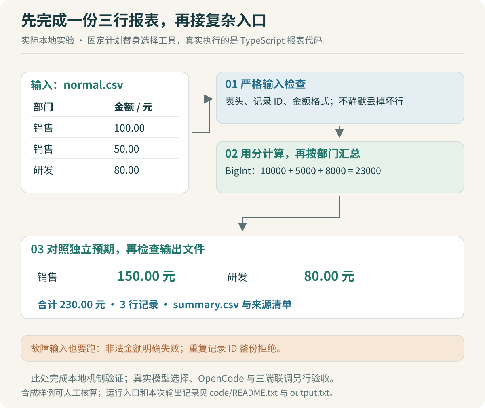

# 最小案例：先完成一次报表任务

员工上传一张表，说“帮我按部门整理一下”。这句话足够开始讨论，还不足以开始生成整个系统。整理是合计金额，还是按月份拆分？重复行应保留、忽略还是报错？遇到“50元”要自动转成数字吗？这些判断会改变结果。

先把范围缩到一份能手工核对的输入。本文约定：按部门合计同一币种的金额；金额是非负、固定两位小数；`record_id` 在文件内唯一；遇到不符合约定的行，整份任务失败，不能默默少算一行。



## 三行数据已经足以暴露几类错误

输入 [normal.csv](data/normal.csv) 完全由本专题编纂：

```csv
record_id,department,amount
R001,销售,100.00
R002,销售,50.00
R003,研发,80.00
```

销售应为 150.00，研发为 80.00，总计 230.00，共计 3 行。这些预期先写进 [expected-report.txt](data/expected-report.txt)，再实现汇总函数。预期文件中的金额以“分”为单位，用十进制字符串保存。

为什么还检查部门结果和行数？如果错误地把研发的 80.00 算进销售，总额仍然是 230.00。仅凭“总金额对了”不能认定报表正确。三个条件分别检查分组、汇总和输入覆盖情况。

再加入 [bad-amount.csv](data/bad-amount.csv) 和 [duplicate-id.csv](data/duplicate-id.csv)。前者包含 `50元`，后者有两个 `R001`。它们的预期是明确失败，没有最终报表。关于重复数据采用什么规则，是业务规格决定的；本实验选择拒绝，便于观察数据问题。

> [!TIP] 先确定错误输入应该怎样结束
> 给 Codex 正常样例时，也给它一个必须失败的样例。否则它可能用 `filter` 跳过坏行，让页面看起来成功，结果却不完整。

## 本地实验实际完成了哪些环节

配套 [demo.ts](code/demo.ts) 使用固定计划替身，返回一个已知工具名 `sum_by_department`；随后真实执行本地 TypeScript 报表函数，生成 CSV 和来源清单。它不调用大模型，也不是 OpenCode fork。

这一步检查的是工具契约、状态流转和产物能否被验证。以后接入真实内部模型时，只替换“决定调用哪个工具、传什么参数”这一部分，其余输入和预期保持不变。这样模型选错工具、参数解析失败和汇总逻辑出错，才容易分别定位。

实验有四个源文件：

| 文件 | 负责什么 |
| --- | --- |
| [report.ts](code/report.ts) | 检查教学 CSV 格式，按部门合计，生成 CSV 文本 |
| [runtime.ts](code/runtime.ts) | 保存任务、事件和能力版本标签，控制取消与结果提交 |
| [demo.ts](code/demo.ts) | 连接固定计划替身与真实工具，写出结果 |
| [lab.test.ts](code/lab.test.ts) | 对照独立预期，验证输入错误、去重、重连和竞态 |

这里有意只支持固定表头、不带引号的 CSV 子集。生产 CSV 经常包含字段内逗号、引号和换行，需要成熟解析库与新的验收数据。把输入范围写清楚，比让一个 `split(',')` 函数看起来“支持 CSV”更有用。

## 金额进入计算前，先变成整数分

`report.ts` 的金额解析保留了一条容易检查的路径：

```ts
export function amountToCents(value: string): bigint {
  if (!/^(0|[1-9]\d*)\.\d{2}$/.test(value)) {
    throw new Error(`INVALID_AMOUNT: ${value}`);
  }
  const [whole, fraction] = value.split('.');
  return BigInt(whole) * 100n + BigInt(fraction);
}
```

先校验完整字符串，再分别处理元和分。`parseFloat('50元')` 这样的宽松转换会把不符合约定的输入解释成 50，这里不接受。`0.10` 和 `0.20` 分别变为 `10n`、`20n`，相加得到 `30n`。

`BigInt` 对 Java 开发者并不陌生，可以类比 `BigInteger` 的整数运算。它解决本例整数金额范围和精度的问题，没有自动解决币种、税额或四舍五入规则。那些规则目前不在数据规格中。

汇总时，`Map<string, bigint>` 保存各部门的累计值。输出前才转为十进制字符串，因为原生 `JSON.stringify` 不能直接序列化 `BigInt`。展示层再把 `15000` 格式化成 `150.00`。

> [!TIP] 让 AI 解释一次数据类型的变化
> 可以要求 Codex 用 `50.00` 沿着“CSV 字符串 → 5000n → JSON 字符串 → 展示金额”走一遍。检查它在哪一步转换，以及每次转换是否丢失信息。这比只问“为什么用 BigInt”更能暴露误解。

## 运行以后，要打开产物核对

本次运行使用 Node v22.22.3。下载专题包后，在 `code` 目录执行：

```sh
node --experimental-strip-types --test lab.test.ts
node --experimental-strip-types demo.ts /tmp/opencode-lab-my-first-run
```

第二条命令要求一个新的输出目录，已有文件会报错。它写出 `summary.csv` 和 `manifest.json`。本轮实际产物副本保存在 [demo-summary.csv](data/demo-summary.csv) 与 [demo-manifest.txt](data/demo-manifest.txt)，执行命令和源文件摘要保存在 [output.txt](code/output.txt)。

CSV 包含研发 80.00、销售 150.00。清单中记录总计 23000 分、3 条输入、输入 SHA256、结果 SHA256，以及本次任务固定的能力版本标签。SHA256 用于判断内容是否发生变化，不能单凭它证明内容正确。

Node 的类型擦除可以运行本例使用的 TypeScript 语法，但不会进行类型检查。实验另用 TypeScript 5.9.3 执行了严格静态检查，命令见 [运行说明](code/README.txt)。这两个检查解决不同问题：前者观察代码行为，后者发现类型层面的不一致。[Node TypeScript 文档](https://nodejs.org/docs/latest-v22.x/api/typescript.html)

从 Java 转过来，还要注意接口声明的作用范围。把外部 JSON 标记成 `Report`，不会自动检查它真的包含合法金额。当前工具返回的是自己维护的函数结果；以后接收模型输出时，需要另外做运行时解析与校验，不能用 `as Report` 代替。

## 怎样把第一轮工作交给 Codex

下面是一张可复用任务卡。它描述建议采用的开发过程，不是补写一段声称已经发生的开发对话。

```text
目标：实现按部门汇总的最小工具，只修改 report.ts。

输入契约：
固定表头；金额非负、两位小数；record_id 不重复。
暂不支持通用 CSV、Excel 或模型接入。

验收依据：
正常输入的完整结果必须等于已给定 expected-report.txt。
坏金额、重复 ID 必须失败，不允许跳过问题行。

执行方式：
先说明输入、输出与失败规则，再实现。
如果预期与代码冲突，先报告冲突，不能修改预期让测试通过。
完成后给出实际运行结果和仍未覆盖的输入类型。
```

这张任务卡约束了目标和范围，也留下了合理的实现空间。无需预先指定每个函数的内部写法。Codex 如果建议支持任意 Excel、引入数据库或增加 Web 页面，可以暂存为后续需求，先完成当前验收。

第一轮失败时，保留输入和报错，要求它解释一个可验证的原因。例如销售变成 50.00，可能是 `Map.set` 每次覆盖而没有累计。先检查这一处，再跑同一份输入；不要同时更换解析器、数据模型和输出格式，否则很难知道哪项修改起了作用。

## 什么时候开始接真实模型

当正常输入、失败输入和产物检查都能重复通过后，就可以进行下一步小实验：让内部模型为同一份报表选择工具，检查参数，再运行已验证工具。随后增加一次需要澄清的需求，例如“按最近一个月统计”，但文件没有日期字段。

如果模型总在生成最终答案时自行改写金额，可让它只生成解释文字，表格使用工具产物。若工具调用格式不稳定，就回到模型能力验证，不要先把 Web 界面包装得更完整。

当前证据停在“固定计划替身＋真实工具＋本地机制验证”。接入模型后的选择准确率、真实 OpenCode 的集成行为，以及员工是否能完成任务，都需要新的实验记录。

下一步阅读：[产物与工作流](09-产物与工作流：把一次成功变成可复用能力.md)，看一次报表结果怎样成为可重复使用的能力。
