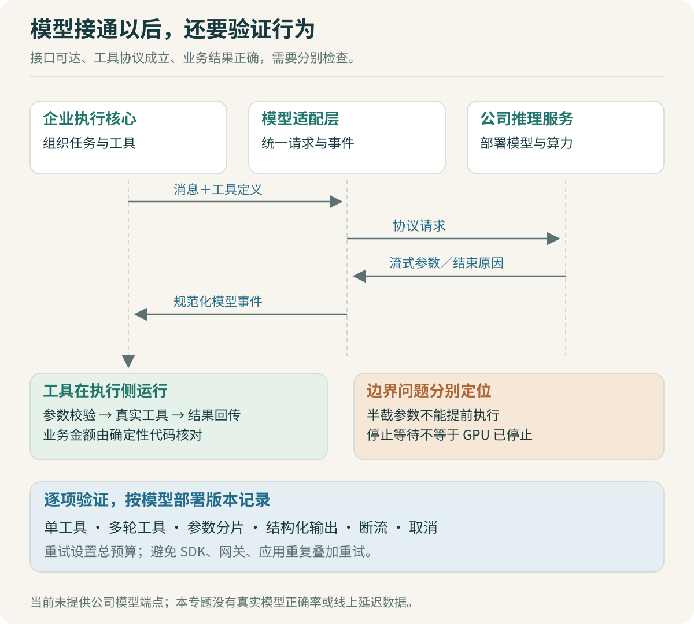

# 内部模型：接入之后还要验证什么

公司已经部署了算力，下一步是不是把 `baseURL` 换成内部地址就能使用？这要分成两个问题。接口能否接通，可以用一次小请求验证；模型能否稳定完成企业任务，需要另一组证据。

本专题没有拿到公司实际推理接口，也没有实测公司模型。这里提供接入方案、验证案例与源码落点。配套实验使用固定计划替身，验证确定性处理和运行机制，不能代表真实模型的理解能力。



## 先画清一条请求的责任边界

企业入口接收任务，执行核心组织消息与工具，模型适配层转换请求，推理服务产生响应。模型返回工具调用后，工具仍由执行侧调用；推理服务器并不会因为输出了一个工具名，就自动获得员工文件系统或业务系统的操作能力。

例如模型选择 `summarize_report`，参数是某个输入产物 ID。执行侧先确认该产物属于当前任务，再读取固定版本的 CSV，用代码得到销售 150 元、研发 80 元、合计 230 元。模型负责理解请求与选择能力，业务计算有独立的正确性依据。

在固定版本 OpenCode 中，`LLM.stream` 既支持原生运行路径，也支持 AI SDK 路径。AI SDK 产生的增量事件经 `LLMAISDK.toLLMEvents` 转换成统一事件，Processor 再消费这些事件。因此接入内部模型时，先核对现有 provider 是否能表示该服务，避免直接在执行循环中塞入供应商专用 HTTP 逻辑。[模型运行层](https://github.com/anomalyco/opencode/blob/b3f1a96c6dd7adeb28b36dd11add1998fc84d67b/packages/opencode/src/session/llm.ts#L225)、[事件适配器](https://github.com/anomalyco/opencode/blob/b3f1a96c6dd7adeb28b36dd11add1998fc84d67b/packages/opencode/src/session/llm/ai-sdk.ts#L193)

“兼容某接口”至少需要核对请求格式、流式事件、错误返回和能力支持。内部网关可能兼容普通文本聊天，却未实现工具参数的增量传输，或者对结构化输出参数直接忽略。

> [!TIP] 首次接入用最小输入
> 先发送短消息，再让模型调用一个无副作用的加法工具，最后才发送真实报表。这样能区分网络、协议、工具调用和长上下文问题，避免一次请求失败后不知道从哪一层查起。

## 一组接入验证，比“可以聊天”更有用

把每次请求及预期行为保存成小型验证集。下面是计划执行的验证项，目前没有填入真实模型成绩：

| 验证项 | 最小案例 | 需要观察的行为 |
|---|---|---|
| 基本文本 | 返回固定短字符串 | 正常结束、字符完整、错误可识别 |
| 单工具 | 读取一个已知报表产物 | 工具名存在、参数符合 Schema、结果能回传 |
| 多轮工具 | 先检查表头，再计算汇总 | 第二步确实使用第一步结果 |
| 参数增量 | 故意把 JSON 拆成多个流式片段 | 完成后再校验和执行，不解析半截参数 |
| 结构化输出 | 返回部门汇总与总额 | 服务端运行时校验通过，必需字段齐全 |
| 异常结束 | 中途断流、缺少结束事件 | 任务不被误标为成功，已有工具结果可辨认 |
| 上下文压力 | 逐步增加工具日志 | 记录实际可接受输入与压缩后的任务表现 |
| 取消 | 请求进行中触发取消 | 本地停止等待，观察上游计算是否也停止 |

工具参数应使用稳定的产物 ID，而不是让模型随意返回服务器绝对路径。报表服务根据 ID 找到受当前任务约束的文件。这样模型接口更简单，也能避免它猜出一个实际不存在的路径。

下面是教学用能力记录，不是 OpenCode 原生配置项：

```ts
type ModelEvidence = {
  provider: string;
  model: string;
  deploymentRevision: string;
  checkedAt: string;
  toolCall: "passed" | "failed" | "unverified";
  structuredOutput: "passed" | "failed" | "unverified";
  streamCancel: "passed" | "failed" | "unverified";
  maxInputTested: number | null;
};
```

`maxInputTested` 是在指定样例上实际验证的输入规模，不能代替模型宣称的上下文上限，也不能推断长任务准确率。部署修订变化后，应重新执行相关验证；名字相同的内部模型端点，背后也可能更换了权重、量化方式或推理框架。

## 工具调用的坑，往往发生在正常响应之后

假设模型返回 `finish_reason: stop`，同时给出了工具调用。如果执行核心只看结束原因，会在工具结果返回模型前退出。OpenCode 的循环专门检查是否仍存在有效工具调用，避免仅因某些 provider 返回 `stop` 就提前结束；被清理标记为中断的孤立调用还需要排除。[继续条件源码](https://github.com/anomalyco/opencode/blob/b3f1a96c6dd7adeb28b36dd11add1998fc84d67b/packages/opencode/src/session/prompt.ts#L1104)

再看结构化输出。TypeScript 的 `type ReportResult` 只在编译阶段提供约束，不会检查 HTTP 响应。字符串中的金额、缺少总额字段、额外编造的部门，都需要运行时校验。即使 JSON Schema 校验通过，也只能说明形状满足要求；“部门总额之和等于总额”“记录没有丢失”仍要通过业务检查。

OpenCode 已有 `json_schema` 相关处理：循环会加入结构化输出要求，并在模型结束却未给出结构化结果时记录错误。企业报表要在此基础上补充业务验证，不能把上游已有的结构校验写成自己的新增能力。[结构化结果检查](https://github.com/anomalyco/opencode/blob/b3f1a96c6dd7adeb28b36dd11add1998fc84d67b/packages/opencode/src/session/prompt.ts#L1267)

工具 Schema 也要控制复杂度。最小案例里只有 `inputArtifactId` 和明确的聚合字段，比一个拥有大量可选项、递归对象和相似字段名的万能报表工具容易检验。后续扩展每个字段，都补一个能区分正确和错误理解的输入样例。

## 把“重试”分成不同的动作

接口超时、模型参数不合法、报表结果不符合口径，看起来都可以再试一次，但下一步处理不同：

- 连接临时失败，可能重发同一模型请求。
- 工具参数不符合 Schema，把具体错误作为工具反馈，允许模型有限次修正。
- 表头缺少 `amount`，应说明输入不满足要求，不能反复调用同一个计算函数期待成功。
- 已调用外部发布接口但响应丢失，先查询业务状态，不能立即再次发布。

OpenCode 的 AI SDK 调用处，`maxRetries` 默认取零，外层 Processor 使用 `SessionRetry.policy` 组织重试。该版本策略包含可重试错误判定、响应头等待时间、指数退避、随机抖动和重试上限。接入时应读清每一层，避免 SDK、网关和应用各重试几次，最终一次用户请求触发大量模型调用。[AI SDK 调用参数](https://github.com/anomalyco/opencode/blob/b3f1a96c6dd7adeb28b36dd11add1998fc84d67b/packages/opencode/src/session/llm.ts#L313)、[重试策略](https://github.com/anomalyco/opencode/blob/b3f1a96c6dd7adeb28b36dd11add1998fc84d67b/packages/opencode/src/session/retry.ts#L183)

> [!TIP] 重试要有总预算
> 除了单次超时，还要限制一个任务累计等待多久、最多请求多少次。服务端返回长时间的等待提示时，可以把任务留在可见的排队状态，而不是让前端看起来一直卡住。示例参数应通过内部服务测试确定，不凭经验写成“最佳值”。

取消也需要两层观察。客户端停止消费流，并不自动证明推理服务停止了 GPU 计算。如果服务端不能传播取消，至少应停止本地后续工具执行，记录这个能力限制，再评估是否需要在内部网关补充请求取消机制。

## 公司共享算力，排队时间也属于用户体验

同样一个短报表任务，单人使用很快，多人同时使用却明显变慢，原因可能是模型推理服务排队，也可能是工具执行占满了服务端资源。只记录一个总耗时，看不出瓶颈。

建议把一次任务的时间拆为：入口排队、模型请求等待与首段响应、模型生成、工具等待与执行、结果校验。流式输出只能提前显示进度，不能降低已经发生的排队或计算量。首段文本很早出现，也不代表报表已经完成。

并发限制应作用于具体资源：模型请求有模型服务的并发预算，代码执行有工作空间与 CPU 预算，业务 MCP 有下游接口限额。不要因为模型允许同时返回多个工具调用，就让每个任务无限启动外部请求。首版可以使用简单的有界队列，把等待与取消处理正确；是否需要更细的优先级调度，取决于实际负载记录。

## 怎样要求 Codex 做这部分开发

先给分析任务，要求它从固定源码中找 provider 选择、事件转换和重试位置。然后才给一个范围较小的实施任务：

```text
目标：验证内部模型的单工具调用协议。
输入：模型端点配置通过环境变量提供；不把凭据写入日志。
工具：仅一个读取固定样例信息的无副作用工具。
先核对现有 provider 是否已经支持接口。
实现协议验证脚本，不改 Agent 主循环，不新增通用网关。
记录工具名、完整参数、结束原因和工具结果回传是否成功。
测试中补充参数分片、错误 JSON、未知工具和中途断流。
输出已实测项与未实测项，不根据 HTTP 200 宣称任务成功。
```

复核时重点看它有没有把未完成的增量参数提前送给工具、有没有重复叠加重试、是否把取消吞成普通成功返回。这些都可以用可控的协议替身复现。替身帮助检查适配代码，真正的工具选择与多轮理解能力，仍要等内部模型端点可用后再测。

上一篇：[最小案例：先完成一次报表任务](04-最小案例：先完成一次报表任务.md) · 下一篇：[Skill与MCP：能力如何发布和装配](06-Skill与MCP：能力如何发布和装配.md)。
