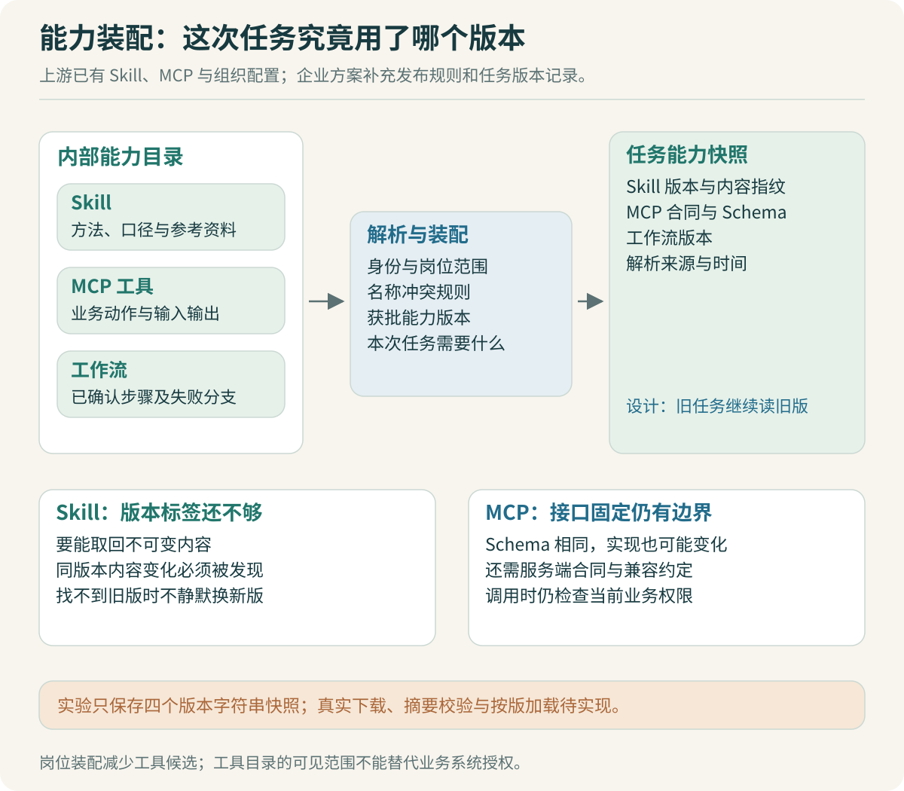

# Skill 与 MCP：能力如何发布和装配

公司已经维护了一些 Skill、MCP 和工作流。改造后的工作台要解决的问题是：员工发起一个任务时，怎样选到合适的能力，运行过程中怎样保持行为可解释，更新之后又怎样知道哪里变了。

先用报表任务把几种能力分清。`report-cleaning` Skill 告诉 Agent 如何理解表头、确认口径和检查结果；报表 MCP 提供受控的业务数据或文件操作接口；固定工作流则规定读取、校验、汇总、生成产物的顺序。它们可以配合使用，但承担不同职责。



## “支持 Skill 和 MCP”已经是上游能力

固定版本 OpenCode 的 `skill/index.ts` 已经扫描技能文件，读取名称、描述、正文和位置，也支持配置额外路径与 URL。系统可以展示可用技能的简短信息，再由 `SkillTool` 根据名称返回正文及关联文件位置。技能的发现与正文加载已有相应实现。[Skill 发现与目录](https://github.com/anomalyco/opencode/blob/b3f1a96c6dd7adeb28b36dd11add1998fc84d67b/packages/opencode/src/skill/index.ts#L211)、[Skill 工具](https://github.com/anomalyco/opencode/blob/b3f1a96c6dd7adeb28b36dd11add1998fc84d67b/packages/opencode/src/tool/skill.ts)

MCP 层已经处理连接、工具目录、状态和超时；远程连接有 Streamable HTTP 与 SSE 相关路径，本地连接使用 Stdio。它还监听工具目录变更。这意味着公司可以先沿现有接入方式验证内部 MCP，再讨论额外的企业治理要求。[MCP 实现](https://github.com/anomalyco/opencode/blob/b3f1a96c6dd7adeb28b36dd11add1998fc84d67b/packages/opencode/src/mcp/index.ts#L218)

组织配置也不是空白。配置模块会根据相应认证类型读取 `/.well-known/opencode`，合并远程配置与后续配置来源。企业配置的优先级、可覆盖项需要核对，不能把“从远端下发默认配置”当成强制授权机制。[远程配置加载](https://github.com/anomalyco/opencode/blob/b3f1a96c6dd7adeb28b36dd11add1998fc84d67b/packages/opencode/src/config/config.ts#L370)

本项目计划补充的是企业能力目录、获批版本、岗位装配与任务版本记录。配套实验只验证了能力快照等小机制，尚未将这些设计接入完整 OpenCode fork。

> [!TIP] 先做一个可核对的目录
> 首版目录有名称、职责、负责人、版本、输入输出示例和状态就够了。先让员工选到正确能力、让执行记录能说明用了哪个版本，再考虑评分、推荐和复杂的市场页面。

## Skill、工具与工作流怎样分工

假设用户说：“把三份部门支出表整理成月报。”Agent 可能需要先询问金额单位、重复记录的处理方式和统计月份。这一段适合用 Skill 指导探索，因为不同输入可能需要不同判断。

一旦口径确认，金额解析、重复 ID 检查和加总应使用代码。配套 CSV 实验选择严格输入：`record_id,department,amount`。销售的 100 与 50 汇总为 150，研发为 80，总额 230。这里的严格格式用于建立最小验收依据，实际 Excel 文件的多表头、公式、日期列属于后续扩展。

如果每个月都采用相同口径，可以把确认过的过程整理成工作流。Skill 可以帮助用户选择这个工作流，但工作流内部已经固定的步骤无需每次重新由模型规划。

| 能力形式 | 适合保存什么 | 不宜寄托什么 |
|---|---|---|
| Skill | 任务处理方法、澄清条件、参考资料 | 精确金额计算、强制业务授权 |
| MCP 工具 | 清晰的业务动作、输入输出协议 | 模糊的长篇任务目标 |
| 工作流 | 明确步骤、依赖关系、校验与失败分支 | 任意需求的一次性通用规划 |

Skill 描述也需要验收。把描述写成“处理所有企业事务”，容易与其他能力相互混淆。可以改成“对包含部门和金额字段的支出表进行口径确认、去重检查与汇总，不处理工资明细”。然后用正例、相邻任务和不适用任务检查模型是否选对。

## 能力版本为什么要在任务开始时固定

用户开始整理报表时，目录中的 `report-cleaning` 是 1.2 版。任务执行到一半，管理员发布 1.3 版，修改了空白金额的处理规则。如果下一轮加载时读到新版本，同一任务可能前半程按“拒绝空白”处理，后半程按“空白视为零”处理。

计划采用的方案是：任务启动时解析能力清单，保存版本和内容指纹；后续读取使用这个清单。下面是企业扩展层的教学数据结构，不是现成的 OpenCode 配置格式：

```ts
type CapabilitySnapshot = {
  bundleVersion: string;
  skills: Array<{
    name: string;
    version: string;
    contentDigest: string;
    immutableArtifactId: string;
  }>;
  tools: Array<{
    server: string;
    name: string;
    schemaDigest: string;
    contractVersion: string;
  }>;
  workflow: { id: string; version: string } | null;
};
```

只记录一个版本字符串还不够。如果服务器上 `1.2` 对应的文件被覆盖，恢复时读到的仍可能是新内容。Skill 文件需要不可变产物与校验指纹；同版本内容变化应当失败或明确报告，不能静默接受。

MCP 更容易被忽略。工具 Schema 的指纹固定了接口形状，却没有固定远程实现。服务端把相同参数的金额单位从元改成分，Schema 可以完全不变。因此还需约定接口版本、兼容策略，并保留已承诺版本的行为。任务快照能够帮助定位问题，无法单独实现远程服务的可重现执行。

运行中发生必要的权限撤销，则不能为了“版本固定”继续放行。能力快照固定处理方法和接口约定，当前身份是否仍有权执行业务动作，需要调用时由服务端校验。

## 岗位装配，先解决工具集合过大的问题

研发人员可能需要仓库、测试和构建工具；业务人员需要报表、文档与特定业务查询。将所有工具都塞入每次请求，会增加提示内容，还会产生名字相近、职责重叠的候选。

DeepSeek Harness 的 Skill 注册表提供了作用域参考：全局层与当前 Scope 链组合，同名项由更近的层覆盖。这给“公共能力＋岗位能力＋项目能力”提供了实现思路，但覆盖顺序要公开可解释。[作用域 Skill 注册表](https://github.com/deepseek-ai/deepseek-harness/blob/c291e7961a515f6d7af9304e7fd1d257929aef26/packages/skill/skill/src/index.ts#L346)

本项目可以先采用显式能力包，例如 `report-assistant-v1` 只包括报表处理 Skill、输入读取、汇总执行和产物查询。用户进入报表助手时选择这个包，模型在一个较小的工具集合内工作。等评测发现固定包覆盖不了常见任务，再研究动态发现。

同名能力必须有确定规则。首版企业目录可以直接拒绝相同命名空间中的重复名称；不要在一次遍历中采用“后加载覆盖前加载”，却在 UI 上只显示短名称。排障时需要查到最终命中哪份内容、它为何被选中。

> [!TIP] 能力筛选与业务授权分开验证
> 没出现在模型工具列表里的能力，通常不会被模型主动选择；这不等于用户无法构造调用请求。目录装配负责减少候选、明确职责，业务接口仍须校验执行身份和资源范围。

## 一次发布要验证到什么程度

假设准备更新金额清洗 Skill。先固定一组输入：正常金额、负数、千分位、空白、非法字符、重复记录。每个输入的预期由报表口径决定，先写清楚，再让 Codex 修改内容或代码。

验证至少包括：目录能解析、引用文件存在、工具合同匹配、典型任务能完成、旧任务仍可解析自己的能力快照。若真实模型还未接入，只能验证装配和确定性工具行为，不能声称 Skill 的选择准确率有所提升。

回退也有两层。将新任务的默认能力包切回上一版，是目录回退；已经生成的报表不会因此自动恢复成旧版本，仍需按任务记录定位受影响产物。把这两种回退混在一起，很容易在面试时讲成一个无法兑现的承诺。

公司聊天工具中的数字助手可以引用同一个能力包。角色描述影响表达与职责，能力包决定允许使用的业务动作，任务记录说明实际使用了哪个版本。这样排查“Web 正常，群里的助手却用了旧规则”时，有可核对的配置与事件。

## 让 Codex 实现时，先给出版本竞态的反例

一个有用的任务描述如下：

```text
实现企业能力快照的最小机制，不做市场页面。
先给出任务启动时的解析规则与同名冲突规则。
验收场景：
1. 任务 A 读取 v1 后，目录发布 v2；A 继续使用 v1。
2. 新任务 B 使用 v2。
3. 相同版本的内容被替换时，校验应报告不一致。
4. 找不到旧版本时明确失败，不自动改用最新版本。
区分实验内存快照与实际不可变文件仓库的实现范围。
```

复核时检查它是否只是浅复制数组，内部对象仍与目录共享；是否把远程端点地址当成实现版本；是否在异常分支里偷偷降级为最新版。独立实验可以先验证对象与版本规则。真实 Skill 装载、MCP 合同版本和企业目录发布仍需分别联调，文章与面试中都应按证据说明完成范围。

上一篇：[内部模型：接入之后还要验证什么](05-内部模型：接入之后还要验证什么.md) · 下一篇：[执行循环：取消重试与恢复](07-执行循环：取消重试与恢复.md)。
