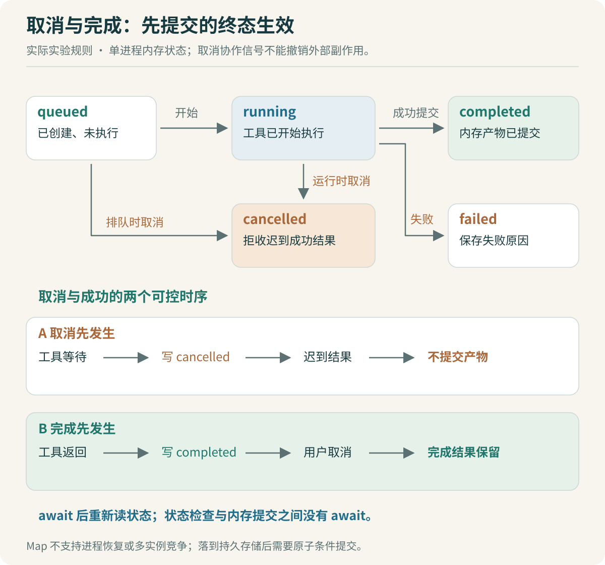

# 执行循环：取消、重试与恢复

报表已经生成，页面恰好断开。用户重新发送“再帮我整理一下”，系统又启动了一次相同任务。另一种情况更难发现：用户点击取消后，后台工具晚到的成功响应把任务状态改回了完成。

这些问题不取决于提示词写得是否详细。必须先说明状态由谁管理、什么时刻允许变化，再决定模型与工具怎样配合。



## 先区分会话、一次执行与业务任务

会话保存对话关系。一轮执行可能包含多次模型请求，每次模型请求又可能触发多个工具。企业业务任务是用户需要追踪的工作，例如“用这份输入生成九月部门支出汇总”。

一个会话可以先澄清口径，再创建任务；同一任务的执行进度也可以在 Web 与 IM 中查看。因此不能默认 `session_id`、`task_id`、`tool_call_id` 是同一个东西。模型工具调用 ID 用于关联协议消息，入口消息 ID 用于辨认重复投递，业务任务 ID 用于查询进度与产物。

OpenCode 的 `SessionRunState` 为会话管理 Runner；`Runner.ensureRunning` 在已有执行运行时等待相应结果，而不是随意再开启一条循环。它使用 Effect 的同步状态操作管理 Idle、Running、Shell 等状态。这提供了会话内部协调机制，并没有替企业入口定义 IM 消息幂等键。[会话运行状态](https://github.com/anomalyco/opencode/blob/b3f1a96c6dd7adeb28b36dd11add1998fc84d67b/packages/opencode/src/session/run-state.ts#L34)、[Runner 实现](https://github.com/anomalyco/opencode/blob/b3f1a96c6dd7adeb28b36dd11add1998fc84d67b/packages/opencode/src/effect/runner.ts#L117)

配套 [runtime.ts](code/runtime.ts) 使用更小的业务任务状态：`queued`、`running`、`completed`、`failed`、`cancelled`。这是独立的单进程教学实验，不是上游状态机的完整替代实现。

## 先把重复提交变成可解释的行为

IM 常见的重复投递可以使用“执行身份＋渠道＋会话标识＋消息 ID”作为幂等键。相同键、相同请求内容返回已有任务；相同键、不同内容报告冲突。只检查消息 ID 而忽略身份与会话，会把不同用户的任务混在一起。

配套实验对指令和 CSV 内容计算摘要，保存在内存 Map 中。创建路径中的查找与写入之间没有 `await`，因此在这个单进程同步路径内不会被另一次异步创建插入。这个结论不适用于多进程或重启之后。

进入企业部署后，需要持久化唯一约束与事务，或等价的原子创建机制。这样两个服务实例同时接收同一消息时，才不会各创建一个任务。还应明确幂等记录保留多久，以及过期之后用户再次提交的含义。

> [!TIP] 不要用整个对话文本当幂等键
> 用户可能确实希望再次执行相同指令，输入文件也可能更新。优先使用渠道提供的稳定消息 ID 或客户端生成的请求 ID，同时记录内容指纹检测冲突。不同请求是否应该复用已有业务结果，是另一条缓存规则。

## 取消不是回滚

取消至少会碰到四个位置：尚未开始、等待模型、工具运行中、产物已经提交。行为需要分别定义。

首版报表实验的规则很明确：排队与运行中的任务允许取消；取消先写终态，再发出 `AbortSignal`；已完成任务不能改成取消。工具如果忽略信号继续完成，迟到结果也不会被提交为成功。

下面节选本地实验的核心逻辑，完整实现见 `runtime.ts`：

```ts
cancel(id: string): boolean {
  const task = this.get(id);
  if (task.status !== 'queued' && task.status !== 'running') return false;
  task.status = 'cancelled';
  this.append(task, 'task.cancelled', 'Late tool results will not be committed.');
  task.controller.abort();
  return true;
}

// await 工具返回之后必须重新读取状态。
const report = await tool(request, snapshot, signal);
if (this.view(id).status !== 'running') return;
// 实验在同一同步片段内保存产物并写 completed，中间没有 await。
```

这里保证的是本地任务终态与产物提交关系。它没有撤销外部副作用：假如工具已把消息发到公司群，`AbortController` 不能收回那条消息。对报表生成，可以先写临时产物，验证通过后再登记正式产物；对发布、转账或审批等动作，需要业务系统自己的幂等与补偿规则。

OpenCode 的取消路径会处理关联后台任务，并取消已有 Runner；Processor 清理尚未完成的工具调用，将它们标记为中断错误。读源码时要同时查看取消入口与清理路径，只看到 `abort()` 不能证明子任务与消息状态都处理完整。[取消与后台任务](https://github.com/anomalyco/opencode/blob/b3f1a96c6dd7adeb28b36dd11add1998fc84d67b/packages/opencode/src/session/run-state.ts#L77)、[工具清理](https://github.com/anomalyco/opencode/blob/b3f1a96c6dd7adeb28b36dd11add1998fc84d67b/packages/opencode/src/session/processor.ts#L585)

## 工具并行，按资源与依赖判断

读取两份固定输入可以并行。汇总步骤依赖读取结果，必须等待。两个操作同时写入同一个输出路径，即使 TypeScript 的 Promise 都能并发启动，业务上也可能冲突。

Codex 的 `ToolCallRuntime` 根据工具是否支持并行，使用共享或独占的执行许可，并在取消到来时检查是否已经达到终态。它还把等待许可与真正开始处理的时间分开记录。这让“工具慢”可以进一步定位为排队慢还是执行慢。[Codex 工具调度](https://github.com/openai/codex/blob/d6489472f3c15e87d2d7763a5fde033545c530f8/codex-rs/core/src/tools/parallel.rs#L116)

DeepSeek Harness 的工具调度使用有界的并行池，并在尚未开始的调用进入执行前重新分类；独占操作需要等待相应并行工作完成。两份源码都提醒我们：并行能力是一项执行规则，不能仅凭模型一次返回了几个工具调用决定。[DeepSeek 工具执行](https://github.com/deepseek-ai/deepseek-harness/blob/c291e7961a515f6d7af9304e7fd1d257929aef26/packages/core/agent-loop/src/tool-calls.ts#L60)

本项目首版只需给工具记录依赖与资源范围，采用有界执行即可。不要为了展示多 Agent，提前把三行 CSV 分给多个子 Agent。真实任务需要并行时，先证明独立输入与产物写入边界，再决定调度方式。

## 重连、重试与恢复，是三个不同入口

| 用户或系统动作 | 应该做什么 | 不应默认做什么 |
|---|---|---|
| Web 刷新或 IM 查看进度 | 按任务 ID 查询状态，按事件游标补取信息 | 重新提交用户指令 |
| 模型请求临时失败 | 按策略重试模型请求，保留调用记录 | 重新执行所有成功工具 |
| 任务进程重启 | 根据持久记录与外部状态决定恢复位置 | 仅凭对话摘要从头运行 |

本地实验的 `eventsAfter(taskId, cursor)` 只返回游标之后的事件，能够验证“页面补取进度不触发执行”。事件与任务仍在内存中，所以它不支持进程崩溃恢复。生产化时还需持久事件序号、留存策略与过期游标处理；游标过旧可以返回快照及新游标，不能悄悄漏掉一段历史。

模型重试也不能被当成业务恢复。OpenCode Processor 的重试围绕流处理路径组织；企业工具如果已经产生结果，重试后模型再次提出相同动作，工具包装与业务系统仍需要辨认重复请求。协议中的 `tool_call_id` 在新一轮生成时可能改变，因此不能总拿它当唯一业务幂等键。

DeepSeek 的 `turn` 会写入开始、步骤边界与结束事件，即使异常也在相应收尾路径记录结束原因。这启发本项目把“已开始”“已验证”“已提交”的业务事实保留下来。但异常路径上的收尾代码无法处理突然断电；持久恢复仍要识别日志尾部的不完整状态。[DeepSeek Turn 实现](https://github.com/deepseek-ai/deepseek-harness/blob/c291e7961a515f6d7af9304e7fd1d257929aef26/packages/core/agent-loop/src/agent.ts#L269)

> [!TIP] 恢复前先问外部事实是否可查询
> 本地生成文件可以检查产物与指纹；业务提交应通过请求 ID 查询结果。既不能查询、又没有幂等约定的外部动作，恢复时应进入待核对状态。不要把“自动恢复”写成所有工具都可安全重跑。

## 用可控时序验证竞态，再让 Codex 修改

测试取消竞态时，使用一个手动控制完成时刻的 Promise。先启动任务，确认工具已进入等待；然后取消，最后释放工具的成功结果。检查任务仍是取消、没有正式产物、没有成功事件。

再反过来执行：先允许工具返回并完成提交，再触发取消。预期完成结果保留，取消操作返回未改变状态。不能只写一个依赖“等 100 毫秒大概完成”的测试，机器变慢后它可能覆盖另一个时序。

给 Codex 的任务应当先包含这两个预期：

```text
定位晚到的工具结果覆盖 cancelled 状态的问题。
先用手动完成的 Promise 写出可稳定复现的失败案例。
检查 await 前后的状态读取，以及产物提交之间是否又发生等待。
只修改任务终态与提交逻辑，保留已有事件顺序。
复核取消先发生、完成先发生、工具拒绝响应三种顺序。
说明结论只适用于当前单进程模型；不要声称分布式恰好一次。
```

这类实验也适合面试展开。你可以先解释初始实现为何在 `await` 后使用了过期状态，再展示怎样稳定制造该时序，最后说明单进程修复的依据以及多实例部署仍缺少什么。AI 可以帮助实现和审查，正确的状态规则与验收时序需要由你明确提出。

上一篇：[Skill与MCP：能力如何发布和装配](06-Skill与MCP：能力如何发布和装配.md) · 下一篇：[上下文与记忆：长任务保留什么](08-上下文与记忆：长任务保留什么.md)。
