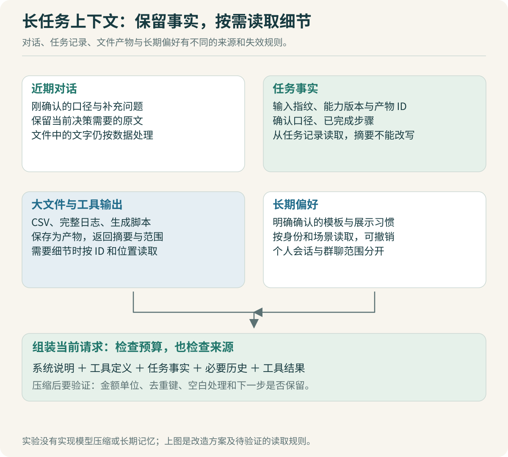

# 上下文与记忆：长任务保留什么

用户确认“金额单位是元，重复记录按 record_id 检查”，随后 Agent 读取了几份文件、输出大量日志、修改了处理脚本。任务还没结束，上下文已经很长。系统做了一次压缩，下一轮却把空白金额当成零，或者忘了哪个文件已经检查过。

上下文优化的验收不应只看少了多少 Token。对于报表任务，更重要的是：压缩后仍使用同一口径，能找到输入与产物，知道下一步要做什么。



## 把四种内容分开存放

对话历史记录用户与助手交流过什么；任务状态记录步骤与结果；产物保存文件和大段输出；长期偏好保存经确认、可以跨任务使用的信息。这几种内容相互关联，但更新与失效规则不同。

例如“销售 150 元、研发 80 元、合计 230 元”是某次输入计算出的结果，不应直接变成用户长期记忆。下个月的数据变了，旧数字没有继续使用的依据。“每月报表按部门排序”可以是偏好，但也需要记录是谁确认、在哪类任务适用。

| 内容 | 报表场景示例 | 建议读取方式 |
|---|---|---|
| 最近对话 | 用户刚补充“不要忽略负数” | 当前请求保留原文 |
| 确认口径与任务事实 | 单位、去重键、已完成步骤、输入指纹 | 小型结构化记录，随任务载入 |
| 大产物 | 原始 CSV、完整错误日志、生成脚本 | 保留产物 ID，按范围读取 |
| 长期偏好 | 常用报表模板、默认展示顺序 | 按身份与场景读取，可修改或撤销 |

本项目计划按这四层组织内容。配套实验实现输入与结果指纹、能力快照和任务状态，没有实现模型压缩、长期记忆或产物按需检索服务。

> [!TIP] 对话摘要不要承担数据库职责
> “任务已完成”“采用哪个能力版本”“正式产物在哪里”应来自可查询记录。摘要可以帮助模型理解过程，不能成为判断业务动作是否已经发生的唯一依据。

## 先减少进入上下文的内容，再考虑压缩

读一份十万行 CSV 时，模型通常不需要看到十万行。先由工具返回表头、行数、类型分布、少量样例和检测到的问题，完整文件仍放在工作空间。模型需要判断异常时，再读取指定行或错误样本。

工具返回可以设计成下面的教学格式，尚未接入 OpenCode：

```ts
type InspectionResult = {
  artifactId: string;
  inputDigest: string;
  rowCount: number;
  columns: string[];
  sampleRows: string[][];
  issues: Array<{ row: number; code: string; detail: string }>;
  hasMoreIssues: boolean;
};
```

这里 `hasMoreIssues` 很有用。只返回前 20 个错误而不说明还有剩余，模型可能误以为全部问题已经处理。工具返回摘要时要交代覆盖范围，完整检查结果另有产物 ID。

简单截取前几千字符也有局限。错误常常出现在日志尾部，列名可能位于表格前面，关键统计可能出现在最后。工具可以按内容类型选择保留方式：日志保留异常附近片段，报表保留字段与统计，代码错误保留堆栈及相关源码位置。

## OpenCode 的裁剪与压缩分别做什么

固定版本的 `SessionCompaction.prune` 从较新的消息向前扫描，跳过最近的一部分对话，对满足条件的较旧工具结果标记压缩时间；它还有受保护工具列表，包含 `skill`。这是一种降低旧工具输出占用的处理路径。它没有证明所有业务事实都能从裁剪后的上下文恢复。[工具输出裁剪源码](https://github.com/anomalyco/opencode/blob/b3f1a96c6dd7adeb28b36dd11add1998fc84d67b/packages/opencode/src/session/compaction.ts#L270)

另一条路径是 `processCompaction`：构造压缩任务，生成摘要，并保留相应的近期消息与继续信息。循环通过压缩后的消息视图组织下一次模型请求。读代码时需要把“较旧工具结果不再完整进入模型”与“通过模型生成摘要”分开，两者的成本和失败方式不同。[压缩处理源码](https://github.com/anomalyco/opencode/blob/b3f1a96c6dd7adeb28b36dd11add1998fc84d67b/packages/opencode/src/session/compaction.ts#L319)

源码里的阈值是这个版本的实现参数，不是企业所有模型的推荐配置。公司模型的窗口大小、输出保留预算和实际计数方式不同，直接照抄数值可能让压缩过早发生，或者直到请求被拒绝才触发。

我们的改造重点可以放在压缩前后的业务事实保留：确认口径来自任务记录，产物通过稳定 ID 读取，摘要则保存尚未固化的分析过程与下一步计划。先验证这些扩展是否能通过现有机制实现，再决定是否需要修改压缩核心。

## Codex 的历史整理，提醒我们保留协议结构

上下文不是任意字符串列表。一次工具调用与其结果需要对应；删除调用却留下结果，会产生没有来源的输出，保留调用却删除结果，也可能形成不完整历史。

Codex 的历史管理在整理模型输入时检查调用结果配对，并移除孤立结果；删除首项时也考虑对应项。它还根据输入模态处理图像和音频。这说明上下文整理需要遵守协议结构，不能只按消息数量截断。[历史整理源码](https://github.com/openai/codex/blob/d6489472f3c15e87d2d7763a5fde033545c530f8/codex-rs/core/src/context_manager/history.rs#L467)

把这个原则放到本项目：一个报表工具调用的参数、输入指纹和结果关联不能丢失。即使完整结果改成产物引用，也应保留“哪个调用生成了哪个产物，以及校验是否通过”。至于再次发给模型的具体工具消息结构，要沿用当前 provider 的协议要求。

DeepSeek Harness 则把模型可见历史从 Session 记录中投影，并在请求准备阶段冻结边界使用的数据。其压缩实现用统一 TokenMeter 评估当前请求压力，并把摘要生成与区域替换组织在相应处理路径中。这给本项目的启发是让压缩输入与输出都有明确来源，而不是维护一份无法追踪来源的自由文本记忆。[请求准备](https://github.com/deepseek-ai/deepseek-harness/blob/c291e7961a515f6d7af9304e7fd1d257929aef26/packages/core/agent-loop/src/agent.ts#L603)、[压缩实现](https://github.com/deepseek-ai/deepseek-harness/blob/c291e7961a515f6d7af9304e7fd1d257929aef26/packages/compaction/compaction-basic/src/index.ts#L250)

## 先确定哪些事实不能被摘要改写

可以为每个报表任务保存一个较小的事实对象。下面是待实现的教学结构，不是本地实验已有接口：

```ts
type ReportFacts = {
  taskId: string;
  inputArtifacts: Array<{ id: string; digest: string }>;
  confirmedRules: {
    amountUnit: "CNY_YUAN";
    duplicateKey: "record_id";
    blankAmount: "reject";
  };
  rulesConfirmedBy: string;
  completedSteps: Array<{ stepId: string; resultArtifactId: string }>;
  pendingQuestion: string | null;
};
```

在这个示例里，空白金额拒绝、重复键为 `record_id` 是当前任务已确认的规则。它们不是模型随时可修改的推断。用户明确改变口径时，系统更新规则版本，并判断已完成步骤是否需要重新计算。

不要把“保留事实”实现成每轮把所有历史都塞进系统提示词。只有当前任务仍需要的事实进入请求；完整来源通过 ID 查询。如果口径有十个版本，当前使用哪一版应明确，旧版本留作追溯。

文件内容也要保持来源身份。CSV 单元格可能包含“忽略前面的规则”这样的文本，它属于输入数据，不应自动升级成用户要求或 Skill 指令。摘要过程也要保持这条区分，避免把文件中的文本改写成“用户要求忽略校验”。

> [!TIP] 优先验证“摘要后有没有改口径”
> 设计一个长任务，让单位、去重键和空白处理规则只在早期确认，再插入大量工具输出，触发压缩。压缩后要求继续处理新的输入，检查规则是否仍生效。只检查摘要里出现了几个关键词，不能证明后续执行正确。

## 上下文预算怎样计算才不容易失真

一次请求消耗的输入包括系统说明、工具定义、近期消息、任务事实和工具输出，还要给模型输出预留空间。只计算用户输入会严重低估占用。

可用的教学表达是：

```text
输入预算 = 当前模型可用窗口 − 预留输出 − 额外余量
实际输入 = 系统说明 + 工具定义 + 任务事实 + 历史 + 工具结果
```

其中余量需要覆盖计数误差与请求封装差异。能使用部署模型的计数器时优先使用；只能估算时就记录估算方法，观察服务端 usage 与拒绝结果后调整。不能用字符数代替 Token 数，再将估算结果写成精确成本。

稳定的系统说明与工具定义也可能有利于模型服务的前缀缓存，但是否支持、缓存如何计费与失效，需要根据内部部署实测。即使缓存命中，窗口空间仍然有限，长输入的语义干扰也不会自动消失。

## 数字助手的长期记忆，从少量可编辑偏好开始

Web 与 IM 共用底层执行能力，不代表它们自动共用所有历史。个人会话与公司群有不同的参与者范围。一个人在私聊中提供的报表口径，不能仅因机器人名称相同就进入另一个群的任务。

首版可以只保存用户明确确认的偏好，并标注所属人、适用场景和更新时间。读取时由可信身份决定范围；更新时保留来源；用户修改偏好后，后续任务使用新值，已经启动的任务按自身口径处理。暂时不需要为所有聊天记录增加向量数据库。

这项设计的验收可以很小：用户 A 修改展示顺序，A 的新任务按新顺序输出；用户 B 的任务不受影响；A 已运行中的任务不被中途改写。先把范围与版本处理正确，再研究语义记忆检索。

## 用 Codex 做一次可复核的上下文改造

先要求它指出原始消息到模型输入之间的路径，说明裁剪发生在哪一层、哪些对象会被重建。再给有限的实施任务：为报表确认口径建立独立记录，在请求组装阶段读取，不改动无关的长期记忆系统。

测试分两类。无模型测试检查口径字段、产物引用、工具调用与结果的关联仍完整；真实模型测试观察压缩之后是否仍按这些规则执行。前者通过不能代替后者，但能让排查更清楚：如果事实根本没进入请求，先修代码；事实完整进入请求却仍被忽略，再研究提示组织、工具选择或模型能力。

开发复盘应留下压缩前的内容构成、压缩后的模型输入、事实校验与后续任务结果。当前专题提供这套验证方法，没有编造 Token 节省比例或压缩后的成功率。等公司模型可用后，用固定任务和相同配置完成对照，才有条件评价这项改造是否值得保留。

上一篇：[执行循环：取消重试与恢复](07-执行循环：取消重试与恢复.md) · 下一篇：[产物与工作流：把一次成功变成可复用能力](09-产物与工作流：把一次成功变成可复用能力.md)。
