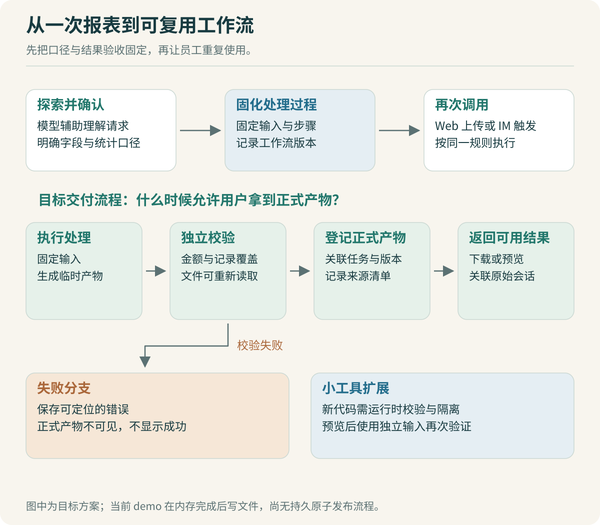

# 产物与工作流：把一次成功变成可复用能力

员工第一次拿到部门汇总表，会接着问：“下个月能直接用吗？”这时需求发生了变化。第一次允许通过对话确认口径；下个月则希望输入新文件后，按同一套规则得到结果。

可以把已经确认的部分逐步固定：输入字段、重复数据处理、计算过程、校验规则和输出格式。变化的部分留作参数。每次重新向模型描述全部步骤，容易让同一个问题出现不同解释。



## 先分清保存的到底是什么

| 对象 | 本场景的例子 | 怎样判断可用 |
| --- | --- | --- |
| 对话回答 | “已按部门整理完成” | 只能说明一次回复结束，不能证明文件存在 |
| 文件产物 | 汇总 CSV 和来源清单 | 能下载、能解析、内容符合口径 |
| 小工具 | 输入文件后执行部门汇总 | 新输入仍按同一规则计算，错误输入按约定失败 |
| 工作流 | 校验输入、汇总、校验结果、发布产物 | 步骤衔接、失败处理和版本选择明确 |

本专题的 [report.ts](code/report.ts) 是一个固定工具；[demo.ts](code/demo.ts) 生成真实文件。它们尚未实现自然语言生成任意小工具，也没有一个通用工作流引擎。这组代码用来把机制看清楚，再确定接入 OpenCode 时需要补哪一部分。

## 文件应带上足够的来源信息

文件名 `最终汇总.csv` 很难解释结果。输入变过一次、Skill 升过版本、模型也换了，员工拿着两个同名文件，无法确定该以哪个为准。

实验的产物清单记录：任务 ID、输入内容摘要、结果内容摘要、能力版本标签和实际汇总结果。[真实清单样本](data/demo-manifest.txt) 中，总额为 `23000` 分，行数为 3。

```ts
const artifact = {
  report: structuredClone(report),
  inputSha256: sha256(task.request.csv),
  resultSha256: sha256(JSON.stringify(report)),
};
```

这段代码来自 [runtime.ts](code/runtime.ts)。`structuredClone` 避免工具返回对象后来被修改，连带改变已提交结果。来源摘要回答“输入和结果内容是否相同”；业务校验回答“这份结果是否算对”。两者都保留，排查时才不会把文件变化与计算错误混在一起。

更完整的服务还需要输入文件位置、产物位置、创建时间与所有者等字段。本文把它们作为接入设计，不声称实验已经完成权限、对象存储或下载服务。

> [!TIP] 验收时直接检查下载文件
> 让 Codex 演示“已完成”的页面后，再要求它读取实际文件，与预期逐项比较。文件路径拼错、写入失败、界面仍指向上一次结果，都不会被一句成功提示暴露出来。

## 把口径写进工作流，而不是藏在提示词里

[workflow-v1.txt](data/workflow-v1.txt) 是一份教学规格，内容可按 JSON 阅读。它不是 OpenCode 官方配置，也没有被本实验的运行时解释执行。

```json
{
  "id": "department-summary",
  "version": "1",
  "input": {
    "columns": ["record_id", "department", "amount"],
    "duplicate_id_policy": "reject whole input"
  },
  "steps": [
    "validate_input",
    "sum_by_department",
    "validate_report",
    "publish_artifact"
  ]
}
```

为什么写成四个步骤？发生异常后，需要知道停在哪里。字段不完整时应反馈输入问题；汇总程序报错时保留错误信息；结果没有通过校验时不能发布一个看起来正常的下载链接。

“校验报表”也要有具体规则。本例至少检查输入行是否全部计入、各部门合计是否等于总额。测试集还逐项对照独立手算结果。把总额再加一遍，只能发现部分结构问题；如果第一步就把部门归错，合计仍可能相等。

当业务提出“同一条记录以后出现的新版本应覆盖旧版本”，就需要新增时间或版本字段，并重新定义重复处理。直接让 Codex 删除重复 ID 检查，会让程序通过，却没有建立新规则。

## 固定版本以后，还要能加载那个版本

任务创建时的能力标签来自 [runtime.ts](code/runtime.ts)：

```ts
snapshot: Object.freeze({ ...capability })
```

拷贝后冻结，可以避免调用方把注册表里的 `skill` 改成新版本时，运行中任务的标签也随之改变。实验中已有一项测试：旧任务保持 `department-report@1.0.0`；后创建的新任务采用 `2.0.0`；重复提交原消息仍返回旧任务。

这个实验只证明快照没有被修改。实际系统还需让执行器按标签读取正确内容，并确认内容摘要。否则清单写着 1.0，执行时却从可变目录读取最新 `SKILL.md`，版本记录就失去了意义。

公司内部能力目录可以先采用简单方案：发布产生不可变版本；任务记录版本与内容摘要；执行器解析到明确的包或端点配置。MCP 工具背后的服务也会变化，固定客户端配置不代表外部服务行为永久不变。这部分需要与内部服务的版本策略一起约定。

> [!TIP] 用升级中的任务检查“版本固定”
> 在任务执行到一半时更新能力目录，让旧任务继续完成，再创建新任务。检查两个任务实际读取的内容与清单是否一致。只检查字符串是否为旧版本，验收还不够。

## 产物发布为什么需要单独一步

实验里，`completed` 表示内存结果已提交；`demo.ts` 随后才写文件。如果磁盘写入失败，内存任务已经是完成状态。这个简化适合观察状态机制，但服务上线前必须处理这个间隙。

一种可进一步实现的流程是：先写不可变的临时产物，读取并校验；产物确认可访问后，在数据库事务中更新产物引用、任务终态与终态事件。对象存储和数据库通常不是同一个事务，写成功但事务失败可能留下孤立对象，需要定期清理。任务结果的发布入口以数据库中的已提交引用为准。

这时取消也有明确含义：取消先占有终态，后续结果不发布；完成先提交，后续取消返回已经完成。只在前端禁用取消按钮，无法解决服务端并发请求的竞争。[实验中的受控竞态](code/lab.test.ts) 验证了单进程的这一规则，跨实例实现仍需数据库条件更新等机制。

## 员工自己做小工具，先从已有工具组合开始

首版可以让模型从已注册的报表工具中选择，再确认参数与输出。用户需要排序、筛选或汇总时，已有工具能覆盖一部分需求。只有遇到确实缺少的能力，才进入生成代码流程。

生成代码的小工具多出几项验收：输入格式、运行时依赖、测试样例、运行时间与产物输出。预览成功也只代表当前样例。保存之前，应使用未参与生成的输入再跑一遍。

运行生成代码时，还需要独立的工作空间和受限执行环境。当前实验只调用自己维护的固定函数，没有执行任意模型生成代码；一个 `TaskRuntime` 类不具备进程、文件和网络隔离能力。这是接入小工具执行器时的一项明确工程工作。

对于本项目，先实现“部门汇总工具＋固定校验＋可下载结果”，再研究“让员工通过自然语言调整一个参数”，更容易建立可比较的迭代记录。让模型自由编写任意应用，会同时引入太多待验证的行为。

## 给 Codex 的下一张任务卡

```text
目标：把已验证的报表函数接入产物发布流程。

先确认现有实现里 completed 表示什么，列出文件写入失败时的状态。
提交方案时给出：产物何时可见、取消与完成谁先提交、失败后如何恢复。

验收至少包含：
正常产物能重新读取并通过独立预期；
写文件失败时不能出现有效下载链接；
取消先提交时，迟到工具结果不发布；
重复消息不生成第二个任务。

先实现一种存储方式。不要同时加入编辑器、模板市场和部署平台。
```

可以借这张任务卡观察 Codex 是否理解已有代码的边界。若它声称内存中加一个字段就解决了文件持久性，继续追问进程在写文件前退出会怎样，并要求用可复现的实验回答。

下一步阅读：[CLI、Web 与 IM](10-CLIWeb与IM：三种入口怎样共用任务.md)，将这些任务和产物接到不同入口。
