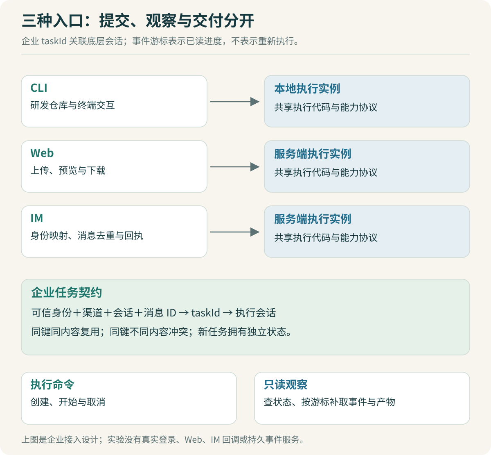

# CLI、Web 与 IM：三种入口怎样共用任务

研发在终端中调试报表工具，业务人员在 Web 上传文件，员工在聊天工具里说“再按上次口径整理一次”。入口不同，但它们都要提交任务、观察进度、接收产物，并在必要时取消。

可以先定义企业层任务契约，再为不同入口做适配。入口负责把交互变成任务请求；执行核心处理模型、工具和上下文；任务服务保存状态与产物关联。CLI 操作本地仓库时，执行实例可以在本机；Web 和 IM 的文件任务通常在服务端运行。它们共享代码和能力定义，不意味着共用同一个进程或文件目录。



## 会话 ID 和任务 ID 各自回答什么问题

一段聊天可能包含多个任务：“汇总这份表”“给结果加个排序”“用另一份数据重跑”。会话 ID 用于关联对话，任务 ID 用于跟踪一次明确执行。把两者混用，会让重试、取消和历史结果变得含糊。

企业接入层可以保存这样的映射：

| 字段 | 含义 |
| --- | --- |
| `actor` | 经过接入层确认的员工身份 |
| `channel`、`conversation` | CLI、Web 或 IM 的交互来源与会话 |
| `messageId` | 本次提交的稳定标识，用于识别重复投递 |
| `taskId` | 企业任务标识，用于状态、事件、取消与产物查询 |
| OpenCode 会话标识 | 关联底层执行上下文，按实际接入方案维护 |

最后一项属于 OpenCode 集成设计，当前 [runtime.ts](code/runtime.ts) 没有调用 OpenCode。本文的 `taskId`、游标查询和事件名都是教学实验定义，不能直接当作上游 HTTP API 使用。

真正接入时，应先沿固定版本源码确认已有会话和事件接口，再决定适配层放在哪里。优先保留上游能够满足需求的能力，企业层补上所需的身份、任务和交付规则。

## 重复消息：先认出是不是同一次提交

IM 平台未及时收到响应，可能再次投递同一条消息；Web 请求超时后，用户也可能重试。实验把以下字段组合成去重键：

```ts
const key = JSON.stringify([
  request.actor,
  request.channel,
  request.conversation,
  request.messageId,
]);
const hash = sha256(JSON.stringify([
  request.instruction,
  request.csv,
]));
```

同一个键且内容摘要相同，返回原 `taskId`。同一个键但内容不同，抛出 `IDEMPOTENCY_CONFLICT`。不同员工、会话或入口可以具有相同消息编号，所以它们也进入键的作用域。

为什么还要检查摘要？如果客户端重用请求编号，却上传了新文件，直接返回旧结果会误导用户。摘要让这种混淆变成明确冲突。真实上传服务应针对文件内容或不可变文件版本计算摘要，只比较一个可变下载链接不够。

> [!TIP] 用“相同编号、不同文件”验收去重
> 只测试原样重发容易通过。再用原消息编号提交修改后的金额，预期必须是冲突或明确的新请求流程，不能悄悄沿用旧报告。

`runtime.ts` 通过内存 `Map` 保存去重信息，查询和插入之间没有 `await`。它只在同一进程的这段同步路径中成立。多实例部署需要共享存储、唯一约束和明确的事务规则；把 JavaScript 的单线程性质等同于跨实例安全，会漏掉第二个进程。

另外，任务创建去重也不能直接保证外部副作用只发生一次。例如向聊天工具发送文件成功，但本地记录失败，再试可能发出第二份。任务执行和消息交付应分别设计去重与恢复，不能只靠一个 `messageId` 包办。

## 页面关闭后，任务与连接可以分别结束

员工关掉页面，通常只是停止接收进度，不等于取消后台工作。系统应将“读取事件的连接”与“任务执行”分开处理。用户明确点取消，才提交取消请求。

实验的每条事件都有任务内连续递增的 `seq`。客户端已应用到序号 1，重连后查询大于 1 的事件：

```ts
const initial = runtime.eventsAfter(taskId, 0);
await runtime.run(taskId, reportTool);
const recovered = runtime.eventsAfter(taskId, initial.at(-1)!.seq);
```

测试得到的序列是：先收到 `task.created`，重连补回 `task.started` 和 `task.completed`，合并后为 `[1, 2, 3]`。客户端应在事件成功应用到界面状态后再推进游标，并按 `taskId + seq` 处理重复事件。仅仅“网络收到”就保存游标，可能在渲染或状态更新失败后丢掉进度。

实验拒绝负数、小数和超过现有最大序号的游标，避免它们看起来只是“没有新事件”。游标属于某个任务和运行实例，进程重启后内存事件消失，不能承诺继续恢复。

> [!TIP] 事件补取不应重新提交原问题
> 让 Codex 实现重连时，检查它调用的是事件读取与任务查询，还是又调用了一次任务创建。后者可能让同一份报表执行两遍。

持久化接入还要考虑“查询历史完成后，订阅实时事件建立前”的间隙。若两步之间发生新事件，简单的先查后订阅可能漏掉它。可以采用同一持久事件流的游标读取，或先订阅缓冲、补齐历史，再按序去重。具体方案应通过服务端接口能力决定，并加入断点实验。

## 数字助手需要职责和会话范围

“报表数字助手”可以有固定职责：接收文件、确认报表口径、执行已发布工作流，并把结果回传到原会话。角色说明影响模型怎样回应，可用工具和实际业务身份决定它能访问什么。

个人聊天中确认的“默认部门”不应直接变成群聊中的共同口径。可以把记忆分成当前任务参数、用户确认的个人偏好，以及显式共享给群聊的规则。先从清晰的作用域开始，再研究长期记忆检索。

工具调用时也需要区分服务账号和最终员工身份。接入层不能相信请求正文里自报的 `actor`，应从已验证的登录或聊天平台身份中映射。本实验由测试代码传入身份，未实现认证，这个字段只是机制输入。

IM 交互还有一个容易忽略的差别：耗时任务不适合长时间占着消息回调。接收后关联任务、快速返回受理结果，再通过独立交付过程发送进度或产物。最终报告通常比逐个转发模型 token 更适合聊天窗口。

## 让 Codex 一次只完成一层接入

可以先写一份请求适配器，把不同入口转成同一种 `Request`；接着验证稳定消息编号与身份作用域；最后接事件显示。这样出错时能判断是输入映射、任务处理还是交付问题。

```text
任务：为企业任务服务增加 IM 请求适配，不改执行核心。

先列出平台字段如何映射到 actor、conversation、messageId。
身份来自可信接入层，不能从消息正文读取自报用户。
同一事件重复投递返回原任务；同键不同内容必须报冲突。

验收：
重复投递、不同群同编号、同编号不同附件都各跑一次。
长任务应先受理，最终结果通过独立交付流程关联原会话。
说明哪些测试使用平台替身，哪些经过真实平台验证。
```

这项任务完成后，再研究平台回调重试、实际文件下载和结果发送。没有真实聊天平台配置时，可用固定事件文件验证映射逻辑，记录为替身实验；不能把它算作线上机器人已经可用。

下一步阅读：[评测与回归](11-评测与回归：质量要分层验证.md)，把三端接入、任务机制和模型效果分别放到可验证的位置。
