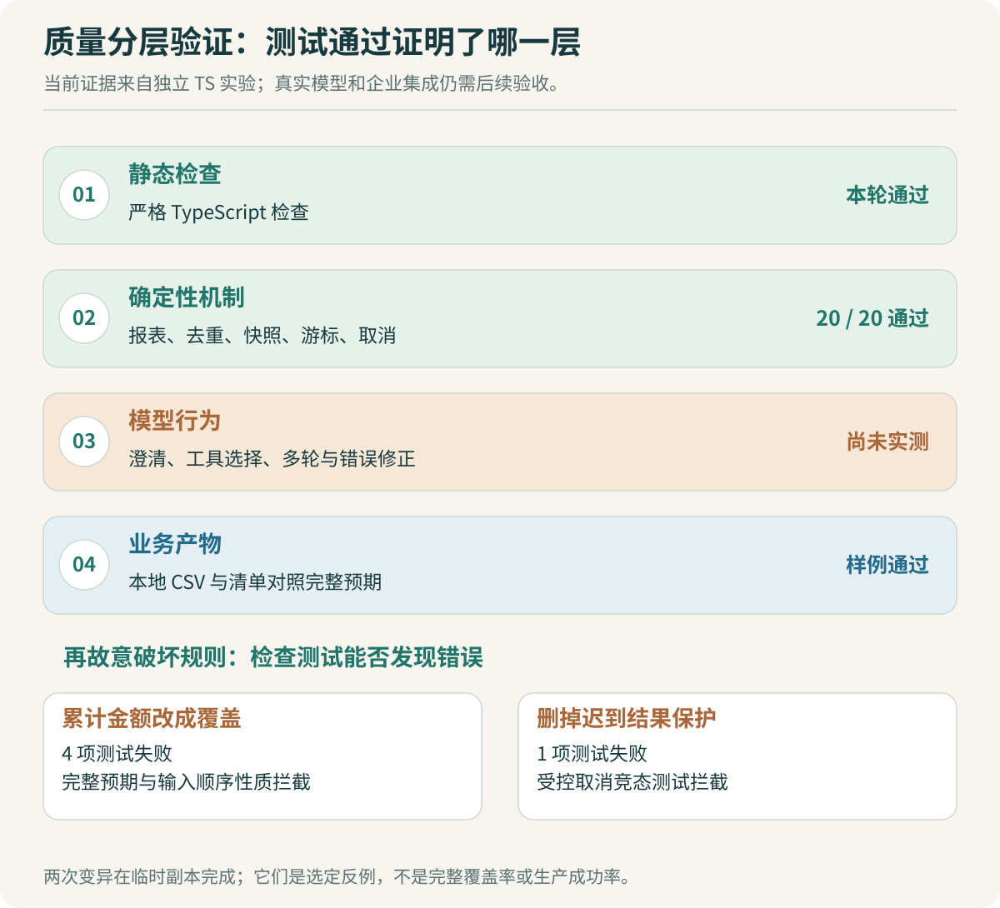

# 评测与回归：质量要分层验证

Codex 写完代码，类型检查通过，页面也出现下载按钮，能否说项目完成？还需要打开文件。文件可能为空，可能包含旧结果，也可能把研发的金额归到了销售。

Agent 应用的质量横跨几层：代码是否按规则运行，模型是否选择了正确动作，最后产物是否满足业务要求。把这些层次全部压成“测试通过率”，会掩盖证据的范围。



## 四层检查分别负责什么

| 层次 | 本场景检查什么 | 通过以后仍不能推出什么 |
| --- | --- | --- |
| 静态检查 | TypeScript 类型、接口使用与编译约束 | 不代表异步顺序正确，也不验证真实输入 |
| 确定性机制 | 去重、状态、取消、事件重连、工具计算 | 不代表模型会选对工具 |
| 模型行为 | 需求澄清、工具与参数选择、错误反馈 | 不代表实际下载文件内容正确 |
| 业务产物 | 报表数值、输入覆盖、文件可读、口径符合 | 不代表所有模型或所有输入都具有相同表现 |

先用稳定的确定性检查约束代码，再接真实模型。更换模型或提示词时保留原任务集，才能看清变化发生在哪一层。

本轮实际执行了严格类型检查、20 项机制测试和一次真实本地报表演示。模型为固定计划替身，没有测真实大模型的选择正确率。这是当前材料的证据范围。

## 独立预期不能从被测函数再算一遍

[lab.test.ts](code/lab.test.ts) 读取 [expected-report.txt](data/expected-report.txt)，逐项对照结果。预期由三行合成输入独立核算：销售 150.00、研发 80.00，总计 230.00。

```ts
const expected = JSON.parse(fixture('expected-report.txt'));
assert.deepEqual(summarize(normal), expected);
```

如果把预期写成 `summarize(normal)`，然后与另一次调用比较，即使实现一直把销售金额覆盖成最后一行的 50.00，测试也可能通过。把同一算法复制到测试中，风险相近：两边可能同时带着同一个错误。

独立不意味着所有结果都靠人工抄写。还可以使用已经验证的参考实现、具有明确数学关系的输入变换，或来源独立的业务样本。不同方法发现的错误不同，可以组合使用。

本例还验证了“改变输入行顺序不应改变汇总结果”。这是一个无需新增手算金额的性质。如果实现保留最后一行而没有累计，行顺序变化会改变结果。对去重、排序等功能，还能根据真实业务规则设计其他性质，但要先确认性质本身成立。

> [!TIP] 给 Codex 一份不能随实现自动更新的预期
> 要求它遇到冲突时先解释规格、输入和计算过程。允许提出预期有误的证据，但不要把“修改预期后测试通过”直接当成修复完成。

## 竞态测试用闸门控制顺序

取消与完成之间的竞争，靠 `sleep(100)` 很难稳定复现。机器快慢、事件循环调度和其他任务都可能改变顺序，测试偶尔通过不能说明机制正确。

实验用两个 Promise 闸门：工具开始时放行第一个，返回结果前等待第二个。测试可以准确地在这两个时刻之间提交取消。

```ts
const running = runtime.run(taskId, async () => {
  started.release();
  await result.promise;
  return expected;
});

await started.promise;
runtime.cancel(taskId);
result.release();
await running;

assert.equal(runtime.view(taskId).status, 'cancelled');
assert.equal(runtime.view(taskId).artifact, undefined);
```

完整测试还确认迟到结果没有产生 `task.completed` 事件。另一个用例安排完成先提交，再调用取消，预期取消返回 `false`，完成结果保持不变。测试的是明确的胜出规则，而不是要求两个结果“尽量不冲突”。

这个实验成立于单进程内存运行时。跨实例状态竞争需要共享存储与条件提交，再以相同业务规则扩展实验。现有代码没有验证数据库事务，也没有阻止外部工具已经发生的副作用。

## 实际检查记录

执行环境与命令保存在 [output.txt](code/output.txt)：Node v22.22.3、TypeScript 5.9.3、`@types/node` 22.20.2。源文件和输入 SHA256 也保存在记录中，后续修改可以据此确认是不是同一份实现。

| 检查 | 本轮结果 | 解释 |
| --- | --- | --- |
| TypeScript 严格检查 | 通过 | 单独执行 `tsc --noEmit --strict`，没有用运行成功替代类型检查 |
| 行为测试 | 20 / 20 通过 | 包括输入、去重、快照、重连、取消竞态和状态保护 |
| 本地报表产物 | 与完整预期一致 | 3 行输入，总计 230.00；CSV 内容与清单逐项检查 |
| 真实内部模型 | 未运行 | 未提供模型接口，本轮使用固定计划替身 |
| 真实 Web、IM 与 OpenCode 集成 | 未运行 | 文章给出接入方案，实验没有创建这些服务 |

测试日志中的耗时是本机一次测试运行时间。它不能作为生产吞吐或模型响应时延。若要比较性能，应先规定输入规模、并发、缓存条件、模型配置和统计方式，再采集足够的独立请求。

## 再故意改坏两处，看测试能否拦住

测试全绿，还可以继续问：它们是否检查到了最担心的错误？本轮在临时副本中做了两次受控变异，原代码保持不变。记录见 [mutation-output.txt](code/mutation-output.txt)。

| 刻意引入的错误 | 运行结果 | 被什么检查发现 |
| --- | --- | --- |
| 部门金额从累计改成每次覆盖 | 20 项中 4 项失败 | 完整预期、输入顺序性质及相关产物检查 |
| 删除工具返回后的终态检查 | 20 项中 1 项失败 | 取消先提交后，迟到成功错误地覆盖终态 |

第一处变异把这行：

```ts
totals.set(department,
  (totals.get(department) ?? 0n) + amountToCents(amount));
```

改成只保存当前行。第二处删除了 `await tool(...)` 之后的状态再检查。两者都对应真实容易发生的实现错误，现有测试能发现它们。

这只是两个手工选择的反例，不能据此宣称测试覆盖全部错误。它的价值是把“测试好像很全面”变成可检查的问题：某条业务约束被破坏后，究竟哪项测试会失败？

> [!TIP] 让 AI 审查时，要求它给出可运行的反例
> “这里可能有竞态”还不够。继续要求它指出两个操作的顺序、预期终态，以及怎样在测试中控制顺序。无法复现的判断先记录为待验证假设。

## 接入真实模型后，怎样增加评测

先保持工具和正常输入不变，观察模型是否选择 `sum_by_department`，参数是否引用正确文件，最终答复是否与工具结果一致。再加入需要澄清的需求：“按最近一个月统计”，但文件没有日期；“去掉重复的”，但没有说明重复口径。

模型评测需要分别记录至少三件事：选择的动作是否合适，实际任务是否完成，产物是否通过确定性校验。一个模型可能选对工具，却把文件参数传错；也可能算对表格，在解释文字里写错总额。把结果细分，改进方向才明确。

开发样例用于调提示词和接口，验收样例留在固定集合中，不应每次根据输出改预期。真实员工输入与本专题的三行合成 CSV 差异很大，需要逐步补充导出表、缺失字段、口径歧义和多轮修改等案例。

对于开放式解释文字，可以由人工按规则判断，或者让另一个模型辅助标注。但报表金额、文件存在、行数和状态这些可确定检查的内容，应先用代码核对，没必要全部交给模型裁判。

## 如何把“全程用 Codex”变成可靠的开发过程

实现前写清验收；实现时限制改动范围；实现后检查实际 diff 与结果。Codex 可以帮助补测试和审查代码，但你需要维护业务预期与证据之间的关系。

```text
审查任务：只读当前 diff、规格与测试，不直接改代码。

请按以下顺序检查：
1. 找出规格中没有对应检查的行为。
2. 找出测试与实现共享同一错误假设的可能性。
3. 为最可能的问题给出输入或受控时序。
4. 区分已经复现的问题与尚待验证的判断。

不要用测试数量、代码行数或口头“已覆盖”替代依据。
```

审查后再开实施任务，只修已确认的问题。修复完成，重跑受影响检查与必要回归，保留命令、输入和结果。面试时可以据此解释：哪些代码由 Codex 生成，哪项方案由你否决，哪个实验让你改变了判断。

本专题已经提供可重复运行的机制实验和两项反例。未来真实接入模型与上游源码后，应继续补集成证据，而不是把今天的 20 项本地测试扩写成生产系统的成功率。
