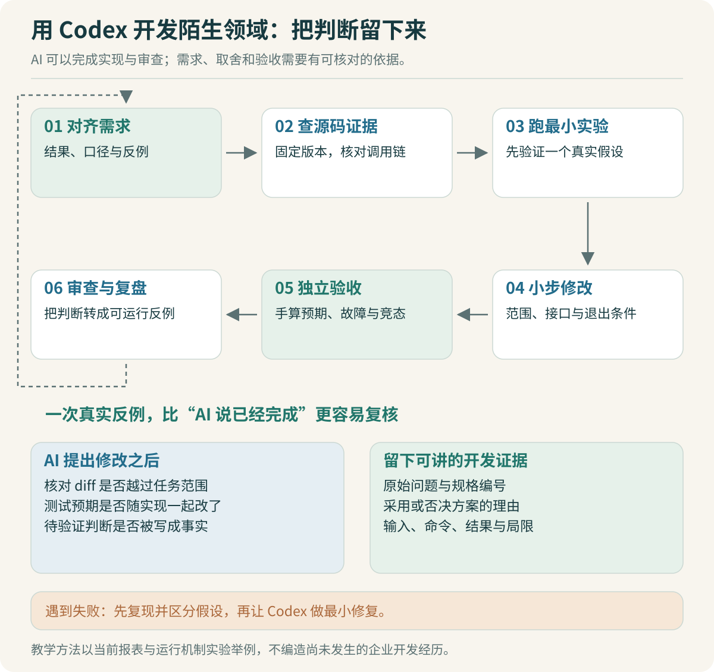

# Codex 开发复盘：怎样驾驭陌生代码库

面试时说“代码主要用 AI 写”，面试官通常会继续问：你能看出它写错了吗？遇到故障时，能判断是模型、工具、运行时还是业务规则的问题吗？一个有说服力的回答，应该包含你采用的判断方法和能拿出来核对的证据。

本章以本专题实际完成的源码阅读和 TypeScript 实验为例，整理用 Codex 开发陌生领域的方法。企业平台仍是设计方案，不能把教程中的设计片段改写成自己已经经历过的线上事故。



## 先建立能核对的源码地图

首次打开 OpenCode，不必让 Codex 逐文件解释整个仓库。先问一个具体问题：“一次 HTTP 报表请求怎样进入模型循环？把调用者、被调用者、状态写入点和取消入口连起来。”要求固定提交，输出路径与函数，指出还没有打开的文件。

本次阅读发现，固定版本同时有 `packages/core` 和 `packages/opencode` 的相关路径。我们沿已核对的 HTTP handler 追到 `SessionPrompt`，才继续读 Processor 和模型层。如果只看文件名或搜索摘要，很容易把不同路径拼成一条并不存在的调用链。证据见 [03](03-源码对照：从调用链找到改造位置.md) 与 [源码索引](sources.txt)。

可以给 Codex 这样的阅读任务：

```text
固定当前提交，追踪 session 的异步 prompt 到一次工具调用完成。
每一跳给出调用位置、实参/返回值和状态变化。
区分你亲自打开核对的事实与推断。
先找最短主链，再查看取消分支；暂时不要提出大规模重构。
最后标出接入企业任务记录可能影响的接口及证据不足之处。
```

随后自己挑两处关键连接核对。比如，取消是否真传到执行中工具，还是只让 UI 停止等待？源码里出现 `abort` 这个单词，不能自动回答这个问题。

## Java 开发者优先补哪些 TypeScript 知识

不必先背完语言手册。围绕当前变更补足能影响正确性的知识，再通过编译器和小实验确认理解。

| 当前问题 | 需要补的知识 | 在本实验里的判断 |
|---|---|---|
| 金额能否准确累计 | JavaScript Number 与 BigInt 的区别 | 用 BigInt 分计算，在 JSON 边界转字符串 |
| `Readonly` 是否阻止外部修改 | 类型约束、对象引用和运行时冻结 | 原始目录拷贝后冻结，返回视图再复制 |
| 多个请求为什么可能交错 | Promise、`await` 和事件循环 | `await` 后重新读状态，提交区保持同步 |
| 为什么发出取消仍收到结果 | AbortSignal 的协作性质 | 迟到结果再次通过任务状态检查 |
| 类型检查为什么没挡住坏数据 | 类型声明与运行时值是两层 | CSV 做实际解析；未来工具结果另加校验 |
| 文件是否真的交付成功 | 内存状态与文件系统是两个提交位置 | 识别 demo 中 completed 之后才写文件的缺口 |

实验使用 Node 的 TypeScript 类型擦除来运行代码，同时单独执行严格类型检查。运行成功不能证明静态类型检查通过；两条命令的真实记录在 [output.txt](code/output.txt)。

`Object.freeze` 的例子尤其适合讲理解。当前能力快照只有四个字符串，拷贝并浅冻结足以隔离这些字段。如果后来增加 `mcp.config.headers` 这样的嵌套对象，外层冻结不会冻结里面的值。是否需要深拷贝或不可变结构，取决于实际数据形状，不能把一句“已经 freeze”当成审查结论。

> [!TIP] 不懂的机制先缩成几十行
> 让 Codex 写一个只展示“创建快照后修改原始对象”的最小程序，预测输出后再运行。能解释这个例子，再去审查业务代码里的快照，比直接接受一大段语言解释更有用。

## 先验证最小路径，再扩大功能

本专题从三行报表开始：固定计划替身选择汇总工具，真实 TypeScript 代码读取数据并生成结果。这样先把“工具能否正确完成任务”与“真实模型能否正确选择工具”分开验证。接入模型后出现错误，已有确定性工具可以作为参照。

模型替身也有局限：它不理解员工的自然语言，不会犯工具选择错误，无法证明内部模型可用。最小案例通过之后，下一步应接一条真实模型请求，观察工具参数与完成事件，再逐渐增加多轮交互。不要把替身演示包装成端到端成功。

同样，先用单进程实验验证取消和事件游标，是为了把机制看清。准备部署多个 Worker 时，需要重新设计共享状态和恢复路径。把部署复杂度后置，可以降低第一轮排错负担，但不能省略最终需要的验证。

## 用小步变更控制 AI 的改动范围

给 Codex 一个清楚的增量：“给任务创建加入消息去重，保持现有报表接口”，通常比“把整个平台优化一下”更容易审查。每次变更明确影响文件、公共行为和需要跑的检查。

如果多个 Agent 并行工作，按独立文件或模块分工，并提前约定接口。一个负责源文件，一个负责同一文件的重构，会造成互相覆盖；更合适的分工是计算工具、调用链取证、独立测试评审。并行的收益来自任务独立性，不能只看开了几个窗口。

当上下文变长，可以交接一份短记录：当前目标、固定提交、已核对事实、已运行命令、尚未解决的问题、下一步。把整个聊天记录重复粘贴一遍，反而会让旧方案和现方案混在一起。

OpenAI 的最佳实践建议给 Codex 清晰的工作上下文，并在完成后检查代码与验证结果。这里的小步变更和交接格式是本项目的具体做法。[官方最佳实践](https://learn.chatgpt.com/guides/best-practices)

## 审查时主动找“看起来通过”的漏洞

在本实验中，可以针对四个位置发起独立审查：

1. 去重键是否包含身份范围。同一 `messageId` 来自另一个员工，不应错误拿到原任务。
2. 取消发生在 `await` 期间，迟到成功或错误是否仍能覆盖状态。
3. 测试是否真的验证没有产物，还是只验证状态变了。
4. `completed` 到文件写入之间进程退出，会留下什么可观察状态。

前三类有对应的行为测试。第四类是本次教学实现明确保留的边界：内存完成先发生，文件由 demo 随后写入。已经识别这一点，才能给真实系统提出“暂存、校验、发布引用、提交终态”的设计，而不是因为演示顺利就宣布交付可靠。

让 Codex 审查时可以这样写：

```text
基于 RUN-001 / RUN-003 和当前 diff，寻找会破坏身份隔离或终态规则的路径。
每条发现提供确定的输入或时序、代码位置、实际后果。
区分可复现缺陷、需要实测的疑点和范围外设计建议。
不要用更多抽象层或更多测试数量代替具体问题。
```

审查工具的回答也可能错。能复现的就先复现；不能复现的，应解释条件为什么不成立，或者补一个能消除疑问的小实验。

> [!TIP] AI 不能同时决定口径和宣布口径正确
> 本例的 150、80、230 先由输入手算得到，测试再与它比较。真实报表应由业务规则、可信基准数据或人工核验样本提供期望。让模型生成答案，再让同一个模型说答案合理，证据仍然很弱。

## 发生错误时怎样和 Codex 协作排查

不要只发“还是不行，再改改”。提供最小复现输入、期望、实际输出、环境版本和上一次改动。让它先提出最可能的原因及验证方式，再执行能区分原因的检查。

假设报表总额正确但重复交付两次，可以先分别统计入口接收次数、任务创建次数、工具执行次数和回执发送次数。如果任务只创建一次、工具只执行一次，而回执发了两次，问题就在交付适配层。改金额函数或提示词都没有依据。

这个故障是教学推演，不是本项目已发生的生产事故。它示范的是把模糊现象拆成可以观察的事实，再决定改动位置。

## 最后保留能经得起追问的开发记录

一份有效的复盘可以只包含：做了哪个需求、看了哪些源码、作出什么判断、采用哪个反例验证、真实命令结果是什么、剩下哪个边界。本次可核对的记录包括三个仓库固定版本的源码索引、20 项行为测试、严格类型检查和报表产物对照。

没有人工独立开发的对照数据，就不写“提效 80%”。没有真实模型调用，就不写“任务成功率达到 95%”。可以准确地描述：使用 Codex 完成了这些学习材料与实验实现，开发者需要掌握其约束和验证方法，再把机制迁移到自己的 fork 中。

上一篇：[评测与回归](11-评测与回归：质量要分层验证.md) · 下一篇：[面试与个人贡献](13-面试与个人贡献：把判断讲到证据.md)。
