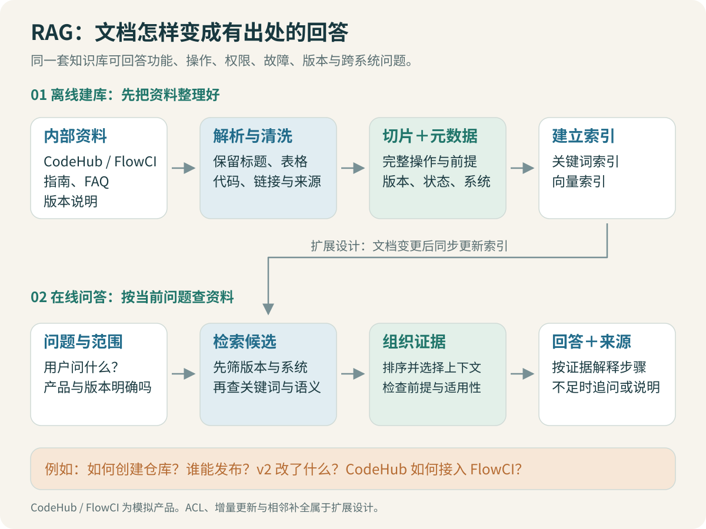

# 一次问答：从问题到有依据的回答

员工问：“我已经能拉代码了，为什么还是不能发生产？该申请什么权限？”

如果只看到“权限”两个字，系统可能返回一整段仓库成员申请流程。文字通顺，却没有解决问题。这个例子需要区分两套能力：代码托管系统允许谁读取代码，CI/CD 系统允许谁向指定环境发布。相关片段还要说明二者是否自动关联。

这就是本项目的基本任务：把问题中的对象和条件保留下来，找到能支持答案的资料，再组织回答。

## 1. RAG 增加了哪一步

单独调用大模型时，回答主要依赖模型参数和本次输入。内部平台的申请入口、审批规则、有效期和自研功能并不一定存在于模型的训练数据中。RAG 在回答前查询外部知识，把找到的内容加入本次输入。

这里的“生成”仍由模型完成，检索不自动保证它逐字遵守资料。需要分别检查找到了什么，以及模型最后说了什么。[LangChain 检索说明](https://docs.langchain.com/oss/python/deepagents/retrieval)介绍了检索后生成的基础结构。

```text
问题：已能拉代码，怎样申请生产发布能力？
证据 A：仓库角色只规定代码访问，不自动授予环境发布能力。
证据 B：生产环境发布有独立申请流程与适用条件。
回答：解释两者区别，给出对应流程，并标明来源。
```

这段是流程示意。具体申请步骤必须来自本套模拟 Wiki 的原文，不允许从常见平台经验补一个“看起来合理”的审批流程。

## 2. 建库和问答分别做什么



离线建库时，网页或 PDF 先变成结构化片段。每个片段保留所属文档、章节、版本和来源，然后生成向量，建立可查询的索引。关键词索引也由同一批片段构建。

在线问答时，系统处理用户问题、查找候选、重新排序、整理上下文，再调用生成器。文档通常不需要每问一次就重新下载和向量化。

| 阶段 | 输入 | 输出 | 能单独检查什么 |
| --- | --- | --- | --- |
| 解析 | HTML 或 PDF | 带来源的章节、段落、页文本 | 标题、表格、步骤有没有丢 |
| 切分 | 解析后的正文 | 带 ID 的 chunk | 条件与结论是否仍在一起 |
| 建索引 | chunk 与向量 | 向量集合、关键词索引 | 模型与维度是否匹配，条目是否重复 |
| 检索 | 问题及明确条件 | 候选片段和各路分数 | 正确证据是否出现 |
| 重排 | 问题与候选 | 按相关程度重排的结果 | 正确证据是否排到前面 |
| 上下文组织 | 排序结果 | 长度受控且可引用的证据 | 是否缺前提、重复或混入冲突版本 |
| 生成 | 原问题与证据 | 回答、引用、缺失说明 | 每项结论能否得到支持 |

> [!TIP] 先检查中间结果
> 找不到正确答案时，先打开检索候选。正确证据根本没出现，就先排查解析与检索；已经完整出现，再检查上下文和生成。不要每次都从改 Prompt 开始。

## 3. 从一个普通函数理解整条链路

下面是解释职责的伪代码，参数并非框架 API：

```python
def answer_question(question, history):
    request = understand(question, history)
    if request.missing_required_condition:
        return ask_for_missing_condition(request)

    candidates = retrieve(request.search_query, request.filters)
    ranked = rerank(request.original_question, candidates)
    evidence = assemble_context(ranked)
    return generate(request.original_question, evidence)
```

`search_query` 用于找到资料，`original_question` 保留用户真实意图。员工说“那外包人员呢”，检索问题可以补成“外包人员申请仓库访问权限”，但生成时还要知道这是上一轮话题的追问。不能仅把用户最后六个字送去检索，也不能把上一轮的“正式员工”条件原样保留。

LangGraph 会把这些函数组织成节点，保存中间状态，并根据证据是否充足进入不同分支。固定流程同样可以用普通函数完成；当加入追问、一次改写和多种结束原因时，图结构能让这些路径更容易检查。[LangGraph 图 API](https://docs.langchain.com/oss/python/langgraph/graph-api)

## 4. 一条证据需要哪些信息

仅有正文字符串，回答时很难说明它适用于哪套系统。一个教学片段可以长这样：

```python
{
    "doc_id": "KH-002",
    "section_id": "s01",
    "title": "CodeHub 2.0：正式员工申请仓库访问权限",
    "system": "code_host",
    "version": "2.0",
    "status": "active",
    "text": "仓库角色不会自动赋予生产环境的发布能力。",
}
```

这条事实来自模拟资料。它能解释“能拉代码不等于能生产发布”，但不能独自说明生产发布申请要填哪些字段。后半个问题还需要 CI/CD 的证据。

元数据和正文作用不同。`version`、`system` 帮助筛选与追踪；正文提供事实。把元数据字段加得很全，不等于文档里已经有足够的答案。

## 5. 有相关文档，不等于能回答

需要分别看三个层次：

- 文档相关：它确实讨论权限。
- 条件适用：它针对正确的平台、人员类型和环境。
- 证据充分：它覆盖问题要求的区别、前提和申请步骤。

假设候选里只有“外包人员访问仓库”的流程，而用户是正式员工，关键词命中很多也不能直接使用。反过来，如果不知道用户人员类型且规则明显不同，先问这一项比随意选择文档更合适。

> [!WARNING] 不要把相似度当成答案可信度
> 向量分数表示模型空间中的接近程度。它不能直接解释为“这条操作有 90% 概率正确”，也不能证明资料仍适用。

## 6. 最小可用回答长什么样

操作问题先说明适用条件，再列步骤、入口与需要准备的信息。故障问题先列待确认条件、检查顺序和各检查结果对应的下一步。历史案例中的原因应注明是候选解释，不能直接宣布当前问题已经查明。

引用应挂在具体事实或步骤旁边。只在回答结尾附三篇“参考资料”，用户还需要重新猜每一步出自哪里。

当资料不完整时，可以回答已有依据的部分，再说明缺少什么。比如已有材料证明两种权限不同，但没有生产权限申请页，就只能解释区别并说明缺少对应指引，不能生成一个申请地址。

## 7. 这一章读完，怎样验收

选一道单文档问题和一道跨系统问题，分别写出：它需要哪些条件、哪几个证据片段、每个片段能支持哪句话。然后运行检索，把实际候选与这份人工清单对照。

暂时不追求复杂问题全部成功。先证明系统能找出一条可核对的证据，并解释一次失败发生在哪一层。接下来两章会处理最靠前、也最容易被忽略的损失：原文没读对，以及切分破坏了意思。

[← 阅读指南](00-阅读指南：先把一次问答看清楚.md) · [解析 Wiki 与 PDF →](02-Wiki与PDF：先把原文读对.md)
