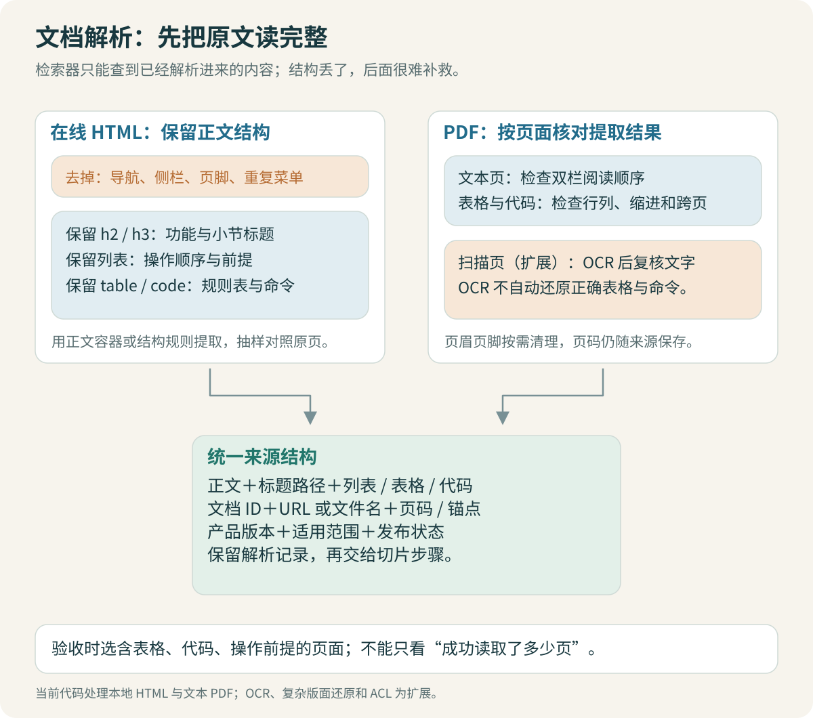

# Wiki 与 PDF：先把原文读对

先打开原始 Wiki，再看程序提取出的文字。如果申请步骤只剩“填写申请、提交审批”，而旁边表格里的必填字段全丢了，后面的模型无法把它们可靠地找回来。

解析阶段交付的应是“带来源和结构的正文”，而不是随便拿到一段字符串。网页和 PDF 的处理方式不同，但都要接受同一项检查：重要事实有没有保留下来。



## 1. 从页面容器开始，别先抓整页文字

内部 Wiki 往往包含侧边栏、导航、搜索框、相关推荐和页脚。如果直接对整个页面调用 `get_text()`，每篇文档可能都带着“仓库、流水线、权限、帮助中心”。这些重复词进入索引后，会让无关文档看起来也很相关。

提取顺序可以先找正文容器，再清理其中的脚本和导航，最后按标题和块级元素解析。下面展示思路；真实选择器应由实际 Wiki 页面结构确认：

```python
from bs4 import BeautifulSoup

def body_from_html(html: str):
    soup = BeautifulSoup(html, "html.parser")
    body = soup.select_one("main article") or soup.select_one("article")
    if body is None:
        raise ValueError("没有识别出正文容器，先检查页面结构")
    for element in body.select("script, style, nav, footer"):
        element.decompose()
    return body
```

不要把“没有找到正文”偷偷降级成“使用整页”。未登录的页面、访问失效提示和空壳 HTML 都可能返回成功状态码。它们应该被识别成解析问题，不应建立一篇题为“登录”的知识文档。

当前模拟数据使用本地 HTML，保留了导航噪声与正文结构。实际解析入口是 [parse_html](code/ingest.py)。真实在线 Wiki 的登录和抓取接入不在本次演示中；获得页面 HTML 后，后续解析流程可以复用。

> [!TIP] 验收时同时看两份内容
> 左边放原始页面，右边放提取结果。先检查标题、适用范围、步骤、表格和命令块，别一开始就用问答结果反推解析是否正确。

## 2. 保留顺序，也保留标题的归属

下面两段文字需要属于同一个章节：

```text
生产环境发布权限
前提：申请人符合生产发布的人员条件。
步骤：提交项目、环境、角色、用途与到期信息。
```

如果只按页面中所有 `p` 标签拼接，章节标题就丢了；如果只提取第一层文本，嵌套列表又可能丢失。解析器要顺着 DOM 的正文顺序走，遇到标题时更新当前章节，随后保留段落、步骤与表格内容。

链接也有两种用途。来源链接帮助用户回到文档；正文中的申请入口本身则是事实。只保留“点击这里”会丢掉操作路径，盲目把侧边栏所有链接加入正文又会制造噪声。应根据正文结构提取，而不是按链接数量多少决定保留。

| 页面元素 | 应保留的内容 | 常见错误 |
| --- | --- | --- |
| 标题 | 文档名、章节路径 | 所有块只有相同的总标题 |
| 有序列表 | 步骤顺序和子步骤 | 多个步骤挤成一行，顺序不明 |
| 表格 | 列名、行值及对应关系 | 只留下值，无法知道属于哪一列 |
| 命令与日志 | 错误码、参数、换行 | 下划线、大小写或符号被清洗掉 |
| 正文链接 | 链接文字、目标与所在步骤 | 有“申请入口”但没有入口地址 |
| 页面噪声 | 从知识正文中排除 | 每篇都包含同一套导航术语 |

对简单表格，可以转成带列名的逐行文本，例如“角色：开发者；可执行：推送个人分支；限制：受保护分支仍需评审”。跨行合并、多层表头则要专门核对，不能假设一个通用转换函数总能保住含义。

## 3. PDF 为什么不能按截图里的样子直接读出来

PDF 更接近页面绘制指令，而不是带语义标签的网页。视觉上相邻的字，提取时可能出现不同顺序；多栏、表格和页眉也不天然带有“正文”“导航”的身份。扫描件还可能只有图像，需要 OCR。[pypdf 文本提取说明](https://pypdf.readthedocs.io/en/stable/user/extract-text.html)

基础页文本提取可以很短：

```python
from pypdf import PdfReader

def page_texts(path):
    reader = PdfReader(path)
    for page_number, page in enumerate(reader.pages, start=1):
        text = page.extract_text() or ""
        yield {"page": page_number, "text": text}
```

这里的页码是文件页序号，不一定等于纸面印刷页码。引用时说明是哪一种。`text` 为空时，应标记待检查，不能认为该页确实没有知识。

本项目先覆盖文本型 PDF。扫描件 OCR、多栏复杂排版和图内文字作为扩展方向，先给出识别与验收方法，不假装一个 `extract_text()` 已经全部处理好了。

配套的 [Wiki 导出 PDF](data/pdf/wiki-export-sample.pdf)有 5 页：第一页说明，随后四页分别为 KH-001、KH-011、KH-015、KH-020。它们与 HTML 同源，不重复入库。本次用 `parse_pdf` 实际提取五页，并对四篇文档共 12 个完整章节逐一比对，仅忽略排版空白；结果与文件哈希见 [PDF 核验记录](data/pdf/verification.txt)。

## 4. PDF 的“页”是定位单位，不一定是切分单位

一个申请流程可能在上一页说明适用人员，下一页继续列步骤。如果直接一页一个 chunk，步骤就丢了前提。可以先按页提取并保留位置，再在识别章节后跨页组织连续内容。

页眉页脚的删除也需要谨慎。反复出现的“内部使用”可以作为候选噪声，但不能把每页相同位置的第一行都删掉，那可能正是新的章节标题。最好记录清洗规则和删除样本，回看是否删掉了必要信息。

> [!WARNING] 不要过度清洗错误日志
> `REPO_403`、路径、分支名、参数和版本号可能正是检索线索。将标点全部删除，或只保留中文，会让关键词召回失去最有辨识度的信息。这里的错误码仅为说明格式，并非真实平台定义。

## 5. 两种格式汇合到同一个证据结构

解析后可以统一成以下概念字段，具体类型以源码为准：

```python
{
    "doc_id": "KH-002",
    "section_id": "s02",
    "title": "CodeHub 2.0：正式员工申请仓库访问权限",
    "section_title": "提交申请与审批",
    "text": "……正文……",
    "source_path": "data/wiki/KH-002.html",
    "page": None,
    "version": "2.0",
}
```

HTML 用章节锚点定位，PDF 用文件与页码定位。两者都保留稳定的文档身份。文档标题可能被修改，因此不要只用标题判断是不是同一篇文档。

同一 Wiki 的 HTML 与 PDF 导出不应默认作为两份独立知识入库。可以选择一个作为检索正文，另一个作为展示来源；也可以建立同源映射，统一去重。否则相同内容会占据多个候选位置，挤掉其他必要证据。

## 6. 给解析阶段单独做验收

| 样本 | 应核对什么 |
| --- | --- |
| 一篇权限指引 | 适用人员、必填字段、审批人和有效期均能提取 |
| 一篇排障记录 | 现象、环境、检查结果、处理与限制保持关联 |
| 一篇带表格的手册 | 列名与每行值的关系不变 |
| 一份跨页 PDF | 章节与页码可追溯，步骤没有漏页 |
| 页面失效样本 | 不把登录页、错误页写成知识正文 |

可以检查文本长度与标题数量，但它们只是异常信号。多提取一万字导航，长度看起来更“完整”，实际检索可能更差。最终仍要对照关键事实。

模拟语料的编纂清单保留章节原文，因此可以用于比对解析前后事实。它不能代替对真实企业 PDF 的人工抽样检查，也不能证明任意 Wiki 模板都能被同一选择器解析。

[← 一次问答](01-一次问答：从问题到有依据的回答.md) · [切分与版本 →](03-切分与版本：保留能解释问题的上下文.md)
