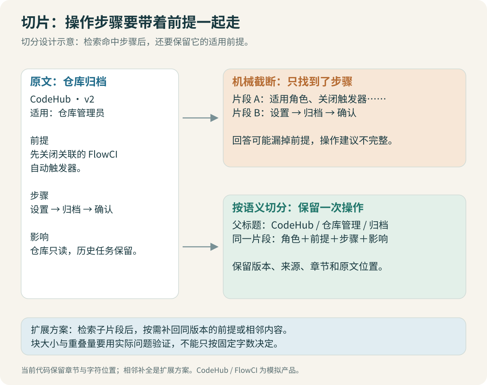
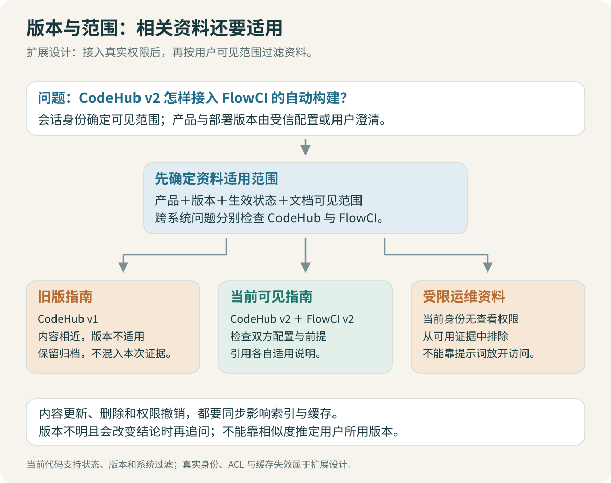

# 切分与版本：保留能解释问题的上下文

权限文档上一段写“只适用于正式员工”，下一段写申请步骤。如果步骤进入了候选，适用范围没有进入，系统可能把它推荐给外包人员。答案里的每一步都来自文档，整体却用错了对象。

切分要同时考虑检索粒度和证据完整性。片段足够聚焦，才容易被找到；它还要带着理解所需的前提，才能被正确使用。



## 1. 先比较小片段与大片段的代价

| 策略 | 容易得到什么 | 容易失去什么 |
| --- | --- | --- |
| 每篇一个片段 | 较完整的局部上下文 | 检索主题不聚焦，长文可能被截断 |
| 固定长度切分 | 实现简单，适合作为基线 | 标题、前提、步骤和例外可能被切散 |
| 按章节与段落切分 | 更接近作者组织知识的方式 | 超长章节仍需二次拆分 |
| 小片段检索、父段补全 | 小范围匹配与较完整证据兼顾 | 上下文变大，补全还需控制范围 |

不存在对所有文档都最优的 chunk 大小。操作手册、故障记录、参数表的组织方式不同，长度只是一个约束。先保留基础切分版本，使用同一问题集比较，才能知道改动解决了什么。

## 2. 字符、token、向量维度不要混淆

字符数是文本长度，token 数取决于模型的分词器，向量维度是编码结果的长度。中文 300 字不保证恰好是 300 token，也不因为向量有 512 维就能输入 512 个汉字。

BGE 模型有各自的输入长度和查询使用方式，实际编码前应检查 tokenizer 的结果。这个项目用模型的 tokenizer 约束片段，而不是凭英文单词数估计中文长度。[BGE 模型说明](https://huggingface.co/BAAI/bge-small-zh-v1.5)

下面是长度预算的概念代码：

```python
def fits(title, body, tokenizer, max_tokens):
    full_text = f"{title}\n{body}"
    ids = tokenizer.encode(full_text, add_special_tokens=True)
    return len(ids) <= max_tokens
```

标题、路径和模型需要的特殊 token 也占长度。不能先把正文切到模型上限，再拼一段标题，最后让编码器静默截掉真正的操作步骤。

> [!TIP] 从截断处检查问题
> 保存送入 Embedding 的实际文本与 token 数。某个步骤总检索不到时，先确认它有没有进入模型输入；原始文档里存在，不代表编码时也存在。

## 3. 按结构切分，再处理超长块

一个适合这套 Wiki 的起点是：先按 `h2` 章节分组，保留文档标题和章节标题；章节较短就作为完整单元，超长章节再按段落、列表或句子拆分。拆分时保留所属章节和顺序编号。

实际入口见 [make_chunks](code/chunking.py)。当前代码先按章节保留结构，再用有重叠的 token 窗口拆超长章节，便于观察每块的长度与来源。真实 tokenizer 使用偏移映射回切原文，避免解码时改写命令、大小写或链接。优先沿段落与步骤边界拆分是下一步可比较的改进，思路如下：

```text
章节
  → 收集连续段落
  → 检查加上标题后的 token 数
  → 超出预算时输出当前块
  → 对单个超长段落继续拆分
  → 为每块保存章节身份与顺序
```

对操作步骤，优先把前提与一组连续步骤放在一起。一个步骤必须继续拆分时，要保留它属于哪个步骤，不能把后一半改造成没有条件的独立指令。

对故障记录，可以保留“适用环境 → 现象 → 判断依据 → 处理 → 结果”的关系。历史记录只能说明某次情况如何解决，不能凭同样错误字符串证明当前根因相同。

## 4. overlap 能补一点上下文，但不是通用修复

重叠切分可以减少边缘内容被断开的影响，也会制造重复。候选前五名如果都来自同一段话的重叠版本，另一篇必要的权限指引就进不来。

先用适当的重叠作为基线，再检查它是否补到了具体的前提。若前提在很远的章节开头，增加几十个 token 的重叠可能没有作用，此时更适合保留标题路径或检索后补父段。

候选去重也不能只看字符串完全相等。相邻片段可能略有差异却覆盖同一证据，最终上下文应记录已经覆盖的文档与章节，减少重复占用。

> [!WARNING] 别靠重复片段制造高分
> 同一证据被切成多个重叠块时，检索到三个块仍可能只覆盖一个事实。评测需要回到文档与章节身份，不能把它们当成三条独立正确证据。

## 5. 小块召回，大块阅读

用户问一条错误码，小片段容易命中；生成回答时，还需要它前面的环境条件和后面的处理步骤。父子检索可以让小块用于匹配，再取回对应父章节作为上下文。

这项优化要有范围限制：只补同一文档、同一版本、同一章节中的邻近内容。不要因为它们属于同一本手册，就把整本 PDF 都塞进去。补全后的内容还要重新计 token，并去掉与其他证据的重复部分。

它也不自动解决跨文档问题。“仓库访问”和“生产发布”分别在两篇指南中，仅扩大其中一篇的父段仍然不够；另一份证据要在召回阶段被找出来。

## 6. 文档更新后，旧片段怎么处理



建议把文档身份、内容版本和索引配置分开记录：

| 信息 | 用途 |
| --- | --- |
| `doc_id` | 标识同一篇逻辑文档，不依赖标题是否改名 |
| 文档版本与生效范围 | 说明规则适用于哪个平台版本与环境 |
| 内容哈希 | 判断正文是否变化，辅助增量处理 |
| 切分配置与 Embedding 版本 | 解释向量由哪套过程生成 |
| chunk 身份与来源位置 | 回到原章节或页码核对 |

内容变化后，需要替换该版本的旧片段，而不是只追加新片段。如果同一操作的旧步骤留在库里，检索可能同时找出两套互相矛盾的答案。

完整的增量发布可以先构建新索引、验证条目与查询，再切换当前读取指针，保留可回退的旧集合。当前教学代码主要展示本地建库与查询；这种在线发布机制是扩展设计，不能因为代码支持 upsert 就声称已经实现。

> [!IMPORTANT] 换 Embedding 模型通常要重建向量
> 维度相同不代表向量空间相同。不能保留旧文档向量，只把问题换成另一个模型编码，然后期待分数仍可比较。

## 7. 旧资料不应一律删除，也不应默认混用

用户问“现在怎样申请”，优先检索当前适用、已发布的指南；用户明确问“1.0 时是怎样操作的”，则需要保留并检索历史版本。`deprecated` 表示它不再是当前指导，并不表示没有历史查询价值。

更新时间也不是唯一依据。一份旧操作说明可能刚补了错别字，时间比现行手册还新。应结合适用版本、生效信息、维护责任和发布状态判断。两份同样适用的正式资料互相冲突时，回答应指出冲突，不要让模型自行挑一个喜欢的版本。

筛选条件来自用户明确输入、受信的会话信息，或事先说明的产品默认值。本示例约定未指定版本时查询现行资料。不能根据相似度高的文档偷偷推定用户正在使用某个版本；若上下文显示版本不明、且规则差异会影响操作，应追问。

## 8. 怎样比较两种切分方案

保持语料、模型、问题和检索参数相同，只替换切分策略。除了 Recall，还看以下现象：正确步骤是否被截断，前提是否一起进入上下文，同源重复占了多少位置，最终上下文有多长。

如果新切分使单文档问题更好、跨文档问题更差，应保留这条结果。它可能是大块占据更多上下文，或重叠导致候选集中在一篇文档。下一步去检查这些中间结果，而不是直接宣布某个 chunk 大小最优。

[← 文档解析](02-Wiki与PDF：先把原文读对.md) · [Embedding 与混合检索 →](04-Embedding与混合检索：找到该找的资料.md)
