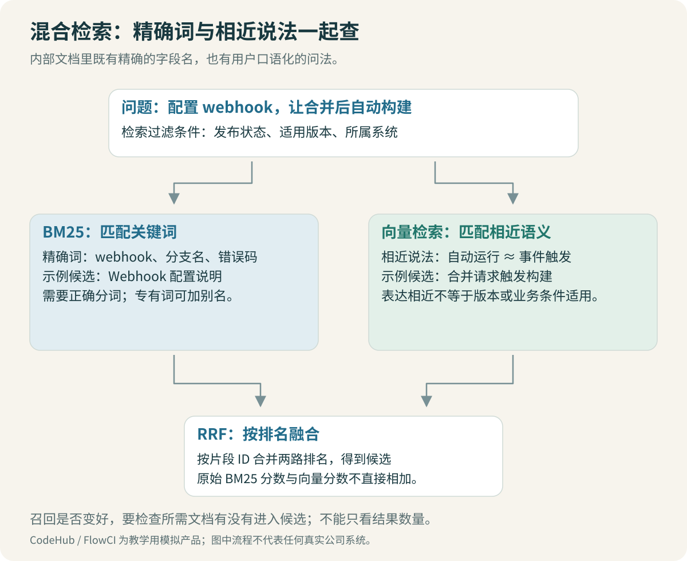

# Embedding 与混合检索：找到该找的资料

“没有合适的机器接任务”和 `RUNNER_NO_MATCH` 可以指向相同的知识，但问法不同。前一种是口语，后一种是明确标识。检索应能理解相近含义，也要保留标识之间的区别。

本项目分别建立向量与关键词检索，然后把两路候选合并。先比较各自找到了什么，再决定混合是否有收益。



## 1. Embedding 做了什么

Embedding 模型把文本变成一组数字。问题与文档使用匹配的编码方式后，可以通过向量距离查找相近内容。这个空间来自模型训练，不是把字符串做哈希后随便得到的一组数字。

本例采用 `BAAI/bge-small-zh-v1.5`，输出 512 维向量。文档直接编码，短问题按模型说明加查询前缀，编码后归一化。模型名、revision 与实际依赖版本在代码中固定。[BGE 官方模型卡](https://huggingface.co/BAAI/bge-small-zh-v1.5)

下面是 [BGEEncoder](code/retrieval.py)中的核心用法：

```python
document_vectors = model.encode(
    texts,
    batch_size=16,
    normalize_embeddings=True,
)
query_vector = model.encode(
    "为这个句子生成表示以用于检索相关文章：" + question,
    normalize_embeddings=True,
)
```

这个前缀是所选模型的用法，不应复制到所有 Embedding 模型。更换模型时，核对它要求的 query/document 提示、池化方式、长度限制与归一化方式。

余弦相似度比较向量方向。向量归一化后，点积与余弦的数值关系更直接，但“接近”仍不是“事实正确”。模型可能觉得仓库权限与生产权限相似，因为它们确实共享大量语义。

> [!TIP] 先检查编码合同
> 文档模型、问题模型、前缀、维度和文本长度必须配套。混合检索不能修复使用错模型空间的向量索引。

## 2. Qdrant 里除了向量，还要放什么

向量用于搜索，payload 保存片段身份与筛选字段。找到一条向量之后，应用需要能返回对应正文、版本和来源，而不是只有一串相似度。

核心写入结构如下，完整实现见 [retrieval.py](code/retrieval.py)：

```python
models.PointStruct(
    id=point_id,
    vector=vector.tolist(),
    payload={
        "chunk_id": chunk.chunk_id,
        "version": chunk.metadata["version"],
        "status": chunk.metadata["status"],
        "system": chunk.metadata["system"],
    },
)
```

Qdrant 的 point ID 与 chunk 身份不必使用相同格式，但映射必须稳定。教学代码用稳定 ID 生成数据库标识，正文对象保留在本次进程内，便于追踪。生产应用还需要持久正文存储、索引更新与一致性管理。

本例使用 Qdrant local 内存模式，无需先部署服务。它能验证接口、向量查询与筛选逻辑；这里的性能不能代表服务端 HNSW 索引、分布式检索或真实生产容量。[Qdrant 本地快速开始](https://qdrant.tech/documentation/quickstart/)

## 3. BM25 怎样补充精确词

BM25 根据词在文档中的出现情况及长度等因素评分，适合为错误码、工具名、配置项和路径提供另一条检索途径。它也依赖分词：索引时把 `RUNNER_NO_MATCH` 拆坏，查询时再保留完整标识，两边就难以匹配。

教学代码保留英文标识与路径，对中文采用透明的相邻双字切分。例如“发布权限”可以产生“发布、布权、权限”。这种方法容易阅读和复现，也会产生不自然的片段；它是中文关键词基线，后续可与词典分词或搜索引擎分析器对照。

```python
# 关键思路：中文片段与英文标识分开处理
parts = re.findall(r"[a-zA-Z0-9_./:-]+|[\u4e00-\u9fff]+", text.lower())
```

需要查看解析后的实际 tokens，尤其是版本号、带下划线错误码、路径和分支名。仅仅安装一个 BM25 包，不代表中文检索已被正确配置。

对于已有明确错误码的查询，可以保留错误码与自然语言说明一起检索。不要把整段流水线日志不加处理地当成问题：重复时间戳、堆栈和环境变量可能淹没真正的线索。先保留失败阶段、报错行和必要上下文，再比较效果。

## 4. 两种分数为什么不直接相加

BM25 与向量分数的范围和含义不同，直接加在一起会让其中一路的数值尺度主导结果。即使各自归一化，转换方式也需要评测。

本例采用 RRF，用名次贡献合并。某个片段出现在第 r 名，贡献为 `1 / (c + r)`；它出现在多路结果里，就累加贡献。没被某一路召回，该路贡献为零。[Qdrant 混合检索说明](https://qdrant.tech/documentation/search/hybrid-queries/)

下面是手算示例，`c=60`，名次从 1 开始，不是实际评测结果：

| 片段 | BM25 名次 | 向量名次 | RRF 得分约值 |
| --- | ---: | ---: | ---: |
| A | 1 | 3 | 1/61 + 1/63 = 0.03227 |
| B | 2 | 1 | 1/62 + 1/61 = 0.03252 |
| C | 未召回 | 2 | 1/62 = 0.01613 |

因此 B 排在 A 前面。RRF 不是投票证明，它只是融合排序的方法。参数 60 是本例起点，需要与候选深度一起记录，不能把它当成固定最优值。

```python
scores = defaultdict(float)
for ranking in rankings:
    seen = set()
    for rank, hit in enumerate(ranking, start=1):
        key = hit.chunk.chunk_id
        if key in seen:
            continue
        seen.add(key)
        scores[key] += 1.0 / (60 + rank)
```

同一路重复出现同一个 chunk，不应重复贡献分数。若是同章节不同重叠块，则还要在上下文阶段处理内容重复。

## 5. 召回数量、重排数量、上下文数量分别控制

例如两路各取 20 个候选，融合后保留 12 个，再重排选一部分进入上下文。这些只是教学配置的量级示意，实际参数以本次命令为准。

扩大候选能让原来排在后面的正确证据进入重排，同时增加耗时和噪声。扩大最终上下文还会增加生成输入长度。不要把三个阶段都叫 `top_k` 然后忘了各自意味着什么。

> [!IMPORTANT] 候选缺失与排序落后分开处理
> 正确证据没进候选，需要回到解析、切分、问题处理、筛选或召回。已经进了候选但排得靠后，再考虑融合与重排。

## 6. 筛选太早也可能把正确答案删掉

用户明确说“1.0”，就不能统一只查 active 文档；用户比较新旧配置，则应允许两个版本。当前代码展示 `version`、`status`、`system` 三类筛选，环境和人员属性的精细筛选留作扩展。

一个跨系统问题可能同时需要 CodeHub 与 FlowCI。若意图识别仅因为用户开头提了仓库，就强制只搜 code_host，后半段生产发布资料会被排除。

筛选应区分“用户明确给出的条件”和“模型猜测的条件”。猜测可以用于排序提示或追问，不能悄悄变成排除证据的硬条件。默认查当前资料是产品约定；回答仍应标清适用版本，并提供历史查询路径。

## 7. 一次检索日志至少记什么

保留原问题、处理后的检索问题、筛选条件、模型与语料版本、两路名次、融合名次以及耗时。然后用一条失败题回答：哪个正确章节没有出现，或者在哪一步被移走。

最有价值的对照通常很小：纯向量、纯 BM25、RRF 混合，在相同语料和问题上分别跑一遍。某类错误码题 BM25 更好、口语问题向量更好，能解释这种差异，就知道混合检索应该解决什么。

[← 切分与版本](03-切分与版本：保留能解释问题的上下文.md) · [重排与上下文 →](05-重排与上下文：把候选变成可用证据.md)
