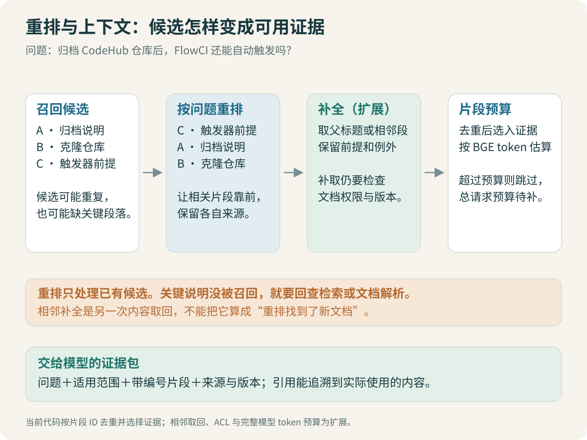

# 重排与上下文：把候选变成可用证据

问“如何申请生产发布权限”，检索结果里可能同时出现仓库访问、测试环境发布、生产发布和旧版审批规则。它们都相关，排在最前面的却未必是最适用的。

重排接收问题与已有候选，更细致地比较两者关系。上下文组织随后决定把哪些内容交给生成模型。这两步的目标不同，也应分别验收。



## 1. 为什么检索后再算一次分数

Embedding 通常分别编码问题和文档，文档向量可以提前计算，查询时快速比较。Cross-Encoder 把问题和候选片段一起输入模型，让它直接判断这一对文本的相关程度；代价是每个候选都需要联合计算，不能像普通文档向量那样全部预先缓存。[Sentence Transformers 检索与重排教程](https://www.sbert.net/examples/sentence_transformer/applications/retrieve_rerank/README.html)

因此通常先用召回缩小范围，再对有限候选重排。让重排模型逐篇比较整个知识库，在资料变多后成本会迅速增加。

核心接口见 [CrossEncoderReranker](code/retrieval.py)：

```python
pairs = [(question, hit.chunk.text) for hit in candidates]
scores = reranker.predict(pairs)
ranked = sorted(zip(candidates, scores), key=lambda item: item[1], reverse=True)
```

本例的神经重排适配使用 `BAAI/bge-reranker-base`。模型说明见 [官方模型卡](https://huggingface.co/BAAI/bge-reranker-base)，实际运行范围与结果在第 08 篇和代码日志中记录。

## 2. 先确认候选里有正确证据

如果生产发布指南根本没进候选，重排只能在仓库权限和测试发布之间挑。它无法从候选集合之外召回新文档。

所谓“重排后补邻近段落”，实际包含了另一次内容取回。需要保留这一过程，而不是把新增证据的收益全部算成排序模型变好了。对照实验应分别记录重排前候选、重排后顺序和补全后的上下文。

> [!TIP] 做一个候选上限检查
> 对每道题先算候选集合是否包含全部必要证据。若上限已经很低，优先修复召回；更贵的重排不会消除这个缺口。

## 3. 模型能看到的长度是多少

Cross-Encoder 的输入包含问题和文档两部分。两者之和超过长度限制时，截断策略可能删掉真正的步骤或限制条件。短问题配很长的文档，也不意味着模型看完了整篇。

记录重排输入的实际长度，检查被截断的位置。候选已经按章节切分，可以减少这种情况；超长章节仍需拆分或挑选与问题有关的局部内容。

分数也要按模型及输出配置解释。即使分数落在 0～1，它也不自动等于经过校准的“答案正确概率”。过滤阈值需要在开发集上观察正例、相似负例和无答案问题，再固定下来。

## 4. 相关性和证据充分性分别判断

一个片段可以非常相关，却只覆盖半个问题。比如它解释为什么仓库权限不等于发布权限，但没有列发布权限的申请流程。

| 检查 | 问的问题 |
| --- | --- |
| 相关性 | 这段是否讨论用户的问题？ |
| 适用性 | 平台、版本、环境、人员类型是否匹配？ |
| 覆盖性 | 原问题的各个部分是否都有依据？ |
| 一致性 | 入选资料之间是否存在互相冲突的规则？ |

重排主要帮助第一项，不能独自承担全部判断。后续的证据判断应输出“缺哪部分”，而不只输出一个好坏分数。缺少用户条件时追问，缺少资料时再检索，文档冲突时说明冲突；三种情况需要不同处理。

## 5. 组织上下文，先减少浪费

当前代码的 [build_context](code/graph.py)先按 chunk ID 去重，再按 token 预算装入上下文。它是便于理解的基线，不是语义去重或最优证据选择算法。

```python
selected, seen, used = [], set(), 0
for hit in ranked:
    if hit.chunk.chunk_id in seen:
        continue
    seen.add(hit.chunk.chunk_id)
    size = count_tokens(labelled_text(hit))
    if used + size <= budget:
        selected.append(hit)
        used += size
```

完整输入还包含系统指令、原问题、会话和输出预留。这里的 `budget` 只是给证据区分配的预算，不能直接设置为整个模型上下文上限。生成模型与 Embedding 的 tokenizer 也可能不同；教学代码使用检索 tokenizer 做证据预算，真实接入要按生成模型重新核对总输入长度。

如果第一条大块放不下，简单跳过可能漏掉最关键证据；如果全部塞入，又可能超过长度限制。进一步优化可以按证据单元精简、补齐必要前提，再装配，仍要保留原文映射供引用。

> [!WARNING] 去重别删掉差异
> 两个片段只有一个词不同，也可能分别适用于测试与生产。相似文本不应在比较条件之前就合并。

## 6. 父段补全怎样控制范围

一种改进是先检索小块，再补同章节前提、相邻步骤或参数解释。适合本套资料的限制包括：同一 doc_id、同一版本、同一章节，且补全后仍在预算内。

当前主链路没有实现完整的父段补全或多样性选择。它们在这里作为下一轮实验设计：固定候选不变，分别比较“直接取 Top-k”与“补同章节前提”，看步骤完整性是否改善、上下文是否明显增大。

跨系统问题还需要避免一篇长文占满上下文。可以按问题所需证据组保留不同来源，但分组规则应来自问题和文档内容，不能读取评测 gold_evidence 参与在线选择。

## 7. 用一个失败题比较重排

先保存这道题的候选原始顺序，人工标出必要证据，再执行重排。关注正确证据是否进入最终上下文，同时检查条件相似但不适用的文档是否被挤下去。

如果重排把最有用的片段降下去了，保留这个反例。可能是输入被截断、问法缺少条件，也可能是模型对内部术语的判断不佳。不要只挑改善的题展示效果。

耗时也要分开记录：模型加载、第一次推理、后续批量推理不是同一件事。CPU 上的小语料实验可以帮助比较本机开销，不能直接推算生产并发与 P99。

[← 混合检索](04-Embedding与混合检索：找到该找的资料.md) · [LangGraph 与状态 →](06-LangGraph：追问、改写与有界重试.md)
