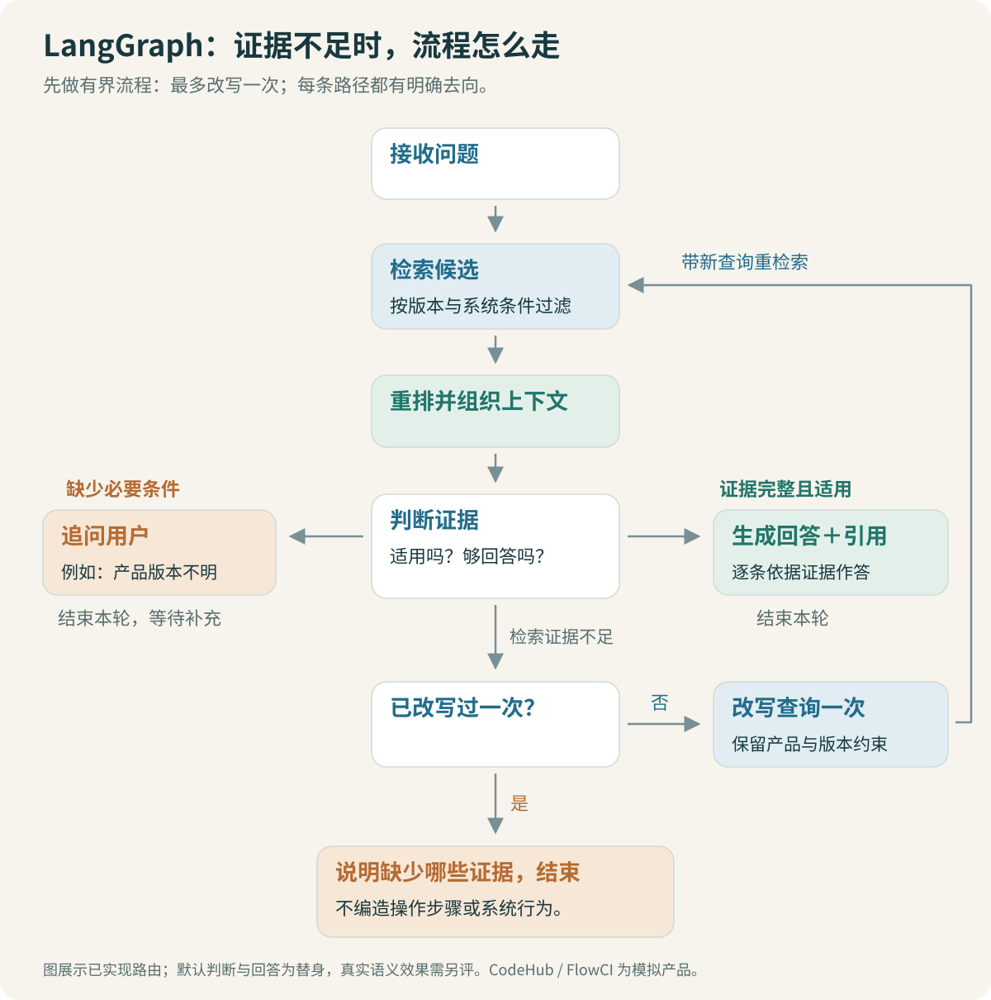

# LangGraph：追问、改写与有界重试

“权限怎么申请？”缺少操作对象。“CodeHub 2.0 的仓库访问权限怎么申请？”已经足够检索。两种问题不能经过同一条无条件生成路径。

还有一种情况：对象明确，但第一次检索没有找到需要的资料。可以换一种保留原意的检索表达，再查一次；如果仍没有证据，就应说明缺口。LangGraph 在这里负责把这些状态和分支组织清楚。



## 1. 节点、状态和边分别是什么

节点是普通 Python 函数，接收状态并返回字段更新；状态保存一次问答目前知道的信息；边规定接下来执行什么。条件边根据判断结果选择生成、追问、改写或结束。[LangGraph 图 API](https://docs.langchain.com/oss/python/langgraph/graph-api)

对于 Java 开发者，可以先把节点看作一个职责单一的处理函数。区别在于它通常返回部分更新，框架按每个字段的合并规则处理，而不是要求函数直接修改整个状态对象。

本例源码位于 [graph.py](code/graph.py)，使用真实 `StateGraph` 构建与执行。检索器、判断器和生成器通过参数传入，便于把流程测试与模型效果分开。

## 2. 为什么保留原问题与检索问题

```python
class RAGState(TypedDict, total=False):
    original_question: str
    history: list[dict]
    query: str
    filters: dict
    candidates: list[Hit]
    context: list[Hit]
    previous_ids: list[str]
    retry_count: int
    action: str
    reason: str
    missing: list[str]
    answer: str
    citations: list[str]
    trace: Annotated[list[dict], operator.add]
```

`query` 可以变化，`original_question` 不能被改写结果覆盖。用户原本问“外包人员怎样申请”，检索改写误丢“外包”时，仍应有原问题供判断和回答核对。

`TypedDict` 主要描述字段类型，不替代模型输出的运行时校验。判断器返回不认识的 action，需要显式拒绝；返回可以回答，但上下文为空，也不能直接生成操作步骤。

## 3. 候选替换，轨迹追加

第一次检索得到 A、B，第二次得到 C、D。当前候选通常应该变成 C、D，同时在 trace 中保留两次记录。若给 candidates 配了列表追加 reducer，就会得到 A、B、C、D，旧版本或无关片段可能一直留在当前证据里。

因此本例只有 trace 使用 `operator.add`。候选、上下文、答案与引用保持覆盖更新。LangGraph 默认字段更新和自定义 reducer 的区别，直接影响多轮执行后的内容。[状态与 reducer 说明](https://docs.langchain.com/oss/python/langgraph/graph-api#reducers)

> [!TIP] 看第二轮状态，比只看最终答案更容易发现问题
> 打印每轮候选 ID 与版本。如果改写后旧候选一直累积，先检查状态合并规则。模型未必是这次错误的起点。

## 4. 图的连接代码很短

以下保留了实际图的连接方式，节点函数定义在源码中：

```python
graph = StateGraph(RAGState)
for name, node in nodes:
    graph.add_node(name, node)

graph.add_edge(START, "prepare")
graph.add_edge("prepare", "retrieve")
graph.add_edge("retrieve", "rerank")
graph.add_edge("rerank", "assess")
graph.add_conditional_edges(
    "assess",
    lambda state: state["action"],
    {
        "answer": "generate",
        "clarify": "clarify",
        "rewrite": "rewrite",
        "abstain": "abstain",
    },
)
graph.add_edge("rewrite", "retrieve")
for terminal in ["generate", "clarify", "abstain"]:
    graph.add_edge(terminal, END)
app = graph.compile()
```

`compile()` 得到可运行的图，不会替你验证文档质量，也不意味着已经具有生产级持久恢复。当前演示通过显式传入 history 支持简单追问，没有实现跨进程会话存储、完整权限体系或生产 checkpoint。

## 5. 判断器应该说明缺少什么

本例给判断器三个基本动作：`answer`、`clarify`、`insufficient`。图再把 insufficient 转成改写或无依据结束。

| 判断结果 | 例子 | 下一步 |
| --- | --- | --- |
| 可以回答 | 适用版本明确，申请条件和步骤都有依据 | 组织回答与引用 |
| 需要追问 | 只问“权限怎么申请”，不知道仓库还是环境 | 问决定流程的缺失条件 |
| 证据不足 | 已明确生产环境，但候选没有审批指引 | 补检索一次或说明缺口 |

判断器可以用结构化模型输出实现，但模型的判断需要单独评测。不能因为它返回 JSON，就相信它真的分清了“相关”和“足够回答”。

机制测试中使用的 `fixture_judge` 是规则替身，只用于稳定触发分支；非空上下文并不能证明可以回答。真实模型判断和生成通过 [model_api.py](code/model_api.py)接入，没有实际调用的部分会在验证记录中说明。

## 6. 一次补检索怎样保证有界

```python
if action == "insufficient":
    action = "rewrite" if state["retry_count"] < 1 else "abstain"
```

改写节点完成后递增计数，再回到 retrieve。这样每次问题最多执行两轮检索。框架的递归上限仍可作为额外保护，但业务预算应直接写在状态与路由中，让运行记录能解释停止原因。

补检索应面向具体缺口，例如增加规范术语或把代词补全。现有演示的无模型改写只是可测试替身，不代表高质量查询改写已经完成。

代码会保护明确版本和部分错误码，若改写丢失它们，就回到原检索表达。这能检查一类明显错误，但无法证明改写语义完全相同。比如“不能发布”变成“如何发布”，字面术语都还在，意图却可能变化。

> [!WARNING] 不要为了找到答案而偷偷放宽条件
> 用户问生产环境，改写成测试环境可能更容易命中文档，但那是换了问题。版本、环境、人员类型和否定条件都需要保留。

第二次仍被判定为资料不足、且检索候选与上一轮相同时，轨迹会记录没有新增证据。比较候选 ID 只能说明集合变化，不能证明新增片段真的补上了缺口；判断器仍需检查内容。

## 7. 连续追问最容易在条件上出错

考虑这段对话：

```text
上一轮：1.0 时生产发布权限怎样申请？
本轮：那现在呢？
```

把两轮问题直接拼起来，仍能搜到“1.0”。如果筛选逻辑优先继承旧版本，就会继续返回旧审批规则。本轮“现在”应覆盖历史版本条件。

再看另一种：上一轮讨论测试环境，本轮问“生产呢”。应保留“申请发布权限”这个主题，同时替换环境。完整的会话处理需要区分可继承的主题和被本轮改写的条件。

当前关键代码保留一个轻量基线：使用上一条用户问题补全话题，并显式处理当前/历史版本意图。它没有实现通用语义槽位管理。长期对话、多个并行话题和复杂否定都需要额外评测，不能靠拼接历史自动解决。

## 8. 测试流程时，不需要每次赌模型输出

流程机制可以用可控依赖测试：第一次返回不足、第二次返回足够，断言节点顺序和检索次数；持续不足则断言结束，候选不能无限追加；返回非法引用则应失败。

模型能力另外用固定问题、真实文档和人工标注验证。这种拆分能明确：某个测试证明“最多两次检索”，另一个评测才判断“是否选对证据”。前者通过，不能当作后者的准确率。

面试时可以先运行一个分支测试，展示 trace，再拿一道真实检索失败题解释为什么证据不足。代码与问题能连起来，LangGraph 的价值就比较容易说明。

[← 重排与上下文](05-重排与上下文：把候选变成可用证据.md) · [回答与引用 →](07-回答与引用：资料没说的不要补出来.md)
