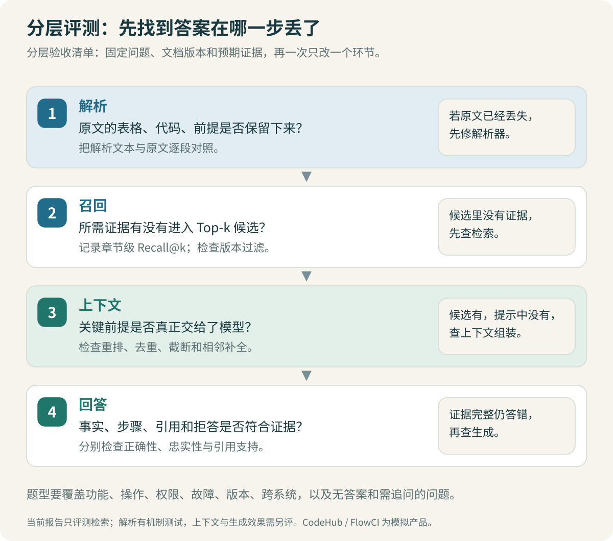

# 评测与优化：定位每一步的损失

“回答看起来更好了”很难复查。换了 Embedding、调了切片、加了重排之后，如果只挑几个成功案例看，你无法知道哪项修改有效，也不知道其他问题是否退步。

先把失败发生的位置找出来：资料根本没有，解析漏了，检索没找到，重排排掉了，上下文装不下，还是模型拿着证据仍答错。这几种问题需要不同的修改。



## 1. 题目要标“依据在哪里”

题库不能只有一个标准答案字符串。同一个意思可以有很多种说法，文本不完全一致不代表回答错误。反过来，回答复述了大部分标准答案，也可能多加一条危险的错误步骤。

本项目的 [questions.jsonl](data/questions.jsonl) 为每道题保留以下内容：

| 字段 | 用来判断什么 |
| --- | --- |
| `question`、`history` | 当前问题，以及理解指代所需的历史 |
| `expected_action` | 应当回答、追问，还是说明资料不足 |
| `gold_evidence` | 回答需要哪些文档章节 |
| `required_points` | 回答必须覆盖的事实或步骤 |
| `forbidden_claims` | 不能出现的具体错误结论 |
| `reference_answer` | 人工编写的参考表达，不要求逐字复述 |
| `family`、`split` | 同类问题如何隔离到开发集或保留测试集 |

例如 Q-009：“我电脑上的 SSH 能正常克隆，FlowCI 检出还是失败，为什么？”依据来自 `KH-004:s03` 和 `KH-016:s01`。回答要解释个人身份和自动化连接身份的差别，不能因为本机克隆成功，就判断流水线一定拥有同样的凭据。

两个章节都与问题有关。只找到一个，可能足够回答某句话，却不足以支撑标注中的完整排查说明。因此要同时看局部召回与完整覆盖。

### 本次数据的组成

语料共 24 篇模拟 Wiki、72 个章节。题库共 72 题，按 24 个题组分为 48 道开发题和 24 道保留测试题；同一个题组不跨集合。

其中 60 道可以根据语料回答，开发集 42 道、测试集 18 道。其余 12 道分为 6 道需要追问、6 道知识库没有足够依据。普通召回率只对这 60 道可回答题计算。

> [!WARNING] 无答案题不能塞进普通 Recall 的分母
> 无答案题没有应当命中的证据集合。把它的 Recall 随便定义成 0 或 1，都会改变统计含义。应当另量“是否错误地给出确定答案”，并检查回答内容。

题目和文档由同一次编纂产生，语言比较清楚，噪声有限。按题组拆分能减少同题改写混入测试集，不能消除共同写作风格造成的偏差。它适合练习和比较这套实现，不能代表真实员工提问的分布。

## 2. 同一份结果，可以算出不同的分数

假设某题需要章节 A、B，前五个 chunk 返回 `[A-1, A-2, C-1, D-1, E-1]`。A-1、A-2 是同一章节的重叠切片。

| 指标 | 这道题的结果 | 说明 |
| --- | --- | --- |
| 章节 Recall@5 | 1 / 2 = 0.5 | 两个必需章节只找到一个，重复 A 不多算 |
| Hit@5 | 1 | 至少找到一条正确证据，但无法说明找全了 |
| RR@5 | 1 | 第一名就是正确证据，仍可能缺 B |
| 标注章节全覆盖 | 0 | A、B 没有同时出现 |

代码没有单独输出 Hit@5，这里用它说明指标差异。`mrr` 字段是各题 RR@K 的平均值，K 以实验配置为准。`all_evidence` 是“标注章节全覆盖”的平均值，不表示答案完全正确。

核心计分方式见 [evaluate.py](code/evaluate.py)：

```python
gold = {(e["doc_id"], e["section_id"]) for e in gold_evidence}
ranked = [(h.chunk.doc_id, h.chunk.section_id) for h in hits[:k]]
found = set(ranked)

section_recall = len(gold & found) / len(gold)
all_evidence = float(gold <= found)
first = next((r for r, evidence in enumerate(ranked, 1)
              if evidence in gold), None)
rr = 1 / first if first else 0.0
```

这里的分母是标注的**章节**，不是切片数量。调大 overlap 后，一个章节可能产生多个 chunk；若分母跟着 chunk 数变动，比较就会混入切分方式造成的变化。

`doc_recall` 把单位放宽到文档。它适合判断是否找对大致资料，却容易掩盖“找对文档、找错章节”。本项目同时保存这两个粒度。

> [!TIP] 先解释分母，再报百分比
> “42 道可回答开发题，按题平均计算必需章节的 Recall@5”，比一句“召回率 95%”更容易让人判断实验是否可信。

标注也可能漏掉等价证据。若系统找到了另一份真正能支持回答的文档，应回看原文、补充可接受证据，而不是强行认定模型错了。修改标注后要升级题库版本，并重新说明结果的可比范围。

## 3. 本次实际测量了什么

检索实验真正执行了 HTML 解析、章节切分、BGE 编码、Qdrant 本地向量查询、BM25 和 RRF。资料与问题是模拟的，检索结果来自实际运行。

固定配置如下，完整模型 revision 与内容哈希保存在报告中：

| 项目 | 本次取值 |
| --- | --- |
| Embedding | `BAAI/bge-small-zh-v1.5`，512 维 |
| 切片预算 | 384 token；长片段重叠 48 token |
| 实际索引 | 24 篇 HTML → 72 个 chunk |
| 候选池 | 向量与 BM25 各最多 20 条 |
| RRF 常数 | 60 |
| 最终检索结果 | K = 5 |
| 可选重排 | 融合前 12 条交给 `bge-reranker-base`，再取 5 条 |

主语料每个章节都能装入预算，因此本次恰好一个章节对应一个 chunk。正式语料没有触发长窗口切分，不能据此宣称 384/48 是最优参数。长文本机制另用真实 tokenizer 检查，见 [model-verification.txt](code/model-verification.txt)。

开发集四路对照如下。42 道可回答题使用相同语料、相同过滤条件和相同 K。CrossEncoder 重排也已实际运行。

| 检索方式 | 章节 Recall@5 | MRR@5 | 标注章节全覆盖 | 本机查询中位耗时 |
| --- | ---: | ---: | ---: | ---: |
| Dense | 0.936508 | 0.944444 | 0.857143 | 10.27 ms |
| BM25 | 0.932540 | 0.882937 | 0.880952 | 0.43 ms |
| RRF 混合检索 | 0.948413 | 0.948413 | 0.880952 | 10.60 ms |
| RRF + 重排 | 0.944444 | 0.952381 | 0.880952 | 400.08 ms |

RRF 的平均章节召回略高于两条单路，但全覆盖与 BM25 相同。加入重排后，首条正确证据的位置略有改善，章节召回反而略降，全覆盖仍没有提高。可见“首条结果更靠前”“多找回部分证据”和“更多问题的依据全部找齐”需要分开看。

这组开发集结果不足以支持默认开启重排。如果主要关心完整证据覆盖，就需要解释额外耗时换来了什么；如果主要关心首条结果，还应先确认这点微小差异能否在更多问题上保持。

保留集在配置不变的情况下运行一次，结果如下。只有 18 道可回答题，一个题的变化就会明显影响均值，不能据此推出通用结论。

| 检索方式 | 章节 Recall@5 | MRR@5 | 标注章节全覆盖 |
| --- | ---: | ---: | ---: |
| Dense | 0.842593 | 0.837963 | 0.722222 |
| BM25 | 0.953704 | 0.916667 | 0.888889 |
| RRF 混合检索 | 0.898148 | 0.907407 | 0.777778 |
| RRF + 重排 | 0.925926 | 0.847222 | 0.833333 |

本批保留题中 BM25 的三项指标更好。混合检索没有稳定超过它，重排也没有同时改善所有维度。因此项目保留这几条路径用于对照，不能把组件组合本身当成效果优势。下一步需要扩大问题来源，逐题核对业务术语、查询表达和证据分布；这些是待检验的原因，并非已经证明的归因。

原始逐题记录分别见 [最初三路开发报告](code/dev-retrieval.metrics.txt)、[四路开发报告](code/dev-rerank.metrics.txt)和 [保留集报告](code/test-retrieval.metrics.txt)。报告是 JSON 文本，包含检索问题、过滤条件、返回 chunk ID 和耗时，便于直接追查失败题。两轮开发报告的三路召回指标一致，表中耗时取自四路同次运行。本轮范围汇总见 [运行核验记录](code/verification.txt)。

本次没有启用真实生成模型和模型证据判断。因此没有回答准确率、拒答准确率、引用蕴含率的实测数字。默认替身能跑通分支，只说明接线和状态逻辑可用。

### 为什么还保存哈希

只写“BGE + Qdrant”无法复现实验。同一套配置下，修改了网页正文、标题前缀或切片方式，结果都可能改变。

报告同时保存语料清单、实际索引 chunk 内容和题库的 SHA-256。实际索引内容包含提取后的文本与元数据，能够发现“清单没变，HTML 解析结果已经变了”的情况。模型 revision 固定权重版本，依赖快照固定代码运行环境。

当前延迟记录来自本机 CPU 顺序执行，受缓存、预热、其他本机活动和执行顺序影响；不含生成模型耗时与模型加载。表中重排路径包含前置混合检索。把这些样本的 P95 写成企业生产链路 P95，会越过这次实验能支持的结论。

## 4. 查一条失败题，比继续堆参数更有价值

开发集 Q-009 与 Q-042，在第一轮三种检索方式下都只召回了一半标注证据。Q-042 的问题是：“FlowCI 构建成功了，CodeHub 合并页仍等 build/test，连接也显示正常，查哪里？”

这道题同时要求理解“构建结果如何回传”与“为什么成功状态没有满足合并检查”。如果只找到其中一个章节，回答可能漏掉 commit SHA、检查名称或连接权限中的必要核对项。

先在报告中找到该题的 `retrieved`，回到 HTML 核对排位。接着问：

1. 缺失章节是否进入过各自的前 20 条？没有进入，优先检查查询表达与召回；已经进入，才看融合或重排。
2. 命中的片段是否与缺失片段属于同一篇短文？可以实验按章节补充相邻上下文，但需要测噪声与 token 成本。
3. 一句话是否实际包含两个子问题？可以尝试拆为“状态回传身份”和“合并检查匹配条件”，分别检索后融合。

这两种优化尚未在当前主链实现。下一次实验先在开发集上测，不能仅凭它们听起来合理就写“已经解决”。

> [!IMPORTANT] Reranker 能重新排序，不能生成缺失的候选
> 如果正确章节根本没进入重排输入，再强的重排模型也无法把它找回来。先分别量候选池召回与最终 Top-K 召回，才能分清问题在哪。

## 5. 每次只检验一个假设

一个可复查的实验记录应包含：失败现象、假设、修改项、其余固定项、逐题差异和成本。

| 观察 | 可以检验的假设 | 对照方法 |
| --- | --- | --- |
| 错误码检索不稳定 | 分词拆坏了标识符 | 固定其他配置，比较完整标识符与普通切分 |
| 相关页面很多，操作步骤排后面 | 融合结果相关但排序不精确 | 固定候选池，对比是否重排 |
| 多章节题经常只找到一半 | 单条 query 覆盖不足 | 固定模型，比较单查询与子问题检索 |
| 旧流程压过新流程 | 适用版本识别不对 | 先检查 filters，再考虑模型分数 |
| 检索命中但答案漏条件 | 上下文或生成损失 | 对比检索结果、实际 prompt 证据与答案 |

调整切片大小时要重新生成向量并建索引。调整 K 时要同时观察完整覆盖、无关内容比例与上下文成本。加重排时要记录模型加载时间和查询时间的区别，并检查联合输入有没有被截断。

开发集用于选方案，方案固定后再运行保留测试集。看过测试结果再据它调参，这批题就不再是未见测试题；后续应另建一批保留问题。

## 6. 生成评测怎样接上

接入真实模型以后，先按题保存最终上下文、答案、引用和判断动作，再分项评审：

| 维度 | 检查方式 |
| --- | --- |
| 事实正确性 | 是否符合题目与适用版本的规则 |
| 必需点覆盖 | `required_points` 是否逐项得到回答 |
| 无依据断言 | 是否出现文档没有支持的审批人、地址或根因 |
| 引用有效性 | 引用 ID 是否在本轮上下文，正文与引用数组是否一致 |
| 引用支持关系 | 被引片段能否支持紧邻的这条说法 |
| 动作选择 | 应追问时是否追问，无依据时是否仍强答 |

可以引入模型裁判协助判断事实与证据关系，但先拿一小批人工判定样例检验裁判，尤其检查它是否偏爱长答案、是否忽略版本。裁判输出理由不代表理由正确，抽样复核仍然需要。

Faithfulness 衡量答案是否受到给定上下文支持。即便这个维度表现好，若检索拿的是过期规定，回答依然可能不符合用户现在的需求。不要把一个分数当成整条链路的质量。[Ragas 的 faithfulness 定义](https://docs.ragas.io/en/stable/concepts/metrics/available_metrics/faithfulness/)与 [LangSmith 的 RAG 评测示例](https://docs.langchain.com/langsmith/evaluate-rag-tutorial)可用于对照评测维度。

## 7. 你应当能够独立复现的动作

按 [代码说明](code/README.txt)安装 Python 环境后，先运行机制检查，再执行开发集检索。先不要改参数，核对语料、题库和索引哈希是否与报告一致。

从报告挑一个漏证据的题，在纸上或笔记里写出它需要的两个章节，再看系统实际返回了什么。只改一项，重新跑开发集，并记录原本正确的题有没有退步。

做到这一步，你已经能解释一次优化的作用范围。至于生产回答准确率，要等真实语料、真实问题、真实模型和明确的评审口径一起到位，才能给出可靠数字。

[上一章：回答与引用](07-回答与引用：资料没说的不要补出来.md) · [下一章：案例与面试](09-案例与面试：把问题讲到代码和证据.md)
