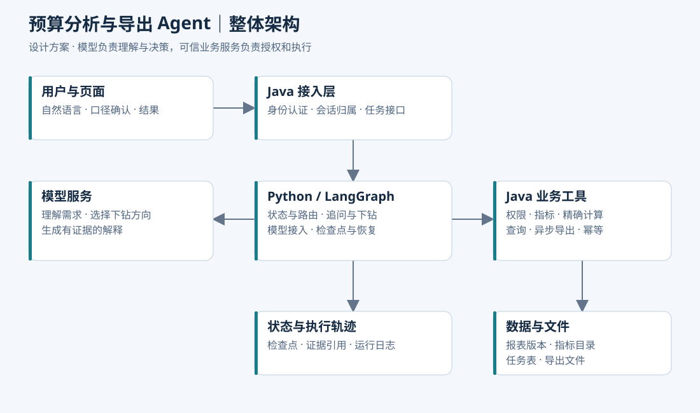
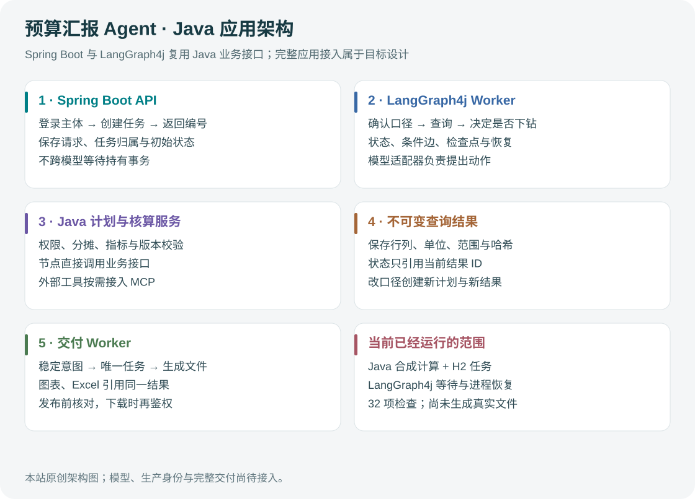

# 业务背景、范围与整体架构

> 本文为独立实践项目设计，组件与场景不代表原公司系统已采用。

## 1. 项目定位

项目名称：多项目预算核算智能分析与汇报助手。

### 已确认的业务背景

原系统是企业内部的预算与核算数据底座，汇集其他系统同步、人工导入及页面维护的数据。核算内容包括项目支出、人力费用等；一个项目可能涉及多个投资方，同一项目的预算核算分摊可以按部门、重量级团队、投资等不同维度查看。这里的“重量级团队”沿用业务称谓，不预设为部门的下级组织。

员工需要围绕多个项目汇报，领导通过汇总和明细了解情况、辅助决策。早期员工从各系统导出文件，再用 Excel 整理和制图；已有系统实现数据集中及固定报表，但卡片、图表主要靠开发定制。员工还需要熟悉复杂的入口、筛选条件和口径，系统更新后需要再次宣讲培训。

因此，新增 Agent 面对的是一个已经存在的业务系统：复用数据和核算能力，减少临时报表加工与操作学习成本。不能把原系统已经完成的数据集成全部归为 Agent 的贡献。

### 从痛点到能力，而不是从框架到功能

| 真实问题 | Agent 拟提供的增量能力 | 后端必须保证什么 |
| --- | --- | --- |
| 不知道从哪个页面、哪个维度查 | 从业务表达识别指标、项目、期间、分摊口径，说明选项 | 能力目录反映当前可用功能，不编造入口 |
| 新卡片和图表需要开发 | 在支持的指标、维度、图表类型内自助组合 | 指标和分摊规则不被模型临时改写 |
| 多张报表导出后再整理 | 多项目查询后生成图表、Excel 和核对数据 | 同一结果版本、完整性和权限一致 |
| 系统更新后重复培训 | 按当前版本提供任务引导、口径解释和变更提示 | 业务说明有适用版本，关键变化显式告知 |
| 汇总发现异常后还要手动查明细 | 在授权范围内依据查询结果选择下一步下钻 | 差异贡献与业务原因分开，缺证据不归因 |

“不需要培训”“完全不需要开发”“领导可以自动决策”均不是项目承诺。新增指标或新核算规则仍要业务确认与开发实施；Agent 解决已有能力的灵活使用和组合。

### 角色和完成标准

员工是首要使用者：描述任务、确认重要口径、核对并采用汇报材料。领导是主要材料使用者，也可以在自己的授权范围内发起查询，但不会因为职称自动获得全量数据。业务管理员维护术语、使用说明和分析方法；开发维护数据接口、核算规则、权限与工具契约。

第一条演示路径是“选多个项目 → 确认期间和分摊维度 → 获取预算/费用 → 按需下钻 → 生成材料与核对数据”。首先跑通员工汇报，再扩展领导临时追问。分析完成表示材料符合请求且能核对，不表示已经替领导作出资源调整决定。

### 面试实践的建模假设

目前只确认存在多个分摊维度，尚未确认真实分摊公式、规则维护方式与维度层级。本项目采用可复现的模拟规则：每个轴是一种独立观察口径；预算和实际分别关联审核后的规则版本；同轴分摊须遵守约定的守恒及舍入政策。多个轴不相加，也不能凭部门与投资的两个边际比例推断联合分摊。需要联合视图时，必须有业务认可的联合规则和相应权限。

投资相关分摊不默认等于出资比例；人力费用也不默认等于人数乘单价。演示可直接使用上游已经核算的项目人力费用，避免无依据地引入个人薪酬、工时或成本计算规则。具体语义和算例统一在[分摊语义与 Java 工程](04-分摊语义与Java工程实现.md)维护。

### 贯穿案例

用户：“整理 P01、P02 上半年的预算执行，按部门展示，说明值得关注的项目，给我图表和 Excel。”

合成数据：P01 调整后预算 70 万元、实际费用 77 万元；P02 为 50 万元、49 万元。项目总额预算 120 万元、实际 126 万元。部门 D_A 在两个项目的比例分别为 60%、20%，D_B 为 40%、80%。本次演示中预算和实际采用相同比例。

| 观察口径 | 预算（万元） | 实际（万元） | 差异：实际－预算（万元） |
| --- | --- | --- | --- |
| 两项目分摊前合计 | 120 | 126 | +6 |
| 部门 D_A 分摊后 | 52 | 56 | +4 |
| 部门 D_B 分摊后 | 68 | 70 | +2 |

Agent 不能看到“部门”就把项目所属部门作为 GROUP BY：本例要求使用部门分摊结果。D_A 的 +4 万来自 P01 的 +4.2 万和 P02 的 -0.2 万，随后是否继续查费用类别取决于用户目标、数据可用性与权限。这里仅定位差异贡献，不能凭这些数字判断“人员投入失控”。

早期实验中的年初预算 100 万、调整后 120 万、实际 126 万、付款 90 万仍用于说明预算/实际口径选择。它是项目总额的合成对照组，不能直接拿来当部门分摊结果。

## 2. 输出与完成标准

一次成功任务应返回：采用的指标口径、组织范围与期间；预算/实际/差异；必要的明细或主要贡献项；查询证据标识和数据截止时间；用户要求导出时的任务状态或文件入口。

如果条件不足，应明确追问；如果数据缺失，应返回缺失状态。不得把缺失记录默认为零，也不应把差异贡献直接写成业务原因。

### 面试官真正要确认什么

“自然语言查数”不足以说明需要 Agent。这个项目的核心需求是：用户只给目标，系统需要根据已有数据决定是否补问、是否下钻，以及下一步查什么。固定报表仍然承担预设查询，Agent 只覆盖临时分析。

例如部门 D_A 分摊后超支 4 万元，先按项目看到 P01 贡献 +4.2 万、P02 抵减 -0.2 万，再决定是否查 P01 的费用类别。若结果没有明显差异且用户只要图表，就直接交付。下一次查询取决于观察与任务目标，这才是动态决策的部分。

如果每个问题最后都固定调用同一组接口，应该把它描述为“自然语言驱动的查询工作流”。不能靠增加一个 LangGraph 依赖就证明存在 Agent 能力。

### 从需求推导验收条件

| 业务要求 | 工程不变量 | 应保留的验证证据 |
| --- | --- | --- |
| 财务数字可以核对 | 所有数值来自同一有效计划下的确定性结果 | 基准结果、有效计划、数据版本 |
| 分摊口径不混用 | 同轴、同目标范围、兼容的预算/实际规则及共同粒度 | 分摊规则包、适用期间、轴内核对结果 |
| 不越权 | 每次业务工具执行都校验当前主体和组织范围 | 拒绝日志、跨用户负例 |
| 用户能继续追问 | 条件变化有明确的继承与失效规则 | 前后计划差异、旧证据失效记录 |
| 服务重启可继续 | 图状态可恢复，外部操作身份不变 | 中断点、恢复 checkpoint、task_id |
| 能说明分析为何结束 | 步数、覆盖率、重复查询与证据可用性共同约束 | termination_reason、查询轨迹 |
| 不影响原报表 | 分析和导出有并发、超时与数据库资源上限 | 原接口延迟、连接等待、拒绝计数 |

这些是不变量与目标，不是已经测得的效果。架构和难点都要围绕它们展开。

## 3. 整体架构

### 设计前提与最终选择

本项目模拟“给已有 Java 预算系统增加智能分析能力”。原有登录、组织权限、核算规则、报表和导出继续由预算系统负责，新增 Agent 运行服务承担多轮交互和分析执行。

采用两个应用：一个 Spring Boot 预算应用，一个 Python/LangGraph Agent 服务。Java 面向用户的接入接口与供 Agent 使用的工具接口属于同一个应用中的不同模块，不拆成两个 Java 服务，也不新建一套业务网关。

划分依据是运行方式和职责：预算接口执行短时、确定性的业务操作；Agent 需要等待模型、暂停追问并恢复任务。把 Agent 的依赖、执行并发和故障范围隔离，能减少对已有业务的影响。双语言是这一选择的成本，不能以“简历需要更多技术栈”作为设计理由。

如果项目只有一次自然语言查询，不需要暂停、恢复或动态下钻，应优先在现有 Java 应用内实现。本设计保留独立服务，是因为目标包含多步分析和可恢复任务；这仍属于可取舍的方案，不是所有 Agent 项目的必需架构。

上图表示基础的两个应用边界；下面是加入 Skills、MCP、双查询通道与统一结果集后的目标能力关系，仍复用同一个 Java 预算应用，不按每个框拆微服务。

| 层次 | 组件 | 职责 |
| --- | --- | --- |
| 交互层 | 简单 Web 页面 | 问题输入、口径确认、进度、结果与导出下载 |
| 接入模块 | 现有 Spring Boot 应用 | 登录态、会话归属、短时提交、状态查询；后续可转发事件 |
| 编排应用 | Python 服务 + LangGraph | 持久化受理、后台执行、状态图、模型调用、追问与恢复 |
| 业务工具模块 | 同一个 Spring Boot 应用 | 指标/分摊规则、权限检查、确定性查询计算、结果与导出 |
| 数据层 | PostgreSQL | 模拟业务数据、报表版本、操作任务与检查点的独立 schema |
| 支撑层 | 文件存储、结构化日志 | 导出文件、证据引用、调用轨迹与评测记录 |

首版用一个 PostgreSQL 实例隔离 schema，Redis、消息队列和独立网关不作为前置依赖。目标版本在 Java 应用中加入 MCP 薄适配模块，先复用已有领域服务。两个应用使用不同数据库角色，仅操作自己拥有的数据；Python 不直接读写预算事实表。

LangGraph 支持在同一图中混合确定性步骤和模型驱动步骤，可以独立于 LangChain 使用。本设计用 LangChain 的模型/工具组件简化接入，用 LangGraph 控制执行流。[官方概览](https://docs.langchain.com/oss/python/langgraph/overview)

## 4. 一次请求的完整链路

1. 页面向 Java 提交分析请求。Java 验证身份，记录请求与用户的归属，用稳定 request_id 调用 Agent 受理接口。
2. Agent 服务持久化任务，返回 run_id 和 QUEUED 状态；Java 立即向页面返回任务标识。模型推理在后台执行，不占用本次提交请求的数据库事务或同步等待链。
3. Agent 识别意图、加载发布的 Skill 和相关工具定义，条件含糊时等待输入；页面经 Java 查询到追问并提交回答。
4. 条件明确后，选择标准指标或受限 Text-to-SQL。两条通道都经 Java 完成当前权限检查、版本绑定和有效查询创建；探索 SQL 另经 AST 与执行边界校验。
5. 执行器将模型 Function Calling 请求适配为 MCP 工具调用。Java 执行查询并物化不可变 result_id，返回有界摘要；Agent 按需下钻生成关联结果。
6. 生成带证据的分析并校验，失败则使用确定性结果模板。
7. 用户要求交付时，Java 基于同一 result 及冻结变换创建 SVG、Excel 和查询数据产物任务，不重新生成 SQL。分析完成与各格式产物完成分别显示。
8. 页面通过 Java 查询分析结果或导出状态；下载时重新检查当前权限。

### 为什么 Java 调 Python，Python 又调用 Java

前者是“提交分析任务”，后者是“执行指标查询或创建导出任务”，两个接口没有相互递归。工具处理过程中禁止再启动 Agent；Java 提交接口只等待任务持久化确认，不等待整轮模型分析。

因此不存在必须维持的“前端 HTTP → Java 事务 → Python 推理 → Java 数据库操作”的长同步调用链。工具请求仍需有超时和并发上限，并给普通预算查询保留资源，防止分析流量耗尽原有业务容量。

### 状态与数据归属

| 事实 | 唯一管理方 | 另一侧如何使用 |
| --- | --- | --- |
| 用户、组织权限、请求归属 | Java | Agent 携带受信上下文，工具仍重新鉴权 |
| 分析排队、执行、等待输入、检查点 | Python | Java 经内部状态 API 查询，不维护第二套可写执行状态 |
| 有效查询计划、报表版本、数值证据 | Java | Agent 保存 ID，通过工具读取 |
| 导出任务、文件发布和下载权限 | Java | Agent 返回任务 ID，页面独立查询 |

Java 保存的是请求到 run_id 的关联；Python 才是分析执行状态的权威来源。用户界面不要把 Agent 服务不可达显示为“任务失败”，应显示状态暂不可用。

### 最小内部接口

以下是本项目自定义 HTTP 契约，不是官方 LangGraph 固定端点。Java 可使用普通 HTTP 客户端，无需在 JVM 中加载 Python 库。

| 接口 | 作用 |
| --- | --- |
| POST /internal/agent/runs | 带 request_id 受理任务，持久化后返回 run_id |
| GET /internal/agent/runs/{id} | 返回执行状态、追问或最终结果引用 |
| POST /internal/agent/runs/{id}/answers | 按 command_id 和等待版本幂等提交回答 |
| POST /internal/agent/runs/{id}/cancel | 请求合作式取消，不承诺立即停止已提交的导出 |
| POST /internal/budget/query-plan | 校验业务条件并绑定报表版本 |
| POST /internal/budget/query | 执行有效计划下的授权查询 |
| POST /internal/budget/exports | 幂等创建导出任务 |

首版页面轮询任务状态即可；需要更即时的进度体验时再增加 SSE。自建 HTTP 受理层必须实现持久化队列和 Worker 恢复，不能使用请求结束后丢失的内存后台任务冒充可靠任务系统。

## 5. 关键技术取舍

### 三种方案的比较：为什么选当前方案

| 方案 | 能满足什么 | 主要缺口或代价 | 决策 |
| --- | --- | --- | --- |
| 表单 + 固定报表 | 预设筛选、标准导出 | 难以承接模糊目标和按结果决定的下钻 | 保留既有能力，不重写 |
| 单体 Java + 模型组件 | 意图提取、工具调用、短流程 | 多步恢复需另选运行机制；对只维护 Java 的团队通常更简洁 | 如果范围缩为单轮查询，优先采用 |
| 既有 Java + 独立图运行服务 | 复用业务边界，单独管理等待、恢复和执行并发 | 双服务、远程失败、持久化受理与状态归属 | 当前多步分析项目采用 |

两个应用并不自动带来高可用。它只提供隔离和独立演化的边界；并发额度、数据库连接隔离、超时和恢复仍然要实现。面试中主动说明这一点，比泛称“微服务解耦、提升稳定性”更准确。

### 任务异步化的边界

不能把 FastAPI 的普通内存后台任务或 Java 的一次 @Async 调用当成可靠队列。受理返回前必须把请求持久化；进程重启后能扫描未完成任务并恢复。

Java 接口仅负责已认证提交；Python 数据库中的运行记录是分析状态唯一事实来源。初次请求超时，使用同一个 request_id 查询或重试受理，而不是再创建一个分析。用户改口径后产生新的 plan_revision，不能静默修改正在导出的旧计划。

初版单执行进程便于控制同一图的写入；部署重启保证旧进程已退出后再恢复。若未来多进程接管，则必须同时处理租约、执行代次以及旧进程继续写 checkpoint 的问题。仅有数据库锁并不能阻止已经失去锁的进程继续运行。

### 哪些需求不值得先引入基础设施

指标定义只有几十个时，结构化目录和关键词匹配足够；不先建向量库。MCP 在当前版本用于统一业务能力接口，不先建独立工具市场和注册中心。任务量不大时，数据库任务表足够；不先增加 MQ、重试主题和死信队列。需要长期保留大量报表版本时，再评估增量存储，首版全量模拟快照只是验证手段。

这些取舍说明的是当前约束下的实现成本，不否定相关技术的价值。

### 为什么 Python + Java

Python/LangGraph 负责多步任务和交互状态，Java 保持既有预算规则与授权边界。代价是双服务部署、接口版本、调用链排查和鉴权传递。分析任务受理使用内部 HTTP；业务工具通过 Java 内的 MCP 适配模块供授权客户端复用。MCP 包装不复制原有领域逻辑，也不提供自动业务鉴权。

纯 Java 方案也可行。如果团队只维护 Java，或独立服务的成本高于收益，可以在同一应用内使用模型组件与持久化任务编排。当前方案选择 LangGraph 复用图执行和暂停恢复能力，不同时维护 Spring AI 与 LangGraph 两套 Agent 运行时。服务数量与恢复能力应随验证结果调整。

### 为什么单 Agent

任务围绕同一指标语义和权限范围。多个 Agent 会增加上下文同步、失败定位与成本问题，暂时没有独立角色或隔离执行的必要。并行查询可以由程序并发完成，不需要为每个查询创建一个 Agent。

### 为什么不直接开放数据库

受控工具可以统一口径、权限和查询资源。标准指标使用可信编译，探索 SQL 可以由模型生成，但必须由相同的受限执行器校验和执行；不允许模型获得数据库全库凭证。两条路径都返回 result_id，而不是把“成功执行任意 SQL”当成目标。

## 6. 数据模型的最小集合

| 数据对象 | 关键内容 |
| --- | --- |
| project、organization | 项目、组织及层级映射 |
| source_batch | 来源、批次状态、业务截止时间、导入校验结果 |
| report_release | 报表发布版本及各来源批次组成 |
| budget_fact、actual_fact | 版本、项目、期间、费用项、币种、金额 |
| allocation_rule_bundle、allocation_rule_item | 预算/实际分摊规则、轴、目标、比例、生效期间和审核状态 |
| allocated_fact | 分摊结果、原事实血缘、规则版本、轴、目标及舍入信息 |
| metric_definition | 指标 ID、定义版本、公式、可用维度与说明 |
| analysis_request（Java） | 用户归属、request_id、run_id 关联 |
| analysis_run（Python） | 分析执行状态、请求去重、Worker 租约、检查点关联 |
| export_task | 操作 ID、参数摘要、状态、租约和文件位置 |

目标版本补充 skill_revision/tool_contract、validated_query、query_result、artifact_job/artifact_manifest。export_task 可映射到统一产物任务，避免重复维护导出事实；详细结构见能力管理、查询及多格式导出专题。

报表发布版本与业务预算版本不同：前者固定一次分析读取的数据集合，后者表示年初/调整等预算口径。分摊规则版本又是另一条轴；组织映射、指标定义、分摊规则均须被有效计划绑定，避免事实数据固定而关联规则改变。权限则检查当前状态，不能冻结旧授权。

下一篇：[Agent 设计与执行流程](02-Agent设计与执行流程.md)。
