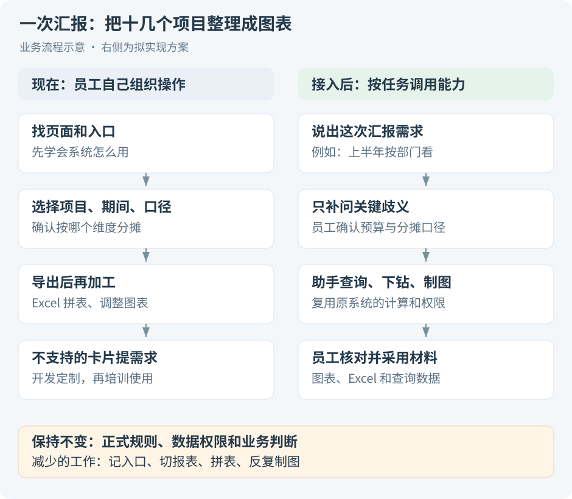
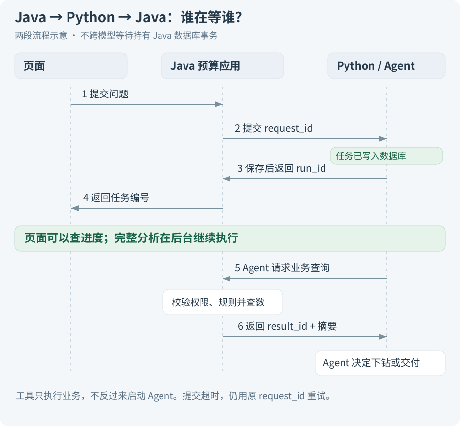

# 先讲明白：这个 Agent 替员工省哪一步？

假设周五要汇报十几个项目。员工打开预算核算系统，先找对应页面，再选部门、期间、项目，导出表格。图表不符合这次汇报的要求，就用 Excel 调整；系统不支持的卡片，还要提需求让开发做。

**系统已经把数据集中起来了，但“把数据变成这次要用的汇报”仍需要人来完成。** 员工还得先学会复杂页面和分摊口径，更新以后重新听宣讲。这就是 Agent 可以介入的地方。

## 1. 先把原系统和新增能力分开讲

原预算与核算系统接收其他系统同步、人工导入、页面维护的数据。费用包括项目支出、人力费用等，一个项目也可能有多个投资方。员工要汇总多个项目，领导通过材料了解情况、辅助决策。

同一个项目可以按部门、重量级团队、投资等维度看分摊结果。这里先沿用真实业务名称，不假定重量级团队一定是部门的下级，也不假定投资分摊比例等于出资比例。

新增 Agent 的入口可以很简单：

> “把 P01、P02 上半年按部门分摊的预算和费用整理一下。看看哪个项目值得关注，给我一张图和 Excel。”

它要先听懂，再找到已有能力完成任务。**已有系统的数据集成和核算能力仍然复用，Agent 负责把这些能力按这次需求组织起来。**

读图时注意第二列：员工仍会确认重要口径和核对结果。省掉的是反复找入口、切报表、拼表和制图，不是省掉对业务的判断。

> [!TIP] 面试开场先说痛点
> “我们已经有预算系统，但新图表靠开发定制，临时汇报靠 Excel，加上分摊维度多，员工学习成本高。”先把这句话讲清楚，再介绍 LangGraph，面试官才知道框架用来解决什么。

### 这次先做哪几件事

| 员工的问题 | 助手做什么 | 完成后拿到什么 |
| --- | --- | --- |
| 不知道该选哪个分摊维度 | 解释候选口径，确有歧义时问一句 | 清楚知道查的是哪份数据 |
| 需要临时换项目、期间或分组 | 在支持的指标和维度里组合查询 | 本次需要的查询表 |
| 汇总有差异，还得自己找明细 | 根据查询结果，选择是否继续按项目或费用类别查 | 可定位的差异贡献 |
| 要图表和 Excel | 根据同一份结果生成需要的形式 | 图表、文件和核对数据 |
| 系统更新后不会用了 | 查当前版本的使用说明，按任务引导 | 对应的说明或功能入口 |

新增公式、新核算规则、新数据接口仍需要业务与开发处理。第一版也不修改预算、不执行付款。领导拿材料判断是否调整资源，助手负责提供依据。

## 2. 用一组金额，把目标落到实处

合成数据如下，单位万元：

| 项目 | 调整后预算 | 实际费用 | D_A 的分摊比例 |
| --- | --- | --- | --- |
| P01 | 70 | 77 | 60% |
| P02 | 50 | 49 | 20% |

部门 D_A 预算 **52 万**，实际 **56 万**，差异 **+4 万**。其中 P01 贡献 +4.2 万，P02 抵减 0.2 万。

这时有两条合理路径：用户只要图表，直接交付；用户希望了解差异，先查 P01 的费用构成。要不要继续、往哪个维度查，需要根据已查到的结果和用户目标决定。

> [!NOTE] 这里哪一步体现 Agent？
> “预算减实际怎么算”交给固定代码。Agent 的选择发生在“发现 P01 贡献最大以后，要不要继续看人力费用、有没有可比较的预算、信息已经够不够”这些地方。选择范围由程序限制，具体选择取决于观察到的结果。

如果所有问题都是固定调用同一个接口、返回同一张表，用自然语言查询工作流就够了。当前设计保留模型做下一步选择，是为了处理没有给出完整查询步骤的汇报任务。

**金额差异能帮助定位问题，但不能直接解释管理原因。** P01 超出预算，不足以证明人员浪费或管理失误；没有相关说明时，报告只列事实和待核查项。

### 这组例子的假设

演示中预算与实际使用相同分摊比例；真实业务可以不同，但需要明确允许怎样比较。部门、团队和投资先作为独立观察方式，不把三个视图相加，也不把两个边际比例相乘来猜联合分摊。人力费用先用上游已核算的项目费用，不自行推算个人工资。

具体公式、不同规则比较、分币和联合分摊反例，统一看[分摊与 Java 实现](04-分摊语义与Java工程实现.md)。

## 3. 整体架构：保留一个 Java 应用，新增一个 Agent 服务

方案选两个应用：**现有 Spring Boot 预算应用＋Python/LangGraph 服务**。每个框是一项职责，不意味着每个框都要拆成微服务。

Java 继续做它擅长且已经存在的工作：登录、数据权限、分摊规则、查询计算、保存结果和生成文件。Python 服务负责等模型回复、保存分析进度、向用户补问、读取工具结果后决定下一步。

### 为什么把这两部分分开

普通查预算接口通常执行完一段业务就返回。Agent 可能要等模型几秒，再等用户补充信息几分钟；两者的运行时间、依赖和失败方式不同。把图执行独立出来，可以单独限制并发和重启，不让预算接口一直等完整轮分析。

代价也明确：**多维护一个服务，多排查一段远程调用，还要处理版本、认证和超时。** 如果最后范围只剩一次“提取条件→查数”，纯 Java 更省事；不能为了用上 Python 而拆服务。

LangGraph 提供带状态的图执行，以及暂停、恢复等机制；可以独立于 LangChain 使用。当前设计复用这些能力，LangChain 只在需要时提供模型和工具接入组件。[LangGraph 官方概览](https://docs.langchain.com/oss/python/langgraph/overview)

> [!IMPORTANT] 面试往下追：Java 能直接调用 LangGraph 吗？
> 这套方案中 Java 通过 HTTP 提交 Python 服务的任务，不在 JVM 里加载 Python 的 LangGraph 库。Java 收请求与 Java 执行工具是同一个预算应用里的不同模块。换成纯 Java 编排也可以，但要重新说明怎么保存进度和恢复，不能把库名换了就算完成设计。

### 第一版不需要再加哪些东西

两个应用可以先共用一个 PostgreSQL 实例，但使用不同 schema 和数据库角色。Python 不直接查询预算事实表；它调用 Java 工具。导出文件放对象存储或本地文件存储，日志记录请求与工具执行。

少量任务先用数据库任务表；指标不多时先用结构化目录和别名匹配。Redis、消息队列、独立网关、向量库都按出现的具体问题再引入。工具通过 Java 内的 MCP 薄适配暴露，避免复制现有业务逻辑。

## 4. Java 调 Python，Python 又调 Java，会不会绕？

关键是看**调用在做什么，以及谁在等待谁**。

图分为上下两段。上半段只是接收任务，保存成功后就把编号返回给页面；下半段才是后台执行。Java 工具处理完业务后返回数据，不会再次启动 Agent。

1. 页面向 Java 提交问题。Java 确认用户身份，保存 request_id 和用户归属。
2. Java 把请求交给 Python。Python 先保存任务，返回 run_id；Java 随即把编号返回页面。
3. 后台 Worker 取出任务，Agent 解析需求；缺重要条件时停下来等回答。
4. 条件明确后，Agent 请求 Java 校验查询计划。Java 检查权限、分摊规则和数据版本，生成可执行计划。
5. Agent 调用查询工具，Java 返回 result_id 和必要摘要。模型据此选择下钻或生成说明。
6. 用户需要文件时，Java 依据结果创建导出任务。页面分别查询分析进度、文件进度，下载时再检查权限。

**提交接口等的是“任务保存好了”，不是“整份报告做好了”。** 因此没有必要在 Java 数据库事务里跨网络等待模型，更不能一直占着事务等用户回答。

### 一个很容易忽略的失败：任务收到了，但返回编号时断网

假设 Python 已把任务写入数据库，Java 却没收到回复。Java 不知道任务到底有没有被接收，应该用**原 request_id**查询或重试。Python 遇到相同用户、相同 request_id、相同参数时，返回原 run_id。参数变了则报冲突。

如果每次超时都生成一个新 ID，就可能启动两份分析。这个问题和后面的重复导出很像，但对象不同：这里是分析受理，导出那边是一次文件生成意图，分别需要稳定编号。

> [!WARNING] 后台执行，不等于任务不会丢
> 普通内存协程、一次 @Async 调用，只能把工作移到后台。进程退出以后，尚未完成的任务可能就没有了。这里要求先持久化任务，再由 Worker 认领；启动时还能找到未完成记录。

## 5. 进度、权限、数据分别由谁说了算

不要在两边各放一份“都能改”的任务状态，再努力同步它们。先确定每种事实的唯一管理方。

| 事实 | 谁负责保存和修改 | 另一侧怎么用 |
| --- | --- | --- |
| 用户、当前权限、请求归属 | Java | Python 通过受信上下文发起调用，工具仍检查权限 |
| 分析排队、等待回答、图执行进度 | Python | Java 查询状态并展示 |
| 有效计划、规则与数据版本、结果 | Java | Agent 保存编号，需要时读取 |
| 文件生成、发布与下载 | Java | Agent 和页面查询任务编号 |

Java 只需要记录请求关联到哪个 run。Python 暂时不可达时，页面显示“暂时无法获取进度”，不能仅凭一次查询失败就把分析改成 FAILED。

### 重启以后怎么接着做

LangGraph 的 checkpoint 保存图运行到哪里、使用哪个计划、拿到了哪些结果。它解决的是图状态恢复。任务表还要解决“谁负责取这个任务”，Java 还要解决“外部导出有没有已经创建”。这几件事要配合，不能用一个 checkpoint 概括全部可靠性。[LangGraph 持久化说明](https://docs.langchain.com/oss/python/langgraph/persistence)

首版先用一个 Worker，重启确认旧进程退出后恢复。以后加多个 Worker，还得处理旧进程失去租约却继续写结果的问题；仅仅把任务行锁住，并不能让旧进程自动停止。具体处理见[执行流程](02-Agent设计与执行流程.md)与[难点实验](08-难点排查与验证实验.md)。

技术补充：内部接口可以怎样划分？

下面是项目自定义接口示意，实际代码尚待集成，不是 LangGraph 固定的官方端点。

| 接口 | 作用 |
| --- | --- |
| POST /internal/agent/runs | 用稳定 request_id 受理任务 |
| GET /internal/agent/runs/{id} | 读取进度、追问和结果引用 |
| POST /internal/agent/runs/{id}/answers | 按回答 ID 和等待版本去重恢复 |
| POST /internal/agent/runs/{id}/cancel | 请求在安全边界停止分析 |
| POST /internal/budget/query-plan | 校验业务口径、权限和版本 |
| POST /internal/budget/query | 执行批准的查询，返回结果编号 |
| POST /internal/budget/exports | 用稳定操作 ID 创建文件任务 |

普通页面接口与 MCP 适配器最终调用同一批领域服务。MCP 不增加第二套规则计算，也不自动带来用户的数据权限。

## 6. 面试官怎么判断这个设计有价值？

先用可验证的目标回答，不急着报未经测量的提升比例。

- **好不好用：** 员工能否用业务表达完成任务，不需要记住每个页面入口；明确的请求是否还被反复追问。
- **查得对不对：** D_A 应是 52/56 万，是否拿成项目总额 120/126 万；期间、规则、权限变化时是否处理正确。
- **交付是否可信：** 图表、Excel、原查询表能否对上；只获准部分份额的用户是否拿不到其他数据。
- **出错能否定位：** 能否区分理解错、查询错、图表错、网络超时，而不是所有错误都调提示词。

> [!IMPORTANT] 一分钟复述练习
> 先讲员工为什么还要加工报表，再画两个应用；用 D_A 52/56 万走一遍提交、校验、查询和导出。最后挑“返回编号时断网”解释稳定 request_id。能讲到这里，架构就已经有业务依据和工程细节了。

本篇的架构是独立实践设计，金额是合成例子。原始数据的同步方式和定制报表痛点来自真实经历；不能据此说整个 Agent 已在原公司上线。

接着读：[Agent 如何一步步执行](02-Agent设计与执行流程.md)。
