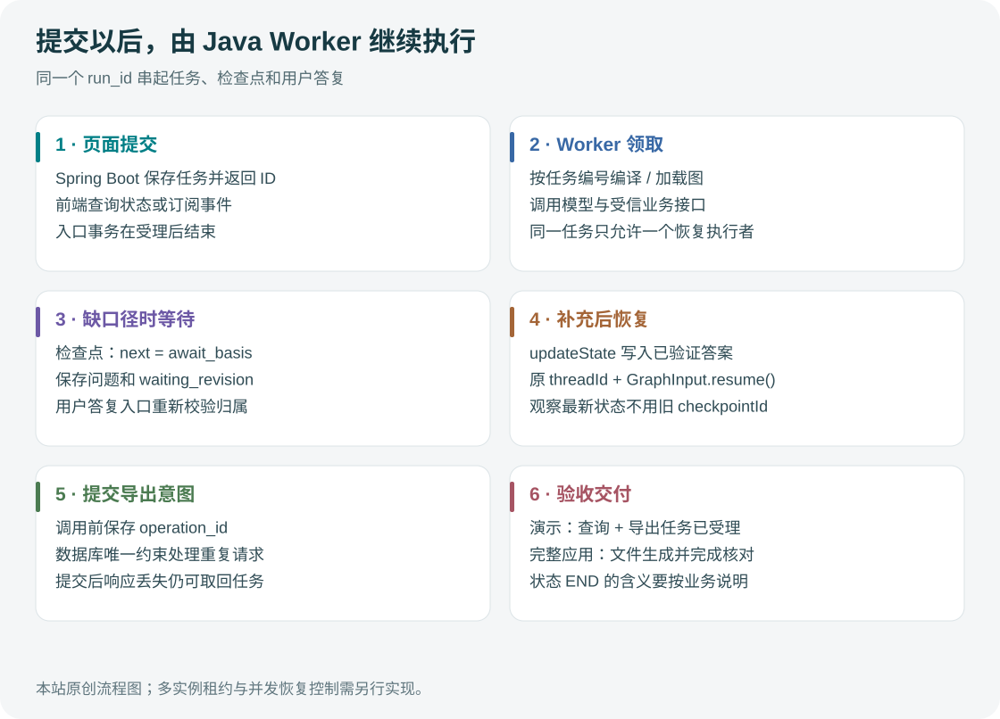

# 先讲明白：这个 Agent 替员工省哪一步？

“把 P01、P02 上半年的预算和费用按部门整理一下，告诉我哪里超支，再给我 Excel。”

这句话背后有好几步：确定上半年的时间范围，确认预算版本，判断“部门”指管理部门还是承担费用的部门，查汇总，找差异，最后整理材料。员工原本要在页面和表格之间来回切换。Agent 的价值，是把这些步骤接起来，并在缺少信息时问到点上。

数字仍要经过同一套核算服务。聊天入口和原有页面如果各算一遍账，用户迟早会发现两边金额不同。

## 先把目标说具体

本项目先处理预算与实际费用的汇报。它可以帮助用户选择口径、查询已发布数据、按项目下钻，并申请图表和 Excel。原始费用录入、财务审批和分摊规则批准继续走现有业务流程。

一个可核验的结果应该包含：查了哪些项目和期间、按什么轴分摊、预算与费用采用哪个版本，以及数字来自哪个查询结果。只返回一段流畅的解释，还不足以交付。

图：本项目的设计边界。完整 Spring Boot 接入尚未实现，已有 Java 演示见第 08 篇。

## Java 应用按职责拆模块

首版采用一个 Java 应用中的 API、Agent Worker、业务服务和交付模块。LangGraph4j 节点直接调用类型明确的 Java 接口，复用已有权限与核算逻辑。模型接入可以选择 LangChain4j 或 Spring AI 的适配器；图的状态与执行顺序由 LangGraph4j 管理。

| 模块 | 接收什么 | 负责什么 |
| --- | --- | --- |
| Spring Boot API | 登录主体与用户请求 | 验证入口参数，创建任务，返回任务编号 |
| Agent Worker | 已入库任务 | 运行图、保存进度、等待补充、选择允许的下一步 |
| 计划与查询服务 | 候选需求及受信身份 | 确认口径、限制范围、编译查询、冻结结果 |
| 分摊与发布服务 | 费用事实与已审核规则 | 精确计算、核对守恒、发布不可变版本 |
| 交付 Worker | 结果编号与导出意图 | 生成文件、核对、发布可下载产物 |

同 JVM 部署适合先复用 Spring Bean、事务与观测设施。需要独立扩容、不同资源配额或故障隔离时，可以把 Agent Worker 拆成另一个 Java 进程，仍通过稳定接口访问业务服务。这个拆分应由负载和运维需求决定。

MCP 适合接外部工具或让多个客户端复用能力。同一个 Java 应用里，图节点访问现成查询服务，可以直接调用接口；不需要为每个本地方法增加一趟协议往返。

## 请求别一直挂在 HTTP 连接上

用户提交后，API 在短事务里创建 `agent_run`，保存受信主体、请求和初始状态，再返回 `run_id`。Worker 领取任务后运行图；前端通过状态接口或事件流看进度。等待模型、等待用户答复、生成大文件，都发生在事务外。

任务恢复要有两个不同的入口。用户回答“用调整后预算”，是向已有任务提交补充；机器重启，是根据已有任务和检查点继续执行。两者都不能被当成新请求随手创建第二个任务。

应用需要为同一 `run_id` 串行处理恢复命令，校验任务归属、当前等待节点与等待版本。分布式部署还需要领取租约或等效的并发控制。LangGraph4j 保存节点状态，并不会自动完成这些业务约束。

## 四类记录别混在一起

`agent_run` 表达业务任务的状态；图检查点记录执行位置及状态；`query_result` 保存已确认的数据快照；`export_task` 记录一次文件生成意图。它们的生命周期不同。

例如导出任务已提交，图还没收到返回，进程就停止了。图恢复后可能再次调用导出服务。只有导出服务按稳定操作编号查到原任务，才能安全继续；“图已经有检查点”无法替代这个约束。

状态中也不要塞整张 Excel 或全部查询行。保存结果 ID、哈希、口径和版本即可。文件与大结果放在适合的存储中，下载时再做当前权限检查。这样检查点不会随着报表大小无限膨胀。

## 用一笔账走一遍

用户选择调整后预算后，Java 生成有效计划，固定数据发布版本与分摊规则。查询服务返回 D_A 预算 52 万、实际 56 万。Agent 根据用户要求决定是否下钻；项目明细表明 P01 超支 4.2 万，P02 节余 0.2 万。

这时可以解释差异由哪几个项目构成，但不能把“P01 超支”直接写成“采购管理失误”。前者有数据支持，后者需要新的证据。导出模块引用同一批结果，图表和 Excel 才能与解释对上。

## 面试时怎么概括

可以先说：“我用 Java 把预算汇报做成一个可恢复的任务。LangGraph4j 管执行过程，业务服务管权限和金额；用户缺口径时暂停，补充后从原任务继续。查询结果先冻结，图表和导出都引用它。”

然后拿响应丢失的实验展开：操作编号在哪一步保存，数据库为什么只留一条导出任务，恢复后读取的检查点是什么。项目是否扎实，往往就在这些追问里看出来。

[← 阅读导引](00-这套项目资料，先从这里读起.md) · [执行过程 →](02-Agent%20怎么一步步完成一次汇报.md)
