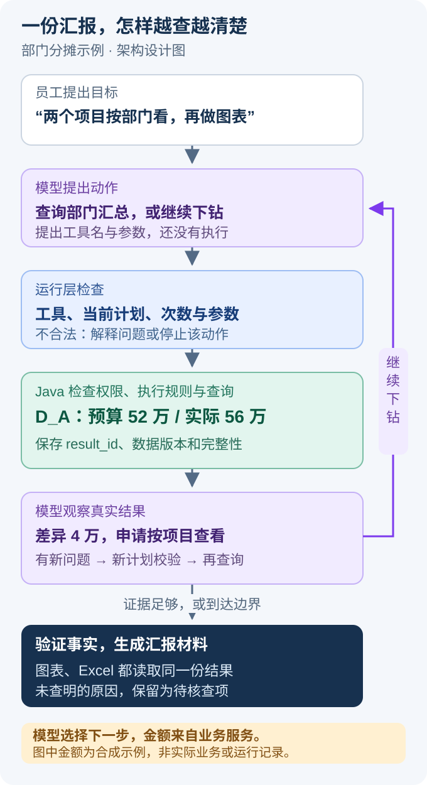

# Agent 怎么一步步完成一次汇报

员工说一句“帮我整理这几个项目的预算执行情况”，背后可能要选口径、查汇总、看明细，再做图和导出。这里要设计的，就是怎样把这句话变成一连串**有依据、能检查、出错后能继续的操作**。

> [!NOTE] 先分清方案与事实
> 原预算核算系统的业务背景来自实际工作。本文的 Agent 流程、工具名、字段和版本是拟议设计，金额是合成案例；代码用于解释机制，不是可直接部署的完整实现。

## 1. 先跟着员工做完一份汇报

假设员工提出：

> 整理 P01、P02 上半年的预算执行情况，按部门看，找出主要费用差异，给我图表和 Excel，也附上查询数据。

系统已经有项目、预算、项目支出、人力费用等数据。但这句话仍有一个会影响金额的问题：“预算”是年初预算，还是调整后预算？如果没有已发布的默认口径，Agent 先问清楚。员工选择“调整后预算”后，才开始查询。

本例的输入如下，金额单位为万元。为了便于手算，预算和实际在部门轴采用相同比例；正式设计仍分别绑定各自已审核的分摊规则。

| 项目 | 调整后预算 | 实际费用 | 分给 D_A | 分给 D_B |
| --- | ---: | ---: | ---: | ---: |
| P01 | 70 | 77 | 60% | 40% |
| P02 | 50 | 49 | 20% | 80% |

Java 业务服务按规则计算，得到 D_A 预算 **52 万**、实际 **56 万**，差异 **4 万**。Agent 看到这个结果，提出继续按项目查看 D_A 的差异。下钻结果是：P01 多了 4.2 万，P02 少了 0.2 万。

因此可以写“D_A 的正向费用差异主要来自 P01，P02 的结余抵消了其中 0.2 万”。还不能写“因为人力投入增加”：当前只证明了差异来自哪个项目，没有证据说明业务原因。

**这次交付要有数据、说明和文件。** 用户能看见采用的项目、期间和分摊口径；图表与 Excel 能追溯到同一份查询结果；没有查明的原因明确列为待核查项。

## 2. Agent 的自主性，体现在看到结果以后怎么查



从上往下读：模型先提出动作，程序检查，Java 执行，再把结果交回模型。绿色部分是已经取得的数据，紫色部分是模型提出的下一步。**只有经过检查的动作才会执行。** 图是设计示意，不是运行截图。

在本例中，流程不会预先写死“第二步一定查人力费用”。模型可能发现 D_A 的差异更明显，先查 D_A；也可能用户只需要两张卡片，查询后就进入交付。可选择的路径不同，业务计算仍使用同一套规则。

| 场景 | 模型可以提出 | 程序必须守住 |
| --- | --- | --- |
| 需求缺条件 | 询问预算定义，解释两种口径 | 不能用模型猜测填入正式默认值 |
| 发现差异 | 按项目或费用类别继续查看 | 只能使用该计划支持且用户有权的粒度 |
| 生成结论 | 选择事实、组织文字、列待核查项 | 数字来自工具，引用来自当前有效结果 |
| 生成图表 | 建议柱状图、单位和排列顺序 | 图表配置经过校验，数据绑定 result_id |

首版用**单 Agent 加受控流程**就足够。把同一份预算数据交给三个“专家 Agent”讨论，并不会自动算得更准，反而多了结论冲突与证据传递问题。先把一个 Agent 的查询和恢复做稳，再根据独立子任务的评测决定是否拆分。

> [!TIP] 面试先讲这段
> “模型负责理解目标、根据结果选择下一步；Java 负责确定口径、授权、计算和保存结果。比如模型可以建议继续查 D_A 的项目构成，但 52 万和 56 万必须由业务服务算出来。”这比一开始罗列框架名称容易听懂。

## 3. 为什么要保存两份计划

“用户想查什么”和“系统批准查什么”之间有一个检查过程。把两者分开，出错时才能判断：是理解错了，还是后端校验漏了。

### 3.1 需求计划：先把人话整理成字段

下面是模型整理出的 `requested_plan`，可以把它理解成一张**待审核的查询申请单**：

```json
{
  "project_scope": {"mode": "EXPLICIT", "project_refs": ["P01", "P02"]},
  "period": {"start": "2026-01-01", "end_exclusive": "2026-07-01"},
  "budget_basis": null,
  "actual_basis": "ACCRUED",
  "expense_scope": "labor_and_other_project_costs",
  "allocation_axis": "DEPARTMENT",
  "group_by": ["allocation_target_id"],
  "requested_outputs": ["chart", "xlsx", "query_data"],
  "field_sources": {
    "allocation_axis": "USER_EXPLICIT",
    "actual_basis": "PUBLISHED_METRIC_DEFAULT"
  }
}
```

这份 JSON 不需要背，重点是理解几组字段：

- `project_scope` 选的是**哪些项目**。项目名称需要后端解析成真实 ID，不能靠模型编造。
- `period` 是查询期间，结束时间不包含 7 月 1 日，避免“6 月 30 日几点截止”的歧义。
- `budget_basis` 决定预算取哪一版；`actual_basis` 决定实际费用按什么口径归集。本例已发布指标定义为应计口径 `ACCRUED`，才允许沿用这个值。
- `expense_scope` 说明要哪些费用。人力与其他支出是否互斥、是否覆盖全部费用，由指标目录规定。
- `allocation_axis` 是**按哪套分摊规则计算**；`group_by` 是**算完以后按什么层次展示**。两者不同。
- `field_sources` 记录条件从哪里来。用户明确说的、上一轮确认的、系统发布的默认值，都应留痕；模型推测不能冒充业务默认。

`budget_basis=null` 表示还缺条件。与其“看起来完整但悄悄猜错”，不如先保留缺口，再用一句追问补齐。

> [!WARNING] “按部门看”不等于 GROUP BY 部门
> 一个项目可能把 60% 的费用分给 D_A，40% 分给 D_B。按项目所属部门分组，无法得到这个承担金额。更不能把部门比例再乘投资方比例，猜出“部门 × 投资方”的交叉金额。本文按独立分摊轴设计，联合视图必须另有已审核规则。

### 3.2 有效计划：Java 批准后生成的执行依据

员工选择调整后预算后，Java 检查项目、期间、规则覆盖、分组粒度和当前权限，返回 `effective_plan`。执行节点只拿它的 ID 查数据。

```json
{
  "effective_plan_id": "plan-demo-002",
  "plan_revision": 2,
  "project_ids": ["P01", "P02"],
  "period": {"start": "2026-01-01", "end_exclusive": "2026-07-01"},
  "metric_id": "budget_execution",
  "expense_scope": "labor_and_other_project_costs",
  "budget_basis": "ADJUSTED",
  "actual_basis": "ACCRUED",
  "allocation_axis": "DEPARTMENT",
  "group_by": ["allocation_target_id"],
  "metric_version": "metric-v1",
  "allocation_rule_bundle_id": "alloc-bundle-v1",
  "rule_binding_manifest_id": "bindings-demo-001",
  "comparison_policy": "APPROVED_SAME_BASIS",
  "rounding_policy": "PER_FACT_LARGEST_REMAINDER_V1",
  "data_release": "rel-001",
  "scope_binding_id": "scope-demo-001",
  "allowed_drilldowns": ["project", "expense_category"],
  "query_route": "TRUSTED_METRIC"
}
```

这里新增的字段，分别解决不同问题：

| 字段 | 通俗解释 | 少了会怎样 |
| --- | --- | --- |
| effective_plan_id | 这次已批准查询的编号 | 模型每次重新拼参数，容易改掉期间或范围 |
| plan_revision | 用户需求改到第几版 | 新旧请求的结果可能混在一起 |
| allocation_rule_bundle_id | 本次使用的规则包 | 第一次和下钻查询可能采用不同分摊比例 |
| rule_binding_manifest_id | 具体命中了哪些项目、期间与规则 | 只知道“规则 v1”，仍说不清 P01 用了哪条 |
| comparison_policy | 预算与实际为什么允许比较 | 版本名字相同，却可能计算口径不同 |
| rounding_policy | 按哪种精度和尾差规则分摊 | 分摊明细加起来与总额差几分钱 |
| data_release | 这次采用的数据发布批次 | 分析做到一半，新增费用使前后数字对不上 |
| scope_binding_id | 记录当时批准的数据范围 | 难以追查结果范围；但它不能替代当前鉴权 |

规则包内部还要保留预算、实际各自的规则集合版本，例如 `budget_rule_version` 和 `actual_rule_version`。不是要求这两个版本字符串相同，而是要求比较方法经过业务确认。舍入算法在[分摊语义与 Java 实现](04-分摊语义与Java工程实现.md)中展开。

**模型拿到计划 ID，不代表获得永久通行证。** 每次执行、读取和下载都重新检查当前授权。模型也不能用自己修改过的 `effective_plan` 对象覆盖后端记录。

标准指标走 `TRUSTED_METRIC`，临时字段组合才考虑受限 Text-to-SQL。后者同样绑定有效计划和允许数据集，最终都返回 `result_id`。

## 4. 把工具循环拆开看，模型到底做了什么

面试官问“你是怎么做 tool calling 的”，只回答“给模型注册工具”还不够。下面是一次完整往返。

### 第一次往返：查部门汇总

运行层把当前计划摘要和允许的工具说明提供给模型。模型返回一条结构化调用申请，以下是便于阅读的归一化形式，不是某家模型的完整原始报文：

```json
{
  "tool_call_id": "call-17",
  "name": "budget_query",
  "arguments": {"effective_plan_id": "plan-demo-002"}
}
```

运行层先检查工具是否允许在当前节点调用、计划是否属于当前 run、参数是否符合 Schema，再交给 MCP Client。Java 端仍会重做业务与权限检查。通过后，工具返回：

```json
{
  "ok": true,
  "result_id": "res-dept-001",
  "effective_plan_id": "plan-demo-002",
  "allocation_axis": "DEPARTMENT",
  "unit": "CNY",
  "rows": [
    {"target": "D_A", "budget": "520000.00", "actual": "560000.00", "variance": "40000.00"},
    {"target": "D_B", "budget": "680000.00", "actual": "700000.00", "variance": "20000.00"}
  ],
  "row_count": 2,
  "completeness": "COMPLETE",
  "truncated": false,
  "data_release": "rel-001"
}
```

`result_id` 指向结果服务里的完整数据；`rows` 是交给模型看的有界摘要；`row_count` 与 `truncated` 说明是否只给了预览。**“前十行看起来正常”不能被写成“已经检查全量”。** 总行数、总金额也要经过授权，不能用摘要泄露隐藏数据。

金额用十进制字符串传输，由 Java 精确计算。D_A 执行率是 `560000 / 520000 ≈ 107.69%`，也由服务计算，不能让模型平均两个项目的百分比。

### 第二次往返：模型看结果，再申请下钻

运行层把结果作为 `call-17` 的工具响应交回模型，同时登记证据。模型看到 D_A 差异较大，申请建立一个派生计划：沿用期间、数据与规则版本，筛选 D_A，按项目展示。

```json
{
  "action": "DRILL_DOWN",
  "parent_plan_id": "plan-demo-002",
  "group_by": ["project"],
  "filters": [{"field": "allocation_target_id", "op": "EQ", "value": "D_A"}],
  "evidence_refs": ["res-dept-001"],
  "reason_code": "LOCATE_VARIANCE_CONTRIBUTOR"
}
```

后端验证后返回新计划 ID，才能再次调用 `budget_query`。不允许在查询调用里偷偷附加 `department=ALL`、新期间或新比例。`reason_code` 只是简短的动作依据，便于观测，不要求模型输出内部思维过程。

这套机制可以用下面的项目伪代码说明：

```python
async def observe_and_propose(state):
    # 只给当前有效计划、证据摘要和必要消息；不会把整个 State 发给模型。
    reply = await model_with_tools.ainvoke(build_current_context(state))
    return {"messages": [reply]}

async def execute_proposal(state):
    calls = normalize_tool_calls(state["messages"][-1].tool_calls)
    # 适配为包含 id、name、arguments 的项目调用对象。
    # 本例一次只执行一个动作；多调用时逐 ID 回复错误，不丢掉协议消息。
    if len(calls) != 1:
        return {
            "messages": [tool_reply(c.id, {"error": "ONE_ACTION_AT_A_TIME"})
                         for c in calls],
            "step_count": state["step_count"] + 1,
        }
    call = calls[0]
    check_node_and_schema(call, state)
    check_current_plan_and_budget(call, state)
    trusted_context = load_current_identity(state["run_id"])
    result = await tool_adapter.invoke(call, trusted_context)
    checked = validate_tool_result(result, state)
    return {
        "messages": [tool_reply(call.id, checked.model_summary)],
        "evidence_by_id": checked.evidence_update,
        "step_count": state["step_count"] + 1,
    }
```

模型回复里有工具调用，就进入受控执行节点；没有调用且已有足够证据，进入报告验证。本例按单动作运行，多调用时给每个调用 ID 返回受控错误，并消耗一步预算；不能只执行第一个、丢掉其余调用，否则下一轮工具消息会配不齐。参数或业务校验失败也要转换为对应 ID 的结构化错误响应。工具结果按调用 ID 配对，不能按“谁先返回”配对。以后支持并行时，也只对没有相互依赖的只读查询开放。

工具调用中，模型提出名称与参数，应用负责实际执行和返回结果。这一点与具体选 Java 或 Python 无关。[Spring AI 工具调用说明](https://docs.spring.io/spring-ai/reference/api/tools.html)

## 5. State 保存什么：它是任务进度，不是聊天记录堆积

用户刚确认“调整后预算”，服务随后重启。如果只存对话文本，恢复后还得让模型重新猜一遍执行到哪里。因此要有明确的 `State`：当前计划是哪版、哪些结果仍可用、正在等哪个回答、是否已经申请导出。

本项目约定一个分析 run 使用一个 checkpoint thread；UI 的同一段会话可以对应多个 run。这是项目选择，不是 LangGraph 强制要求。

| 信息 | 示例 | 写入者 |
| --- | --- | --- |
| 用户需求 | requested_plan、field_sources、plan_revision | 模型提出候选，专门节点校验与合并 |
| 执行依据 | effective_plan_id、版本摘要 | Java 返回后，由校验节点写入 |
| 查询证据 | evidence_by_id、active_evidence_refs | 工具结果验证节点 |
| 等待状态 | pending_question、waiting_revision | 澄清准备节点 |
| 执行控制 | step_count、deadline_at、visited_query_hashes | 运行层 |
| 文件任务 | export_operation_id、artifact_job_id | 意图保存与产物提交节点 |

Skill、说明资料、工具合同和模板的版本也要保留。完整业务数据放在结果服务，State 只留引用与必要摘要。用户身份、租户、凭证和当前权限由可信运行上下文提供，**不放进模型可自由修改的字段**。

### reducer 到底是什么

一个节点返回 `{"step_count": 3}`，意思是“把步数更新为 3”，不需要返回整份 State。多个节点都要补充证据时，则要规定新旧内容怎样合并；这段合并规则就叫 reducer。

默认更新会覆盖字段。列表想累积、消息想按 ID 更新，都需要相应 reducer。LangGraph 提供 `add_messages` 来处理消息 ID；项目证据有自己的规则。[LangGraph State 与 reducer 文档](https://docs.langchain.com/oss/python/langgraph/graph-api)

下面是本项目的简化示意：

```python
from typing import Annotated, TypedDict
from langgraph.graph.message import add_messages

def merge_evidence(left, right):
    merged = dict(left)
    for evidence_id, item in right.items():
        # 同一结果重复返回可以接受；同一 ID 指向不同内容不能悄悄覆盖。
        if evidence_id in merged and merged[evidence_id] != item:
            raise ValueError("EVIDENCE_ID_CONFLICT")
        merged[evidence_id] = item
    return merged

class RunState(TypedDict):
    messages: Annotated[list, add_messages]
    evidence_by_id: Annotated[dict, merge_evidence]
    active_evidence_refs: list[str]  # 不累加，由单一节点覆盖选定
    plan_revision: int             # 只允许计划管理节点修改
    effective_plan_id: str | None
    step_count: int
```

证据条目必须先规范化成不可变内容，例如结果 ID、所属计划修订、数据版本和内容 hash。`fetched_at` 这类每次读取都会变化的值另放观测日志，否则同一结果重试也会被误判冲突。

**Schema 不等于写入权限。** 上面的类型不会自动阻止其他节点修改 `plan_revision`；还需要封装节点输出、限制模型可写字段，并在合并入口验证。并行分支不共同修改当前计划，它们只提交各自结果，由一个归并节点决定哪些证据进入当前分析。

> [!IMPORTANT] reducer 最容易被追问的坑
> 如果证据列表使用“新旧列表相加”，重试可能加出重复结果；返回空列表也不会清空旧值。因此这里把“历史证据字典”和“当前有效证据 ID 列表”分开：历史按 ID 合并，当前列表由单一节点直接替换。变更口径时清空当前列表，旧数据仍可审计。

## 6. 用户改需求，哪些内容还能沿用

上一轮是部门视角，用户又说：“同样一份，改按投资看。”

这时最危险的错误，不是新查询失败，而是**新标题配旧金额**。如果聊天历史还留着 D_A 的 56 万，模型可能把它当成投资视图的事实。

处理步骤要落实到状态更新：

1. 沿用已确认的项目、上半年、调整后预算和输出形式，把计划修订从 2 改为 3。
2. 改为投资分摊轴，清空 `effective_plan_id`、当前证据列表、部门下钻筛选和数据型图表配置。
3. Java 重新验证投资规则、可比性和当前权限，生成新有效计划。原数据发布批次不支持时，明确说明可选批次，不能静默换成更新数据。
4. 新查询携带修订 3。若部门查询这时才返回，登记到历史，但不能进入修订 3 的有效证据。
5. 组织模型上下文时，只加载新计划和它的有效结果。旧导出保留“部门视图”标记，不改名冒充新文件。

每份结果在进入当前上下文前，至少检查 `run_id + plan_revision + effective_plan_id + data_release` 的绑定关系。一次报告可以同时引用汇总和合法下钻，它们有不同的计划 ID；Java 要登记**本次修订已批准的主计划和下钻计划列表**，结果必须属于该列表，并符合相应数据、规则版本与当前权限。改分摊口径时替换整个列表，不能要求所有证据只有同一个计划 ID，也不能只隐藏页面上的旧图。

| 用户改动 | 是否重查 | 处理原因 |
| --- | --- | --- |
| “改成柱状图” | 通常不用 | 数据没变，只校验新图表配置 |
| “单位改成万元” | 不用 | 保留原精度，只改变显示换算 |
| “改按投资看” | 需要 | 分摊轴和规则变了 |
| “换成下半年” | 需要 | 数据范围和规则生效期可能变化 |
| “用最新数据” | 需要 | 重新绑定发布批次，全部证据重新取得 |
| “说得简短一点” | 不用 | 沿用有效事实，重新校验文字和引用 |

## 7. 澄清怎么做，才不会把用户问烦

只追问会实质改变金额、范围或解释的问题。图表颜色、无冲突的已发布显示单位，可以采用默认值并显示出来。

- “预算执行”缺预算定义，且系统没有发布默认值：问年初预算还是调整后预算。
- “我们团队”对应两个可访问组织：给出候选，请用户选一个。
- “全部导出”已有明确计划：导出该计划的完整授权结果，说明范围与行数，不重复询问所有条件。
- 本期缺少已审核分摊规则：说明缺口，不能让模型均分，也不能套另一个项目的比例。

准备澄清的节点先保存问题与等待修订，再进入暂停节点。恢复时，不是把答案作为新聊天从头跑，而是用原 `thread_id` 继续该任务。

```python
from langgraph.types import interrupt, Command

def clarify(state):
    answer = interrupt({
        "waiting_revision": state["waiting_revision"],
        "question": state["pending_question"],
    })
    return validate_answer_for_revision(answer, state)

# 网关此前已验证用户归属、等待修订及 resume_command_id。
# 同一 run 的恢复串行处理；config 使用原 thread_id。
graph.invoke(Command(resume={"budget_basis": "ADJUSTED"}), config)
```

`interrupt` 暂停后，节点恢复会从头重新执行，之前的代码可能再跑一次。不要在它前面发送通知、创建文件或修改规则；也不要用宽泛异常捕获把暂停信号吞掉。[LangGraph interrupt 文档](https://docs.langchain.com/oss/python/langgraph/interrupts)

> [!WARNING] 暂停不等于函数停在内存里的某一行
> 假设 `interrupt` 前面写着“创建 Excel 任务”，用户回答后恢复，可能再创建一次。把澄清节点保持为读状态、等待和验证；副作用放到独立节点，另做幂等。回答无效时，先保存新的等待状态，再进入下一轮澄清。

`waiting_revision` 防止上一道问题的答案覆盖新问题，`resume_command_id` 防止用户双击造成两次推进。恢复入口还要检查 run 归属和当前权限，暂停前有权不代表现在仍有权。

## 8. checkpoint 能恢复进度，但不会自动消除重复导出

LangGraph checkpointer 保存线程状态，适合暂停、恢复和故障后继续；内存实现不能证明跨进程恢复。正式演示需要使用持久存储，并真的杀进程验证。[LangGraph 持久化文档](https://docs.langchain.com/oss/python/langgraph/persistence)

但还有一个跨服务问题：

```text
Python 提交导出 → Java 已保存文件任务 → 响应在网络中丢失
Python 只看见超时，无法判断 Java 有没有成功
```

解决方法是先保存这次导出的稳定操作 ID，再发起调用。恢复后沿用同一 ID，Java 查到已有任务就返回原来的 `artifact_job_id`。相同 ID 但参数不同要报冲突，不能覆盖。


看这张图时关注“任务已提交”和“响应已收到”是两件事。检查点负责记住执行进度，Java 唯一约束负责识别同一次导出，两者不能互相替代。图为设计示意。

```text
prepare_artifact：固定结果、格式和配置，生成并持久化 operation_id
        ↓ 确认这个写入已经可靠完成
submit_artifact：带同一 operation_id 请求 Java
        ↓ 超时则查询或重试同一操作
Java：唯一约束 + 规范化参数 hash → 原任务 / 新任务 / 参数冲突
```

需要验证选定的 checkpoint 写入模式是否在外部副作用前形成可靠边界。做不到时，用独立的操作意图表补足。**不要把“用了 LangGraph”讲成“只会执行一次”。**

Java 受理请求后保存任务与用户归属，Python Worker 管理分析状态。首版单 Worker 就能验证恢复；扩展多 Worker 时，还要防止旧 Worker 失去租约后继续提交，使用版本或 fencing token 保护关键写入。页面连接断开不等于取消，显式取消在安全节点处理。

## 9. 什么时候继续查，什么时候应该停

“模型想继续”不能成为无限调用的理由。每轮执行前检查当前步骤数、截止时间、重复查询和可用的下钻层次。查询 hash 至少包括有效计划语义、筛选、分组和数据版本，避免同一查询换种表达就绕过检测。

业务停止条件同样重要：用户只要图表时，图表完成即可；用户要找差异来源时，定位到项目后若没有可比较的更细预算，就应说明分析边界。

假设只有实际人力明细，没有对应人力预算，可以展示“实际费用里有多少是人力”，**不能写“人力预算超支”**。这是证据不足，不是再换一个 Prompt 就一定能解决。

> [!TIP] 把“查到哪里”写进交付
> 可以写“已定位到 P01 对 D_A 差异的贡献；费用类别预算暂不支持继续比较”。如果因为次数或时间上限停止，就标记部分完成。演示设置“最多三次下钻”属于实验配置，达到三次不代表已经全面分析。

报告生成后，再由程序检查金额、单位、结果引用、分摊口径和完整性。事实需要绑定结果、行或分组与字段，例如“D_A 实际 56 万”应能定位到 `res-dept-001 / D_A / actual`。模型文字中的业务原因没有支持资料时，只能作为待核查假设。

## 10. 面试中的深度，来自这些可验证的细节

排查时按顺序对照：**用户原话 → 需求计划 → 有效计划 → 工具结果 → 最终引用**。不要第一步就调整 Prompt。如果有效计划已经错了，润色输出不会修正金额。

每个节点记录 run、计划修订、Skill/工具合同版本、工具名、结果 ID、耗时和重试原因；敏感明细不直接写普通日志。下表是待实现的验收设计，不代表当前已完成模型端到端测试。

| 演练输入 | 应看到的结果 | 验证了什么 |
| --- | --- | --- |
| P01、P02 按部门汇报 | D_A 预算 52 万、实际 56 万 | 调用采用正确分摊口径 |
| 部门改投资，旧查询延迟返回 | 旧结果只进历史 | 计划变更和异步结果不会串用 |
| 连续点击两次提交澄清答案 | 只推进一次 | 恢复请求去重与串行控制 |
| 暂停后撤销权限 | 恢复或读取被拒绝 | 历史状态不能冻结权限 |
| Java 接受导出后丢弃响应 | 恢复得到同一任务 ID | 状态恢复与业务幂等配合 |
| 数据只有实际人力、没有人力预算 | 不输出“人力预算超支” | 粒度和证据边界得到执行 |

评测时，先看固定任务能否**正确完成**，再看不该执行却执行的比例、必要澄清是否漏掉、工具次数、耗时与每成功任务成本。没有实际测量，就报告验证方案，不能编造提升比例。

## 11. 面试官继续追问时怎么接

**“这不就是工作流吗，Agent 在哪里？”**

流程约束能去哪些节点，模型根据实际结果选下一步。D_A 差异大时先拆项目，有可比较的费用类别才继续拆；用户只要卡片时直接交付。模型决定分析路径，业务程序决定动作能否执行。

**“为什么不直接让模型生成 SQL？”**

用户要的是一份可核对的汇报，前面有口径与权限，后面有证据、图表和文件。SQL 只完成其中的取数。标准指标先复用业务能力，临时查询再走受限 SQL，避免生成一段能运行但分摊语义错误的查询。

**“State 里已经存了结果，为什么还有 result_id？”**

State 适合保存当前进度和小摘要。完整数据可能很大，还要被 Excel、SVG 和核对页面共同读取，因此由结果服务保存。State 留 result_id 与版本，减少模型上下文和检查点体积，也能防止不同格式重复查询后数字不一致。

**“reducer 是不是给列表加个 append 就够了？”**

要先区分历史和当前。历史证据按不可变结果 ID 合并，重复重放不重复登记；当前有效引用单独替换，换口径时可以清空。还要拒绝同一结果 ID 对应不同内容，避免静默覆盖。

**“有 checkpoint 为什么还要幂等？”**

checkpoint 说明执行恢复到哪里，不能证明外部系统有没有执行成功。Java 可能已经受理、响应却丢了，所以业务操作 ID 要在调用前可靠保存，后端用唯一约束和参数 hash 处理重试。

继续阅读：[Skill、Function Calling 和 MCP 如何配合](03-Skills与MCP能力管理.md)，再进入[分摊语义与 Java 工程实现](04-分摊语义与Java工程实现.md)。
