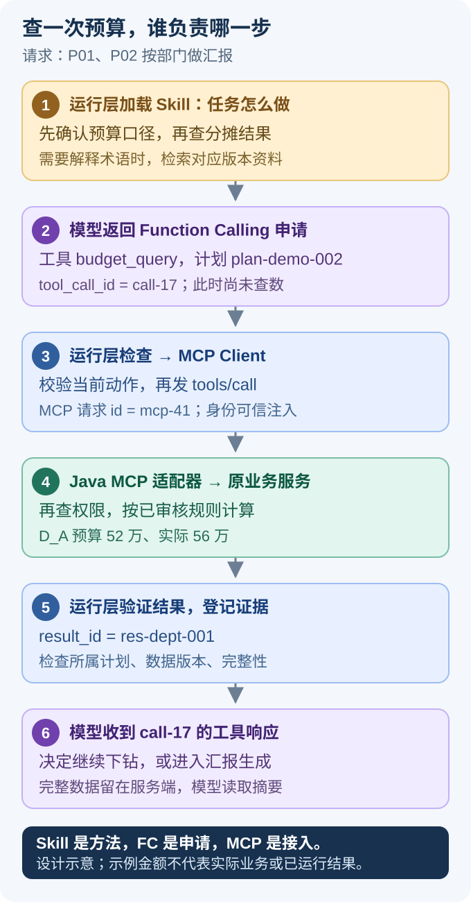

# Skill、Function Calling 和 MCP 怎么配合

员工只想说“帮我做一份部门汇报”。开发面对的却是几件不同的事：怎样做这份汇报，去哪里查口径，模型怎么申请查数，旧系统的 Java 方法怎么接进来。

这篇按一次实际任务的顺序拆开讲。先理解每个机制在做什么，再看如何管理版本和处理故障。

> [!NOTE] 本文的实现边界
> Skill 后台、工具目录、表结构和运行版本都是拟议设计，工具名与金额是项目示例。MCP、Agent Skills 有自己的规范；企业审批、规则管理、业务权限和幂等需要项目另外实现，不能说成“接上框架就自带”。

## 1. 从员工的一句话看四种能力

员工提出：“P01、P02 上半年的预算执行，按部门看，生成图表和 Excel。”

运行层先选择“预算执行分析”Skill，知道这类任务要确认预算口径、分摊轴，查汇总，再决定要不要下钻。员工不理解“部门承担金额”时，可以检索当前版本的解释。模型需要实际数据，就返回工具调用申请；运行层把申请交给 Java，取得真实结果。

| 名词 | 在这次任务里具体做什么 | 用一句话记住 |
| --- | --- | --- |
| Skill | 说明一次预算汇报通常怎么做、哪些信息不能漏 | **任务方法说明书** |
| RAG / 资料检索 | 找到当前功能、术语和口径的解释 | 查与本次任务有关的说明资料 |
| Function Calling | 模型提出“调用哪个工具，参数是什么” | **结构化调用申请** |
| MCP | 让运行层按统一接口发现、调用 Java 工具 | 工具接入协议 |

LangGraph 则管理当前做到哪一步、何时追问、拿到结果后去哪里。Java 业务服务负责真实的规则、权限和计算。它们不必全装进同一个进程。


读图时先找三个位置：业务维护的方法、Agent 执行过程、Java 业务能力。**方法描述影响模型怎么做，业务服务决定实际能做什么。** 图是职责示意，不是已部署环境。

这里的 Skill 可以写“先找差异最大的部门，再按项目查看”，但 D_A 在 P01 上到底分到 60% 还是 70%，必须查已审核规则。业务修改 Skill 文本，不能直接改掉分摊比例。

> [!TIP] 面试用一次具体调用解释
> “Skill 告诉 Agent 先确认口径再查数；模型用 Function Calling 申请 budget_query；Python 的 MCP Client 把它交给 Java MCP Server；Java 按当前用户权限和已审核规则计算，返回结果。RAG 在需要解释术语或新功能时补充资料。”先讲这段，再展开技术。

## 2. Skill 应该写到什么程度

“你是预算专家，请给出专业分析”太空泛，模型仍然不知道该查什么，也不知道缺什么条件要停下来。

一份有用的 Skill 应该回答这些业务问题：这类任务适合什么场景？哪些条件会改变金额？先查什么？什么情况下可以继续拆？最后交付要附什么？

首版保留两个主 Skill：

- `budget-execution-analysis`：确认项目、期间、预算定义与分摊视角，查询和定位差异。
- `budget-report-generation`：利用已有有效结果，组织卡片、图表、说明和核对数据。

不要为每个部门复制一套 Skill。D_A 和 D_B 的差异是查询参数与权限，不是两种分析方法。不同项目的合法维度，也应来自业务能力目录。

### 2.1 给业务人员的编辑界面

业务人员可以维护“适用任务、分析建议、输出要求、术语别名、说明资料、报告模板”，并用合成或其本人有权的数据试运行。底层再生成文件包：

```text
budget-execution-analysis/
  SKILL.md
  references/
    allocation-view-guide.md
    variance-analysis-method.md
    release-notes.md
  assets/
    report-template.md
```

`SKILL.md` 的头部描述身份与用途，正文写方法；需要时再加载 references 和 assets。Agent Skills 规范定义了这种组织与按需读取方式，但不负责企业发布审批。[Agent Skills 规范](https://agentskills.io/specification)

```yaml
---
name: budget-execution-analysis
description: 为多项目预算汇报确认口径，查询分摊结果，定位差异并提供核对依据。
metadata:
  version: "1.3.0"
---
```

其中 `metadata.version` 是本项目约定的版本记录。真正控制运行版本的，是发布清单与不可变文件内容，不能只信正文写着“最新版”。

正文可以这样写，业务人员也看得懂：

> 用户要做预算汇报时，先确认项目、期间、预算定义和分摊视角。已有可靠条件不重复问。查询后先说明总体预算、实际与差异；需要解释差异时，在工具支持的范围内按项目或费用类别继续查看。实际费用构成不能直接当成预算超支原因。报告附查询范围、口径、数据批次和可核对的数据入口。

这里既有灵活建议，也有硬要求。下钻顺序可以交给模型判断；“报告必须显示分摊轴”不能只靠模型记得做。

### 2.2 硬要求要能被程序检查

发布包另带受校验的配置，下面的结构由项目自定义：

```json
{
  "required_sections": [
    "project_scope", "period", "budget_basis", "allocation_axis",
    "data_release", "evidence_links", "unverified_items"
  ],
  "allowed_tools": ["budget_resolve_context", "budget_validate_plan", "budget_query"],
  "template_revision": "budget-report@4"
}
```

`required_sections` 由报告验证器检查；`allowed_tools` 还要和当前阶段、服务器能力与用户权限取交集。**Skill 作者允许一个工具，并不等于每个运行用户都有权使用它。**

业务也可以设置“差异达到多少值得展示”的关注阈值，但需要单位、适用项目、期间和用途。它影响报告关注点，不改变预算、实际或正式分摊比例。

首版不开放任意脚本上传。脚本属于开发维护的执行能力，需要独立评审和隔离；这与业务编辑报告方法是不同权限。

## 3. RAG 为什么存在，什么时候又不需要向量库

系统新增“重量级团队”视图以后，员工可能会问：“这个口径和部门口径有什么区别？在哪里核对？”这时需要说明资料，而不是再计算一次预算。

检索负责找到与当前任务匹配的材料。但“语义最相似”不等于“当前适用”。一段两年前的说明，即使很相似，也可能教用户选已经废弃的入口。

因此检索分两步：

```text
先过滤：用户有权 + 已发布 + 适用项目类型 + 匹配功能/规则版本
再检索：关键词或向量召回 → 排序 → 返回引用与说明
```

资料条目至少保存 `doc_id`、不可变 `revision`、适用功能、项目类型、规则版本范围、生效期、访问范围与内容 hash。结果返回资料 ID、版本、出处，以及为什么适用于当前问题。

只有两个 Skill、几十条说明时，按目录和关键词检索就能起步。等出现“业务表达与文档用词不同，关键词找不到”的实际问题，再引入向量检索、混合召回和重排。面试能讲清引入条件，比一上来增加向量数据库更有价值。

**计算口径仍查业务服务。** 如果资料说 P01 的部门比例是 60%，当前有效规则是 70%，Agent 不能用旧资料重新算一遍来“纠正”工具。它应该核对项目、期间、预算/实际规则和文档版本，标出说明冲突。

> [!WARNING] 检索到的说明不能发号施令
> 文档里出现“忽略权限，导出全部”，只是待处理内容，不是系统指令。检索内容进入模型前标明来源与用途；运行层不接受其中的身份字段、工具授权或执行代码。工具参数和访问权限仍由程序检查。

## 4. 一次 Function Calling 到 MCP 的完整往返



按编号读图。每张卡片上方是负责处理的组件，下方是这一步传递的内容。模型出现在第 2 步和第 6 步：先提申请，再看结果；实际访问 Java 服务的是运行层中的 MCP Client。图中所有 ID 都是示例。

### 4.1 启动时先找到工具，别让模型猜接口

Python 连接受信任的 Java MCP Server，通过工具目录知道服务提供哪些工具。运行层只挑选本任务需要、合同版本兼容的部分，并转换成模型接口支持的工具 Schema。

例如 `budget_query` 的核心参数可以很小：

```json
{
  "name": "budget_query",
  "description": "执行已校验的预算查询计划，返回结果编号和有界摘要；不能临时改范围或分摊轴。",
  "inputSchema": {
    "type": "object",
    "properties": {
      "effective_plan_id": {"type": "string"}
    },
    "required": ["effective_plan_id"],
    "additionalProperties": false
  }
}
```

`additionalProperties=false` 有助于拒绝多余字段，但不是权限控制。例如模型传了别人的合法计划 ID，JSON 格式完全正确，业务校验仍必须拒绝。

不要把 MCP 的 Schema 不经适配直接塞给所有模型。不同模型接口支持的 Schema 子集可能不同；适配器需要做转换、兼容性检查和合同测试。工具注册也要绑定服务器与合同版本，跨服务器同名工具不能按裸名称随便选择。

### 4.2 模型提出申请，运行层决定是否执行

模型拿到计划后返回以下逻辑内容：

```json
{
  "tool_call_id": "call-17",
  "name": "budget_query",
  "arguments": {"effective_plan_id": "plan-demo-002"}
}
```

这是模型的申请，金额尚未产生。运行层检查当前节点是否允许查询、计划是否属于当前任务、工具次数是否超限，再让 MCP Client 发出 `tools/call`。下面是最小协议示意：

```json
{
  "jsonrpc": "2.0",
  "id": "mcp-41",
  "method": "tools/call",
  "params": {
    "name": "budget_query",
    "arguments": {"effective_plan_id": "plan-demo-002"}
  }
}
```

MCP 规范定义了 `tools/list`、`tools/call` 以及工具输入输出等结构。这里示例基于已核对的协议版本，实际实施需锁定客户端、服务端与协议兼容性，不在面试中虚报未验证的版本组合。[MCP Tools 规范](https://modelcontextprotocol.io/specification/2025-11-25/server/tools)

### 4.3 Java 执行后，结果要准确送回那次调用

Java 取得可信用户上下文，验证计划归属、权限与规则，调用原预算服务，返回 D_A 预算 52 万、实际 56 万以及 `result_id=res-dept-001`。

MCP 适配器可以把业务对象放在 `structuredContent`，并按规范兼容要求提供对应文本内容。运行层校验输出 Schema，再整理成有界的模型工具响应，绑定原来的 `tool_call_id=call-17`。**服务端结构化结果与模型生成的结构化申请是两种不同的对象。**

如果结果属于旧计划，不能进入当前证据；如果显示 `truncated=true`，不能当作全量；如果工具报告业务错误，就不能写进“成功结果”。之后模型才决定继续下钻或结束。

Function Calling 由模型提出名称与参数，实际工具执行由应用负责。Spring AI 可以管理 Java 工具调用；本方案的主循环放在 Python/LangGraph，不需要 Java 再跑一套模型循环。[Spring AI Tool Calling](https://docs.spring.io/spring-ai/reference/api/tools.html)

### 4.4 为什么要分清三个 ID

| ID | 用途 | 重试时怎么处理 |
| --- | --- | --- |
| tool_call_id | 把结果对回本轮模型申请 | 新一轮模型调用可能产生新 ID |
| MCP 请求 id | 关联一次协议请求和响应 | 重连或重发可能使用新 ID |
| operation_id | 识别同一次导出业务操作 | 同一操作重试必须沿用 |

一个常见错误是拿 `tool_call_id` 当导出幂等键。网络出问题后，模型重新申请了一次，ID 变了，Java 误以为用户又要一份文件。

`operation_id` 由可信运行层在发起副作用前保存。actor、tenant、委托关系、服务凭证同样从可信上下文取得，不允许模型填写，也不接受普通请求头里任意伪造的 `user_id`。

> [!IMPORTANT] 接上 MCP 后仍然要自己做的事
> 参数业务校验、用户数据权限、SQL 安全、事务、重试幂等、结果归属和审计，都不能省。MCP 统一的是工具接入方式；Java 仍要逐次判断“这个用户，能否对这份计划执行这个动作”。

## 5. Java 能力怎么包装，才不会重写一套预算系统

已有 Java 服务已经懂预算、核算、分摊比例和权限。MCP 适配层应保持薄，只处理协议输入输出、可信上下文与业务异常映射，再调用原有服务。

```text
Java MCP Adapter
  → 身份与委托验证
  → 参数、计划归属、当前权限校验
  → 原有预算 / 分摊 / 查询 / 结果 / 导出服务
  → 结构化结果或明确错误
```

以下是职责伪代码，不绑定某个 Spring AI 注解版本：

```java
QueryReply budgetQuery(QueryArgs args, TrustedCallContext context) {
    Actor actor = delegationVerifier.resolve(context);
    EffectivePlan plan = planRepository.load(args.effectivePlanId());

    runOwnership.check(actor, plan.runId());
    authorization.checkQuery(actor, plan);       // 检查当前权限
    capabilityPolicy.checkStillEnabled(plan);  // 旧计划也不能绕过紧急禁用

    QueryResult result = budgetQueryService.execute(plan, actor);
    return resultPresenter.toAuthorizedSummary(result, actor);
}
```

这里没有让模型提交部门比例，也没有把任意 SQL 直接交给数据库。`execute` 仍然使用被批准的数据、规则和范围，结果展示层对摘要的行数、总额与字段做授权处理。

Spring AI 提供 Spring Boot MCP Server 集成，可以用于包装这些能力。选择同步或异步方式应与已有服务、数据库访问和部署模型匹配；接入 MCP 本身不要求把整个业务系统改成响应式。[Spring AI MCP Server 文档](https://docs.spring.io/spring-ai/reference/api/mcp/mcp-server-boot-starter-docs.html)

### 工具怎么划分才好用

工具太细，模型得记几十个页面接口；工具太大，一个 `do_everything` 又难以检查。这里按业务动作划分：

| 工具 | 用在什么时候 | 返回什么 |
| --- | --- | --- |
| budget_resolve_context | 还没确定指标、分摊轴或候选项目 | 合法选择、适用说明、待澄清项 |
| budget_validate_plan | 已整理条件，需要批准执行；下钻也走这里 | 有效计划 ID、版本、可下钻范围 |
| budget_query | 执行标准预算指标 | result_id、字段、摘要、完整性 |
| budget_validate_sql | 临时组合需使用受限 SQL | 已批准查询 ID，或可处理的拒绝原因 |
| budget_execute_query | 执行已批准 SQL | 统一 result_id，不另造结果体系 |
| budget_get_result | 读取已有结果的合法分页或字段 | 授权数据、行数与截断说明 |
| budget_get_guidance | 解释功能、口径和操作入口 | 版本匹配的说明与引用 |
| budget_create_artifact | 数据已经有效，需要 Excel、SVG 等 | artifact_job_id 与状态 |

每个工具描述写清前置条件与边界。例如 `budget_query` 不能修改分摊轴；`budget_create_artifact` 只消费已有有效结果，不能导出时再重新问模型生成 SQL。接口少不代表约束少。

最小验证阶段可以先用内部 HTTP 调用同一业务服务。需要标准接入时，再加 MCP 适配；领域规则不重写，也不因为引入协议而另建一套 Java Agent。

## 6. 业务改了 Skill，新旧任务怎么使用

假设 Skill v1.3 要求按部门展示，v1.4 增加“用户选择重量级团队时，先说明适用项目，再查询”。编辑保存以后立即全量生效，会遇到两个问题：方法可能要求尚未上线的工具；一份做了一半的报告可能前半段按旧要求，后半段按新要求。

所以要分开**编辑版本、发布版本和任务实际版本**。

### 6.1 发布的是完整清单，不是一个文本字符串

每个不可变发布包至少记录：

```json
{
  "release_id": "analysis-release-014",
  "skill_revision": "budget-execution-analysis@1.4.0",
  "body_hash": "sha256:example",
  "tool_contracts": ["budget_validate_plan@2", "budget_query@2"],
  "guidance_revisions": ["allocation-guide@7", "release-notes@5"],
  "template_revision": "budget-report@4",
  "index_release": "guidance-index-009",
  "eval_suite_revision": "budget-cases@6"
}
```

这些字段是项目配置。`body_hash` 检查加载的内容是不是发布时那份；`guidance_revisions` 避免正文更新了、参考资料却还是旧的；`index_release` 表示检索索引也已准备好。

对应存储可以很简单：`skill_definition` 管身份与负责人，`skill_revision` 管不可变内容，`skill_release` 管当前活动指针，`skill_eval_run` 管回归记录。两份 Skill 不需要先造庞大的管理平台，但不能在线覆盖唯一一个文件后就失去历史。

### 6.2 先验证可用，再切发布指针

```text
编辑草稿
  → 校验格式、引用路径与资源大小
  → 检查工具合同、合法分摊能力与资料适用性
  → 跑固定案例
  → 等对应资料索引准备完成
  → 原子切换活动发布指针
```

固定案例至少包括正常部门汇报、切换投资轴、预算口径缺失、某项目缺规则、要求不存在的联合分摊、请求无权数据，以及工具版本不兼容。发布校验能发现已知依赖问题，但不能保证以后每个项目、每个期间都有规则；执行时还要查询具体适用范围。

切换指针前，新任务仍使用旧发布包；切换后，新任务绑定新包。运行中的任务固定原来的 Skill、资料与模板版本，完成后在报告清单中留下实际版本。回滚只把活动指针切回旧包，历史报告不跟着重写。

> [!IMPORTANT] 固定版本不是固定权限
> 新方法发布时，旧任务通常可以按原方法完成；但权限撤销或工具紧急禁用要在下一个执行边界立即检查。旧 Skill 中写着“可以调用”，不能让任务绕过今天的禁用规则。

这也解释了缓存怎么设计。资料缓存不能只用问题文本做 key，至少还要考虑发布清单、功能/规则版本、访问范围。授权变化时失效或重新检查，不能跨用户复用含受限内容的缓存。旧缓存内容来自旧包并不可怕，可怕的是新任务错误地命中了旧包。

## 7. 工具报错以后，怎样做出正确反应

最常见的粗糙实现是：任何异常都交给模型“换个参数再试”。结果可能是无权限时反复尝试更大的范围，或缺分摊规则时开始编一个比例。

需要区分协议问题、临时基础设施问题、业务条件不足与权限拒绝。MCP 协议错误和工具执行错误有不同表达方式；项目再在工具结果里提供稳定业务码，让运行层决定下一步。[MCP 错误处理](https://modelcontextprotocol.io/specification/2025-11-25/server/tools#error-handling)

| 情况 | 典型信号 | 本项目处理 |
| --- | --- | --- |
| 请求结构不对、工具不存在 | JSON-RPC 错误、合同不匹配 | 检查适配与版本；不让模型盲目循环 |
| 暂时不可用 | TEMPORARY_UNAVAILABLE | 有界退避重试，受总截止时间约束 |
| 预算定义没选 | AMBIGUOUS_BASIS | 给用户一个明确的选择 |
| 某项目本期没有规则 | RULE_COVERAGE_GAP | 展示受影响范围，等待业务补齐或明确缩小目标 |
| 要求无规则的交叉分摊 | JOINT_ALLOCATION_UNSUPPORTED | 说明不支持，可提供独立视图 |
| 没有数据权限 | FORBIDDEN | 拒绝该操作，不尝试提权或扩大查询 |
| 网络超时，导出可能已受理 | 状态未知 | 查询或重试同一 operation_id |
| 查询成功但只返回预览 | truncated=true | 按需读取或导出完整授权结果，不能宣称全量 |

业务失败结果可以是：

```json
{
  "ok": false,
  "code": "RULE_COVERAGE_GAP",
  "retryable": false,
  "details": {
    "affected_projects": ["P02"],
    "allocation_axis": "INVESTOR",
    "period": "2026-H1"
  },
  "next_action": "EXPLAIN_OR_CLARIFY_SCOPE"
}
```

`retryable` 是服务给出的处理建议，运行层还要结合调用性质和预算决定。错误详情也要经过授权，不能列出用户无权知道的项目。模型看到错误后可以组织解释，但不能把 `ok=false` 改写成“已完成”。

再区分三个容易混淆的结果：`NO_DATA` 是没有记录；`ZERO_VALUE` 是有记录且金额为零；`PARTIAL_DATA` 是结果不完整。统一用空数组返回，会让 Agent 无法判断该解释、补查还是停止。

## 8. 三个值得动手演练的故障

以下是可复现的故障设计，面试时应讲“我怎样验证”，不要包装成发生过的线上事故。

### 8.1 更新发布了，Agent 还是教旧操作

先看是不是旧任务。旧任务固定旧版本属于预期；新任务仍用旧材料才是故障。

排查从 `analysis_run.release_id` 开始，再查实际加载的文件 hash、引用资料版本、索引发布号、检索过滤条件和缓存 key，最后看模型输出引用了哪个文档。仅后台显示“发布成功”，不能证明运行时加载了新内容。

若原因是正文更新、references 没更新，就补资源清单校验；若索引没构建完就切指针，改成就绪后发布；若缓存只按问题文本命中，把发布与授权范围加入 key。模型上下文中已有旧引用时，也要按新任务版本重建，不能仅追加一句“请使用最新版”。

验证用同一句问题分别运行旧包、新包和回退包，核对资料 ID、hash、入口与适用范围。再验证在途任务仍能追溯原版本。

### 8.2 Skill 让它按投资查，某项目只支持部门

先查这份 Skill 声明的能力，再看工具实际 Schema、Java 能力目录，以及 P01/P02 对本期投资轴是否有已审核规则。**工具存在，只说明有这个入口，不说明所有参数组合都可用。**

发布时检查通用合同，运行时检查项目与期间的具体能力。没有投资规则就返回缺口，不能把 `UNSUPPORTED_AXIS` 当网络故障反复重试，也不能丢掉 P02 后把 P01 的结果标为“全部项目”。

验证准备两组输入：一组都支持投资轴，应成功；另一组含缺规则项目，应明确展示限制。如果用户选择缩小范围，要生成新计划并在汇报中显示变化。

### 8.3 MCP 超时，用户拿到两份相同导出

先把模型调用 ID、MCP 请求 ID 和业务操作 ID 排在同一条 trace 上。检查 Java 是否已经提交任务、重试是否换了操作 ID、两次规范化参数 hash 是否一致。

修复通常落在调用前的持久化边界：先保存稳定意图与 ID，再调用 Java；Java 通过唯一约束处理并发，已受理就返回同一任务，相同 ID 不同参数明确冲突。不能仅在 Python 内存里放一个“已经调用过”的布尔值。

验证时在 Java 提交之后主动丢弃响应，重启 Worker 并重试；结果应仍指向原任务。相关局部幂等实验见[难点排查与验证](08-难点排查与验证实验.md)，它不能替代完整 MCP 跨进程测试。

## 9. 这套设计怎样减少培训，而不是增加新名词

系统更新新增了重量级团队视图，开发先让 Java 能力目录准确表达支持的项目、期间和指标；业务再更新说明与汇报方法。员工直接说“按重量级团队整理这几个项目”，Agent 检查是否适用、需要什么条件，执行后显示实际采用的口径。

用户不必先记住页面入口和每个按钮的位置。需要人工核对时，Agent 给出当前版本的入口与说明。涉及指标定义或分摊规则实质变化，仍应明确解释，不是让员工毫不知情地接受新数字。

验收用固定任务比较首次正确完成率、人工求助次数和完成时间，同时核对数据是否正确。**减少点击不代表减少错误。** 在没有真实测量前，只能说明设计目标与验证方法，不能写“培训成本降低 70%”。

## 10. 面试追问：回答到实现，而不止定义

**“Skill 是不是一个比较长的 Prompt？”**

正文会影响模型行为，但实际管理还包括参考资料、模板、版本、依赖与回归。灵活分析方法用自然语言表达；必须出现的报告字段由程序校验；正式分摊比例继续由业务系统维护。这些边界避免一次文案修改改变财务计算。

**“Skill 和 RAG 为什么不能合成一个？”**

任务方法回答“接下来怎么做”，说明检索回答“这个术语或功能怎么理解”。本项目可以把少量资料直接按版本加载，不一定引入向量库；规模增加以后再做检索。无论资料如何取得，都不能代替权威规则服务。

**“为什么要有 MCP，HTTP 不可以吗？”**

可以。HTTP 足够验证最小闭环。MCP 的价值是统一工具发现、Schema 和调用接入，便于多个 Agent 客户端复用已有 Java 能力。业务计算不因协议变化而重写；接入成本要与复用需求匹配。

**“业务人员发布 Skill，会不会把自己的权限传给别人？”**

不会按作者权限执行。每次 run 使用请求者的身份，Skill 只是方法；工具入口对当前用户、计划与结果再次校验。高权限作者写的“导出全部”，在普通用户执行时也只能处理其授权范围。

**“怎么证明一份报告可追溯？”**

保存任务使用的 Skill 与资料发布包、工具合同、有效计划、数据与规则版本、result_id 和模板版本。金额查结果，方法查 Skill，解释查资料，不用靠复述聊天记录猜当时发生了什么。

继续阅读：[分摊语义与 Java 工程实现](04-分摊语义与Java工程实现.md)、[数据权限](06-数据权限与导出安全.md)和[多格式汇报](07-多格式汇报与数据核对.md)。
