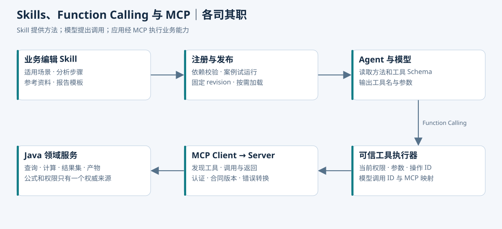

# Skill、Function Calling 和 MCP 怎么配合

员工不一定知道该点哪个页面，但通常说得出自己要汇报什么。Agent 要把这句话变成操作，需要两类东西：一类解释业务上该怎么做，另一类真正去查询和生成文件。Skill 主要提供前一种指导，工具接口提供后一种能力。

LangGraph4j 把这些步骤组织起来。它不会因为加载了一份 Skill，就自动知道业务表的权限，也不会替工具完成参数校验。



## 用一次查询分清职责

| 名称 | 在本项目中的作用 | 一个例子 |
| --- | --- | --- |
| Skill | 描述适用场景、步骤与完成条件 | 预算不明确时先确认版本，汇总后再决定是否下钻 |
| RAG | 找到当前适用的资料 | 检索“调整后预算”的说明与操作指南 |
| Function Calling | 模型提出结构化调用请求 | 请求 `queryBudgetSummary(planId)` |
| Java 工具适配器 | 校验并执行请求 | 检查工具白名单，调用受信查询服务 |
| MCP | 跨客户端或服务连接工具的协议 | Java Agent 调用已配置的外部文档工具 |
| LangGraph4j | 管状态、路由和恢复 | 等用户选完口径后继续原任务 |

模型返回了工具名和参数，代表它提出一次请求。应用还要核对权限、参数及当前任务是否允许这一步，执行后把结果与对应调用 ID 配对返回。

## Skill 写成业务方法，硬约束写进代码

预算汇报的 Skill 可以很短：确认项目和期间；区分管理部门与分摊部门；预算版本有歧义就追问；先查汇总；用户需要解释差异时再按项目下钻；图表与导出使用已有结果；没有原因证据时只说明差异构成。

这些步骤能减少用户记菜单和术语的负担。但“只能访问授权部门”“比例必须合计为 1”“同意图只创建一个导出任务”应由 Java 和数据库执行。只写在提示词里，既难验证，也容易在长对话中被忽略。

业务人员可以编辑适用场景、字段解释和示例。发布时要检查引用的指标、工具合同与数据版本，保留审核记录。用户上传的文档和检索结果只是资料，不能把其中的命令自动当成新的系统规则。

## 同一个 Java 应用，直接调用现有服务

首版可以给图节点注入一个窄接口：

```java
public interface BudgetTools {
  SummaryResult querySummary(EffectivePlanId plan, Actor actor);
  DetailResult queryProjectVariance(EffectivePlanId plan, Actor actor);
  ExportTaskId createExport(ExportIntent intent, Actor actor);
}
```

这里是目标接口示意，类型定义由业务模块提供；可运行演示用合成计算与 `ExportStore` 代替。`Actor` 来自登录和受信上下文，不能照收模型参数中的用户 ID。

节点经适配器调用已有 Spring Bean，就能复用核算与权限服务。需要接外部 MCP 工具时，再在 Java 侧加 MCP Client 适配器：启动或连接时读取工具目录，按服务白名单、合同版本和任务需要挑选工具，然后把调用结果转换回应用类型。

工具描述再完整，也不代表服务器值得信任。连接地址、认证和可访问范围由应用配置，不能让模型从网页文本里读到一个地址就主动连接。

## 接入真实模型，只保留一处动作决策

LangGraph4j 的 `decide` 节点可以调用模型适配器，获得 `drilldown` 或 `export` 这样的结构化结果。采用 LangChain4j 或 Spring AI 时，要明确哪一层负责执行工具循环，避免适配器自动执行一轮，图又把同一请求执行一次。

一个容易核对的实现是：模型提出动作，Java 适配器验证，图节点执行对应业务方法，再把结果摘要写回状态。模型只能看到本轮允许的动作与必要数据。敏感查询结果不必全部塞回提示词，能够用聚合和结果引用回答时就不要展开明细。

工具报错也要有稳定分类。缺参数就追问；权限不足就拒绝；数据尚未发布就说明状态；临时网络失败可以在预算内重试。反复把“失败了，请重试”发给模型，容易把永久错误变成无限循环。

## 三个编号分别对应三件事

`tool_call_id` 用于配对一次模型调用与返回；`operation_id` 表示用户的一次持久业务意图；`export_task_id` 是服务受理后生成的任务记录。

同一个导出意图重试时，模型调用编号可能变，操作编号必须不变。用户明确要求“按新口径重新导出”，才创建新意图。同编号不同参数应报冲突，不能悄悄覆盖已经接受的任务。

这些规则同样适用于直接 Java 调用、HTTP 和 MCP。协议换了，副作用边界仍在业务服务。第 08 篇的 H2 实验验证了并发请求与响应丢失两种情况。

## 资料少的时候，先用明确的版本目录

只有几十条指标说明和操作指南时，可以先按指标 ID、系统版本、角色范围检索，配合关键词搜索。向量检索在表达多样、材料较多时有帮助，但它不会自动判断“发生费用”与“已付款项”能不能混用。

返回资料时保留文档版本、有效期、来源和适用范围。查到旧版说明，应提示不兼容或换用当前资料。示例问题也必须带验证记录，不能把历史对话中一条未经核对的 SQL 当成标准答案。

## 更新 Skill 时，旧任务怎么处理

发布的是一份能力清单：Skill 版本、指标定义、工具合同、说明资料版本和验证结果。先验证整份清单，再切换“当前版本”指针，避免文本先更新、工具还没部署的半成品状态。

运行中的任务固定它开始时的兼容版本。普通内容更新可以让旧任务继续；权限撤销、严重口径错误等事件需要明确暂停或重新确认。恢复任务时同时检查兼容性与当前权限，不能只看到检查点存在就继续。

一个典型故障是新指南发布了，Agent 仍教旧按钮。排查顺序应是当前发布指针、任务固定版本、检索过滤、缓存键和实际召回片段，再检查提示词。先找它究竟读到了什么，往往比直接重写提示更有效。

## 面试时这样讲会比较顺

“Skill 告诉 Agent 这类汇报该确认什么、按什么步骤做；模型通过 Function Calling 提出工具请求，Java 负责检查和执行。我们在同一个应用内直接调用业务接口，接外部工具时才用 MCP。LangGraph4j 保存过程，业务服务保存结果和操作意图，所以换进程恢复以后也能继续核对。”

[← 执行过程](02-Agent%20怎么一步步完成一次汇报.md) · [分摊核算 →](04-一笔费用怎样分摊，Java%20又该守住什么.md)
