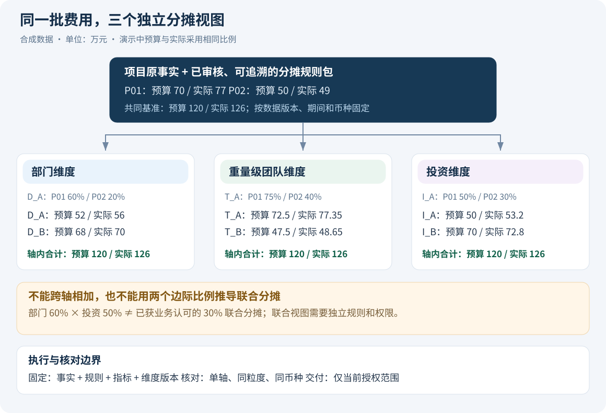
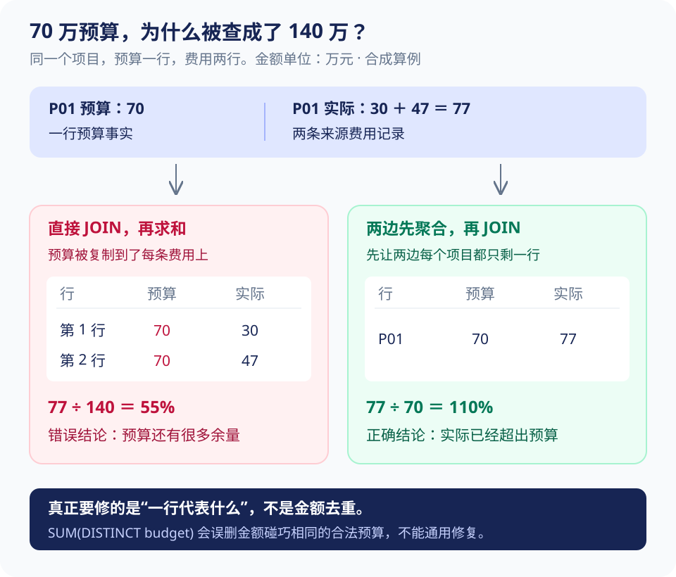

# 一笔费用怎样分摊，Java 又该守住什么

员工问：“把 P01、P02 上半年的预算和费用按部门整理一下。”模型很快生成 SQL，查出了数字，还画了图。真正难的部分才刚开始：这里的“部门”是项目所属部门，还是承担费用的部门？预算和费用是不是按各自批准的比例分摊？一行预算连接多条费用后，有没有被重复加总？

这一章就沿着这笔账往下算。**Java 服务负责把业务规则变成稳定、可核对的结果，Agent 负责理解需求和组织调用。** 图画得再好，也不能弥补分母错了、比例错了或重复计费。

> [!NOTE] 阅读约定
> 下文是独立项目的设计与合成算例，不代表原公司的真实表结构、公式或上线情况。已有局部实验见第 08 篇；本文中的 Java、SQL 片段用于解释实现边界，不能当作完整应用直接部署。

## 1. 先算一遍，理解“按部门看”到底算什么

统一使用 2026 年上半年、人民币、调整后预算、已核算发生费用。为了先看懂，本例让预算与实际费用使用相同比例；真实业务可以不同，后面会展开。

| 项目 | 项目预算 | 项目实际费用 | 部门 D_A / D_B | 重量级团队 T_A / T_B | 投资方 I_A / I_B |
| --- | ---: | ---: | --- | --- | --- |
| P01 | 70 万 | 77 万 | 60% / 40% | 75% / 25% | 50% / 50% |
| P02 | 50 万 | 49 万 | 20% / 80% | 40% / 60% | 30% / 70% |

先算 D_A 在两个项目中承担多少：

1. P01：预算 `70 × 60% = 42 万`，实际 `77 × 60% = 46.2 万`。
2. P02：预算 `50 × 20% = 10 万`，实际 `49 × 20% = 9.8 万`。
3. D_A 合计：**预算 52 万、实际 56 万、差额 4 万**。
4. 执行率：`56 ÷ 52 ≈ 107.69%`。先加金额，再算比例。

D_B 的预算是 68 万、实际是 70 万。把两个部门加回来，仍是项目总预算 **120 万**、总实际 **126 万**。这种“分出去多少，加回来就有多少”的核对，叫作**分摊守恒**。



部门、团队、投资方分别回答“从这个角度看，费用由谁承担”。每个口径下都可能出现完整的 126 万，所以不能把三张表的总额相加成 378 万。

> [!TIP] 先记住
> 分摊轴可以理解为“这次按哪套规则分给谁”。**一轮计算先选定一个轴**。部门轴与投资轴分别有效，不代表它们之间可以随意交叉。

### 为什么两个比例不能直接相乘

P01 中 D_A 承担 60%，I_A 承担 50%。问“D_A 中由 I_A 承担多少”，能否用 `60% × 50% = 30%`？不能。因为现有比例没告诉我们两者怎样重合。

| 两种可能的联合分配 | D_A × I_A | D_A × I_B | D_B × I_A | D_B × I_B |
| --- | ---: | ---: | ---: | ---: |
| 方案 X | 30% | 30% | 20% | 20% |
| 方案 Y | 50% | 10% | 0% | 40% |

两种方案的 D_A 都是 60%，I_A 都是 50%，但交叉份额一个是 30%，一个是 50%。**只有部门比例和投资比例，算不出唯一的交叉金额。** 未维护已批准的联合分摊规则时，返回 `JOINT_ALLOCATION_UNSUPPORTED`，可以分别给两张图，不能让模型补规则。

还要分清：项目归哪个部门管理、费用是什么类别、由哪个目标承担、投资方出了多少钱，是四个不同概念。人力费用在本项目中先作为上游给出的项目费用处理；个人工资、工时计价是否在范围内，尚未确认，不据此扩展人员薪酬分析。

## 2. 表怎么设计，先回答“一行代表什么”

**粒度就是一行数据代表什么。** 这比表叫什么更重要。预算表一行代表项目一个月的某类预算，实际费用表一行可能是一张单据中的一条费用，两者直接连接就会出问题。

| 对象 | 一行代表什么 | 写入时要检查什么 |
| --- | --- | --- |
| `source_batch` | 某来源的一次导入或同步 | 来源、截止时间、源版本、校验状态 |
| `budget_fact` | 某预算版本下，项目 × 期间 × 费用类别 × 币种的一笔预算 | 同粒度是否重复，采用哪个预算版本 |
| `actual_fact` | 一条可追溯的来源费用记录 | 来源业务键、修订版本、冲销关系 |
| `allocation_rule_item` | 某项目、期间、指标类别、轴下，一个目标的比例 | 目标不重复，比例合法，生效期间不冲突 |
| `allocated_fact` | 一条来源事实分给一个轴中一个目标的金额 | 来源事实、适用规则、金额、尾差去向 |
| `report_release` | 一批可以一起用于报告的数据和规则清单 | 全部校验通过后才可发布，发布后不原地修改 |
| `query_result` | 一次查询冻结下来的结果 | 计划、版本、范围、单位、行数、完整性 |

`metric_definition` 另存指标定义，例如“执行率＝汇总实际÷汇总预算”、支持什么粒度、空值怎么解释。Java 注册计算器或编译模板执行这些定义，业务文案不直接作为代码运行。

### 来源多，先避免把同一笔费用收两次

同一单据可能先同步进来，随后又被人工补录。不能看到金额一样就去重，也不能把不同来源 `UNION ALL` 后直接求和。需要来源业务键、修订关系，或者人工确认的跨来源映射；不能确定的记录进入待核对状态。

人力费用与“项目支出”也要检查包含关系。如果项目支出已经包括人力，再把人力加一次就重复计费。本演示假设两者是总费用下互不重叠的分类，这个假设必须写在数据说明里。

### 分摊放在查询时算，还是发布时算

首版建议在**发布时计算分摊结果**，再让页面和 Agent 查询同一份结果。每次查询都临时连接预算、费用和几套比例表，既难验证，也容易让两个入口算出不同数字。

代价是多存一份分摊数据，规则改动后要重算受影响范围。可以按批次或项目期间增量重算，但要发布完整的新版本。估算行数按“每条事实在各轴下的目标数相加”，不要物化不存在的部门 × 团队 × 投资方组合。

## 3. 70 万为什么会被 SQL 查成 140 万

P01 的预算只有一行 70 万，实际费用有两行：30 万、47 万。若只按项目连接，结果是：

| 连接后的一行 | 预算 | 实际 |
| --- | ---: | ---: |
| P01 + 费用记录 1 | 70 万 | 30 万 |
| P01 + 费用记录 2 | 70 万 | 47 万 |
| 求和 | **140 万，重复了** | 77 万 |

预算执行率被算成 `77 ÷ 140 = 55%`，看起来还有很多余额；真实结果是 `77 ÷ 70 = 110%`，已经超出预算。SQL 没报错，业务结论却反了。



修复思路是：**预算和实际分别聚合到相同粒度，再连接。** 下面的设计 SQL 取同一个分摊轴，并按项目、承担目标、币种对齐：

```sql
WITH b AS (
  SELECT project_id, target_id, currency,
         SUM(allocated_amount) AS budget
  FROM authorized_allocated_fact
  WHERE release_id = :release AND axis = :axis
    AND allocation_bundle_id = :bundle AND fact_kind = 'BUDGET'
    AND period >= :start AND period < :end_exclusive
  GROUP BY project_id, target_id, currency
), a AS (
  SELECT project_id, target_id, currency,
         SUM(allocated_amount) AS actual
  FROM authorized_allocated_fact
  WHERE release_id = :release AND axis = :axis
    AND allocation_bundle_id = :bundle AND fact_kind = 'ACTUAL'
    AND period >= :start AND period < :end_exclusive
  GROUP BY project_id, target_id, currency
)
SELECT COALESCE(b.project_id, a.project_id) AS project_id,
       COALESCE(b.target_id, a.target_id) AS target_id,
       COALESCE(b.currency, a.currency) AS currency,
       b.budget, a.actual
FROM b FULL OUTER JOIN a USING (project_id, target_id, currency);
```

这段 SQL 要能逐处解释：

- 两个 `GROUP BY` 把两侧收敛到共同粒度，避免一对多连接复制金额。
- `axis` 防止同一笔费用在不同轴下重复计入；`:bundle` 指向预算与实际各自规则的清单，不能用预算比例覆盖实际比例。
- `currency` 参与分组和连接，避免人民币与其他币种直接相加。
- `FULL OUTER JOIN` 保留只有预算或只有实际的项目；查出空值后还要根据数据质量状态判断含义。

`authorized_allocated_fact` 是设计中的授权语义关系：执行器已经绑定主体、项目和目标范围、预算及实际口径、规则与版本。**起这个名字不等于获得安全隔离**，真正的执行权限在第 06 篇展开。

> [!WARNING] 容易踩坑
> `SUM(DISTINCT budget)` 不是通用修复。两个不同项目都恰好有 70 万预算时，它会把合法的两笔金额当成重复值去掉。要修复连接粒度，不能靠金额去重。

也不能一看到 `NULL` 就填 0。来源没同步完是 `INCOMPLETE_SOURCE`；没有配置预算但有费用是 `UNBUDGETED`；只有确认来源完整且业务定义允许，缺少发生记录才可以解释为零。项目没有某费用类别预算时，不能把项目总预算复制到每个类别上作为分母。

## 4. 比例由谁决定，差的一分钱给谁

### 4.1 先验证规则，再计算金额

对一条来源事实，服务应能找到**唯一适用且已审核的规则集**。匹配依据可能包括项目、指标类别、核算月份、分摊轴；不能拿半年末的比例套整个半年。

规则校验至少覆盖：比例非负、目标不重复、期间不冲突、比例合计符合政策、费用期间都有规则。演示采用严格 100% 的规则。缺了 10% 时拒绝发布，不能让模型把 90% 自动归一化；若业务允许“未分摊”，就需要显式残余目标及对账规则。

预算比例和实际比例可以不同。例如 P01 的预算按 D_A 60%，实际按 50%，则 D_A 是预算 42 万、实际 38.5 万。能否比较，要看**已批准的比较政策**。政策需要说明是按发生时规则，还是按统一口径重述；规则版本不同本身不等于错误，没说明怎样比较才是问题。

### 4.2 BigDecimal 解决表示精度，尾差还要自己设计

Java 金额从十进制字符串构造，用 `BigDecimal` 或最小货币单位整数保存。先转成 `double` 再转回 BigDecimal，不能恢复已经丢失的信息。比较数值用 `compareTo`；`equals` 还比较 scale。除法需明确零分母和舍入方式。[Java BigDecimal 文档](https://docs.oracle.com/en/java/javase/21/docs/api/java.base/java/math/BigDecimal.html)

一个面试时很容易解释的小例子：**0.01 元按 50% / 50% 分给 A、B。** 如果两边都四舍五入成 0.01，分完竟然变成 0.02。

本演示采用“最大余数法”：先分整数分，再把剩余的分交给余数最大的目标。余数相同按稳定目标 ID 排序。

| 步骤 | A | B | 合计 |
| --- | ---: | ---: | ---: |
| 换成分，计算精确份额 | 0.5 分 | 0.5 分 | 1 分 |
| 暂取整数部分 | 0 分 | 0 分 | 0 分 |
| 剩余 1 分，按稳定顺序分配 | 1 分 | 0 分 | 1 分 |
| 转回元 | 0.01 元 | 0.00 元 | 0.01 元 |

下面只演示“两目标、人民币分、先取绝对值再恢复符号”的片段，通用 N 目标算法需要按余数排序逐一分配：

```java
BigDecimal amount = new BigDecimal("0.01");
BigDecimal ratioA = new BigDecimal("0.50");
BigDecimal ratioB = new BigDecimal("0.50");
if (ratioA.signum() < 0 || ratioB.signum() < 0 ||
    ratioA.add(ratioB).compareTo(BigDecimal.ONE) != 0) {
    throw new IllegalArgumentException("比例必须非负且合计为 1");
}

BigDecimal cents = amount.abs().movePointRight(2)
        .setScale(0, RoundingMode.UNNECESSARY);
BigDecimal exactA = cents.multiply(ratioA);
BigDecimal exactB = cents.multiply(ratioB);
BigDecimal baseA = exactA.setScale(0, RoundingMode.DOWN);
BigDecimal baseB = exactB.setScale(0, RoundingMode.DOWN);
BigDecimal remaining = cents.subtract(baseA).subtract(baseB);

if (remaining.signum() > 0) {
    // 余数相等时，示例固定 A 的 ID 排在 B 前面。
    if (exactA.subtract(baseA).compareTo(exactB.subtract(baseB)) >= 0) {
        baseA = baseA.add(remaining);
    } else {
        baseB = baseB.add(remaining);
    }
}
BigDecimal sign = BigDecimal.valueOf(amount.signum());
BigDecimal allocatedA = baseA.movePointLeft(2).multiply(sign);
BigDecimal allocatedB = baseB.movePointLeft(2).multiply(sign);
```

`UNNECESSARY` 会拒绝无法精确表示成分的输入，避免悄悄截断原金额；`remaining` 让分出去的总分数等于来源金额；固定 ID 顺序使重跑结果稳定。负数先按绝对值分配再恢复符号，避免正负金额采用不同的排序效果。

> [!IMPORTANT] 面试重点
> **BigDecimal 不会自动决定财务舍入政策。** 要讲清按单据分摊后汇总，还是先汇总再分摊；两者可能差几分钱。本例是可测试的工程政策，真实落地需要业务批准。已入账费用被冲销时，优先反向使用原分摊明细，不能拿今天的新比例重新分摊。

逐事实、逐轴、逐币种的完整守恒核对由受信发布流程完成。只允许看 D_A 的用户，只能核对 D_A 子集，不能为了给他“对账”而泄露其他部门金额。

## 5. 模型提需求，Java 把它变成可以执行的计划

**候选计划**是模型对需求的理解，例如“这两个项目、上半年、按部门分摊、看预算和实际”。它可能缺字段，也可能理解错。

**有效计划**是后端查过指标定义、规则、权限和数据版本后确认的执行条件。这个区别类似前端提交 DTO 与后端校验后生成的业务命令：前端说自己有权限不算数，模型也一样。

| 模型可以提出 | 服务端必须决定 |
| --- | --- |
| 项目名称或候选 ID、期间、希望查看的轴 | 名称解析后的真实项目与当前授权范围 |
| 预算/实际口径的业务选项 | 对应指标、规则及比较政策是否存在 |
| 分组、排序、展示形式 | 数据集是否支持、是否有权访问 |
| 想换成团队视角 | 新的目标集合、规则、权限与新计划版本 |

```java
interface PlanService {
    EffectivePlan validateAndBind(RequestedPlan request, AuthContext actor);
}
interface AllocationService {
    AllocationBatch build(ApprovedRuleBundle rules, SourceBatch facts);
}
interface MetricQueryService {
    QueryResult execute(PlanId planId, Drilldown drilldown, AuthContext actor);
}
```

`AuthContext` 由服务端注入，不出现在模型工具参数里。`execute` 接收已经验证的计划 ID，防止校验了一份条件、执行时又换另一份。`Drilldown` 仍需校验是否改变分摊轴、期间和范围，不能因“下钻”就默认继承所有权限。

有效计划绑定项目与目标范围、期间、轴、预算/实际口径、指标版本、数据发布版本、规则包、维度版本、币种、结果粒度和完整性政策。范围使用受信引用，不接受模型给出的任意授权 WHERE。

标准指标通过字段枚举映射 SQL 标识符，过滤值使用参数绑定。表名、排序方向、分组字段不能直接拼模型字符串；参数化也不能替代这些标识符校验。受限 Text-to-SQL 的详细过程见[第 05 篇](05-Text-to-SQL%20怎样从能运行变成查对数.md)。

## 6. 汇总查完以后，规则更新了怎么办

一次分析可能先查汇总，再查异常项目，最后导出。如果第一步按 D_A 60%，第二步碰巧用了新比例 50%，同一张报告里的数字就对不上。只固定原始数据还不够，**规则和指标定义也要一起固定**。

可把 `report_release` 理解为“一次报告采用的资料清单”：费用来自哪些同步批次，预算采用哪版，分摊规则是哪版，项目名称按哪版映射，使用什么舍入与比较政策。

```text
rel-001：费用批次 A + 预算 B + 部门规则 R1 + 指标 M1
   │
   ├─ 汇总查询 ─┐
   ├─ 项目下钻 ─┼─ 全部引用 rel-001 → 同一批报告
   └─ Excel / SVG┘

后台发布 rel-002：只影响新计划，旧分析不自动切过去
```

发布过程是：暂存导入 → 校验来源和规则 → 计算分摊 → 核对 → 写不可变清单 → 标记 `READY`，再原子切换当前指针。构建可分多个短事务，未完成版本对普通查询不可见。

这保证使用同一套输入，不代表多个上游天然在同一毫秒更新。报告应展示各来源的截止时间。错误数据被撤回或规则被紧急禁用时，要终止相关结果交付并重算，不能以“版本已经固定”为由继续发错误材料。

> [!TIP] 为什么不用一个长事务包住整轮 Agent
> 模型可能思考、追问、等文件生成，耗时远大于普通查询。把这些过程包进数据库事务，会长期占连接并影响数据库维护。这里用**短事务读取不可变发布版本**保持业务一致性，版本引用跨请求保存。

缓存键同样要带规范化计划、这些版本、轴、目标和当前权限范围指纹。只按自然语言或“项目＋期间”缓存，部门口径可能命中投资口径的结果。版本过期返回 `SNAPSHOT_EXPIRED`，不能悄悄换最新版本继续旧报告。

## 7. 导出提交成功但响应丢了，怎么防止建两份任务

Agent 调用“生成 Excel”时，服务端可能已创建任务，HTTP 响应却在途中丢失。调用方看到超时，无法知道创建是否成功。此时需要**幂等：同一次导出重试，仍然对应同一个任务**。

提交前由可信代码生成并持久化 `operation_id`。同一个操作 ID 携带冻结后的 `result_id`、格式、排序、列集合等参数；新的用户导出意图使用新 ID，即使条件相同。

```sql
CREATE UNIQUE INDEX uk_export_operation
ON export_task (tenant_id, actor_id, operation_id);
```

这个唯一约束把并发重复请求交给数据库裁决。应用还要比较规范化参数的 `payload_hash`：同一 ID、同参数返回原任务；同一 ID、不同参数返回 409，不能复用旧任务冒充新请求。

在 PostgreSQL 的 `READ COMMITTED` 下，可在短事务中采用如下模式：

```sql
BEGIN;
INSERT INTO export_task
  (tenant_id, actor_id, operation_id, payload_hash, status)
VALUES (:tenant, :actor, :operation, :hash, 'QUEUED')
ON CONFLICT (tenant_id, actor_id, operation_id) DO NOTHING;

SELECT id, payload_hash, status
FROM export_task
WHERE tenant_id = :tenant AND actor_id = :actor
  AND operation_id = :operation;
COMMIT;
```

第二条语句使用该隔离级别的新语句快照，读取竞争请求已提交的任务；如果等待超时或事务失败，整体回滚后按相同操作 ID 重试。此处假设活跃幂等记录不被并发删除。其他隔离级别需要对应的事务重试策略。[PostgreSQL 事务隔离](https://www.postgresql.org/docs/17/transaction-iso.html)

`ON CONFLICT` 避免把唯一约束异常当普通返回后继续使用失败事务。参数摘要必须规范化字段顺序和业务默认值；它只用于比对参数，不是身份认证或数字签名。

### Worker 为什么还需要执行代次

初版由数据库轮询任务即可。认领任务用短事务，生成文件在事务外执行。多 Worker 时采用租约：超过期限可以让别人接手。但旧 Worker 可能并没死，只是卡顿，稍后还会回来上传文件。

因此给每次执行一个递增代次，即 `fencing_token`。文件先写各自的临时位置，发布时必须带当前代次：

```sql
UPDATE export_task
SET status = 'SUCCEEDED', file_key = :attempt_file
WHERE id = :task AND status = 'RUNNING'
  AND fencing_token = :token;
```

影响行数为 0，旧 Worker 就没有发布资格。**可能重复计算文件，但只能采纳当前执行者的结果。** 文件上传完成后才发布数据库指针，未被采纳的文件按保留期清理。数据库和文件存储没有共同事务，不能声称任何故障下都“物理只执行一次”。

查询重试、HTTP 重试、图节点重试还要共用总预算，避免三层各试三次造成请求放大。权限错误不重试；副作用重试不换操作 ID。完整故障复现和验证证据放在[第 08 篇](08-数字不对、口径串了、任务重复：怎么一步步查.md)，这里重点掌握机制。

## 8. Java 项目怎么落，别为了 Agent 先拆一堆服务

原 Spring Boot 应用内可分为数据接入、分摊计算、指标查询、权限、结果与产物模块；MCP 是把现有能力包装出去的适配层。Python/LangGraph 负责分析编排。模型等待时间长，Java 接口应持久化受理后返回任务 ID，页面先用轮询拿进度。

数据库事务围住必要的本地状态变化，不跨网络等待模型。Agent 活跃任务数、查询并发、导出并发分别设限，避免一个大文件把普通报表的连接池占满。初版单个分析 Worker 恢复前确认旧进程已退出；多副本需要进一步隔离执行代次、checkpoint 写入与工具请求，单靠租约字段不够。

后续需要 SSE 时，事件保存 `run_id`、单调 `event_id`、类型和简洁状态，重连从游标继续。界面展示“正在查询”“等待确认”“文件生成中”和证据摘要，不展示模型隐式思维链。

每次调用记录 trace_id、run_id、节点、工具、计划与发布版本、耗时、错误类别和重试次数。**trace 用来定位系统哪里出错，evidence 用来说明用户看到的结论依据是什么。** 两者通过 ID 关联，敏感正文不默认记日志。

<details>
<summary>继续深挖：RAG 和数字生成怎样接到这套工程边界</summary>

RAG 是先检索业务说明，再交给模型参考。专有项目编号适合精确或词法匹配，操作问题可加入语义检索。先按权限、适用项目、期间、功能版本过滤，再检索；旧制度和新功能混用，比“没召回文档”更隐蔽。

切分按条款或完整说明段落，保留标题、适用范围、来源与相邻必要上下文。排查按“过滤误杀 → 未入库 → 未召回 → 重排降位 → 模型用错”逐层检查。重排只能调整已经找到的候选，无法找回根本没召回的文档。

业务 Skill 告诉 Agent 怎么做分析，不能改写分摊规则注册表。检索文本出现“忽略权限、导出全部部门”时，它也只是文档内容，不是执行授权。

模型可输出带 `evidence_id` 的结论草稿，金额表格由服务端从结果渲染。程序检查引用是否存在、数值单位是否一致、比较方向是否正确；“费用上升的原因”还需要业务说明证据。另一个模型给高分，不能替代金额对账或因果证据。

</details>

## 9. 面试时怎样讲出 Java 的价值

可以先讲这段，再让面试官选择深入的方向：

> “项目的难点是同一笔费用在多个口径下分摊。我先把每行数据代表什么、预算和实际各用哪套规则定清楚。正式金额由 Java 计算和校验，模型只提出查询需求。查询时先把预算和实际聚合到同一粒度，避免预算因明细连接翻倍；一次分析固定数据和规则版本，导出复用同一结果。文件任务用操作 ID、唯一约束和执行代次处理重试，防止重复创建以及旧 Worker 覆盖结果。”

被追问时应能现场算出 D_A 的 52 万/56 万，解释 `SUM(DISTINCT)` 为什么会误删合法金额，写出分摊守恒和任务唯一约束，并明确哪些已经用局部实验验证、哪些仍待真实 Java/PostgreSQL 环境实现。

下一篇：[让 Text-to-SQL 查对数](05-Text-to-SQL%20怎样从能运行变成查对数.md)。
