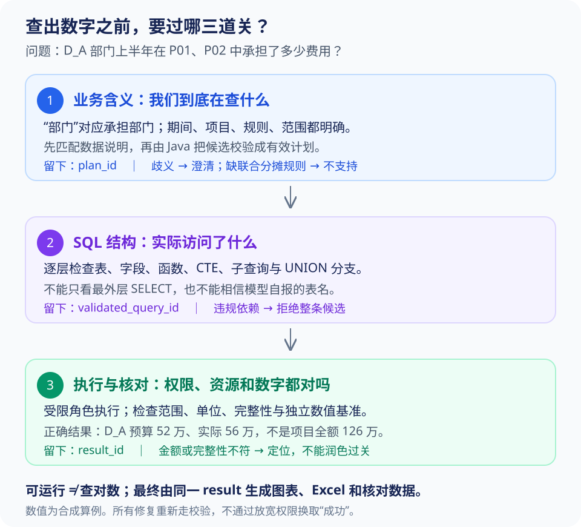

# Text-to-SQL 怎样从能运行变成查对数

用户问：“D_A 部门上半年在这两个项目中承担了多少费用？”SQL 正常执行，返回 **126 万**。但我们上一章算过，D_A 实际只承担 **56 万**，126 万是两个项目的全部费用。

这里没有语法错误，也没有接口异常。模型只是把“承担费用的部门”理解成“项目所属部门”，查到了另一种含义的数据。**要提高成功率，先让模型选对口径和数据，再讨论 SQL 怎么写。**

> [!NOTE] 这篇准备到什么程度
> 下文是目标方案与评测设计，金额使用合成数据。目前没有模型准确率或提升比例。仓库中的两组局部实验共 23 项检查，验证部分计算与任务行为，不能替代 Text-to-SQL 的端到端评测。

## 1. 开发还写不写 SQL，模型到底省了哪部分工作

开发仍然要维护指标定义、可信数据集、允许的关联方式和执行权限。模型可以省掉“每个筛选和分组组合都手写接口”的工作，不能替业务决定预算口径或分摊比例。

因此，项目保留两条查询路径：

| 用户需求 | 走哪条路径 | SQL 由谁产生 |
| --- | --- | --- |
| 按部门看预算、实际、差额、执行率 | 标准指标查询 | Java 根据指标 ID、维度和筛选编译模板 |
| 在已支持的数据上，做临时组合或比较 | 受限 Text-to-SQL | 模型生成候选，校验后执行 |
| 要求部门 × 投资方联合分摊，但业务没有维护联合规则 | 说明当前不支持 | 不生成一条“看似能算”的 SQL |

标准指标可以动态组合项目、月份、费用类别，不必一问一接口。受限探索只在**已定义、已授权的数据范围内**扩展表达能力。标准工具返回 `FORBIDDEN` 后，不能换自由 SQL 再试一次。

> [!TIP] 先记住
> 面试问“为什么不让模型直接查库”，可以用一句话回答：**已有的预算公式和分摊规则没有必要每次重新猜；模型主要负责把用户的问题转换成这些能力能接受的查询。**

## 2. 查询要过三道关

把过程拆开，出了错才知道应该修哪一层。



第一关是**业务含义**：这次查哪些项目、什么期间、哪个分摊轴、什么预算和实际口径？第二关是 **SQL 结构**：真的只访问允许的数据吗，嵌套查询里藏了什么，聚合粒度对不对？第三关是**执行与结果**：能否在权限和资源边界内完成，数值是否符合独立基准？

完整链路如下，方框里的对象都可以留存，便于复现：

```text
用户问题 + 已确认上下文
 → 候选计划
 → 找到适用的数据说明、指标和已验证例子
 → Java 校验并绑定有效计划
 → 标准编译 / 模型生成 SQL
 → SQL 结构检查与资源预检
 → validated_query_id
 → 受限执行 → result_id
 → 数值和完整性核对 → 解释 / 图表 / Excel
```

候选计划允许缺少条件，**有效计划才允许进入执行**。数据说明没找到时不能随便猜表，用户有歧义时不能靠重试直到生成一个 SQL。

## 3. Schema Linking：把业务用语对到真正的数据字段

Schema Linking 可以直接理解为“**用户说的东西，对应哪张数据集、哪个字段和哪种关系**”。本项目里，“部门”至少可能指项目归属部门、费用发生部门、分摊承担部门。这几个词不能仅靠向量相似度合并。

用户说“按部门分摊看费用”，目录应选中 `allocated_budget_execution`，而不是项目主表里的 `owner_department_id`。如果只说“按部门看”，且当前页面和历史对话都没有确定含义，就补问一句；已在部门分摊报表内发起，则继承并展示口径，不让用户重复填写。

### 给模型一张能看懂的数据说明卡

只给 DDL，模型能知道列的类型，但不知道“实际”是发生额还是付款额。说明卡至少补上这些信息：

| 内容 | 本项目示例 | 防止哪种错误 |
| --- | --- | --- |
| 数据含义 | 已审核规则计算后的预算与费用分摊结果 | 把项目全额当部门承担额 |
| 一行代表什么 | 项目 × 期间 × 费用类别 × 轴 × 目标 × 币种 | 连接重复、汇总粒度错 |
| 金额含义 | 调整后预算、已核算发生额 | 预算版本或发生/付款混用 |
| 时间含义 | 核算期间，不是导入时间 | “上半年”过滤到了导入日期 |
| 合法维度 | 每次选一个分摊轴 | 把独立轴相乘或跨轴求总计 |
| 指标怎么算 | 执行率＝总实际÷总预算 | 平均项目百分比 |
| 关联关系 | 项目名称按同发布版本一对一映射 | 名称维表一对多导致金额翻倍 |
| 完整性 | 来源没到齐时不能把缺失填 0 | 空值掩盖同步缺口 |

元数据应先按当前用户可见的数据域和字段过滤，再检索。补充维表时只补允许的关联；原始比例表和人员薪酬表不能因为“可能有帮助”全部塞给模型。

项目编号适合精确或关键词匹配，描述性词语可用语义检索。数据集数量少时，业务别名表往往已经够用。后来加入混合检索或重排，要测**正确数据集和必要字段有没有进入候选**，不能只测耗时。

员工说“领导要看的那张卡片”时，可以先解析现有卡片 ID，继承指标和默认条件。系统更新后别名可以重定向，但口径变了就要提示，不能把“名字相近的新卡片”当成原卡片。

## 4. 有效计划为什么值得单独存下来

对“按部门分摊汇总 P01、P02 上半年预算与实际”这一问，模型只提交业务候选。Java 校验后，生成如下有效计划：

```json
{
  "plan_id": "plan-101",
  "dataset": "allocated_budget_execution",
  "projects": ["P01", "P02"],
  "period": {"start": "2026-01-01", "end_exclusive": "2026-07-01"},
  "allocation_axis": "DEPARTMENT",
  "target_scope_ref": "scope-resolved-by-java",
  "budget_basis": "ADJUSTED",
  "actual_basis": "ACCRUED",
  "rule_bundle": "alloc-bundle-v1",
  "comparison_policy": "APPROVED_SAME_BASIS",
  "data_release": "rel-001",
  "metric_version": "metric-v1",
  "grain": ["allocation_target_id"],
  "currency": "CNY"
}
```

这里有几处值得追问：`target_scope_ref` 来自权限服务，模型不能自签授权；`rule_bundle` 分别绑定预算和实际的规则，不假设两者永远相同；`data_release` 固定这轮使用的数据；`grain` 明确每行代表一个承担部门。

完整契约还应保存维度、舍入、完整性政策及校验器版本，上例省略它们便于阅读。执行层不用把所有内部字段都展示给员工，但应提供能理解的口径摘要。

用户随后说“改成重量级团队”，可以继承项目和期间，**轴、目标、规则、权限和结果粒度要重新校验**，产生新计划与新结果。旧部门结果不能拿来解释团队费用。

“前十名”是业务范围；“页面只预览 100 行”只是显示限制。这两种上限应分别存为 `semantic_limit` 和 `preview_limit`，否则一导出就可能把预览误当全部。

## 5. 让模型生成 SQL，示例应该怎么给

Few-shot 就是给模型看少量“已经做对的例子”。优先选择同一指标、同一聚合结构和同一数据模型的例子，不能只挑文字最像的问题。“发生费用”和“已付款项”文字相近，但事实不同。

例子要带已验证计划、SQL 模板、schema/指标版本和验证记录。不能把生产日志直接当标准答案：错误 SQL 也在日志里。示例中的身份和范围必须换成本次受信计划，不能照搬管理员的全公司查询。

一次提示可按“问题 → 有效计划 → 数据说明 → 业务约束 → 少量例子 → 输出结构”组织。模型返回 SQL、参数候选和简短说明即可；它自报的 `used_datasets` 只能辅助诊断，实际依赖由解析器读取。

下面用授权语义关系说明正确的聚合方式：

```sql
SELECT allocation_target_id,
       SUM(allocated_budget) AS budget,
       SUM(allocated_actual) AS actual,
       SUM(allocated_actual) - SUM(allocated_budget) AS variance,
       SUM(allocated_actual)
         / NULLIF(SUM(allocated_budget), 0) AS execution_rate
FROM authorized_allocated_costs
WHERE period >= :period_start AND period < :period_end
GROUP BY allocation_target_id;
```

`SUM(actual) / SUM(budget)` 先合计金额再计算比例。`NULLIF` 避免零分母报错，结果为空还要附上“零预算”状态；它不能区分预算缺失与预算为零，这需要数据质量标记。金额列采用精确十进制类型，不能让整数除法或浮点误差改变结果。

这里的 `authorized_allocated_costs` 是执行器按有效计划提供的关系，已限制项目、目标、轴、规则、发布版本、币种和指标口径。名字只是示意；真正数据库隔离需按[第 06 篇](06-用户说“导出全部”，怎样守住数据权限.md)实现验证。不能把这段 SQL 放到全库账号下，就认为权限已经解决。

## 6. AST 校验到底在查什么

AST 是**把 SQL 解析成树状结构**：哪些表被读，哪些字段参与表达式，哪里有连接、子查询和集合操作。它比“看字符串里有没有 WHERE”更可靠，因为 SQL 可以嵌套很多层。

### 只检查最外层，为什么会漏

看下面这个故意构造的负例，外层查的只是 `q`：

```sql
WITH q AS (
  SELECT allocated_actual AS amount
  FROM authorized_allocated_costs
  UNION ALL
  SELECT total_actual AS amount
  FROM raw_project_actual
)
SELECT SUM(amount) FROM q;
```

如果只看外层 `FROM q`，会漏掉里面的原始项目全额表。正确过程是：解析 `q` 的定义 → 分别检查 `UNION ALL` 两边 → 解析第二边的真实表标识 → 发现不在允许数据集中 → **整条拒绝**。不能只删除违规分支后继续返回一个被悄悄改变的问题答案。

PostgreSQL 的 `WITH` 中甚至可以包含数据修改语句，所以“整段看起来最后是 SELECT”也不够。首版拒绝数据修改 CTE、递归 CTE 和其他未实现语法，只开放经过验证的查询子集。[PostgreSQL WITH 文档](https://www.postgresql.org/docs/17/queries-with.html)

### 递归检查怎样写到工程里

下面是设计伪代码，不对应某个解析器的现成 API：

```java
void validateQuery(QueryNode query, NameScope outer) {
    requireSupportedQueryKind(query);
    NameScope local = outer.child();
    for (CteNode cte : query.ctesInVisibilityOrder()) {
        validateQuery(cte.body(), local);
        local.bind(cte.name(), resolveOutputColumns(cte.body()));
    }
    for (QueryNode branch : query.setOperationBranches()) {
        validateQuery(branch, local);
    }
    for (Relation relation : query.relations()) {
        validateRelationOrSubquery(relation, local);
    }
    for (Expression expression : query.allExpressions()) {
        validateColumnsFunctionsAndNestedQueries(expression, local);
    }
    rejectUnknownNodes();
}
```

逐段看它在防什么：

- `NameScope` 管当前层有哪些表、别名和列。内层同名别名不能误解析到外层；关联子查询还需按方言解析外层可见名称。
- CTE 本体先校验，再登记它输出的列；`UNION / INTERSECT / EXCEPT` 每个分支都要走完整检查。
- `relations()` 覆盖真正的表、视图和子查询；不能只相信模型列出的表名。对象名解析到数据库目录中的确定对象，并限制 schema/search_path。
- `allExpressions()` 包括 SELECT、JOIN ON、WHERE、GROUP BY、HAVING、ORDER BY、窗口定义等位置。受限字段藏在筛选或排序中也要拒绝。
- 星号需要按允许输出列展开检查。函数和操作符按受支持清单与解析后的身份验证，不凭函数名字像 `sum` 就放行。
- 遇到解析器新增节点、未识别方言或没覆盖的语法，默认拒绝，不能因为遍历器“没报错”就允许。

> [!WARNING] 容易踩坑
> **AST 能发现结构和依赖，不能证明任意 SQL 的业务含义都正确。** 它能拦住未授权表，却未必看得出某个复杂公式把“预算执行率”理解错了。正式指标优先用可信编译器，结果仍需语义基准验证。

### 校验后为什么只给 query_id

SQL 通过后，保存规范化 SQL、绑定参数、有效计划、主体范围、版本、校验器版本和过期时间，生成 `validated_query_id`。执行接口只接这个 ID。

这样可以防止“校验 SQL A，执行时却提交 SQL B”。修改候选、切换轴或更换数据版本，都需要重新校验。执行前再检查当前授权，历史校验记录不能把已经撤销的权限保留下来。

## 7. 可执行还不够，要能在资源预算内执行

只读查询也可能把数据库拖慢。先限制允许的数据集、期间、连接结构和最大返回量；必要时用 `EXPLAIN` 看估计扫描、笛卡尔积和大排序，再配置服务端超时与并发额度。

`EXPLAIN` 的估计不是准确耗时承诺。`EXPLAIN ANALYZE` 会实际执行，不能当无执行预检查；`LIMIT 100` 也可能先完成大量聚合与排序才返回 100 行。[PostgreSQL EXPLAIN 文档](https://www.postgresql.org/docs/17/sql-explain.html)

预检没发现问题，执行仍可能超时。此时不能偷偷把半年改成一个月来“成功返回”。可以说明成本问题，或在语义不变的前提下优化计划、改为异步；需要缩小范围就让用户明确选择。

执行成功后将结果保存为不可变 `result_id`，附 schema、单位、行数、完整性、计划与发布版本。模型读摘要或授权分页，Excel 和 SVG 用同一结果，不再分别生成 SQL。

## 8. 修复不是一直问模型“再试一次”

先分清错误是否值得让模型修。字段名写错可以修，缺少业务规则和没有权限都不该靠重试突破。

| 错误类型 | 先查哪里 | 后续动作 |
| --- | --- | --- |
| `COLUMN_NOT_FOUND` | 目录、示例是否匹配已绑定的 schema 版本 | 刷新该版本元数据后再生成；不能静默切最新版本 |
| `TYPE_MISMATCH` | 日期、金额字段类型和表达式 | 给脱敏诊断，有限修正 |
| `FORBIDDEN` | 实际主体、依赖表或字段 | 结束相关查询，不寻找绕过路径 |
| `ALLOCATION_RULE_UNAVAILABLE` | 该期间是否有已审核规则 | 显示缺口，不用最新比例或 100% 凑数 |
| `UNSUPPORTED_SEMANTICS` | 是否缺联合事实或合法比较口径 | 说明支持范围，不当语法错误修复 |
| `SCOPE_OR_AXIS_MISMATCH` | 候选是否偏离有效计划 | 拒绝候选，检查多轮条件继承 |
| `QUERY_TIMEOUT` | 扫描、连接、排序、资源额度 | 语义不变时优化，否则明确终止或协商范围 |
| `NO_DATA` | 计划、来源完整性、日期与过滤 | 空结果可能正确，不强迫模型查出数据 |
| `INVARIANT_FAILED` | 单位、聚合、规则与版本 | 回到相应计算层，不让模型润色错误数字 |

初始实验可设“首轮＋最多两次修复”，并设总时长和调用预算。每次修复后的候选**重新过全部校验**，不是只检查上次报错字段。

```text
CANDIDATE → VALIDATING → EXECUTING → CHECKING → SUCCEEDED
                 │           │           │
                 └────可修复错误─────────┘
                            ↓
                  REPAIRING（次数/时限有上限）
                            ↓
                      新候选重新校验

权限拒绝 → DENIED；语义不支持 → UNSUPPORTED；预算耗尽 → FAILED
```

重试输入包含原有效计划、相关元数据和处理后的错误类别，不带数据库内部敏感信息。多候选生成可以做对照实验，但不要把候选都直接对生产库执行来“投票”。

> [!TIP] 排查时先问一个简单问题
> **错误发生在哪一层，那里有可以改的东西吗？** 缺字段就修元数据；规则没发布就修业务准备；没有权限就结束。把所有错误交给模型多试几次，会掩盖真正的问题。

## 9. 一次具体的错误，怎样定位到根因

仍用开头的故障假设：D_A 应是 56 万，页面却显示 126 万。

先用 `result_id` 找原查询结果。如果 JSONL 是 56 万，只有图表是 126 万，就看 `source_result_id`、图表转换和缓存；别先改 SQL 提示词。

如果结果本身就是 126 万，继续检查有效计划：它写的是部门分摊，还是项目归属？如果计划已经错了，问题在意图理解或上下文继承；若计划正确，再看实际扫描对象，是 `allocated_*`，还是 `raw_project_actual`。

若表也对，检查轴、目标、规则包和聚合粒度。只有找到具体错误层，才修相应机制。例如把说明卡中的“部门”拆成三个业务概念，或修复目录/校验器使原始全额表不能替代分摊数据。不要给原问题加一句“这次记得只查 D_A”就算结束。

回归至少加三种变化：换成投资轴；预算与实际采用不同批准规则；用户只允许看 D_A。它们能检查修复是否覆盖机制，而非记住一句测试原文。完整事故叙述和证据组织见[第 08 篇](08-数字不对、口径串了、任务重复：怎么一步步查.md)。

## 10. 怎样证明“提高了正确率”，不只证明 SQL 能跑

先确定评测在衡量什么。下面几种成功不能混用：

| 指标 | 真正判断什么 | 不能据此声称什么 |
| --- | --- | --- |
| 语法通过率 | 解析器接受 SQL | 没查错字段 |
| 可执行率 | 查询在边界内完成 | 返回的金额和口径正确 |
| 计划正确率 | 轴、期间、规则、范围、粒度与需求一致 | SQL 实现一定正确 |
| 语义/数值正确率 | 独立基准认可含义与结果 | 图表和文件一定完整 |
| 任务成功率 | 查询、解释、权限和所需产物都符合要求 | 所有输入都必须生成 SQL |

有歧义时正确追问，没有权限时正确拒绝，都可能是任务的预期动作。它们单独计分，同时保留覆盖全部请求的任务成功率，避免靠大量拒绝把已执行查询正确率做高。

### 一个问题要配多组能区分错误的测试数据

只用预算与实际比例相同的数据，无法发现程序错用了比例。增加 P01 的预算比例 60%、实际比例 50% 的变体：预算仍为 42 万，实际应为 38.5 万；若还返回 46.2 万，就定位到实际用了预算规则。

类似地，两个项目执行率分别 110%、98%，平均是 104%；总实际 126 万除总预算 120 万才是 **105%**。需要这种能把错公式与对公式区分开的数据。

> [!IMPORTANT] 面试重点
> **一份数据上碰巧查出相同结果，不代表两个 SQL 语义等价。** 评测要换比例、加入重复值、缺失值、零预算和不同期间；不能只对 SQL 文本，也不能只跑一个正常例子。[Text-to-SQL 语义评测研究](https://arxiv.org/abs/2010.02840)

首批案例可以这样设计：

| 测试变化 | 预期动作或数值 | 主要检查 |
| --- | --- | --- |
| 两项目按部门分摊汇总 | D_A 52/56 万，D_B 68/70 万 | 不用项目全额冒充份额 |
| D_A 下钻到项目 | P01 42/46.2 万，P02 10/9.8 万 | 下钻仍保持原口径 |
| 全额授权用户看整体执行率 | 126/120＝105% | 不平均百分比 |
| 预算和实际比例不同，比较政策已批准 | P01 D_A 实际 38.5 万 | 两种事实用各自规则 |
| 同一项目跨月规则变化 | 逐月用适用规则，再加总 | 不套期末最新比例 |
| 无上下文的“按部门看” | 必要澄清 | 不强行猜口径 |
| 部门 × 投资方，无联合事实 | `JOINT_ALLOCATION_UNSUPPORTED` | 不把边际比例相乘 |
| 零预算与缺预算 | 执行率为空，但状态不同 | 不把缺失藏成 0 |
| D_A 用户要求投资方数据 | 拒绝，相关样例也不进入模型 | 权限在生成前就生效 |
| 部门查询后切团队，沿用旧证据 | 新计划、新结果 | 多轮状态不串口径 |
| 预览 100 行，导出全部 | 使用完整结果 | 不把预览当导出来源 |

完整守恒只能在同轴、同规则适用集合、完整目标集合中检查。只允许拿 D_A 的用户，不能要求其结果等于 126 万，更不能为测试这个条件向用户暴露全项目数据。

### 每个优化到底贡献多少

消融实验就是“每次只加一项，看看提升来自哪里”。可以比较：A 仅 DDL；B 加业务解释与粒度；C 加相关 schema 和已验证例子；D 加有效计划和校验；E 加有限修复。

固定模型版本、数据、温度、工具预算与超时，记录每例的计划、候选、错误层、耗时和最终动作。除了成功率，还看：正确 schema 是否召回、首轮成功率、修复后成功率、必要追问与无谓追问、权限违反数、端到端延迟和成本。

开发集用于调整提示；留出集按查询结构、项目别名、规则变体隔离。不要把测试原题加入示例后仍称“泛化能力提升”。也不要只报告多次运行中最好的一次。

## 11. 面试可以怎样回答

> “我把 Text-to-SQL 的成功定义为查对业务数据，而不是 SQL 能执行。先解析项目、期间和分摊口径，用业务目录把‘部门’映射到承担部门，再由 Java 绑定规则、数据版本与权限。正式指标走可信编译，临时组合才让模型生成。候选经过递归 AST 校验和受限执行，数值用独立基准核对，只有可修复错误才有限重试。评测会加入预算与实际比例不同、跨月规则变化、连接翻倍这些能暴露错误的数据。”

这段话中的深度，要靠你能画出三道关、解释 CTE 的扫描路径、算出 52/56 万，并展示逐例评测记录。没有实际跑出的模型数据，就清楚说“评测方案已设计，效果待测”。

下一篇：[数据权限怎样管住查询与导出](06-用户说“导出全部”，怎样守住数据权限.md)。
