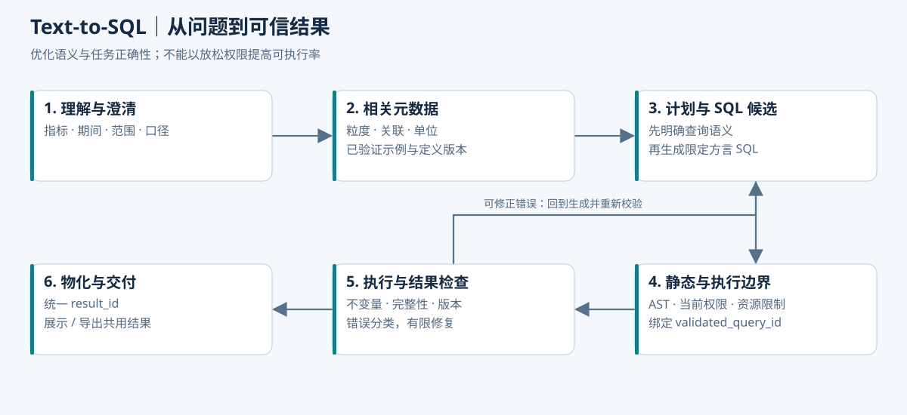

# Text-to-SQL：提高正确完成任务的比例

> 本章为目标实现与实验设计。没有已测得的模型准确率或提升比例；已有局部工程检查不构成 Text-to-SQL 评测结果。所有金额与规则例子均为合成数据。

本项目更难的问题是：“按部门看项目费用”到底表示费用发生部门、项目归属部门，还是分摊承担部门？如果这个语义没确定，SQL 再流畅也可能选错数据。提高成功率应先解决口径映射，再解决 SQL 生成。

## 1. 开发还需要写 SQL 吗

开发需要定义可信数据集、指标语义、关联关系、权限与执行规则。尤其是已审核的分摊比例、生效期间、预算与实际的规则映射，必须由业务服务管理。成熟核心指标的 SQL 或编译模板也需要开发维护，但不应为每句自然语言手写一条专用 SQL。

采用两条查询通道：

| 通道 | 输入 | SQL 来源 | 适用情况 |
| --- | --- | --- | --- |
| 标准指标 | 指标 ID＋期间＋分摊轴/目标＋粒度＋筛选 | Java 指标编译器/已验证模板 | 分摊后预算、实际、差额、执行率等正式定义 |
| 受限探索 | 自然语言目标＋授权分摊语义数据集 | 模型生成，经过相同执行边界校验 | 支持范围内的新组合、临时比较和探索查询 |

两者都产生统一的 result_id，都受当前权限、数据版本与资源限制。不能因标准工具返回 FORBIDDEN，就改走自由 SQL；探索通道是表达能力扩展，不是绕过路径。

“按部门看执行率”和“按项目排序”不必写两条固定接口，指标编译器可以动态组合合法维度。超出表达范围但数据集支持的临时分析才进入探索通道。

“部门 × 投资方费用”不是随意增加两个 `GROUP BY` 就能实现。首版假设各分摊轴独立，部门与投资方的边际比例不能相乘编造联合分摊。缺少权威联合事实时返回错误类别 `UNSUPPORTED_SEMANTICS`、业务码 `JOINT_ALLOCATION_UNSUPPORTED`，即使模型能生成可执行 SQL 也不能放行。规则模型见[技术实现与工程边界](04-分摊语义与Java工程实现.md)。

## 2. 什么叫生成成功

| 指标 | 定义 | 容易产生的误判 |
| --- | --- | --- |
| 结构/语法通过率 | 生成 SQL 被解析器接受 | SQL 可能查询了错误字段 |
| 可执行率 | 在受控环境执行成功 | HTTP 200、空结果也可能业务错误 |
| 语义正确率 | 指标、分摊轴/规则、范围、期间、粒度与问题一致 | 查项目全额或旧比例也可能正常返回 |
| 数值正确率 | 数值断言满足基准与精度规则 | 简单平均比率、单位混用 |
| 任务成功率 | 动作、权限、查询、解释和所需产物都满足 | 有查询结果但文件不完整 |

目标是后面几项。必要追问和正确拒绝也是特定案例的成功动作，不应该强迫所有输入都生成 SQL。

## 3. 端到端生成流水线



```text
理解问题与继承条件
  → 确认歧义
  → 相关数据集检索与关联补齐
  → 指标/业务规则与已验证示例
  → 语义查询计划
  → SQL 候选
  → 静态校验与资源预检
  → 绑定权限、参数及数据版本的有效查询
  → 执行并物化结果
  → 业务不变量检查与解释
```

路由失败、元数据缺失和 SQL 语法错误是不同错误，分别处理。运行轨迹记录各阶段输入摘要、版本、耗时与错误归属。

## 4. Schema Linking：给模型正确的数据，而不是所有表

每个数据集需要一张数据说明卡：

```yaml
dataset: allocated_budget_execution
description: 已审核分摊后的项目预算与实际费用；不表示原始项目全额
grain: [project_id, period, expense_type, allocation_axis, allocation_target_id, currency]
versions: [data_release, allocation_rule_version, metric_version]
dimensions:
  project_id: 项目标识，与项目映射使用同一发布版本
  period: 核算期间，不是导入时间
  allocation_axis: DEPARTMENT / HEAVYWEIGHT_TEAM / INVESTOR
  allocation_target_id: 所选轴中的承担部门、重量级团队或投资方
measures:
  allocated_budget: 按预算适用规则分摊后的调整预算
  allocated_actual: 按实际适用规则分摊后的发生费用，不是付款额
rules:
  - 同一查询固定一个分摊轴；跨轴并列展示也不得相加
  - allocation_rule_version 解析到预算和实际各自的不可变规则版本
  - 权限、轴和规则版本由执行器绑定；模型提供的 WHERE 不是授权边界
  - 比率以汇总后的分子和分母计算
  - 不同币种不能直接相加
  - 只有来源完整时无发生记录才能按零处理
```

元数据至少包括字段业务解释、别名、时间语义、单位、基数关系、主键、合法连接、数据新鲜度、定义版本和可加性。示例值使用授权或合成值，不能把数据库全量样本当 prompt。

检索先按主体权限和数据域过滤，再按轴、期间与数据发布版本找相关数据集。必要的项目名称等维表关系可以补齐，但原始比例表不应因为“可能有用”就全部提供。首版优先让可信服务完成分摊，并向模型暴露单轴语义视图，减少关联歧义和越权面。

数据目录记录“部门”别名对应的不同业务概念，澄清选择再映射 ID。知识检索可以解释操作和口径，不能覆盖指标注册表。员工说“领导要看的那张卡片”时，应优先解析现有卡片 ID、指标版本及默认条件；系统更新后别名重定向到新卡片也必须提示口径是否变化，不能仅用文本相似度替换。

元数据数量少时采用关键词和业务别名匹配即可。数量增长后再用混合检索，评测正确数据集、字段和关联路径是否进入候选，而不是只记录检索耗时。

## 5. 查询计划：在 SQL 前暴露语义错误

用户：“按部门分摊口径汇总 P01、P02 上半年的预算和实际费用，再给执行率。”

若预算口径未确认，先追问或应用已展示的合法默认。明确后生成计划：

```json
{
  "goal": "summarize_allocated_execution",
  "dataset": "allocated_budget_execution",
  "period": {"start": "2026-01-01", "end_exclusive": "2026-07-01"},
  "allocation_axis": "DEPARTMENT",
  "allocation_rule_version": "alloc-bundle-v1",
  "rule_bindings": {"budget": "budget-dept-v1", "actual": "actual-dept-v1"},
  "comparison_policy": "APPROVED_SAME_BASIS",
  "rounding_policy": "PER_FACT_LARGEST_REMAINDER_V1",
  "budget_basis": "ADJUSTED",
  "actual_basis": "ACCRUED",
  "metric_version": "metric-v1",
  "data_release": "rel-001",
  "grain": ["allocation_target_id"],
  "currency": "CNY",
  "metrics": ["allocated_budget", "allocated_actual", "variance", "execution_rate"],
  "scope": {"projects": ["P01", "P02"], "allocation_targets": ["D_A", "D_B"]},
  "authorization_ref": "scope-resolved-by-java",
  "zero_budget_policy": "UNDEFINED_WITH_FLAG"
}
```

这是**校验后的有效计划**示例，不是模型拥有的权限声明。模型提出候选，Java 从指标与规则注册表解析版本，从当前主体解析 scope，拒绝不支持的组合。`metrics` 对应注册指标，不接受任意字符串公式。两种规则在演示 fixture 中数值相同，不表示真实业务必须相同。

用户说“换成重量级团队”时，保留已明确的期间和项目范围，重新解析轴、目标、规则、权限与输出粒度，生成新 plan_id。原部门证据不能直接用于新口径结论；无需用户重复所有条件，也不能自动保留已失效的假设。

“最高”未说明数量时可采用明确展示的 Top 10 默认；“全部”不能被这个默认静默覆盖。空值排序应显式处理，零预算项目不能排成正常高执行率项目。

### 一个受控 SQL 例子

以下命名参数由执行器绑定。`authorized_allocated_costs` 表示本次查询可访问的受控关系，它已按 effective_plan 限制主体、项目/目标范围、轴、规则、发布版本、币种、预算口径、实际口径与比较政策，不是一个靠名称宣称安全的普通全量视图：

```sql
SELECT allocation_target_id,
       SUM(allocated_budget) AS budget,
       SUM(allocated_actual) AS actual,
       SUM(allocated_actual) - SUM(allocated_budget) AS variance,
       SUM(allocated_actual) / NULLIF(SUM(allocated_budget), 0) AS execution_rate
FROM authorized_allocated_costs
WHERE period >= :period_start AND period < :period_end
GROUP BY allocation_target_id;
```

金额列需采用精确十进制类型，执行率精度和异常标识由注册指标规则处理。真实实现还要定义预算缺失、实际来源不完整的聚合状态，不能依靠 SQL 默认忽略 NULL 就认定完整。上例解释聚合方式，未展示完整质量标识逻辑；并非可以直接复制到任意数据库的安全实现。

## 6. Few-shot 示例与业务知识怎么用

优先检索相同指标、相同聚合结构和相同数据模型的已验证查询。相同文字不一定同义：“发生金额”和“付款金额”很接近，却可能来自不同事实。

示例记录 problem、normalized_plan、sql_template、schema_version、metric_version、验证案例与来源。示例里的用户身份和组织参数必须替换为当前受信计划，不能照搬某个高权限用户的 SQL。

没有验证的生产日志不能自动进入示例库。错误 SQL 同样会大量出现于日志，直接回灌会放大错误。建议先人工或自动不变量验证，再发布例子版本。

提示上下文顺序可采用：任务目标 → 当前有效计划 → 数据说明 → 必须遵守的业务不变量 → 少量相似示例 → 允许的 SQL 范围与输出结构。顺序和示例数量通过实验确定，不宣称一种模板适用于所有模型。

## 7. SQL 候选与验证

模型返回 sql、parameters、used_datasets、说明摘要；used_datasets 只能辅助解释，实际依赖必须由解析器从 SQL 提取。

校验阶段：

1. 解析目标数据库方言，限定单条支持的查询语句。
2. 递归检查 CTE、子查询、集合操作、所有对象和字段。
3. 检查函数、操作符和允许表达式，拒绝更改上下文、外部访问及不支持能力。
4. 解析标识符到数据目录，不接受名称相似就视为同一数据集。
5. 校验已确认语义和绑定参数，禁止模型自行切换轴、目标范围、分摊规则、预算版本或发布时间。项目原始全额与分摊结果不是可以自由互换的数据集。
6. 资源预检：时间跨度、笛卡尔积风险、估计扫描与输出规模。
7. 建立 validated_query_id，持久化候选摘要、参数、授权及版本。

静态 AST 检查无法完整证明任意 SQL 的业务语义。正式指标可与编译器生成的基准结构/结果比对；复杂探索查询应保留探索状态、显示限制，必要时交人工核对。

EXPLAIN 估计用于发现潜在昂贵计划，不是安全证明或精确耗时承诺。EXPLAIN ANALYZE 会实际执行语句，不能当成无执行的预检查。LIMIT 也未必减少前面的聚合、排序或连接扫描，执行超时仍需强制。[PostgreSQL EXPLAIN](https://www.postgresql.org/docs/17/sql-explain.html)

## 8. 结果检查与有限修复

| 错误 | 定位 | 动作 |
| --- | --- | --- |
| COLUMN_NOT_FOUND | Schema/示例版本过期 | 刷新相关元数据，重新生成并全量校验 |
| TYPE_MISMATCH | 字段类型或日期语义错误 | 提供处理后的诊断，有限修正 |
| FORBIDDEN | 权限边界 | 结束，不尝试绕过的替代表/函数 |
| UNSUPPORTED_QUERY | 超出 SQL 子集 | 使用受控查询或说明不支持 |
| QUERY_TIMEOUT | 资源不足或错误计划 | 检查范围与聚合；不静默缩小用户目标 |
| NO_DATA | 可能正常，也可能条件错误 | 核对有效计划和来源完整性，不强迫查出非空结果 |
| INVARIANT_FAILED | 聚合、单位、版本等问题 | 定位计划或 SQL，不直接让模型润色答案 |
| ALLOCATION_RULE_UNAVAILABLE | 指定期间/轴缺少已审核规则 | 返回缺口，不能使用 100% 或最新比例凑数 |
| UNSUPPORTED_SEMANTICS | 没有联合分摊事实或合法口径 | 说明支持的独立视角；不能当语法错误反复修复 |
| SCOPE_OR_AXIS_MISMATCH | 候选与有效计划的轴/目标不一致 | 拒绝候选并检查计划继承，不能静默换口径 |

初始可设置最多一次或两次修复作为实验配置，每次仍完整经过权限与 SQL 校验；根据错误分布和预算调整。记录首轮成功率与修复后成功率，不能只报告多次尝试中的最好一次。

候选重排或多候选生成可以作为对照方案，代价是推理和执行成本。不能把所有候选都直接对生产库执行来“投票”。

## 9. 预算系统特有的错误与对策

### 把分摊承担部门理解成项目归属部门

合成基准如下，金额单位为元，预算与实际分别使用已审核规则，演示取相同比例：

| 项目 | 项目预算 | 项目实际 | D_A 比例 | D_A 预算 / 实际 | D_B 预算 / 实际 |
| --- | ---: | ---: | ---: | ---: | ---: |
| P01 | 700,000 | 770,000 | 60% | 420,000 / 462,000 | 280,000 / 308,000 |
| P02 | 500,000 | 490,000 | 20% | 100,000 / 98,000 | 400,000 / 392,000 |
| 合计 | 1,200,000 | 1,260,000 | 不汇总比例 | 520,000 / 560,000 | 680,000 / 700,000 |

“D_A 承担的预算和实际”应得到 520,000、560,000，差额为 40,000。按项目归属筛选后 SUM 原始项目全额，会拿到另一种含义，不能因为金额能加总就判正确。执行器必须选部门分摊语义数据集；AST 白名单禁止用原始全额事实替换。

如果同一行还保留项目全额供核对，不能在按目标聚合时 SUM 重复的项目全额。该字段应被标记为“参考、不可直接跨目标加总”，且只有全额授权用户才可访问。

### 预算与实际错用同一比例

上述演示比例相同，容易掩盖实现错误。追加变体：P01 预算按 D_A 60%，实际按 D_A 50%。此时 D_A 预算应为 420,000，实际为 385,000；若仍得到 462,000，就是实际错用了预算规则。查询应消费可信服务按各自规则计算的事实，并在有效计划记录规则映射。

### 独立轴被相加或误做联合分摊

项目全额在部门、团队、投资三个轴各自出现，并不代表发生了三次费用。导出三轴对比时使用分栏/分图，禁止再做跨轴“总计”。如果缺少联合事实，问“D_A 中投资方 I_A 承担多少”应该说明不支持，不能用两个边际比例相乘。

### 预算连接实际后翻倍

预算 70 万元，实际两条 30 万和 47 万；连接后 SUM(budget) 变成 140 万元。两边先按同一目标粒度聚合，再关联。SQL 能运行不代表这一点正确。

### 平均执行率错误

P01 预算 70 万、实际 77 万，P02 预算 50 万、实际 49 万。项目比率平均为 104%，总实际/总预算为 105%。比率是非可加指标，要使用其分子分母聚合规则。

### 年度预算与半年实际混用

如果用户要求半年预算执行，应使用半年分配预算；如果要求“全年预算已消耗多少”，才使用全年预算。没有预算分期数据就说明缺口，不能默认除以二。

### 排名和导出不一致

问题明确要求 Top 10 时，Top 10 是业务查询范围；页面预览前 100 行只是展示限制。结果元数据必须区分 semantic_limit 和 preview_limit，否则导出可能误把预览截断当完整查询。

### 没有预算与预算为零混淆

NULL 可能代表缺失、未配置或未同步，不等于金额零。数据说明和结果 flags 应明确区分，再决定是否可以填零。

## 10. 可复用结果，而不是每种输出重查

执行通过后，由 Java 把规范化结果物化为不可变 result_id，记录完整 schema、单位、行数、完整性与数据版本。模型只得到摘要和分页入口。页面、Excel 和 SVG 使用该结果，不分别生成新 SQL。

下钻产生新的 result_id，与父结果和派生计划关联。一个分析可以使用多个结果，但它们要明确引用同一报表发布集合或披露不同期间/版本的比较含义。

同一查询的图表变换和文件输出不会改变 result。用户改条件则新建结果，不更新旧对象内容。详情见[多格式导出与数据核对](07-多格式汇报与数据核对.md)。

## 11. 分层评测与消融

案例结构要包含主体、输入、多轮历史、数据模型版本、fixture 和预期动作/结果，不只是一对自然语言和 SQL 字符串。

```json
{
  "caseId": "allocation-axis-001",
  "actorProfile": "department-all-summary-reader",
  "fixture": "budget-two-projects-allocation-v1",
  "question": "按部门分摊口径汇总 P01、P02 上半年的预算、实际和差额",
  "expected": {
    "action": "QUERY",
    "allocation_axis": "DEPARTMENT",
    "allocation_rule_version": "alloc-bundle-v1",
    "data_release": "rel-001",
    "grain": ["allocation_target_id"],
    "rows": {
      "D_A": {"budget": "520000.00", "actual": "560000.00", "variance": "40000.00"},
      "D_B": {"budget": "680000.00", "actual": "700000.00", "variance": "20000.00"}
    },
    "forbiddenFields": ["employee_salary"]
  }
}
```

本正例拥有两项目全部门结果及相应项目汇总权限，不假定它能看到所有目标却仍无法推知整体。严格的项目全额隔离使用仅 D_A 的负例，敏感个人薪酬仍不开放。

### 首批必须覆盖的案例

| 类别 / 输入变化 | 期望行为或断言 | 防止什么“虚高成功率” |
| --- | --- | --- |
| 明确按部门汇总 | D_A 预算 520,000、实际 560,000；D_B 680,000、700,000 | 用项目全额蒙混过关 |
| D_A 下钻到项目 | P01 420,000 / 462,000；P02 100,000 / 98,000 | 下钻时丢分摊条件 |
| 全授权用户问整体执行率 | 1,260,000 / 1,200,000 = 105% | 平均各项目百分比 |
| 预算/实际不同规则变体（有已批准比较政策） | P01 D_A 实际 385,000，预算仍 420,000 | 演示同规则掩盖错误 |
| 同项目出现两个核算期间 | 按各期间生效规则计算后汇总 | 对全年套当前比例 |
| “按部门看”且无上下文 | CLARIFY 归属/发生/承担含义 | 为了多出 SQL 而猜口径 |
| “部门 × 投资方”，无联合事实 | JOINT_ALLOCATION_UNSUPPORTED（语义不支持类） | 把边际比例相乘 |
| 预算为 0 与预算缺失两种变体 | 执行率为空并给出不同标识 | 填 0 掩盖数据缺口 |
| D_A 用户请求所有投资方金额 | FORBIDDEN；无相关样例/结果进入模型 | 换工具绕过权限 |
| D_A 请求全公司占比，未获分母权限 | 拒绝该口径或澄清授权范围占比 | 仅检查输出列不检查分母 |
| 查询后换轴，沿用旧证据 | 新计划、新 result；旧证据不得解释新轴 | 多轮单句测试无法发现的串口径 |
| 预览截断但要求完整导出 | 以完整结果交付，记录完整行数 | 只看第一屏输出正确 |

这些是预期行为表，不代表已经跑过模型。分摊守恒检查只适用于同一轴、同一规则适用集合和完整目标集合；只拿 D_A 授权结果不能要求它等于全项目金额。守恒校验可在受信发布流程内做，不能为了验证而向普通用户泄露全额。

建议按开发/留出/权限负例/故障集分别管理。比较 A=DDL 基线、B=业务说明与粒度、C=相关 schema 和示例检索、D=语义计划及校验、E=有限修复。固定模型与数据，记录每个模块实际贡献及成本。

SQL 文本不同但结果语义可能等价，不能只做字符串精确匹配；一份数据上结果相同也可能只是巧合。用多组有区分力的数据、排序/空值/重复行语义和独立基准验证。[Text-to-SQL 语义评测研究](https://arxiv.org/abs/2010.02840)

| 度量 | 分母与注意事项 |
| --- | --- |
| Schema Linking 命中率 | 正确数据集、轴与必需字段是否进入检索候选；候选集大小同时记录 |
| 首轮可执行率 | 应执行且在支持范围内的案例；不能剔除困难例不说明 |
| 分摊计划正确率 | 轴、规则映射、期间、目标集合与粒度全部正确的明确案例 |
| 首轮语义/数值正确率 | 独立基准验证正确的明确查询案例；保留计划正确但 SQL 错的分类 |
| 修复后任务成功率 | 限定预算内完成；保留失败与超时 |
| 必要追问召回/无谓追问率 | 分别针对歧义集和条件完整集 |
| 权限违反数 | 未授权对象、字段、样例、产物是否曾被访问/泄露 |
| 端到端延迟与成本 | 包含检索、生成、校验、执行、修复，不只模型响应 |

开发集用来改提示和示例；留出集按查询结构、项目别名与规则变体隔离，不能把测试原题放进 few-shot 再称泛化能力提升。消融时固定模型版本、温度、工具预算和 fixture；输出每例结果及错误类别，再汇总比例。必要澄清/拒绝单独计分，同时保留覆盖全部请求的任务成功率，避免通过大量拒绝让“已执行查询正确率”变好。

## 12. 排查手册

用户反馈数字不对时，按 result_id 取得原 SQL、参数、有效计划、版本和 schema。先确认结果是否被图表或单位变换改错，再查实际结果、SQL 聚合、语义计划和用户条件。每一步都有证据，避免从最终答案倒推一段未经验证的“模型原因”。

例如 D_A 实际显示 1,260,000：先看 JSONL 是否也是这个值。若 JSONL 为 560,000 而图表为 1,260,000，查图表 source_result/缓存；若查询结果已错，检查选中的是分摊事实还是项目总额；若数据集正确，再检查轴绑定、有效目标范围、规则版本和聚合粒度。修复后同时回归“其他轴请求”“预算/实际不同规则”“只允许 D_A”三种变体，避免只给原句加特殊提示。

命中错误示例时撤回示例版本并回归；schema 检索遗漏时检查权限过滤与关联补齐；修复频繁则统计错误类别，优先改善元数据而不是增加重试次数。

## 13. 面试回答主线

“提高生成率”应回答为：降低问题歧义、提供正确粒度与关联、选择相关 schema 和已验证示例、让语义计划先暴露错误、校验执行并有限修复、用独立案例衡量正确性。权限和不支持边界不为了提高比例而放松。

工程亮点是可以沿 question → plan → SQL → result → artifact 追溯，定位失败属于哪一层。当前所有模型效果数据待测，禁止填写推测性的准确率提升。

下一篇：[多格式导出与数据核对](07-多格式汇报与数据核对.md)。
