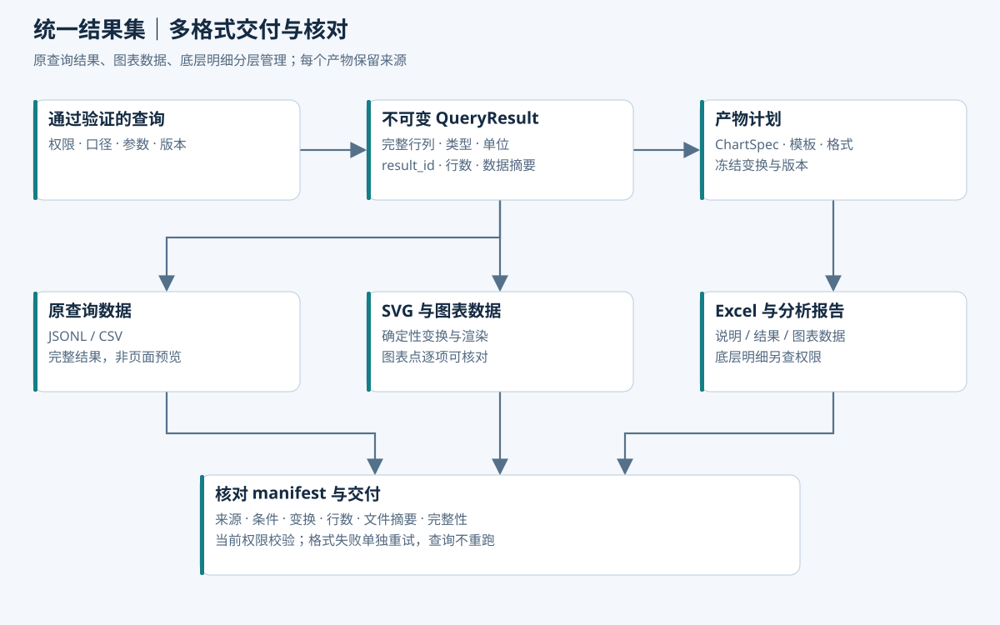

# 同一份查询结果，多种可核对的交付形式

> 本章是产物服务设计。示例 JSON 和目录是合成样例，不表示已经生成了实际预算报告。当前笔记配图用于解释架构，不是业务数据图表。

## 1. 用户真正需要什么

用户提出“生成对比图、导出 Excel，并给我原查询数据核对”。完成标准不仅是下载三个文件，还包括它们使用相同条件和数据版本，图表可以逐点核对，文件完整性与权限明确。

实际切入点是员工已经能在原系统查固定卡片与图表，但临时按部门、重量级团队或投资维度汇报，仍需重新找入口、学习条件、导出再整理。Agent 应把这次任务变成一个可复核的交付包：说清“用了哪个分摊口径、覆盖哪些项目、数据截至何时”，并提供适合汇报的材料，而不只是多一个下载按钮。

设计约束：模型决定表达方式，后端读取受控结果生成产物。不得为 SVG、Excel 和报告分别让模型重新生成 SQL。



## 2. “原数据”分成三个层次

| 层次 | 内容 | 默认交付策略 |
| --- | --- | --- |
| 原查询结果 | 通过验证查询返回的完整行列，包括该查询选定的分摊金额 | 有结果导出权限时提供，作为主要核对依据 |
| 图表数据 | 排序、Top N 或聚合后真正绘制的点 | 随图提供，并记录变换规则 |
| 底层业务明细 | 构成查询聚合的单据/记录 | 额外检查明细权限和来源可用性，按需提供 |

用户能看汇总不一定能看底层明细。不能以“核对”为理由自动扩大数据范围。也不能把模型重新组织过的摘要称为原查询数据。

例如用户查询 D_A 承担的 P01 费用，原查询金额是分摊后的 462,000 元，不必然是项目全额 770,000 元。“请附原数据”默认指**本次授权查询层的完整结果**；若要分摊前全额、精确比例、人员成本单据，需要分别检查相应权限和业务可用性。精确比例与分摊后金额组合能反推全额，因此它也不能默认随包披露。

普通用户查看业务条件、字段说明、单位和结果即可。完整 SQL、表名和内部执行计划属于技术审计信息，可单独授权提供；不默认打包数据库凭证或内部地址。

## 3. QueryResult 作为唯一数据来源

结果模型示例：

```json
{
  "resultId": "res-001",
  "queryId": "vq-001",
  "runId": "run-001",
  "releaseId": "rel-001",
  "metricVersion": "metric-v1",
  "allocationAxis": "DEPARTMENT",
  "allocationRuleVersion": "alloc-bundle-v1",
  "ruleBindings": {"budget": "budget-dept-v1", "actual": "actual-dept-v1"},
  "comparisonPolicy": "APPROVED_SAME_BASIS",
  "period": {"start": "2026-01-01", "endExclusive": "2026-07-01"},
  "grain": ["allocationTargetId"],
  "currency": "CNY",
  "scope": {"projects": ["P01", "P02"], "allocationTargets": ["D_A", "D_B"]},
  "denominatorScope": "SAME_AXIS_SAME_TARGET_SAME_PERIOD",
  "schema": [
    {"name": "allocationTargetId", "type": "string", "label": "承担部门"},
    {"name": "budget", "type": "decimal", "scale": 2, "unit": "CNY"},
    {"name": "actual", "type": "decimal", "scale": 2, "unit": "CNY"},
    {"name": "variance", "type": "decimal", "scale": 2, "unit": "CNY"},
    {"name": "executionRate", "type": "decimal", "unit": "ratio"}
  ],
  "totalRows": 2,
  "completeness": "COMPLETE_FOR_QUERY",
  "semanticLimit": null,
  "previewLimit": 100,
  "storageRef": "internal-result-object",
  "contentHash": "sha256:example-placeholder",
  "authorizationRef": "policy-scope-001"
}
```

本示例的主体可以查看两个项目所有部门分摊及相应项目汇总，包中未请求原项目金额；不能把“隐藏原金额列”描述为阻止其自行求和。严格的部分范围授权场景使用 D_A-only 主体。

contentHash 是示例占位，实际须由生成程序计算。storageRef 为内部标识，不能直接变成公开 URL。COMPLETE_FOR_QUERY 表示查询要求的结果完整，不保证所有来源系统已经同步完毕；来源完整性另外记录。

`denominatorScope` 在此描述执行率分母：同轴、同目标、同期间的分摊预算。若还输出“占本部门全部费用比例”，应为该指标单独记录分母 result/指标/范围，不能用一个通用字段混淆执行率与构成占比。分摊规则包关联预算、实际各自适用规则；输出小数位、舍入规则、数据质量 flags 也要固定。

结果一旦 READY 不覆盖更新。用户改条件生成新 result_id；对同一结果换图表颜色、排序或导出格式，创建新产物配置，不修改源数据。

## 4. 结果怎样产生和存储

小结果可保存为类型明确的 JSON。大结果由执行器流式读取写入分片文件或列式存储，并计算行数、统计和校验摘要。数据库游标和事务只覆盖该次结果提取，不跨模型等待。

过程：BUILDING → 校验分片、行数和摘要 → READY；失败进入 FAILED，不能把部分写入的文件作为完整结果交付。元数据发布与文件存储之间用临时路径和原子可见指针协调，孤儿临时文件按保留规则清理。

来源查询应绑定数据发布版本；若采用分页查询，应使用稳定排序和一致的数据集合，避免 OFFSET 在更新中漏行或重复。多步分析可以产生多个 result，报告 manifest 明确列出全部依赖。

同一分析既要总额又要明细时，可在同一发布版本提取不同结果；不能说两个 result 的字节相同，但可以验证其业务汇总关系。

合成示例：部门汇总 result 中 D_A 为预算 520,000、实际 560,000，D_B 为 680,000、700,000。D_A 项目下钻是另一个 result，包含 P01 的 420,000 / 462,000 和 P02 的 100,000 / 98,000，按同一规则聚合后应回到 520,000 / 560,000。项目总额和分摊后结果属于不同语义，不能仅因为 project_id 相同就相互替换。

## 5. 模型输出的是 ChartSpec，不是财务数字或任意 SVG

```json
{
  "resultId": "res-001",
  "chartType": "grouped_bar",
  "category": "allocationTargetId",
  "measures": ["budget", "actual"],
  "transform": {
    "sortBy": "actual",
    "direction": "DESC",
    "topN": 10
  },
  "presentation": {
    "title": "P01、P02 部门分摊预算与实际费用对比",
    "displayUnit": "CNY_10K",
    "showDataDate": true
  }
}
```

后端验证结果归属、字段存在、数值类型、图表支持范围、变换含义和参数上限。title 不允许误导性范围；可以由服务端根据实际组织和期间生成副标题。

不应只用另一个 LLM 判断标题是否正确。期间、项目范围、分摊轴、币种、数据时间等关键副标题由有效计划确定性生成；模型可以选择简洁主标题，但不能覆盖这些事实字段。卡片上的总预算、实际、差额、执行率来自注册指标，不能让模型自己算一个数填进去。

确定性变换从完整 result 生成 chart_data，保存 transform_version 和图表数据摘要。模型不能自行传一组“看起来合理”的预算金额替代 result 中的数据。

### 图表变换的几个陷阱

- Top N 必须明确是图表展示还是用户查询本身的限制。
- “其他”类别的金额可以按规则汇总；执行率必须从预算与实际重新计算，不能累加或平均现成百分比。
- 有负差异时不能随意使用只适合非负构成的图表。
- 金额单位转换后保留原值，标签四舍五入可能导致视觉加总差一分或一单位，应记录显示精度。
- 图表截取十个项目不能标题写“全部项目对比”，除非同时清楚标明只展示前十项。
- 三个独立分摊轴可以分别成图，但禁止将部门、团队、投资三组金额放在同一个可相加的总计中。
- 用户只获某部门分摊结果时，饼图比例要明确分母是本部门授权集合，不得借图形暗示全项目或全公司份额。

## 6. SVG 渲染与内容安全

使用固定渲染器和允许的 ChartSpec 生成 SVG，禁止模型直接上传任意可执行 SVG。文本需转义，限制外部资源、脚本、事件处理器、foreignObject 等非必要能力，不允许从图表字段中发起网络请求。

渲染 Worker 只获得 result/ChartSpec 的受控读取能力，不持有任意查询数据库或访问外网的权限。业务 Skill 的模板也应经过同样限制。

保存 SVG 的同时交付 chart_data.csv 或 Excel 中的“图表数据”页。配图可以补充 PNG/PDF 以兼容不同软件，但这些转换依然使用同一 SVG 或图表配置，不重新生成数据。

## 7. Excel 结构与精度

建议工作簿结构：

| Sheet | 内容 |
| --- | --- |
| 阅读说明 | 查询目标、实际范围、期间、分摊轴、数据/规则版本、口径、完整性与 result_id |
| 查询结果 | 原查询完整结果，字段顺序与类型保持可核对 |
| 图表数据 | 每张图实际使用的点及变换说明 |
| 分析结论 | 有引用的事实、业务说明、待核查项 |
| 口径与核对 | 各指标公式、单位、规则标识、核对状态；数值比例仅在有权时提供 |
| 核对明细 | 可选且独立授权的底层明细 |

核对页可以告诉员工“D_A 汇总来自两个项目，在指定部门规则版本下形成”，并提供获授权的项目分摊明细。没有原始全额权限时，不能把项目全额放到隐藏 Sheet 再隐藏列；文件内容本身必须不包含无权数据。

金额在后端使用精确十进制计算。Excel 数值精度有限，长项目编号等标识符写为文本；超过可靠数值精度的金额保留精确文本，并在规范数据文件中保留十进制字符串。不能仅靠单元格显示两位小数就认为底层数值精确。[Excel 限制与规格](https://support.microsoft.com/en-us/excel/excel-specifications-and-limits)

用户输入的名称和说明写为文本单元格，不作为公式。CSV 的转义引号不能防止所有电子表格公式解释问题；面向表格软件的 CSV 要有文本安全策略，同时提供保留原始语义的类型化 JSONL 作为核对源，记录任何字符处理，避免“防护后文件与原值不一致”却不说明。

预算执行率展示百分比时保存其比例含义。示例 1.05 对应 105%，不能再乘 100 后同时套百分比格式导致 10500%。

### 分摊精度与可核对性

需要冻结两种精度：业务计算精度与展示精度。先按已审核的舍入/尾差规则形成规范分摊结果，再渲染两位小数或万元单位；不能让 Excel、SVG 各自重算比例后四舍五入。

示例：1.00 元分给三个目标，独立显示 0.33 元会只得到 0.99 元。若业务规则规定需要到分守恒，就按已批准的尾差分配策略形成 0.33、0.33、0.34，并在核对元数据记录调整归属。尾差给谁是业务规则，不能由模型临时挑选。若业务允许高精度存储、展示有差异，则保留精确规范值并说明显示舍入差，不能自行改账。

只有完整目标集合才能核对“分摊后合计＝分摊前金额”。对只有 D_A 权限的用户，只核对本次授权结果内部的小计、合计及图表数据；全量守恒可由受信发布流程验证后返回有权限披露的状态，不把全额带给用户。预算缺失与零预算需要不同 flags；执行率未定义时显示“—＋原因”，不能导出成 0% 或无穷大。

### 超出单文件容量

Excel 单工作表最多 1,048,576 行，若占一行表头则数据行上限更少。大结果应分工作表或分文件，并提供 CSV/JSONL 压缩包作为完整查询数据。每个分片记录行范围、行数和摘要，不允许静默丢弃尾部数据。[Excel 规格](https://support.microsoft.com/en-us/excel/excel-specifications-and-limits)

## 8. 原查询数据核对包

```text
budget-analysis-package/
  README.txt
  report.xlsx
  charts/
    budget-vs-actual.svg
  query-data/
    result-001.jsonl
    result-001.csv
  chart-data/
    chart-001.csv
  manifest.json
```

这是包结构设计。原查询数据建议至少提供一种无损、类型明确的格式；CSV 便于人工打开，但单靠 CSV 难以准确表达空值、文本标识和十进制类型。

manifest 示例：

```json
{
  "packageId": "pkg-001",
  "resultIds": ["res-001"],
  "releaseId": "rel-001",
  "scopeLabel": "P01、P02 / D_A、D_B / 2026 年上半年",
  "allocationAxis": "DEPARTMENT",
  "allocationRuleVersion": "alloc-bundle-v1",
  "ruleBindings": {"budget": "budget-dept-v1", "actual": "actual-dept-v1"},
  "comparisonPolicy": "APPROVED_SAME_BASIS",
  "budgetBasis": "ADJUSTED",
  "actualBasis": "ACCRUED",
  "currency": "CNY",
  "roundingPolicyVersion": "PER_FACT_LARGEST_REMAINDER_V1",
  "completeness": "COMPLETE_FOR_QUERY",
  "rowCount": 2,
  "artifacts": [
    {"name": "report.xlsx", "status": "READY", "sourceResultId": "res-001"},
    {"name": "budget-vs-actual.svg", "status": "READY", "sourceResultId": "res-001"}
  ],
  "transforms": [{"chartId": "chart-001", "version": "v1", "topN": 10}],
  "detailAvailability": "NOT_REQUESTED",
  "rawProjectAmountAvailability": "NOT_REQUESTED",
  "numericAllocationRatioAvailability": "NOT_AUTHORIZED"
}
```

实际 manifest 还需文件摘要、大小、生成器/模板版本、时间及缺失项。哈希只能帮助验证内容完整性，不证明 SQL 的业务含义正确；语义校验在查询阶段完成。

规则 ID 仅是追溯标识，不必公开规则文件全部内容；它是否可以展示也服从元数据可见性。若用户有全额与比例核对权限，可追加已授权的“项目 × 期间 × 费用类型 × 目标”核对表，记录分摊前金额、适用比例、分摊后金额、尾差与规则来源。不能只有比例列却不说明预算/实际各用了哪套规则。

## 9. 自动核对规则

| 检查 | 如何做 | 失败处理 |
| --- | --- | --- |
| 查询数据完整 | 比较实际落盘行数、分片范围和读取状态 | 结果不进入 READY |
| Excel 完整 | 按数据页读取行数与规范值，不把说明页算数据 | 产物失败，保留源结果 |
| 图表数值一致 | 图表点与记录的变换结果逐项比较 | 重新生成图表，不重新查库 |
| 单位正确 | 比较原单位、显示单位和比例规则 | 拒绝有歧义配置 |
| 汇总与明细对应 | 同范围同版本，按指标规则聚合对账 | 区分舍入、缺失和真实差异 |
| 分摊轴与粒度一致 | 每组小计只在同轴/目标集合/期间内进行 | 拒绝跨轴总计和原始全额替换 |
| 分摊规则可追溯 | 核对预算、实际各自规则映射和舍入版本 | 不使用“最新比例”补齐缺失 |
| 执行率和占比分母正确 | 分别核对注册公式、分母范围及其授权 | 不平均执行率，不偷偷读全量分母 |
| 版本一致 | 对比 result、release、metric、allocation rule 与 template 版本 | 拒绝混合未声明版本 |
| 包内容有权限 | 对每个文件和依赖结果重新检查 | 不发布无权文件 |

规范数据哈希需定义列顺序、类型、NULL、十进制、字符编码和行顺序。无排序 SQL 不保证重跑字节顺序一致；本设计在物化时确定 row_ordinal，并让同一 result 的产物复用它。跨独立查询的等价比较应根据查询语义处理有序结果或多重集合，而不是只比较哈希。

## 10. 多格式任务如何幂等与部分失败

一个 artifact_job 绑定用户意图、result 集合、格式集合、ChartSpec 和模板版本。operation_id 标识一次提交；相同 ID 改格式或图表参数返回冲突，新意图使用新 ID。

由于 result 已冻结数据和分摊规则，导出 Worker 不再解析“当前部门比例”。这样用户点击重新下载时，不会因为规则改版得到内容不同但 ID 相同的文件。需要新规则就新建分析结果和产物，而非覆盖旧文件。

每种格式有子任务和独立状态：PENDING、RUNNING、READY、FAILED。Excel 成功而 SVG 失败时，整体为 PARTIAL，用户可先下载已授权的成功产物，也能只重试失败格式。不能整体标成功，或为了一个失败图表重新执行 SQL。

子任务失败重试复用同一源结果和冻结配置。Worker 产物先写 attempt 临时路径，当前有效 token 才能发布最终指针，继承前文导出幂等与 fencing 设计。

原先的 export_task 可以作为兼容接口映射到 artifact_job，不再新建一套并行且重复的导出事实。分析结束与全部产物完成分开显示。

## 11. 权限、保留期与权限变化

产物继承所有依赖结果的必要访问范围，并有独立拥有者和共享 ACL。生成、发布、下载时校验当前权限。权限撤销后已生成文件可以保留审计，但不能继续交付给无权用户。

用户只想拿有权部分时，重新查询或从明确支持的安全子集生成新 result，再渲染新文件；任意报告不能只删除某几行就假定所有总额和结论已净化。

运行中的产物任务引用 result，防止结果清理抢先发生。超过保留期的长任务应明确失败并提示重算，不能重新查询最新数据后沿用旧 manifest。

## 12. 故障场景与验证

| 注入场景 | 要验证什么 |
| --- | --- |
| 页面预览 100 行，完整结果超过 100 行 | 导出使用完整 result，数量不受预览限制 |
| 生成 Excel 期间发布新数据 | 原文件保持原 result 与 release |
| SVG 成功、Excel Worker 崩溃 | 可恢复单格式任务，不重新查数 |
| 图表显示 Top 10 | 图表数据与前十项对应，完整查询数据仍可核对 |
| 用户无明细权限 | 核对包不包含底层明细，说明其不可用 |
| 名称含公式开头字符或 XML 特殊字符 | 单元格和 SVG 文本不执行内容 |
| 高精度金额与长项目编号 | 精确源数据保留，Excel 无静默截断标识 |
| 来源结果到期 | 明确重算，不能伪造旧版本复现 |
| 分摊比例在 Excel 生成中途改版 | SVG、Excel、JSONL 都使用冻结的旧规则映射 |
| 部门和投资轴放在一个报告 | 可分图对比，但不存在跨轴相加的总计 |
| D_A 用户要求分摊前金额与比例核对 | 根据独立权限决定提供项，不把隐藏 Sheet 当隔离 |
| 1 元三目标分摊、有零预算和缺失预算 | 按规则处理尾差，未定义执行率不变成 0% |

### “图表对得上，领导手工核算对不上”如何排查

故障演练：用户看到 D_A 实际费用为 56 万元，但把表内“项目原始费用”加总得到 126 万元。

1. 先核对用户加总的是哪一层：原始项目金额，还是部门分摊金额。这里 126 万与 56 万本来就属于不同语义，不能先认定图表算错。
2. 检查文件标题、列名、口径页是否让两个金额看起来都是“实际费用”。若是，修复字段标签为“项目全额实际”“本部门分摊实际”，明确各自可加范围；无全额权限则根本不应输出前者。
3. 如果确为同一层不一致，比较 result 的规范值、chart_data、Excel 单元格和舍入版本。规范值对但 Excel 错，修复渲染器或百分比/单位转换；规范值已错，回到查询和分摊计算层。
4. 使用已冻结 result 重生成失败产物，不重查最新数据。回读 Excel 和图表数据逐项断言，而不是仅看视觉上“差不多”。

最终报告可附“D_A 预算 52 万元、实际 56 万元、差额 4 万元”的证据引用。没有费用原因材料时只能说明差异及贡献项目，不能自动断言“人员效率下降导致超支”。将数值事实、可能解释和待业务核实项区分开，才是可用于汇报的材料。

## 13. 面试表达与实施范围

面试主线：“我把一次分摊分析固化成独立 result，绑定项目、期间、分摊轴、预算/实际规则和权限。图表、Excel 和原查询数据共用这个结果，比例和小计能追溯，某一格式失败只重试渲染。用户要求原数据时，我提供授权查询层的完整数据，不默认扩大到项目全额和人员明细。”

先实现一个分组柱状图、一个 Excel 模板、JSONL/CSV 查询数据和 manifest；通过后再扩展其他图形和 PDF。不要一开始构建任意代码生成报表平台。

这些产物功能尚待实现；验证应包含实际读取导出文件回查数据，不能只看截图。阅读路径：[返回指南](00-阅读指南与准备路线.md)。
