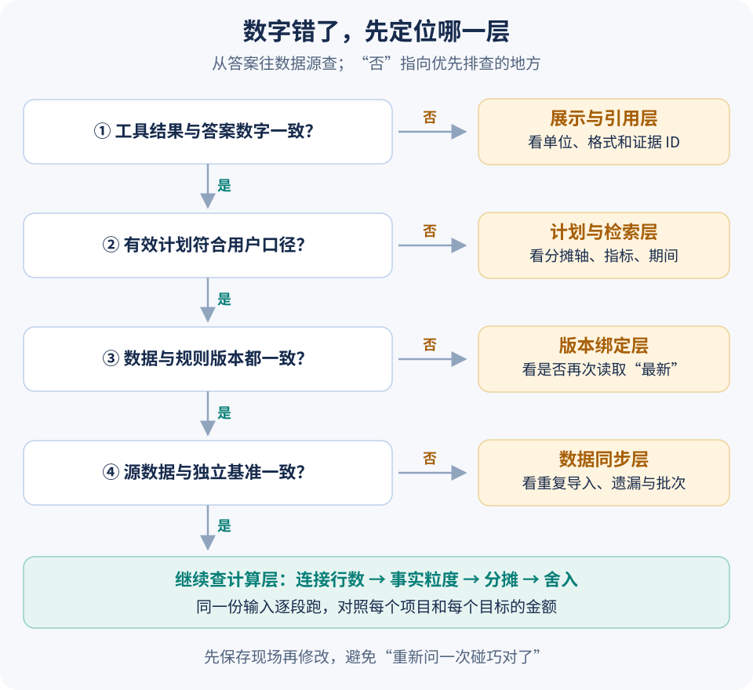

# 数字不对、口径串了、任务重复：怎么一步步查

面试里说“考虑了稳定性”很容易。更有说服力的是拿出一个具体故障：输入是什么，错误结果怎样出现，哪一处约束挡住了它，改完又怎么验证。

本章对应可以下载运行的 Java 工程。金额是合成数据，框架与数据库调用是真实执行；不把这组实验写成生产事故，也不据此编造业务收益。



## 先把工程跑起来

[下载完整源码 ZIP](code/langgraph4j-demo.zip) · [运行说明](code/langgraph4j-demo/README.txt) · [实际验证记录](code/verification.txt)

解压后进入 `langgraph4j-demo`，准备 JDK 21 和 Maven，再执行：

```bash
mvn -B -ntp test
```

依赖在 [pom.xml](code/langgraph4j-demo/pom.xml) 中固定：LangGraph4j 1.8.27、H2 2.3.232、JUnit 5.13.4。2026-09-10 在 JDK 21.0.9、Maven 3.9.16 环境实际通过 32 项检查，失败与错误均为 0。

| 测试类 | 数量 | 验证内容 |
| --- | ---: | --- |
| [BudgetMathTest](code/langgraph4j-demo/src/test/java/dev/learning/BudgetMathTest.java) | 12 | 分摊、规则、尾差、冲销、发布不变性 |
| [BusinessInvariantsTest](code/langgraph4j-demo/src/test/java/dev/learning/BusinessInvariantsTest.java) | 11 | 连接放大、比率、固定版本、并发导出、旧 Worker |
| [BudgetGraphTest](code/langgraph4j-demo/src/test/java/dev/learning/BudgetGraphTest.java) | 9 | 暂停恢复、响应丢失、等待版本、证据合并、动作限制 |

测试中的故意异常可能由框架打印 ERROR 日志。判断是否通过，应看 Surefire 的测试结果；不应把预期异常删掉，只为了让日志看起来干净。

## 70 万预算为什么变成 140 万

H2 中放一行 70 万预算，两行实际费用 30 万、47 万。按项目直接连接，预算出现在两行里，`SUM` 得到 140 万；算出来的执行率是 55%，而正确结果是 110%。

测试先复现错误连接，再分别聚合预算与实际，检查修复后仍是 70 万和 77 万。它验证的是业务结果，不是只看 SQL 能不能执行。`SUM(DISTINCT budget)` 不作为修复，因为两个项目可能恰好有相同预算。

再看部门汇总。P01、P02 分到 D_A 后，应得到预算 52 万、实际 56 万。执行率要用汇总金额相除，不能对每个项目的百分比取平均。零预算返回未定义状态，不能伪造一个 0% 让报表继续画。

## 一分钱也要能解释去向

[BudgetMath.java](code/langgraph4j-demo/src/main/java/dev/learning/BudgetMath.java) 用整数分保存金额，用 BigDecimal 表达比例。最大余数法先分整数分，剩下的分按余数排序发给目标，余数相同时按目标 ID 排序。

0.01 元按一半一半分，结果只能是某一方 0.01、另一方 0。测试调换输入顺序，仍要求同一目标拿到尾差；再用相同规则处理 -0.01 元，逐目标抵消。这样同时检查守恒、顺序稳定与负数方向。

另一个检查比较“逐笔分摊后合计”和“先合计再分摊”。两条各 0.01 元的记录可能与一条 0.02 元产生不同尾差去向，所以必须先确定业务政策。正式冲销应引用原分摊明细，而不是拿最新规则重算一遍。

## 口径变了，旧结果不能继续参与解释

一次任务先用计划版本 1 得到汇总，随后用户要求换预算口径。新的有效计划要有新版本，当前结果集合清空，旧证据保留在历史档案中供追溯。

图测试直接验证两种状态策略：档案按 ID 合并，同 ID 换内容报冲突；当前集合允许覆盖和清空。还检查结果引用是否与当前计划版本、计划 ID 和数据发布版本一致。

如果遇到“前半段按年初预算，后半段按调整后预算”的输出，先查这几个字段和实际使用的结果 ID，再看提示词。只让模型“仔细检查口径”，无法修复已经混在一起的状态。

## 导出成功了，但调用方没有收到返回

[ExportStore.java](code/langgraph4j-demo/src/main/java/dev/learning/ExportStore.java) 使用 H2 文件库。创建任务时，`(actor, operation_id)` 有唯一约束，并记录规范化参数摘要。

同意图同参数重试，返回同一个任务；同意图换参数，明确冲突；用户后来提出新的导出要求，用新编号创建新任务。并发测试用四个线程提交十二次相同请求，最终只保留一个逻辑任务。

这不依赖“先查再插”的时间差。插入竞争由数据库唯一约束裁决，冲突后再读原记录并核对摘要。本例使用自动提交连接处理 H2 唯一冲突；迁移到 PostgreSQL 时，要重新设计事务内冲突的处理方式，不能在已经失败的事务里继续查询。

## 用三个 JVM 验证图恢复

下面三条命令分别启动独立的 JVM。`/tmp/budget-agent-demo-01` 应是新的实验目录；重复整轮实验时换一个目录，不要覆盖旧证据。

```bash
mvn -B -ntp exec:java '-Dexec.args=start /tmp/budget-agent-demo-01'
mvn -B -ntp exec:java '-Dexec.args=answer /tmp/budget-agent-demo-01'
mvn -B -ntp exec:java '-Dexec.args=resume /tmp/budget-agent-demo-01'
```

| 命令 | 实际观察到的下一节点 | 导出任务数 | 发生了什么 |
| --- | --- | ---: | --- |
| `start` | `await_basis` | 0 | 缺预算口径，检查点保存等待状态 |
| `answer` | `submit_export` | 1 | 回答“调整后”，提交成功后注入响应丢失 |
| `resume` | `__END__` | 1 | 新进程读取检查点，重试返回原任务 |

恢复后的金额仍为预算 52 万、实际 56 万，差额 4 万；P01、P02 的差异分别是 4.2 万和 -0.2 万。这轮不是在同一内存对象里调用两次，而是重新加载图与文件状态。

第二步会打印预期异常，命令捕获指定故障后正常退出。实验验证的是提交后异常与干净进程重启，没有模拟检查点写到一半时突然断电。FileSystemSaver 本身的写入方式也不足以支持这种保证。

## 旧 Worker 为什么不能抢着发布结果

任务被新 Worker 接手后，旧 Worker 可能仍在后台计算。测试通过递增的执行代次模拟这种竞争：发布 SQL 同时匹配任务 ID、运行状态与当前 token。旧 token 更新零行，新 token 才能发布。

这证明的是发布条件检查，尚未实现完整分布式租约服务。生产系统还要处理租约续期、任务领取、检查点并发写，以及未被采用文件的清理。文件可能被计算两次，但用户可见指针只能采用当前执行者的结果。

## 这组实验没有证明什么

当前决策器是固定替身，未测真实模型的理解准确率。权限测试检查任务归属、等待版本和模拟授权状态，未连接真实身份系统或 PostgreSQL RLS。导出仅创建任务，没有生成 Excel、SVG 或下载地址。并发恢复命令的持久去重、共享检查点的多实例访问，也还未实现。

因此示例结束时明确标记 `completion_scope=query_and_export_task_accepted`。面试时可以说“已跑通 Java 图的等待、恢复和业务去重”，不能说“完整生产报表链路已上线”。下一步验证顺序见第 09 篇。

[← 图表与核对](07-图表、Excel%20和查询数据，怎样做到对得上.md) · [面试与计划 →](09-面试怎么讲，接下来八周怎么做.md)
