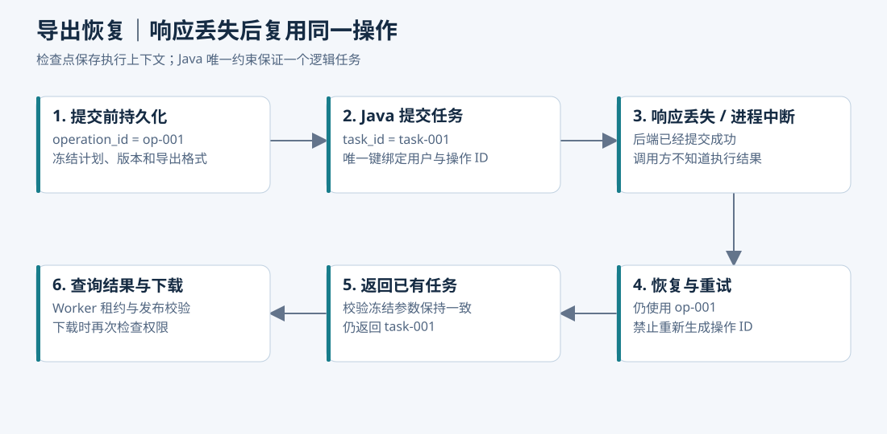

# 分摊口径、故障排查与验证实验

> 本章是可落地的设计与合成实验，不是公司生产事故复盘。2026-09-09 新增的 Python Decimal/SQLite 分摊实验实际运行 12 项通过；原有 11 项数据与幂等实验的执行记录也保留。尚未验证 Java/PostgreSQL 集成、真实模型、LangGraph 恢复或生产性能。面试时区分“设计了”“用最小实验验证了”和“实际上线过”。

## 1. 面试如何选难点：先说业务损失，再说技术机制

这个项目的难点不是“模型能够调用几个接口”，而是员工说一句“按部门整理这些项目的执行情况”，系统必须选对分摊口径、生成可信结果，并在长流程和重试中保持一致。

建议主讲前两个案例，再按岗位侧重点补充幂等或上下文案例。每个案例采用同一条叙述链：**场景 → 症状 → 证据与排除 → 根因 → 措施 → 验证 → 代价**。不要一开始就背“加缓存、加重试、调提示词”。

| 主案例 | 面试官实际在考什么 | 当前证据等级 |
| --- | --- | --- |
| 多分摊轴连接导致重复计数 | 能否识别事实粒度，区分 SQL 可执行与业务正确 | 已运行 SQLite 反例与修正 |
| 数据没变，规则改变导致对比失真 | 是否知道结果依赖业务规则版本，能否设计可追溯计划 | 已运行规则不可变、显式比较政策实验；集成待做 |
| 分币、冲销与明细对账 | 是否认真处理金额精度和核算粒度 | 已运行 Decimal 合成实验 |
| 问对了 SQL，还是答错了业务问题 | 能否定位计划、计算、生成的不同错误层 | 部分数值反例已运行；模型评测待做 |
| 多轮改口径后旧证据混入 | Agent 状态、证据有效性与恢复边界 | 设计与待执行集成方案 |
| 导出已提交，响应丢失后重复执行 | 外部副作用、幂等、恢复与 Worker 发布控制 | 原 SQLite 局部不变量已运行；网络/框架故障待做 |

## 2. 公共合成数据与设计假设

真实业务已确认：系统服务多项目预算核算与汇报，费用包括项目支出、人力费用等；同一项目可以按部门、重量级团队、投资等维度查看分摊结果。以下数字、规则与期间是为了实验构造的，不来自公司数据。

| 项目 | 预算/元 | 实际费用/元 | 部门 D_A 比例 | 部门 D_B 比例 |
| --- | ---: | ---: | ---: | ---: |
| P01 | 700,000 | 770,000 | 60% | 40% |
| P02 | 500,000 | 490,000 | 20% | 80% |
| 合计 | 1,200,000 | 1,260,000 | 不对比例跨项目求和 | 不对比例跨项目求和 |

该实验中，预算规则 `budget-dept-v1` 和实际规则 `actual-dept-v1` **分别绑定、分别审核**，只是数值恰好相同；不能从这个例子推断真实系统预算与实际必须使用同一比例。

人工基准值：

```text
D_A 预算 = 700000 × 0.6 + 500000 × 0.2 = 520000 元
D_A 实际 = 770000 × 0.6 + 490000 × 0.2 = 560000 元
D_A 差异 = 560000 - 520000 = +40000 元
D_B 预算 = 680000 元，实际 = 700000 元，差异 = +20000 元
部门全量合计：预算 1200000 元，实际 1260000 元，差异 +60000 元
```

本章选择以下工程假设，落地前应让业务负责人确认：

- 部门、重量级团队、投资是**独立观察轴**，每个轴各自解释同一笔费用；不同轴的结果不能直接相加。
- 当前实验要求每个项目在单个轴上完整分摊，比例合计必须为 100%。若业务允许未分摊余额，应建立显式余额目标和状态，不能把缺失记录当成零或自动归一化。
- 演示先把项目支出和人力费用归集为项目费用总额。真实规则若按期间、费用类别、人员归属或核算批次区分，规则键和分摊粒度必须增加这些字段，不能把项目级样例直接作为生产表设计。
- 分摊金额按已确认的最小粒度计算后汇总。实验使用“项目 × 指标”的分币规则，每项视为一条合成来源事实；真实业务的逐事实粒度见分摊语义章，不代表生产中应先汇总整个项目再舍入。
- 原始项目数据、分摊规则、组织映射、指标定义、比较政策、舍入政策，共同参与本次有效分析计划。

## 3. 难点一：总费用翻倍，但每条 SQL 都能成功执行

### 场景与症状

员工要求“按部门整理 P01、P02 的实际费用”。查询同时连接部门分摊表和投资方分摊表，每个项目分别有两条部门、两条投资规则。

页面显示 D_A 实际费用 112 万元、D_B 140 万元，合计 252 万元；项目原始费用只有 126 万元。SQL 没有语法报错，模型还可能根据这个错误结果写出一份完整报告。

### 排查证据与排除顺序

1. **先冻结输入。** 保存 project_ids、period、axis、数据发布版本及规则版本；避免排查期间“查最新”掩盖问题。
2. **比较原始结果与回答。** 如果工具已经返回 112 万，问题不在模型抄写，也不在 SVG 单位转换。
3. **核对项目基准。** 独立按项目聚合得到 77 万、49 万，排除重复导入、源数据翻倍。
4. **逐段看连接基数。** P01 聚合后 1 行，连部门后 2 行，再连投资方后 4 行；部门 D_A 的同一份费用被每个投资方重复引用。
5. **用单轴查询对照。** 移除不需要的投资方连接后，D_A 恢复 56 万。保留两种 SQL 和每阶段行数，这是能证伪根因的证据。

错误模式如下，示意省略了版本、期间和权限条件；不能直接用于生产：

```sql
SELECT d.target_id, SUM(f.amount * d.ratio)
FROM project_actual f
JOIN allocation d ON d.project_id = f.project_id AND d.axis = 'DEPARTMENT'
JOIN allocation i ON i.project_id = f.project_id AND i.axis = 'INVESTOR'
GROUP BY d.target_id;
```

### 根因

原始费用事实、部门分摊结果和投资分摊结果具有不同粒度。查询把两套一对多规则同时接到同一份费用上，产生连接倍增。`SELECT DISTINCT` 或 `SUM(DISTINCT amount)` 不能通用修复；后者还可能把不同项目恰好相同的合法金额去掉。

更隐蔽的错误是改成 `费用 × 部门比例 × 投资比例`。总额看似守恒，却在没有业务依据时假定两个轴独立，**编造了“部门 × 投资方”联合分摊结果**。

例如，部门比例为 60%/40%、投资方为 50%/50%，下面两套联合分配都满足相同的边际比例：

| 联合方案 | D_A / I_A | D_A / I_B | D_B / I_A | D_B / I_B |
| --- | ---: | ---: | ---: | ---: |
| 合法数学可能一 | 50% | 10% | 0% | 40% |
| 合法数学可能二 | 10% | 50% | 40% | 0% |

两套数字只是证明联合结果不唯一，不能当成业务批准方案。单凭 60% 和 50% 无法确定 D_A/I_A 就是 30%。

### 解决措施

- 计划中 `allocation_axis` 必选，查询只加载当前轴的规则。标准分摊由 Java 确定性业务能力完成；Text-to-SQL 读取经过治理的分摊结果或受限视图。
- 在规则定义的粒度聚合费用，再与唯一、已审核、指定版本的当前轴规则连接。唯一键至少覆盖版本、适用粒度、目标；实际以业务规则为准。
- 如果用户要求同时展示部门和投资情况，输出两个独立视图，明确各自总额，不增加“跨轴总计”。
- 用户要求联合钻取时，检查是否存在经审核的联合规则或底层真实联合归属；不存在则说明不支持这个交叉口径。提示词不能替代缺失的业务事实。
- 验证当前轴的全量守恒、项目级守恒和分摊明细唯一性；仅检查全局总额无法发现错误分到别的部门。

### 验证与代价

新脚本检查 01～04 实际验证：D_A 预算/实际为 52 万/56 万；每个独立轴实际合计均为 126 万；跨三轴相加错误得到 378 万；错误 SQL 得到 D_A 112 万，单轴修正为 56 万；相同边际比例可对应不同联合分配。

代价是限制了模型“任意拼表”的自由，需要维护事实粒度、合法连接路径与工具边界。收益是计算过程可以逐项解释，错误不再依赖模型自觉发现。

**面试讲述示范：**“我先确认工具结果已经翻倍，再逐段观察连接行数，发现同一项目的部门和投资规则形成了多对多展开。修复不是让模型加 DISTINCT，而是在有效计划中确定分摊轴，按规则粒度调用单轴计算能力，并增加守恒与目标金额断言。还专门验证了仅有两个边际比例不能推出联合分摊。”

## 4. 难点二：源数据没有变化，部门差异却从超支变成结余

### 场景与症状

员工先查询部门 D_A，结果预算 52 万、实际 56 万、差异 +4 万。生成图表期间，有人发布新的实际费用分摊规则：P01 的 D_A 比例从 60% 调整为 50%，P02 保持 20%。如果图表工具又取“最新规则”，实际变为：

```text
770000 × 0.5 + 490000 × 0.2 = 483000 元
若仍与旧预算 520000 元比较，差异为 -37000 元。
```

项目总费用仍是 126 万，部门归属却改变了。只锁原始数据版本，仍然无法保证一次汇报的内部一致性。

### 排查证据与排除顺序

1. 比较同一查询的项目、期间、数据发布版本、金额单位，确认费用数据本身未变。
2. 对比汇总、图表、文件的 `result_id`；如果它们各自重查，先定位重复计算入口。
3. 对照 `budget_rule_id`、`actual_rule_id`、规则内容摘要、组织映射和比较政策。不要只看两个版本 ID 是否都叫“v1”。
4. 用旧规则重放得到 56 万、用新规则得到 48.3 万，说明差异来自分摊变更，不能让模型解释成“项目节省了 7.7 万费用”。
5. 若某项目规则缺失，检查是否被内连接静默丢弃、补了默认比例或归一化；这些路径可能让总数看起来正常但含义已变。

可保存如下合成 trace：

```text
summary: release=r1, budget_rule=budget-dept-v1, actual_rule=actual-dept-v1
         department=D_A, budget=520000, actual=560000
chart:   release=r1, budget_rule=budget-dept-v1, actual_rule=actual-dept-v2
         department=D_A, budget=520000, actual=483000
finding: same source release; different actual allocation rule
```

### 根因

系统把“数据版本”等同于“结果版本”，遗漏了会改变计算含义的规则。另一个常见设计错误是预算、实际共用一个 `allocation_version` 字段，无法表达“预算用已批准的预算分摊，实际用另一套已批准的费用分摊”。

预算和实际规则不同不必一律禁止，但**必须存在明确的比较政策**：哪些规则对可以比较，是否按原记账口径还是重述口径展示，标签如何解释。不能由模型、最近发布时间或相同字段名决定。

### 解决措施

建立由服务端解析、验证并冻结的有效计划：

```json
{
  "data_release_id": "rel-demo-001",
  "allocation_axis": "DEPARTMENT",
  "budget_rule_id": "budget-dept-v1",
  "actual_rule_id": "actual-dept-v1",
  "comparison_policy_id": "approved-pair-v1",
  "metric_version": "adjusted-budget-recorded-cost-v1",
  "mapping_version": "org-map-v1",
  "rounding_policy_id": "project-measure-cents-lrm-v1",
  "project_ids": ["P01", "P02"],
  "period": "2026-Q2",
  "scope_ref": "server-resolved-scope",
  "plan_revision": 1
}
```

这里的字段值均为演示标识。服务端还应记录实际解析到的规则摘要、适用期间、缺失检查和规则来源，不能信任模型自行填入的版本或 `scope_ref`。

执行前按完整规则集检查：审核状态、适用期间、目标重复、比例非法、比例合计、规则是否缺失。总比例不足或超额均返回结构化错误，不自动归一化；若确有余额业务，显式返回“未分摊”目标及比例。对结果做权限裁剪后，用户只能看到部分份额时，不再强行要求用户可见总额等于整个项目金额，更不能将可见比例归一化至 100%。

规则发布采用不可变版本，同一个规则 ID 不能覆盖内容。旧 run 继续使用旧有效计划；新会话按最新已生效规则解析。若旧版本到期或被紧急禁用，明确失败或重新发起计划，不能静默切换。

缓存、`result_id` 的关联清单与产物身份包含规范化查询、数据与规则版本、指标/组织映射/舍入政策以及授权范围指纹。缓存命中后仍按当前权限决定是否允许读取，哈希并不具备授权能力。SVG 和 Excel 消费同一个不可变结果，避免各渲染器独立查询。

### 验证与代价

新脚本检查 05、09～12 已验证：缺失/未审核/非法规则拒绝；不同预算实际规则没有明确配对政策时拒绝；显式批准的配对可计算；旧规则发布后不被新规则覆盖；有效计划关键字段改变会改变摘要；过滤到 D_A 不会把它的 60% 擅自放大为 100%。

该实验中的身份检查仅验证“键的输入约定”，不证明生产缓存隔离或权限实现正确。后续还要集成测试规则紧急禁用、跨期间、动态授权、并发发布和过期清理。

代价是维护版本、保留回放所需的数据与规则，不能让所有页面永远自动跟随最新规则。预算核算需要解释历史结果，这个成本有明确业务价值。

## 5. 难点三：总额正确，但明细相差一分钱，冲销后还有余额

### 场景与症状

一笔 0.01 元费用按 A/B 各 50% 分摊。如果两个目标各自四舍五入，可能得到 0.01 + 0.01 = 0.02 元。另一种实现汇总图表时先合计再分摊、明细导出时逐项目分摊，也会出现图表与 Excel 的目标金额对不上。

更难发现的是负数冲销：正向费用与反向费用使用不同的取整方式或不同规则版本，项目合计归零，但个别部门仍留一分钱尾差。

### 排查证据与根因

记录原金额、金额单位、原比例、未舍入值、分币结果、尾差归属和舍入政策版本。依次排除前端万元展示、Excel 单元格格式、二进制浮点精度，再检查“在哪个粒度舍入”和“负数是否与原记账分配对称”。

常见根因是把 `double` 计算结果当最终金额，或每一行独立舍入后不处理总差；另一个根因是汇总和明细使用不同计算路径。只有总额相同，不能证明每个目标正确。

### 解决措施

- 计算使用整数最小货币单位或明确精度的 `BigDecimal`，比例由十进制字符串解析。模型不负责计算金额。
- 本实验选择最大余数法：对金额绝对值按比例计算，先向下取整到分，将剩余分按小数余数从大到小分配；相同余数按稳定目标 ID 排序；最后恢复金额符号。
- 同一金额的完全冲销优先引用原分摊明细及原规则，逐目标反向冲回。本实验只证明“相同规则下金额正负对称”，不能替代真实的部分冲销、汇率和税额规则。
- 统一分摊粒度和舍入政策。汇总、图表直接加总已经确定的分摊明细；不能再从总额重新分摊一次。
- 给尾差保留可审计字段；目标排序和组织 ID 变化也不能悄悄改变历史结果。

### 验证与代价

新脚本检查 06～08 运行了 1 分、奇数分、大额、负数与输入顺序变化。两笔各 1 分费用分别分摊后，A/B 得到 2 分/0 分；先合并为 2 分再分摊得到 1 分/1 分。两者总额都正确，说明必须由业务政策固定舍入粒度。

代价是尾差分配规则需要业务确认，长期固定目标优先可能产生微小偏置。不能把技术上可守恒的算法包装成唯一财务标准。多币种、汇率、税额、分次冲销需要单独建模，本实验未覆盖。

## 6. 难点四：查询没有报错，却回答了另一个业务问题

### 场景与症状

员工说“看这些项目部门维度的预算执行情况”，模型选了投资维度，或用付款额代替实际费用，或者不知道按哪个分摊口径而静默选择。此时金额可能自洽，但不能用于本次汇报。

这类错误不能只靠数据库成功率衡量。还要区分“选错指标”“SQL 粒度错误”“答案抄错数字”。

### 排查方法

为每个案例保存：原问题 → 候选业务说明 → 模型提出的计划 → 服务端有效计划 → 工具结果 → 引用证据 → 最终答案 → 人工基准。

| 观察 | 优先检查 | 能排除或证伪什么 |
| --- | --- | --- |
| 工具结果正确，答案数字错 | 单位、格式化、生成引用 | 不是重新设计数据库就能修复 |
| 工具参数选错分摊轴或指标 | 意图解析、说明检索、上下文继承 | 正确计划直接调用工具应得到正确结果 |
| 参数正确，结果错误 | 数据/规则版本、粒度、SQL、舍入 | 不能直接归因于提示词 |
| 同一句话时对时错 | 模型上下文、工具描述、候选冲突 | 固定输入多次运行，对比计划分布 |
| 多轮修改后才错 | 计划版本与证据失效 | 见下一案例，不一定是知识库召回不足 |

### 措施、验证与代价

Skill 说明“部门汇报通常如何组织步骤、解释哪些指标”，指标目录和业务服务定义权威公式，结构化计划声明轴、期间、项目、预算/实际口径。服务端进行规则校验；缺失会改变金额或权限的关键条件时澄清，普通展示偏好使用明确默认值。

设计 30 条小评测：10 条明确表达、10 条同义/系统别名、10 条缺失条件。比较基础工具说明、增加业务说明、增加有效计划校验三个版本；明确问题比较规范化计划与基准金额，歧义问题比较是否正确追问。保留没用于改提示的表达。

这些 30 条模型测试**尚未执行**，不能写“准确率提升到 95%”。如果模型没有自然产生预设错误，可以注入错误计划验证校验器，但要标为注入测试。追问增加交互轮次，应同时测必要追问召回率和无谓追问率。

## 7. 难点五：员工改了口径，Agent 仍引用旧数据

### 场景与症状

第一次按部门汇报，随后用户说“再改成重量级团队维度”。新工具已返回团队结果，但模型继续引用部门 D_A 的超支 4 万，或把旧部门图表放进新的团队报告。

也可能没有改变分摊轴，只修改项目范围、预算版本或实际费用定义，产生同类问题。

### 排查证据与根因

先确认当前有效计划已变更，再按 `evidence_id` 追溯最终数字。若证据属于 `plan_revision=1 / axis=DEPARTMENT`，当前已经是 `revision=2 / axis=TEAM`，说明旧证据仍在生成上下文中被当成有效内容。

这是会话记录与有效证据没有分离：历史消息应可追溯，但不等于可以被本轮继续引用。只扩大上下文或添加“请注意最新问题”不能可靠解决。

### 解决措施

- 每条证据绑定 `run_id`、`plan_revision`、`result_id` 和有效计划摘要。数据库中保留历史，生成节点只拿当前有效证据集合。
- 服务端按字段依赖关系处理计划变更：换轴使所有分摊结果和图表失效；换展示颜色只重新渲染；改授权范围必须重新检查可访问性。
- 对每次结论引用校验有效计划与来源，不允许把部门数据解释为团队数据。单位转换由确定性代码完成。
- 尚未提交的导出意图若条件改变，生成新意图；已经提交的任务继续对应原冻结条件，页面显示旧口径。不能修改原任务参数以“追随对话”。

### 验证与代价

待执行 Agent 集成测试覆盖“部门→团队”“P01/P02→仅 P01”“旧规则→新规则”“本部门→全公司”。最后一种检查权限重新解析。每次验证计划、证据、图表与文件参数一致，不能只检查最终文本里有“团队”两个字。

代价是证据失效可能触发重查，需要明确可复用的依赖关系。不要一开始设计复杂的通用依赖系统；首版可以用明确的字段变更表。

## 8. 难点六：导出已创建，Agent 超时重试后出现重复任务



### 场景与症状

员工要求生成 Excel 与 SVG。Java 已提交导出任务，但响应丢失，或 Agent 在收到响应后、写 checkpoint 前崩溃。恢复时再次调用工具，出现两条任务，甚至两个 Worker 同时覆盖文件。

### 排查证据与排除顺序

1. 用 run_id、operation_id 和请求日志确认第一次请求是否到达 Java。
2. 查任务记录和数据库提交事实，区别“服务未受理”与“已提交但调用方未知”。
3. 比较重试身份与规范化参数摘要：重新生成 UUID 会把重试伪装成新操作。
4. 区分任务创建重复与 Worker 执行重复。唯一键解决前者，认领/租约/发布 token 解决后者。

### 根因与措施

Agent 检查点和 Java 业务数据库不存在共同事务；框架恢复可能重放节点，并不知道外部副作用已经提交。因此提交前先持久化操作意图，冻结 `result_id`、格式、有效计划摘要和 `operation_id`，重放时复用。

Java 对“用户范围内的 operation_id”设置唯一约束：同身份同规范化参数返回已有 task_id；同身份不同参数返回冲突。用户之后重新要求相同条件导出，可以生成新的操作身份，不能仅用参数哈希永久去重。

Worker 发布产物时检查递增 fencing token。旧 Worker 可以已经消耗过 CPU，但不得发布覆盖当前产物；稳定对象键、临时产物和垃圾清理需配套设计。业务幂等不是“物理执行永远只有一次”。

```text
T0 prepare_export：创建 op-001，冻结 result-001 / xlsx / svg
T1 独立持久化边界完成，重启后可读取该意图
T2 submit_export：向 Java 提交 op-001
T3 Java 提交 task-001
T4 注入响应丢失或 Agent 终止
T5 恢复相同任务，重放时仍发送 op-001
T6 Java 返回已有 task-001；Agent 保存后查询状态
```

T1 之前崩溃且没有发出副作用时，可以重建意图；必须通过实际持久化模式与故障注入确认 T2 不会越过持久化边界。仅依赖图节点名称，并不能证明执行顺序。

### 验证与代价

| 故障注入位置 | 必须检查的事实 |
| --- | --- |
| 发送前退出 | 恢复后可创建任务，不丢失合法请求 |
| 数据库提交后响应丢失 | 重试返回相同任务 ID，逻辑任务数为 1 |
| 同 operation_id 并发提交 | 唯一记录与参数一致 |
| 相同 ID 修改 result_id/格式 | 冲突，不能复用错误文件 |
| 旧 Worker 在租约失效后继续 | 旧 token 发布失败 |
| 用户新建相同条件的导出 | 新意图允许生成新任务 |
| 下载前权限被撤销 | 下载失败，不能只依赖创建时授权 |

原实验检查 05～11 验证了 SQLite 唯一任务、冲突、并发重复、用户命名空间和过期 token；未模拟真实 HTTP、LangGraph、对象存储和权限撤销。Redis 锁或拉长 HTTP 超时不能替代这些边界。代价是任务记录、去重窗口、租约和孤立产物清理都需管理。

## 9. 共性优化：数据时点、延迟和上下文体积

### 原始数据也必须冻结

规则冻结不能替代数据快照。原有合成实验先查项目总实际 126 万，再把 P02 实际从 49 万变为 52 万；若后续明细查最新，会合计 129 万。

排查时先排除连接倍增、期间/项目/单位差异，再对照数据发布版本。分析计划绑定不可变 `report_release`，发布清单解析到各来源批次、定义、映射和规则；发布完成前不开放查询。原 run 保持旧结果，新 run 才使用新版本。过期不可用时明确失败，不能静默读取最新。

不要跨模型等待持有长数据库事务，也不要用“更新时间小于某时刻”冒充可重建快照：被原地覆盖的历史记录无法由时间过滤找回。代价是保留历史版本和一定发布延迟，不能宣称各异步来源因此获得同一实时状态。

### 性能先定位瓶颈，再选择措施

记录受理延迟、排队时间、模型轮数、工具时间、数据库扫描/返回行数、序列化、生成完成与文件完成时间。并行 span 的总和不是端到端耗时。SQL 慢查计划和粒度，SQL 快但工具慢查序列化，工具快查模型上下文和轮数。

可按证据选择：

- 同轴、同版本的预算和实际尽量由一次可信计算返回；独立且无依赖的查询才并行。
- 先在服务端聚合，模型接收主要差异项、统计摘要和按需明细入口；不把全部分摊明细塞入上下文。
- 渲染器消费同一个结果；生成 SVG/Excel 不再次调用模型计算金额或重新查询。
- 缓存后置，键包含有效计划与授权范围；权限改变仍需重新校验。
- 模型并发、查询并发和导出并发分别限额，队列有上界。加线程不能增加数据库和模型配额。

| 对照版本 | 成功/总案例 | 数值错误数 | P50/P95 | 每任务 Token | 查询扫描量 | 环境 |
| --- | --- | --- | --- | --- | --- | --- |
| 基线 | 待测 | 待测 | 待测 | 待测 | 待测 | 固定环境和数据量 |
| 优化后 | 待测 | 待测 | 待测 | 待测 | 待测 | 相同测试集 |

分别记录冷/热缓存、样本数、失败和超时。不能删除慢失败后声称延迟下降。TTFT 很低只说明先出现文字，不能证明分析或文件完成快。以上是性能实验方案，当前没有实测生产收益。

## 10. 评测怎么证明“这个 Agent 有用且可信”

任务成功应同时满足：动作正确、计划与分摊口径正确、权限正确、数值正确、证据有效；请求文件时还要文件生成且可在权限内下载。正确追问或拒绝也属于对应案例成功。“接口返回 200”与“报告文字流畅”都不够。

原因分析要区分可计算的差异贡献和真实原因。D_A 超出预算 4 万可以由分摊金额证实；“因为新增人员”还需要人力投入变化或业务说明证据，不能凭金额自动推断因果。

建议规划 60 条核心案例，**数量是后续计划，不是已有 60 条测试**：

| 类型 | 计划数量 | 代表断言 |
| --- | ---: | --- |
| 明确项目/期间/单轴查询 | 10 | 规范化计划、D_A 52 万/56 万等人工基准 |
| 歧义、术语别名与必要澄清 | 8 | 不静默选轴，不把付款冒充实际费用 |
| 多轴/联合查询与非法连接 | 8 | 不跨轴相加；无联合规则不得乘边际比例 |
| 规则异常、分币、冲销与零预算 | 10 | 拒绝缺规则/非法比例；守恒和目标金额都正确 |
| 多轮条件与版本变化 | 8 | 旧证据失效；数据/规则/映射固定且一致 |
| 权限、注入与可见份额 | 8 | 无未授权结果；裁剪后不归一化 |
| 导出一致性与恢复故障 | 8 | 同结果多格式可核对；唯一逻辑导出 |

按场景分开发集和留出集，不能只改同一句话几个词。每个失败案例保存输入、预期动作、有效计划、SQL或工具记录、证据与实际结果。金额、权限、任务事实用确定性断言；模型评审仅辅助判断文字完整度。

至少分别报告计划准确率、必要追问召回率、无谓追问率、数值正确率、完整任务成功率、未授权访问成功数、幂等违反数。对格式任务，还看结果/图表数据/Excel 的行数、类型、金额及来源是否一致。有限案例中安全违反为零不等于全系统安全证明。

对比基础工具说明、增加指标/Skill 说明、增加有效计划校验、增加证据隔离时，应固定模型、数据和案例；每次记录错误类型与交互轮次。不能把模型升级、提示变化和架构改动一起做，再把收益归给某一个框架。

## 11. 已运行证据、复现方式与边界

### 新增分摊实验

源码：[reproduce_allocation.py](./code/reproduce_allocation.py)；本次真实执行输出：[allocation-verification.txt](./code/allocation-verification.txt)。

```bash
python3 reproduce_allocation.py
```

仅依赖 Python 标准库；SQLite 为内存数据库，金额使用整数分，规则计算使用 Decimal。2026-09-09 在 macOS 26.5.1 / Python 3.14.3 / SQLite 3.53.2 环境实际执行 **12 项检查通过**。时间戳和实际耗时见输出，不将毫秒级小测试耗时当成应用性能。

| 检查 | 已验证内容 |
| --- | --- |
| 01 | 部门预算、实际、差异与独立人工算例一致 |
| 02～04 | 各轴独立守恒、混轴相加错误、多表连接倍增、边际比例不足以确定联合结果 |
| 05 | 缺规则、未审核、合计不足/超额、负数/非有限比例、重复目标均拒绝 |
| 06～08 | 分币守恒与稳定排序、同规则正负对称、舍入粒度不同会造成目标差异 |
| 09～10 | 预算实际规则需显式比较政策；规则不可原地覆盖；旧规则仍可重放 |
| 11～12 | 有效计划关键输入改变时摘要隔离；可见份额不重新归一化 |

测试大多使用人工预期值或可控失败反例，而不只重复实现步骤。它们仍是小规模局部验证：没有数据库行列权限、真实规则审批、HTTP 服务、MCP、LangGraph、模型或生产缓存；没有覆盖多币种、跨期间组织变更、分次冲销、全量业务规则以及生产并发。特别是第 12 项只是演示正确的金额语义，不是权限隔离测试。

### 原有数据与幂等实验

源码：[reproduce_invariants.py](./code/reproduce_invariants.py)；原执行输出：[verification.txt](./code/verification.txt)。2026-09-08 在 Python 3.14.3 / SQLite 3.53.2 环境执行 11 项通过，原文件和记录保留。

其中 01～03 是预算/实际连接倍增、比率错误平均、零预算；04 是数据版本；05～11 是操作幂等、冲突、并发、命名空间、旧 Worker token 和参数摘要。SQLite 并发与唯一约束示例不能代替 PostgreSQL 隔离级别和 Spring 事务测试。

### 面试中如何准确使用证据

可以说：“我以现有业务为背景设计了 Agent 方案，并写了可运行的合成实验，验证多轴连接、规则版本和分币这些容易被模型掩盖的问题。”

不能说：“线上发生过这些事故”“权限攻击已经全部拦住”“准确率提升了某个百分比”——这些结论没有对应运行证据。真正可体现工程能力的是明确不变量、构造反例、解释根因、证明修复范围，并清楚下一步还需要哪些集成验证。

下一篇：[面试讲述与实施计划](09-面试讲述与八周计划.md)。查询与权限细节见[数据权限与导出安全](06-数据权限与导出安全.md)、[Text-to-SQL 生成与评测](05-可信查询与Text-to-SQL评测.md)、[多格式导出与数据核对](07-多格式汇报与数据核对.md)。
