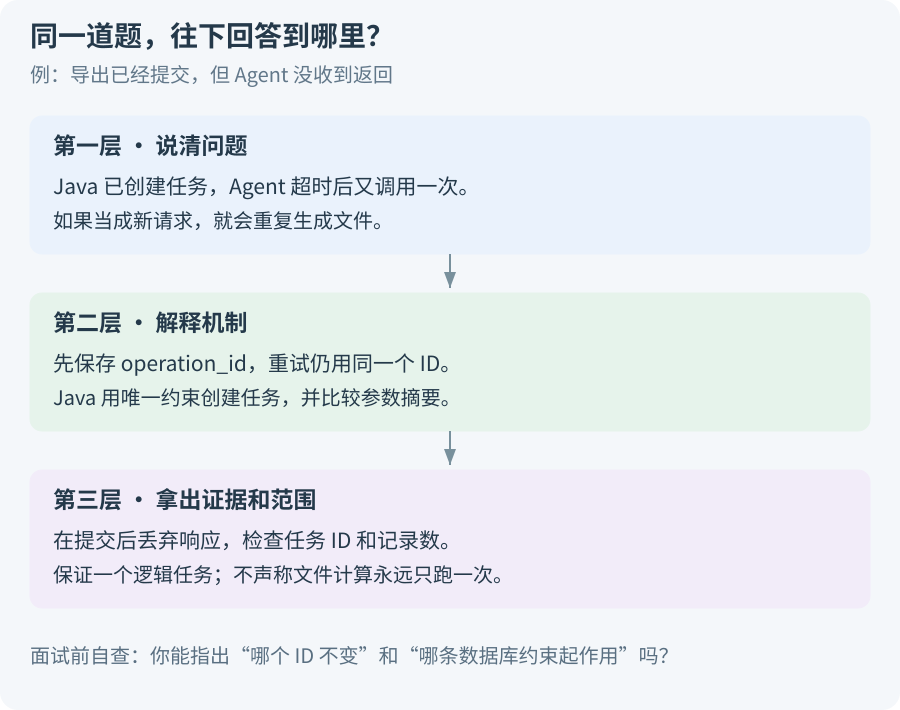

# 面试怎么讲，接下来八周怎么做

你有七年 Java 经验。面试里真正值得展开的，是你能把模糊的汇报需求拆成可执行的步骤，能让金额算对，也能在失败后定位问题、恢复任务。框架名称说到需要的地方就够了。

先准备一个三分钟版本。对方感兴趣时，再沿分摊、状态恢复或权限往下讲。

> [!TIP] 每次回答都带上一个具体对象
> 讲口径，就说 D_A 的 52/56 万；讲恢复，就说原 run_id；讲重复导出，就说 operation_id 和唯一约束。有具体对象，回答才不容易停在概念上。

## 1. 三分钟介绍，可以这样说

下面是**当前设计与局部实验阶段**的表达，练习时按自己完成的内容调整。

“我之前做的是企业内部预算与核算系统，主要把项目支出、人力费用等数据集中起来，给员工做多项目汇报用。一个项目可以从部门、重量级团队、投资等不同维度看分摊结果。

系统有固定报表，但临时卡片和图表经常需要开发定制。员工还得学会页面入口和统计口径，系统更新后又要培训。所以我在这个背景上设计了一个独立的分析与汇报助手，让员工直接说要看哪些项目、什么期间、按什么维度看，助手调用已有能力完成查询和制图。

我把 Java 和 Agent 的职责分开了。Java 继续负责身份、权限、分摊规则、查数和导出；Python/LangGraph 负责保存分析进度、必要时问用户一句，再根据查询结果决定是否下钻。Java 提交任务以后就返回编号，不会一直占着请求线程等模型。

这个项目里，我最关注的是查对业务口径。比如两个项目总预算是 120 万、实际 126 万，但按 D_A 的比例分摊后是 52 万和 56 万。不能因为查到了正确的项目总额，就拿它当部门金额。模型先提查询计划，Java 检查分摊维度、规则和权限，计算完保存结果，图表和 Excel 都用这份结果。

我还围绕一些容易出问题的地方做了局部实验，比如多表连接把金额翻倍、比例变化导致两次查询对不上、导出已提交但返回丢失以后重复执行。目前有两组共 23 项合成检查通过；完整模型、Java 和图恢复的集成效果，还需要继续验证。”

这段不用逐字背。记住顺序：**业务痛点 → 谁负责什么 → 一个数字例子 → 一个工程问题 → 实际完成情况**。

> [!WARNING] 不要把设计讲成生产事故
> “我设计了恢复方案”“我用 SQLite 验证了去重”与“线上稳定运行过”是不同经历。面试官问到部署、规模和监控时，前两者无法替代第三者。按真实进度说，后续追问反而更好接。

## 2. 对方继续问时，怎样答出深度



图里每一层都回答了一个不同的问题。第一层让人知道你遇到了什么；第二层说明具体怎么解决；第三层给出可检查的依据和保证范围。

拿“导出超时”来说，只说“加重试和幂等”还不够。可以继续解释：

- Java 可能已经提交任务，只是 Agent 没收到返回，所以不能直接认为操作失败。
- Agent 在调用前保存 operation_id，恢复时仍带原 ID。
- Java 的唯一约束保证同一用户的这个操作只建立一个逻辑任务，参数摘要检查它是否被改成另一份导出。
- Worker 生成文件可能重跑，但只有当前有效的执行者能发布结果；这和“物理计算永远只发生一次”不同。

最后拿出任务行、操作 ID 和故障注入记录。这就能连到你熟悉的事务、唯一索引、并发与网络问题。

> [!IMPORTANT] 深度来自继续解释“为什么”
> “用了 LangGraph”回答的是选了什么。还要能解释：State 放哪些数据，checkpoint 什么时候写，恢复会重跑哪一步，外部任务已经成功怎么办。每个框架点都能接到具体运行过程，才有面试价值。

### 根据对方关注点调整展开顺序

| 对方在追问什么 | 优先展开 | 准备什么材料 |
| --- | --- | --- |
| 业务价值 | 原系统已有能力、员工剩余工作、Agent 的作用 | 旧新流程和一个实际请求 |
| Agent 开发 | 工具选择、必要澄清、动态下钻、停止 | 两条走向不同的执行轨迹 |
| Java 工程 | 分摊、事务、版本、任务和资源限制 | SQL、操作 ID、失败时间线 |
| 数据与权限 | 怎样知道查对了，怎样拦住越权 | 基准数据、拒绝案例和核对包 |

完整回答看[24 组面试追问](10-面试时怎么说，追问来了怎么接.md)。不要试图在三分钟里一次讲完所有技术。

## 3. 五分钟演示，挑能让人看懂的变化

演示的重点是让人看到：输入变了以后，系统按正确方式变化。下面是完整应用的待实现目标，尚未做出的部分不冒充实时运行。

1. **普通汇报：** 查询 P01、P02 上半年部门分摊。显示 D_A 52/56 万、D_B 68/70 万，再打开图表和查询表核对。
2. **必要澄清：** 在没有上下文时说“按部门看”。若管理归属和分摊都适用，问一次；确认后不再把整套条件重问一遍。
3. **改变口径：** 说“改按投资看”。展示新计划和新结果，旧部门结论不混进新报告。只改图表颜色时则复用原结果。
4. **能力和权限限制：** 仅有 D_A 份额的用户请求其他部门，系统拒绝；没有联合规则时请求“部门×投资”，系统解释为什么不能算。
5. **失败恢复：** 查看局部实验中“提交后响应丢失”的记录，检查是否仍返回同一任务 ID。完整 Agent 尚未接通前，明确这一步演示的是局部实验。

> [!NOTE] 为什么要演示“改按投资看”？
> 因为它能同时检验需求理解、规则选择、权限、旧证据清理和图表更新。只演示一句固定问题，很难看出这些工程设计有没有真正起作用。

## 4. 八周安排：边投递，边把项目做扎实

下面是参考节奏，不假定每天都能全职投入。Java 基础、投递与项目实践同时推进，不必等所有功能做好才开始面试。

| 周 | 这一周先做成什么 | 能讲清的面试问题 |
| --- | --- | --- |
| 1 | 准备合成数据，跑通单轴分摊和基准查询 | 为什么“按部门查”可能拿错金额？ |
| 2 | 接一个模型和少量工具，完成查询、结果和最小导出 | 模型和程序分别在做什么？ |
| 3 | 增加状态图、必要澄清、持久化任务和版本固定 | 等用户回答或进程重启后怎样继续？ |
| 4 | 明确数据范围，接 MCP，维护两个小 Skill | Skill 更新会不会改变公式或权限？ |
| 5 | 图表、Excel、查询表复用结果，补导出幂等 | 三份材料为什么对得上，超时怎样处理？ |
| 6 | 做固定案例评测，尝试一个受限 SQL 数据集 | 怎样证明查询正确，优化有没有用？ |
| 7 | 修复集成问题，按面试反馈补薄弱处 | 能否拿出一份失败与修复记录？ |
| 8 | 稳定演示，整理完成状态，停止扩范围 | 能否独立讲完并接住连续追问？ |

### 时间不够，优先保住什么

**先保住完整路径：** 一个分摊轴、有限指标、权限校验、一份可信结果和一次可核对导出。接口很多但没有一条能完整演示的路径，准备效果会很差。

再挑两项体现 Agent 能力的内容做深，例如根据结果下钻、改口径清理旧证据、暂停后恢复。Text-to-SQL、多轴和说明检索根据时间扩展，不把未验证能力打开给演示用户。

LangGraph 先学 State、路由、工具循环、checkpoint 和 interrupt。LangChain 先掌握模型、消息和工具接入。Java 继续准备事务隔离、SQL、并发、接口幂等、权限和排查，这些正是把 Agent 做可靠时会遇到的问题。

> [!TIP] 每周留下一个能重跑的例子
> 一张架构图只能说明你想过。一个带输入、失败结果、修复和验证的例子，才能支持“我做到了什么”。保存模型版本、数据版本和代码提交，别等面试前再补证据。

## 5. 简历分成两段，职责才清楚

原系统经历按自己实际做过的工作写，例如：

> 参与预算与核算系统开发，整合系统同步、人工导入及页面维护的数据，支持多项目及部门、团队、投资等维度展示，开发指标卡片和报表，支撑业务汇报。

Agent 独立实践等对应能力完成后再写，例如：

> 设计并实现多项目预算分析助手，通过结构化查询计划识别分摊口径，调用 Java 分摊与指标服务；用固定数据和规则版本生成可核对的图表、Excel，处理多轮改条件和导出重试，并用合成案例验证查询及故障处理。

如果目前只完成设计和局部实验，把“实现”改为“验证部分关键机制”，删去未完成项。没有测量过的效率提升、真实用户规模或模型准确率不填写。

## 6. 面试前最后检查这几件事

能否在新环境重跑一个案例；能否说明一个数字来自哪里；能否讲清一次失败发生在哪层；能否回答为什么不用更简单的方案；能否明确哪些完成、哪些待做。

复盘时可以用下面这份短记录：

```text
用户提出什么需求：
这次采用哪些项目、期间和分摊口径：
原来错在哪里，证据是什么：
排除了哪些猜测：
改了什么，为什么能解决：
输入、预期、实际结果：
代码/数据/模型版本：
还有哪些情况没有验证：
```

回到[阅读指南](00-这套项目资料，先从这里读起.md)，或开始练习[面试追问](10-面试时怎么说，追问来了怎么接.md)。
