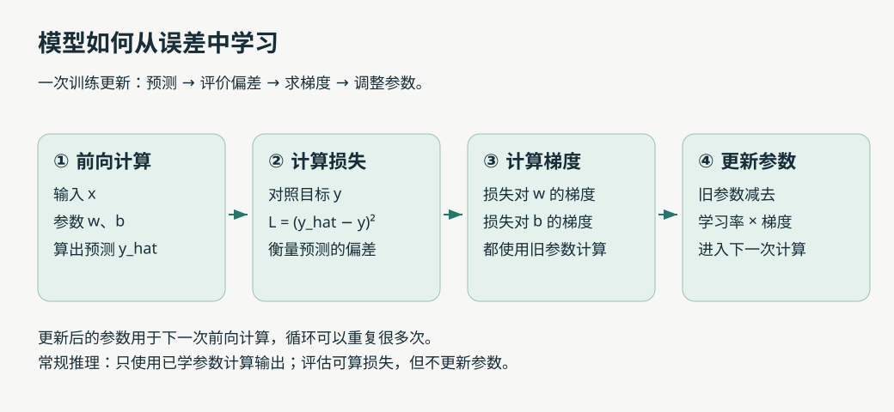
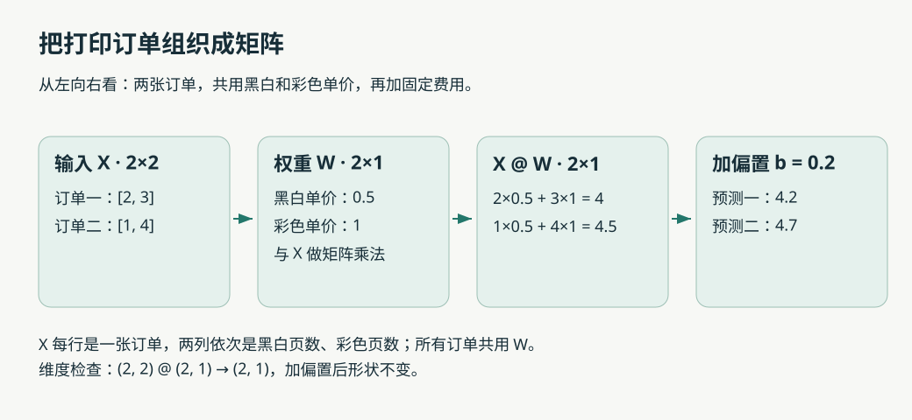

# 第 01 章：参数、预测与训练

## 本章在整条主线中的位置

建议先读[一条回答是怎样生成的](00-一条回答是怎样生成的.md)，建立“输入 → 模型计算 → 选择 Token → 继续生成”的全貌。本章是其中“参数为什么能产生有用预测”的手算补充，不是理解大模型前必须跨过的数学门槛。

你可以从总览第 6 节跳到这里，算清一次训练，再返回总览继续理解后训练与助手系统。下面的打印店案例只用来把参数更新算明白，语言模型的输入、输出和损失要按总览中的对应关系理解。

## 本章要解决什么问题

输入“小猫饿了，它想吃……”，语言模型怎样给出后面的文字？先把问题拆成两半：**它按什么规则计算，以及这些规则里的数字从哪里来。** 本章先研究第二个问题：模型怎样从例子中调整自己。

直接拿文字开始，会同时遇到分词、概率、矩阵等概念。我们先用一个能亲手算完的任务：根据打印页数估算费用。等训练过程清楚了，再接回语言模型。

本章所有订单和价格都是人为构造的教学数据，不代表真实收费。上午可以读第 1–4 节，下午读第 5–8 节并做练习，晚上再运行实验。每次遇到计算，先自己算一遍，再看结果。

> **Tip｜先抓住三个问题**
>
> 现在输入了什么？模型里哪些数字可以调整？我们拿什么判断它算得好不好？能回答这三个问题，就已经抓住训练的起点。

## 1. 从打印订单认识模型和参数

### 1.1 我们知道订单，但暂时不知道收费规则

假设看到以下历史记录。为了手算简单，先只考虑一种打印方式。

| 订单 | 页数 x | 实际费用 y |
| --- | --- | --- |
| A | 1 | 2 元 |
| B | 2 | 4 元 |
| C | 3 | 6 元 |

你很容易发现“每页 2 元”。但现在我们想写一个程序，让它通过调整数字来贴近这些记录，而不是直接把答案写进去。

先选一种计算方式：

```text
估计费用 = 每页价格 × 页数 + 固定费用
  y_hat = w × x + b
```

四个符号各有工作：

| 符号 | 在订单里的含义 | 在模型里的名称 |
| --- | --- | --- |
| x | 这次打印多少页 | 输入 |
| y | 历史订单实际收了多少钱 | 目标，也叫标签 |
| y_hat | 按当前规则估出来的费用 | 预测 |
| w、b | 当前采用的每页价格、固定费用 | 参数 |

这里的“模型”就是这条带有可调数字的计算规则。我们暂时猜 w = 1、b = 0，拿订单 B 试算：

```text
输入：x = 2
预测：y_hat = 1 × 2 + 0 = 2 元
目标：y = 4 元
结果：少估了 2 元
```

### 1.2 换输入和换参数，是两种不同操作

保持 w = 1、b = 0，页数从 2 换成 3，预测变成 3 元。这是在**使用同一个模型处理新输入**。

保持页数 x = 2，把 w 从 1 调成 1.5，预测变成 3 元。这是在**改变模型的参数**。

后面说“训练”，主要就是根据数据反复做第二类调整；说“推理”，通常就是用已有参数做第一类计算。

> **Tip｜参数不是每道题的答案**
>
> w、b 是所有订单共用的数字。不能给订单 A 单独配一套、订单 B 再配一套，否则很容易只记住旧订单，仍不会处理新订单。

**架构决定怎么算，参数决定当前算出什么。** 本例选择了“先乘再加”的结构；训练在这个结构内寻找合适的 w、b。

## 2. 怎样比较两套估价规则：损失

### 2.1 为什么不直接把误差加起来

对三张订单，比较两个候选模型。定义“误差 = 预测 − 目标”。

| 候选模型 | 三次预测 | 三次误差 | 误差之和 |
| --- | --- | --- | --- |
| A：w = 1，b = 0 | 1、2、3 | −1、−2、−3 | −6 |
| B：w = 1，b = 2 | 3、4、5 | +1、0、−1 | 0 |

模型 B 的误差加起来是 0，但第一张多收 1 元，第三张少收 1 元，并没有全部算对。**正负误差会相互抵消。**

我们需要一种不会抵消的评价办法。这里选择先平方，再取平均：

```text
模型 A：L = [(-1)² + (-2)² + (-3)²] / 3 = 14/3 ≈ 4.67
模型 B：L = [(+1)² + 0² + (-1)²] / 3 = 2/3 ≈ 0.67
```

这个数叫**损失**；这里采用的具体形式叫**均方误差**。在这批订单、这个评价标准下，B 比 A 好。

### 2.2 为什么平方，为什么平均

平方后正负都变成非负数；误差从 1 增到 2，平方从 1 增到 4，因此较大误差会受到更重惩罚。取平均则避免仅仅因为订单数量增加，误差总和就自然变大。

绝对值也能避免正负抵消，平方并不是唯一选择。我们选它，是因为容易计算，也方便观察后面的参数更新。

> **Tip｜损失是评分，不是调整方案**
>
> 损失为 4，只告诉你当前偏差的大小，没有告诉你 w 应该加多少、b 应该减多少。找到调整方向，需要下一节的梯度。

## 3. 先用“试着调一点”理解梯度

回到订单 B：x = 2、y = 4，当前 w = 1、b = 0。预测是 2，单个样本的平方误差是 4。

先固定 b，只轻轻改变 w：

| w | 预测 2w + b | 损失 (预测 − 4)² |
| --- | --- | --- |
| 0.99 | 1.98 | 4.0804 |
| 1.00 | 2.00 | 4.0000 |
| 1.01 | 2.02 | 3.9204 |

可以看到，在当前位置附近，w 稍微增大，损失就减小。我们还可以估算它变化得多快：

```text
损失的变化 / w 的变化
= (3.9204 - 4) / (1.01 - 1)
= -7.96
```

这个值接近 −8。如果把试探的幅度取得越来越小，对这个函数，得到的变化率会趋近 −8。这就是此处损失对 w 的导数。

模型有多个参数时，把各个参数对应的变化率放在一起，就得到**梯度**。本例中，损失对 w 的变化率是 −8，对 b 的变化率是 −4。

> **Tip｜负梯度值为什么反而意味着要增大参数？**
>
> 这里的 −8 表示：在当前点附近，w 往增大的方向移动时，损失往减小的方向变化。为了减小损失，我们沿梯度的反方向走，所以会增大 w。梯度的正负说的是变化方向，不是在评价参数“好”或“坏”。

实际训练通常通过求导计算梯度，不必逐个参数尝试加一点、减一点。本例的求导过程放在文末，先不熟悉微积分也能继续。

## 4. 从方向到行动：手算一次训练

### 4.1 学习率控制每次走多远

知道方向后，还要决定调多少。最基础的梯度下降规则是：

```text
新参数 = 旧参数 - 学习率 × 该参数的梯度
```

用刚才的订单，取学习率 0.1：

```text
旧参数：w = 1，b = 0
旧预测：y_hat = 1 × 2 + 0 = 2
误差：e = 2 - 4 = -2

w 的梯度 = 2 × e × x = -8
b 的梯度 = 2 × e = -4

新 w = 1 - 0.1 × (-8) = 1.8
新 b = 0 - 0.1 × (-4) = 0.4

更新后预测：1.8 × 2 + 0.4 = 4
更新后损失：(4 - 4)² = 0
```

这次刚好算对了订单 B。把刚才的动作连起来，就是一次完整训练更新：



“前向计算”是用当前参数算出预测；“反向传播”用于沿计算过程求出梯度；“优化器”按更新规则调整参数。本例的优化器采用最基础的梯度下降。

> **Tip｜两个梯度要站在同一个起点算**
>
> w 和 b 的梯度都用旧参数计算，然后一起更新。不要先改 w，再拿新 w 算 b 的梯度，那就不是这里演示的同一次梯度下降更新了。

### 4.2 换一个学习率，会发生什么

下面每一行都**重新从 w = 1、b = 0 出发**，只更新一次，使用同一组梯度 −8、−4。

| 学习率 | 新 w | 新 b | 对 x = 2 的预测 | 更新后损失 |
| --- | --- | --- | --- | --- |
| 0.01 | 1.08 | 0.04 | 2.2 | 3.24 |
| 0.10 | 1.80 | 0.40 | 4.0 | 0 |
| 0.30 | 3.40 | 1.20 | 8.0 | 16 |

原来的损失是 4。小步有进展，合适的一步恰好到达目标，过大的一步越过目标，反而让损失变成 16。在这个单样本问题中，继续使用 0.30，下一步预测会变成 −4，损失变成 64，偏差继续扩大。

> **Tip｜0.1 不是通用的好学习率**
>
> 它在这里一步算对，是这组数字恰好产生的结果。换输入尺度、模型或数据，合适的学习率也会变化。梯度描述当前位置附近的趋势，不保证沿这个方向走任意远都更好。

### 4.3 一张订单算对，不等于学会收费规律

刚训练出的 w = 1.8、b = 0.4，在其他页数上表现如何？

| 页数 | 目标费用 | 当前预测 |
| --- | --- | --- |
| 1 | 2 | 2.2 |
| 2 | 4 | 4.0 |
| 3 | 6 | 5.8 |
| 4（新订单） | 8 | 7.6 |

为什么会这样？订单 B 只要求 `2w + b = 4`。w = 2、b = 0 可以满足，w = 1、b = 2 也可以满足，甚至 w = 0、b = 4 都可以满足。**一个样本无法确定唯一的收费规则。**

因此训练一般会用很多样本，让共用参数同时照顾它们。本例用三张订单的平均损失训练，梯度也取三个样本梯度的平均值，文末代码会演示这个过程。

## 5. 输入不止一个数字时：向量与矩阵

### 5.1 先扩展订单，再引入记号

现在换一个打印场景：一张订单既有黑白页，也有彩色页。暂时给定黑白每页 0.5 元、彩色每页 1 元、固定费用 0.2 元。这是一个独立的多特征示例，不沿用前面的单价。

订单一有 2 页黑白、3 页彩色：

```text
预测费用 = 2 × 0.5 + 3 × 1 + 0.2 = 4.2 元
```

把输入按固定顺序排成一串数字，就是向量：

```text
x = [2, 3]       # [黑白页数, 彩色页数]
w = [0.5, 1]     # [黑白单价, 彩色单价]
b = 0.2
```

`2 × 0.5 + 3 × 1` 这种对应位置相乘、再相加的计算，叫**点积**。在这里，它计算的是两类页面的费用总和。

> **Tip｜数字的顺序也是约定的一部分**
>
> 如果输入改成“彩色在前、黑白在后”，参数也必须对应换序。维度相同只说明能算，不保证业务含义正确。点积也不能一概解释成“语义相似度”，它的意义取决于参与计算的数字。

### 5.2 两张订单放在一起，就得到矩阵

再加入订单二：1 页黑白、4 页彩色。先用熟悉的方法逐单计算：

```text
订单一：2 × 0.5 + 3 × 1 + 0.2 = 4.2
订单二：1 × 0.5 + 4 × 1 + 0.2 = 4.7
```

为了统一组织计算，把订单排成表，每行一个订单，每列一种特征。这张数字表就是矩阵 X：

```text
     黑白  彩色
X = [ 2,    3 ]    订单一
    [ 1,    4 ]    订单二

W = [ 0.5 ]       黑白单价
    [ 1.0 ]       彩色单价

X @ W = [ 4.0 ]   加上共同的 b = 0.2 → [ 4.2 ]
        [ 4.5 ]                        [ 4.7 ]
```

符号 `@` 表示矩阵乘法。这里它把刚才两次点积统一写在一起，并没有换掉收费规则。



### 5.3 怎样读懂形状

`(2, 2)` 表示 2 行、2 列；这个例子里正好有两张订单、两种特征。它们数量相同只是巧合。

```text
X: (订单数, 输入特征数) = (2, 2)
W: (输入特征数, 输出数) = (2, 1)
结果: (订单数, 输出数) = (2, 1)
```

中间两个维度必须相等，因为每个输入特征都要找到对应的权重。外侧两个维度决定结果：两张订单，每张输出一个费用。

换成 5 张订单、每张 3 种页数特征、仍输出一个费用，形状就是 `(5, 3) @ (3, 1) → (5, 1)`。

> **Tip｜本例中每行是订单，后面每行可能是 Token**
>
> 矩阵是组织数字的方式。阅读每个新例子时，要重新确认行、列各代表什么。Token 的向量通常是学出来的表示，不能照搬打印例子，把每一列都理解成有明确名字的属性。

## 6. 为什么还需要神经网络和非线性

### 6.1 一条直线表达不了所有规则

假设打印店改成阶梯优惠：前 2 页每页 2 元，超过 2 页的部分每页 1 元，不收固定费用。

| 页数 | 费用 | 相比前一页增加 |
| --- | --- | --- |
| 1 | 2 | 2 |
| 2 | 4 | 2 |
| 3 | 5 | 1 |
| 4 | 6 | 1 |

`wx + b` 每多一页，费用总是增加同一个 w。它无法同时表达“前面每页加 2，后面每页加 1”。这次的困难来自模型能表达的规则，而不仅是参数还没调好。

### 6.2 多接一层乘加，够不够

试着先算 `h = 2x + 1`，再算 `y_hat = 3h + 4`：

```text
y_hat = 3 × (2x + 1) + 4 = 6x + 7
```

两层合起来仍然是“乘一个数，再加一个数”。更一般地，不夹入非线性函数，多个线性变换加偏置仍可合并成一个这样的变换。

### 6.3 用 ReLU 做出一个转折

ReLU 的规则很简单：负数变成 0，非负数保持原值，即 `ReLU(z) = max(0, z)`。

这条带优惠的收费规则可以写成：

```text
费用 = 2x - ReLU(x - 2)
```

为什么？前两页不减价；超过两页后，每多一页，从原来的费用里减去 1 元。

| x | x − 2 | ReLU(x − 2) | 2x − ReLU(x − 2) |
| --- | --- | --- | --- |
| 1 | −1 | 0 | 2 |
| 2 | 0 | 0 | 4 |
| 3 | 1 | 1 | 5 |
| 4 | 2 | 2 | 6 |

这次真的出现了转折。神经网络会组合可训练的变换和非线性函数，表示比一条直线更丰富的关系。

> **Tip｜能表达规则，与能学到规则是两回事**
>
> 上面的优惠公式是我们手工写出的，用来展示非线性的作用。它还没有演示网络自己学会优惠。学出来的结果还取决于数据、损失、优化方法等条件；模型变复杂也不自动保证新数据表现更好。

Transformer 同样包含可训练的变换和非线性。后面会分别解释：注意力怎样让不同位置交换信息，前馈网络怎样继续加工每个位置的表示。

## 7. 训练、推理，以及“旧订单全对了”之后

回顾同一家打印店的两种操作：

| 操作 | 做什么 | 参数是否更新 |
| --- | --- | --- |
| 训练 | 用历史订单计算预测、损失、梯度，修正估价规则 | 是 |
| 常规推理 | 输入一张新订单，用当前规则估价 | 否 |
| 评估 | 对留出的订单估价，再与实际费用比较 | 否 |

评估也能计算损失，所以“看到了损失”不等于“正在训练”。

再想一个极端程序：把三张旧订单的答案背下来，遇到别的页数一律输出 0。它在旧订单上完全正确，在 4 页的新订单上却预测 0 元。这个例子说明：**旧数据上的高分，不能替代新数据上的检查。** 模型过度贴合训练数据、在新数据上表现差的现象叫过拟合。

通常会把数据分成三部分：训练集用于调整参数，验证集用于比较设置（例如学习率），测试集留到最后评估。若反复查看测试结果来调整方案，它就不再是独立的最终检查。

> **Tip｜新数据也要问“新在哪里”**
>
> 从同一收费规则生成的 4 页订单，只能检查这个简单场景。换一家采用阶梯折扣的店，规律本身变了。教学例子上的成功，不能证明模型在任意真实场景都能可靠外推。

### 接回“小猫饿了，它想吃……”

打印例子帮助我们理解了训练循环。换成语言模型时，循环中的具体内容会改变：

| 环节 | 打印费用模型 | 预测下一个 Token 的语言模型 |
| --- | --- | --- |
| 输入 | 页数或多种页数特征 | 前面的 Token 序列 |
| 输出 | 一个费用数值 | 词表中各候选 Token 的分数，再转成概率 |
| 训练目标 | 订单实际费用 | 训练文本实际出现的下一个 Token |
| 损失 | 本章使用均方误差 | 通常使用交叉熵，后续从概率解释 |
| 共通动作 | 根据损失计算梯度、更新参数 | 根据损失计算梯度、更新参数 |

“小猫饿了，它想吃……”只是一个直觉入口。真实训练样本会提供具体的后续文本；模型不会收到“所有合理答案的完整清单”。Token 也不一定恰好等于一个汉字或一个词，下一章再拆开讲。

> **Tip｜聊天中换了回答，不代表模型刚刚训练了**
>
> 给同一句话补上不同的前文，就改变了输入，因此即使参数固定，输出也可以变化。本章打印模型在参数不变时，页数从 2 换成 3，预测也会变化。利用上下文和更新参数，是两件不同的事。

## 8. 可选实验：先预测，再运行

示例文件：[01_linear_learning.py](code/01_linear_learning.py)。只用 Python，不需要第三方库。在专题目录运行：

```bash
python3 code/01_linear_learning.py
```

代码依次复现：两种估价规则的损失、微调参数的结果、三种学习率的一步更新、两张多特征订单、阶梯优惠，最后用三张订单共同训练模型。前面的对比都有对应输出；最后的训练每隔 50 步打印一次。

第一次运行时，只对照正文，不急着修改。第二次选一个实验，每次只改一个条件：

| 实验 | 修改 | 运行前先猜 | 重点观察 |
| --- | --- | --- | --- |
| 小步训练 | learning_rate 从 0.05 改成 0.005 | 相同 200 次更新，损失谁更低？ | 更小的步幅在有限次数内可能进展更慢 |
| 数据不足 | samples 只保留 (2.0, 4.0) | 训练正确后，4 页一定预测 8 吗？ | 同一训练答案对应多组参数 |
| 模型受限 | samples 改成 [(1, 2), (2, 4), (3, 5), (4, 6)] | 一条直线能把四张订单都算对吗？ | 延长训练也不能消除表达能力的限制 |

代码中的断言检查的是前半部分固定教学案例；它们通过不代表后面的自定义实验一定训练成功。观察自己修改后的损失和预测，并写下一句话解释原因。

## 9. 自测：先做，再对照答案

1. 打印页数从 2 换成 3，但 w、b 不变，这是换输入还是训练？
2. x = 3、w = 2、b = 1、目标 y = 6，预测和平方误差是多少？
3. 两张订单分别多估 2 元、少估 2 元，平均误差是 0。均方误差也是 0 吗？
4. w 的梯度为 −8，学习率为 0.01，w = 1 更新后是多少？
5. 5 张订单，每张 3 个特征，希望每张输出 2 个数，X、W 和输出形状分别是什么？
6. 为什么只用 (2, 4) 训练，不能唯一确定 w、b？请给两组解。
7. 把 h = 2x + 1、y_hat = 3h + 4 合并。为什么这没有增加转折能力？
8. “小猫饿了，它想吃……”换了前文后，模型的候选词概率变了，能据此判断参数更新了吗？

### 参考答案

1. 换输入，属于使用已有参数计算的过程。
2. 预测是 7，平方误差是 1。
3. 不是，均方误差为 `(2² + (-2)²) / 2 = 4`，正负不会抵消。
4. `1 - 0.01 × (-8) = 1.08`，参数增大。
5. X 为 (5, 3)，W 为 (3, 2)，输出为 (5, 2)。每个输出各有一组权重。
6. 只约束 `2w + b = 4`；例如 (w = 2, b = 0) 和 (w = 1, b = 2) 都符合。
7. 得到 `6x + 7`，仍是固定斜率的一条直线，没有引入非线性。
8. 不能，输入改变本身就能改变输出，需要区分上下文变化与参数更新。

## 10. 选读：梯度公式为什么是这样

本节给第 3–4 节的数字补上来路。以 w 为起点，顺着计算看：

```text
w → 预测 y_hat = wx + b → 误差 e = y_hat - y → 损失 L = e²
```

只微调 w，其他量先固定。它对损失的影响会经过三段：

1. w 改变一点，预测的变化率是 x；本例 x = 2，相当于先放大两倍。
2. 从预测减去固定目标，误差对预测的变化率是 1。
3. 误差平方得到损失，损失对误差的变化率是 2e。

把沿途变化率相乘，就是链式法则：

```text
dL/dw = 2e × 1 × x = 2ex
dL/db = 2e × 1 × 1 = 2e

在 x = 2、e = -2 时：
dL/dw = -8
dL/db = -4
```

符号 `dL/dw` 在这里表示“损失对 w 的变化率”；有多个参数时，严格记号是偏导数 `∂L/∂w`，含义是考察 w 时将其他参数固定。

若对 n 个样本取平均损失，对应梯度也取平均：

```text
w 的梯度 = (每个样本的 2 × 误差 × 输入 相加) / n
b 的梯度 = (每个样本的 2 × 误差 相加) / n
```

复杂网络会有更多计算步骤。反向传播组织的就是这种沿计算图传递、相乘，并在多条影响路径汇合处相加的求导过程。后面使用自动求导时，你不必手写每条公式，但应该知道它计算的是损失对参数的梯度。

## 本章完成标准

试着离开正文，向别人讲清楚打印店模型的一次训练：输入一张订单，用旧参数估价，与目标比较得到损失，计算梯度，再用学习率更新参数。然后解释为什么一张订单算对不够、为什么阶梯优惠需要更丰富的表达方式。

如果卡在“往哪个方向调”，回看第 3 节的小幅试探；如果卡在维度，回看第 5 节逐单计算，不必急着背形状公式。

完成手算后，返回[一条回答是怎样生成的](00-一条回答是怎样生成的.md)，尝试把“更新参数”放回整个大模型工作流程。后续深入专题将从 Token 与 Embedding 展开（待编写），阅读顺序见总览。
