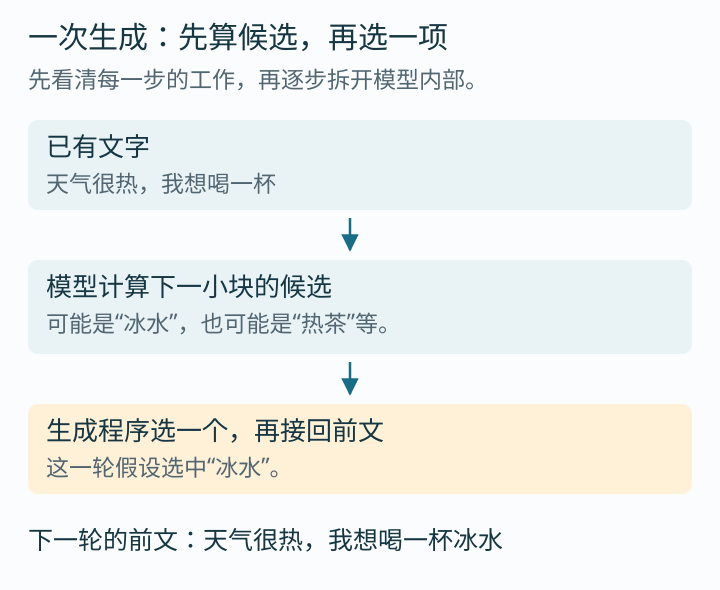
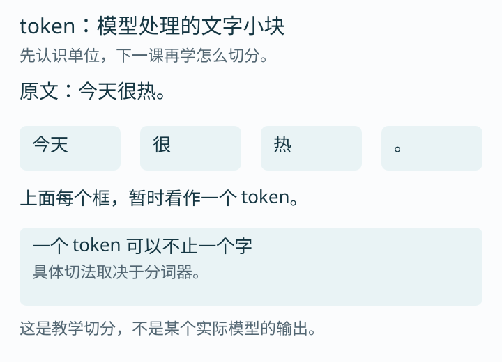
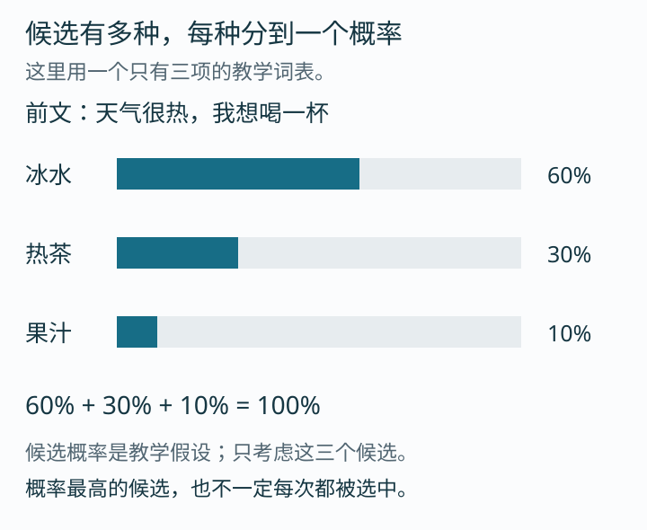
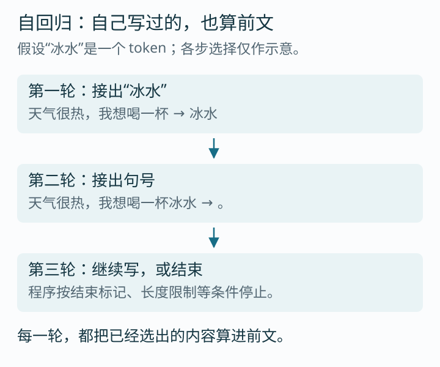
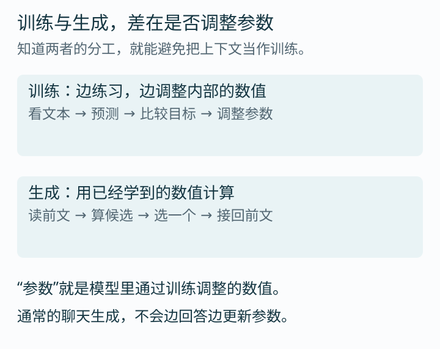
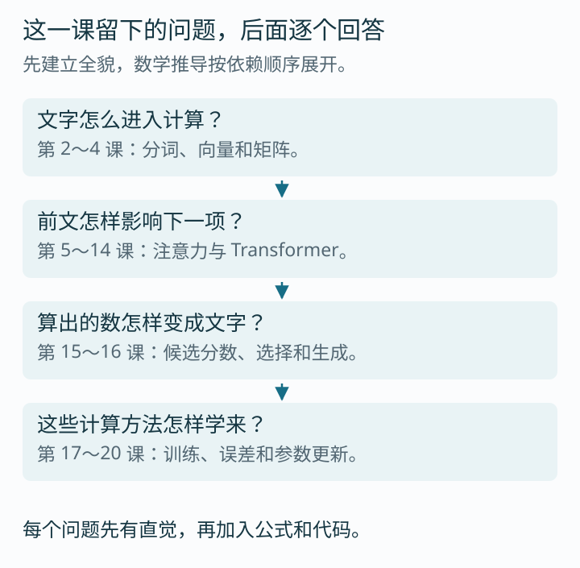

# 第 1 课：先看懂模型怎样接着写

你输入一句“天气很热，我想喝一杯”，模型接出“冰水”。我们先跟踪这一次接话，看看中间发生了什么。

这节课的目标很具体：读完后，你能向别人解释模型如何一步步生成回答，以及训练和生成有什么区别。矩阵、注意力和梯度会在后面的课里算，不需要现在就掌握。

建议分两轮聊天读完，合计约 25～35 分钟。读到练习时先说自己的答案，再展开解析；不需要一次记住整篇。

## 1. 先把一次接话分成几步

假设模型已经读到了：

> 天气很热，我想喝一杯

它会计算紧接着出现的文字有哪些候选，以及各自的概率。随后，生成程序从中选出一项。我们先假设这次选中“冰水”。



你可以把这一轮理解成一道接话题：前面的文字是题目，模型为后面可能出现的内容打分，程序再按设定的方法选出一个。

这里先留一个问题：模型为什么会给不同候选不同的分数？这与它在训练中学到的数值、当前读到的文字都有关系。我们先看清输入和输出，等学过向量和矩阵，再拆开中间的计算。

## 2. 模型每次处理的“小块”叫 token

屏幕上看起来是字，模型使用的单位叫 **token**。你可以先把它理解成“文字小块”。



图中“今天”有两个字，却放在同一个框里；标点也单独占一个框。这是为了说明：一个 token 不一定等于一个汉字。

具体怎么切，由一个叫“分词器”的程序决定。它负责把文字编码成模型使用的编号；不同分词器可能切得不一样。图里的切法只是教学示意，下一课会用实际例子来检查。

接下来，为了能跟踪过程，我们暂时把“冰水”当作一个 token。如果真实分词器把它切成两块，模型就会分别处理这两块。

### 停下来想一想

“模型生成了 100 个 token”，能直接说成“模型生成了 100 个汉字”吗？

<details>
<summary>想好后看解析</summary>

不能。一个 token 可能包含不止一个字，也可能是标点或词的一部分。要知道对应多少文字，需要看具体内容和分词器。面试里谈成本、输入长度时，这个区别很常用。

</details>

## 3. “根据前文”，究竟是根据什么？

比较这两句：

> 天气很热，我想喝一杯……
>
> 天气很冷，我想喝一杯……

后半句相同，前面的“热”和“冷”却会影响我们想到的饮料。对模型来说，输入文字变了，它计算出的候选概率也可能变化。

这些已经提供给模型、能影响本次计算的内容，叫 **上下文**。本例的上下文就是“天气很热，我想喝一杯”。在聊天产品中，上下文还可能包含前几轮对话、系统指令，以及程序提供的资料或工具结果。

注意这里的范围：我们讨论的是本次实际送进模型的内容。如果一段历史没有被送进去，就不能假设模型这次仍然看得到它。

**与后面课程的联系：**注意力机制会参与计算“怎样把前面各部分的信息汇入当前位置”。现在先记住它要解决的这个问题，不急着引入 Q、K、V。

## 4. 候选有多个，为什么选了“冰水”？

假设我们只考虑冰水、热茶、果汁三个候选。模型为它们算出如下概率：



这些数字是教学设定，不是实际模型运行结果。真实词表通常有更多候选。

先读懂这张表：冰水分到 60%，热茶 30%，果汁 10%。三项加起来是 100%，表示在这个简化例子里，全部概率都分配给了这三个候选。

有了概率，还要决定怎样选。两种常见方式是：

- 直接取概率最高的候选，本例就是“冰水”。这种方法叫贪心选择。
- 按概率抽取：冰水更容易被抽到，但热茶和果汁也有机会。这叫采样。

采样可以想成一个分成三块的转盘，各区域分别占 60%、30%、10%。每次转动会落在一块区域里；转十次不保证恰好六次冰水、三次热茶、一次果汁。

这也解释了为什么同一段输入有时会得到不同续写：生成程序可能使用了采样。当然，实际排查时还要检查输入、模型和设置是否真的相同。

### 第一条公式：先学会读

```text
P(下一个 token 是“冰水” | 上下文) = 0.6
```

从左到右解释：

| 写法 | 怎么读 |
| --- | --- |
| P | 概率 |
| 下一个 token 是“冰水” | 我们关心的结果 |
| 竖线 \| | 在……条件下 |
| 上下文 | 模型已经看到的内容 |
| 0.6 | 60% |

合起来就是：**在给定这些前文的条件下，下一个 token 为“冰水”的概率是 60%。**

所以它叫“条件概率”：我们已经知道一些条件，再讨论某个结果出现的概率。如果上下文换成另一句话，这个数也可能改变。

这里还没有推导概率是怎么从模型分数算出来的。到第 15 课，我们会把那一步展开；现在需要先知道这个数在表达什么。

### 一个容易混淆的地方

候选概率高，表示模型更倾向于这样接下去，不能直接当作“这句话在事实上正确”的保证。比如模型给某个人名较高概率，仍可能答错事实。以后做 Agent 时，资料核对和工具执行结果都要单独检查。

### 小练习

某次三个候选的概率是 0.2、0.3、0.5。哪一个在采样时最容易被选到？它是不是每次都会被选中？

<details>
<summary>查看解析</summary>

第三个最容易被选到，因为 0.5 最大。但按概率采样时，前两个也有机会。如果程序使用贪心选择，才会取这个唯一的最大项。

</details>

## 5. 选出一个以后，把它接回去

选出“冰水”后，下一轮的题目已经变成：

> 天气很热，我想喝一杯冰水

模型根据这段更新后的前文，继续计算下一项。假设第二轮选中了句号。



这种“把自己已经生成的内容也当作下一次条件”的过程，叫 **自回归生成**。名字可以慢慢熟悉，先看懂“接回去”这个动作。

句号不一定让整段回答结束。模型还可能接着写下一句。程序通常在遇到指定的结束标记、达到长度上限，或满足其他停止条件时结束生成。[Hugging Face 的生成说明](https://huggingface.co/docs/transformers/en/llm_tutorial)介绍了这类过程。

这里谈的是基本生成流程。屏幕上文字逐渐出现，是界面的显示方式；仅靠观察“逐字出现”，无法确认程序内部每一步怎样计算。

### 如果第一步选错了，会发生什么？

假设这次选中的是“热茶”，下一轮前文便是“天气很热，我想喝一杯热茶”。模型会沿着已经生成的内容继续，不能仍然假装前一步选的是“冰水”。

这让我们看见一个实际问题：前面的选择会改变后面的条件。一个早期错误可能影响后续内容，需要通过校验、重新生成等方式处理；单纯继续往后写，不保证会自行修正。

<details>
<summary>选做：已经理解上面内容后，算一个两步概率</summary>

假设先选到“冰水”的概率是 0.6；在已经选到冰水的条件下，再选句号的概率是 0.8。连续走这两步的概率为：

```text
P(先“冰水”，再“。” | 原来的前文)
= P(“冰水” | 原来的前文)
  × P(“。” | 原来的前文加上“冰水”)
= 0.6 × 0.8
= 0.48
```

为什么相乘？可以用重复很多次的情形理解：第一步约 60% 的情况走到冰水分支，在这些情况里又约 80% 走到句号。因此总比例约为 60%×80%=48%。

第二个概率的条件已经包含冰水，不能换成另一条分支的概率。这个乘法关系来自条件概率的定义，后面的课会推广到更长的序列。本例只算这两个 token，未包含结束标记。

</details>

## 6. 模型什么时候学会这些计算？

刚开始的模型并不会自然知道该接“冰水”。它需要训练。

模型内部有许多数值，会影响输入如何被处理、各候选得到什么分数。这些可以通过训练调整的数值，叫 **参数**。现在先知道它们是数值；之后学矩阵时，我们会看它们怎样组织和参与乘法。



训练时，程序拿一段文本做练习。例如，真实文本是“我想喝水”，就可以让模型根据“我想喝”预测后面实际出现的“水”。模型预测后，程序会计算它与训练目标的差距，再调整参数。

这里只讲分工，不要求你现在算参数更新。后面会先补导数，再推导这种调整究竟怎么做。

生成时，模型使用已经训练好的参数，为新的上下文计算候选。通常的一次聊天回答不会一边写、一边通过梯度修改参数。

你可能会问：“我刚告诉它名字，它后面记得我叫什么，难道不算学会了吗？”

如果名字仍在上下文里，它可以直接根据这段输入回答。这里改变的是它看到的内容。产品也可能把名字存进外部数据库，之后再提供给模型。它们都需要与参数训练区分。

### 用自己的话试着解释

“训练”和“生成”最大的区别是什么？不用说反向传播、梯度下降这些词，只说你现在理解的过程。

<details>
<summary>参考表达</summary>

训练会根据练习结果调整模型内部的参数；生成通常使用已经训练好的参数，根据当前上下文继续写。对话内容变化可以改变回答，但不代表参数也跟着更新了。

</details>

## 7. Transformer 在这条流程里做什么？

Transformer 是一种神经网络结构。这里可以先将“神经网络”理解为由许多带参数的计算步骤组成的模型。

在这条生成流程中，Transformer 根据输入对应的数字进行计算，形成能用于预测下一项的表示。输出部分再把这些表示转换成候选分数。我们后面会把每一步展开，看到真实的向量与矩阵操作。



这些课程有依赖关系：先知道文字怎样变成数字，才能算这些数字如何交换信息；先看懂一次前向计算，才适合研究训练怎样修改它。

至于“预测下一项为什么能支撑推理、翻译和写代码”，今天先把问题留住。会继续写，和能在复杂任务中写对，是两个还需要连接起来的问题。后面会结合训练、具体任务和实验讨论，第一课不用急着给“智能涌现”下结论。

## 8. 本课面试题：只考刚刚讲过的内容

### 问题一：大模型怎样一步步生成回答？

<details>
<summary>参考答案</summary>

以基本自回归生成为例，模型根据当前上下文计算下一个 token 的候选，生成程序选出一个，将它接回已有内容，再继续下一轮。遇到结束标记、长度上限或其他停止条件时结束。

追问“每次都选概率最大的那个吗”：使用贪心选择时会这样；按概率采样时，其他候选也有机会。

</details>

### 问题二：token 和汉字有什么区别？

<details>
<summary>参考答案</summary>

token 是模型处理文字的单位，具体切法由分词器决定，不能简单等同于一个汉字。例如教学图中“今天”有两个字，却被放在一个 token 框里；实际切法需要检查所用的分词器。

</details>

### 问题三：我告诉助手名字后，它能重复出来，说明参数更新了吗？

<details>
<summary>参考答案</summary>

不能这样判断。名字可能仍在当前上下文中，也可能由产品从外部存储提供。通常的生成使用已有参数，和训练时更新参数是不同过程。

</details>

### Agent 小场景：模型写“查询成功”，就说明真的查到了吗？

Agent 可以先理解为由模型配合工具执行任务的程序。这里不要求你提前了解它的架构。

<details>
<summary>参考答案</summary>

不能只看模型写出的这句话。要检查程序是否真的调用了查询工具，以及工具返回了什么结果。生成一句话和完成一个外部操作，是两个需要分别核实的步骤。

</details>

## 9. 给别人讲，可以先讲这一分钟

> 模型每次根据已经看到的内容，计算下一小块文字可能是什么。这种小块叫 token，不一定是一个汉字。生成程序选出一个 token 后，会把它接回前文，再继续下一次预测。模型内部用于计算的参数主要通过训练学到，通常的聊天生成使用的是已有参数。我们接下来要研究的，就是文字怎样进入这些计算，以及前文怎样影响下一步的候选。

读完不用急着打勾。先自己举一个两轮接话的例子：写出第一轮的输入、选中的 token，再写出第二轮的输入。只要第二轮确实包含第一轮生成的内容，自回归的基本动作就抓住了。

下一课接着问：**token 究竟怎么切？模型拿到的“编号”又是什么？**

[返回课程计划](00-课程计划.md)
