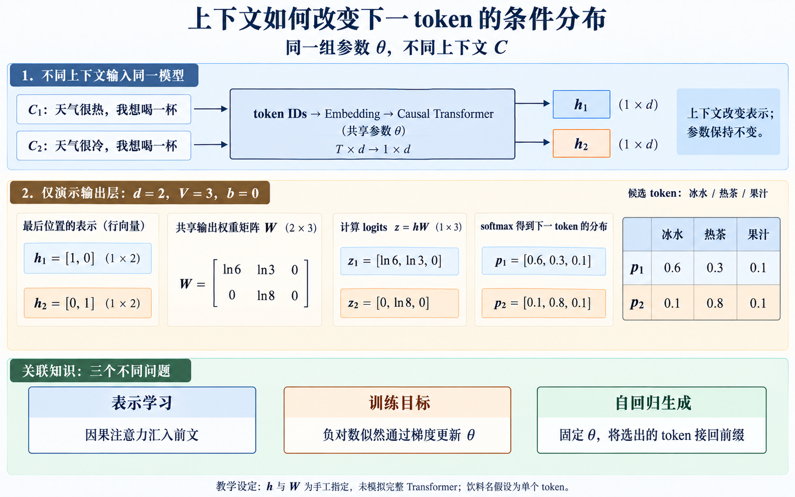
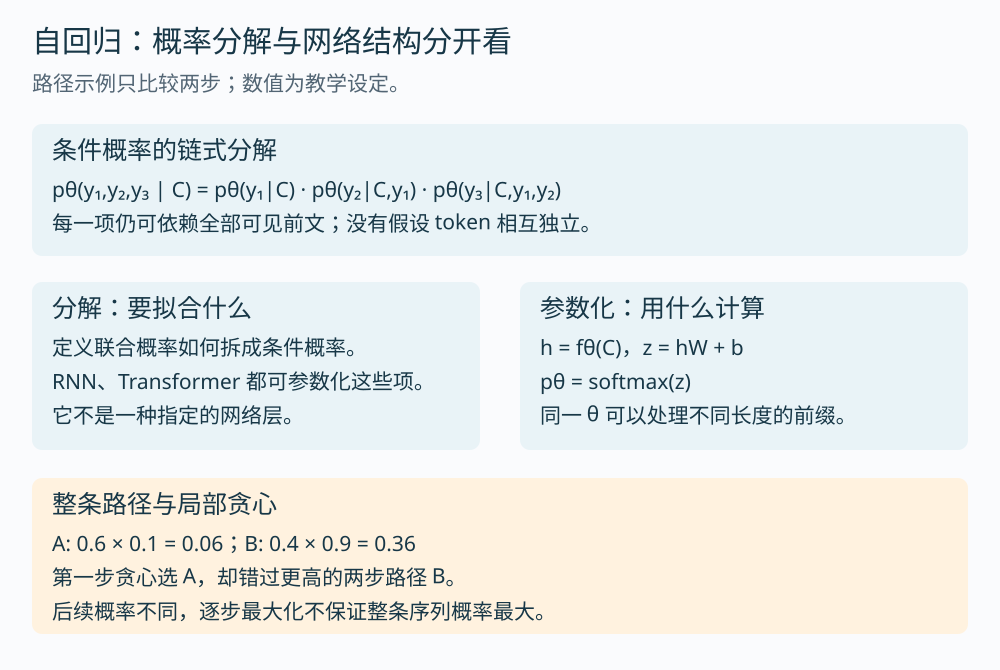
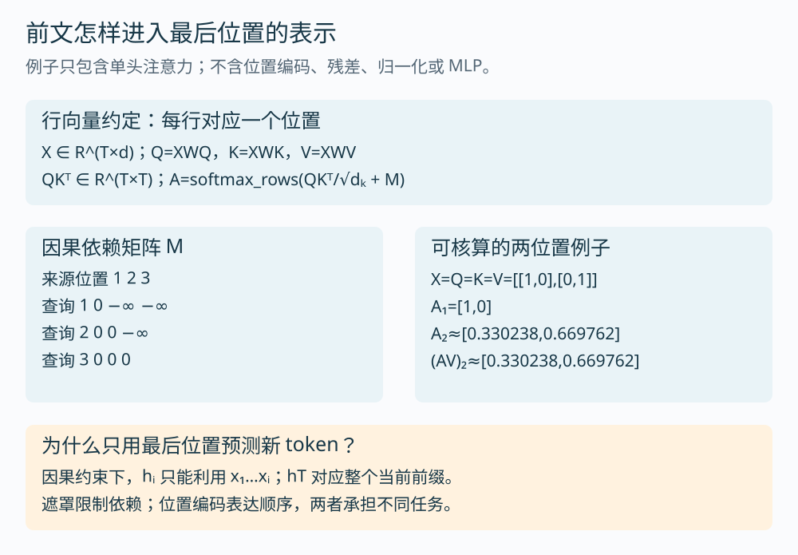
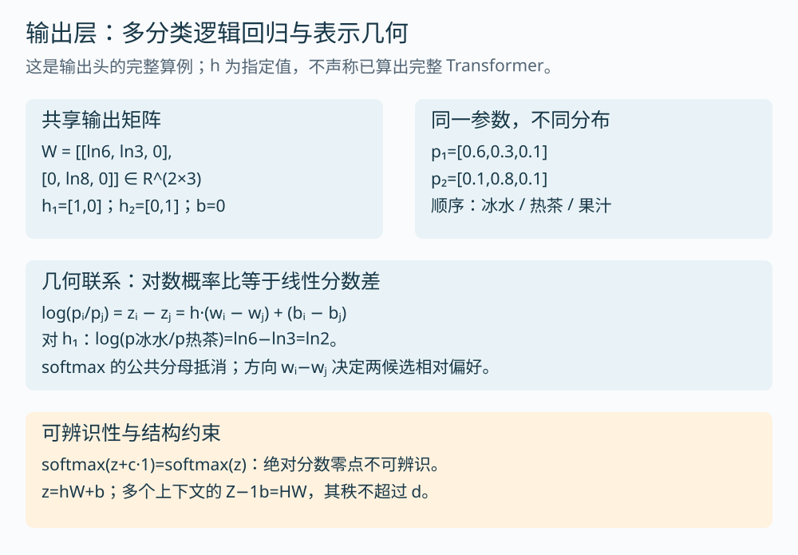
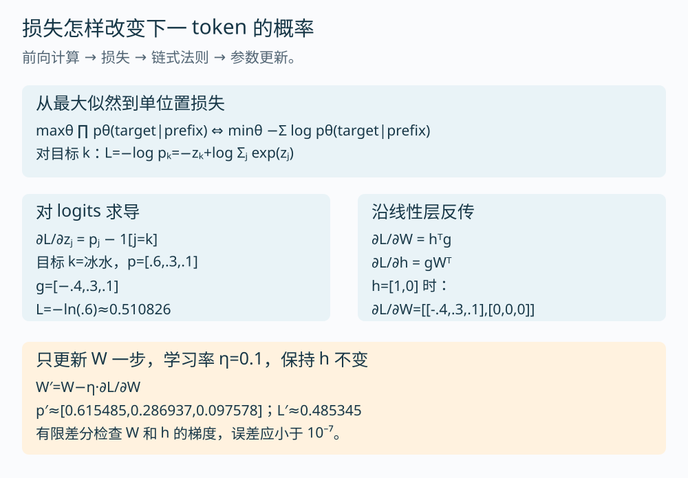
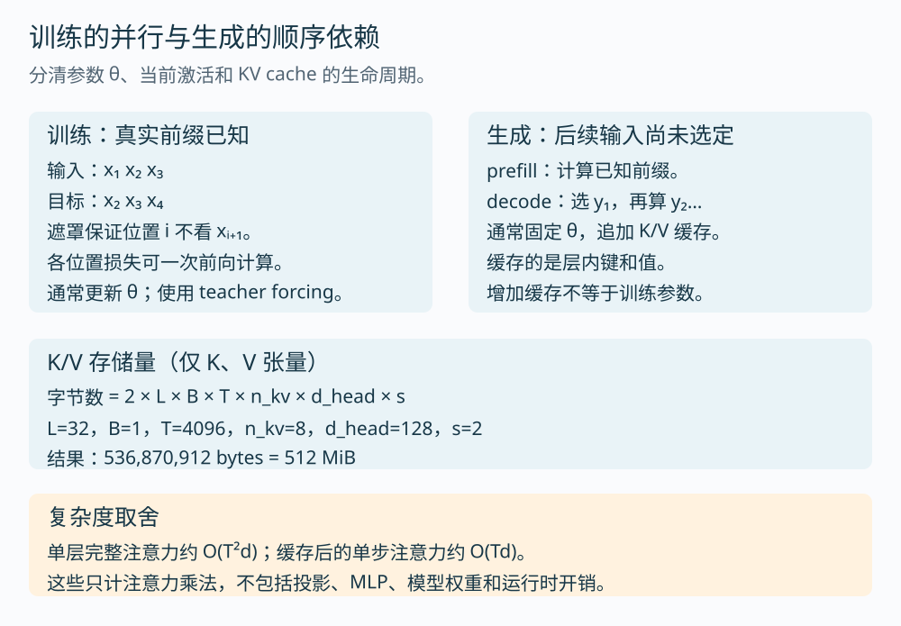
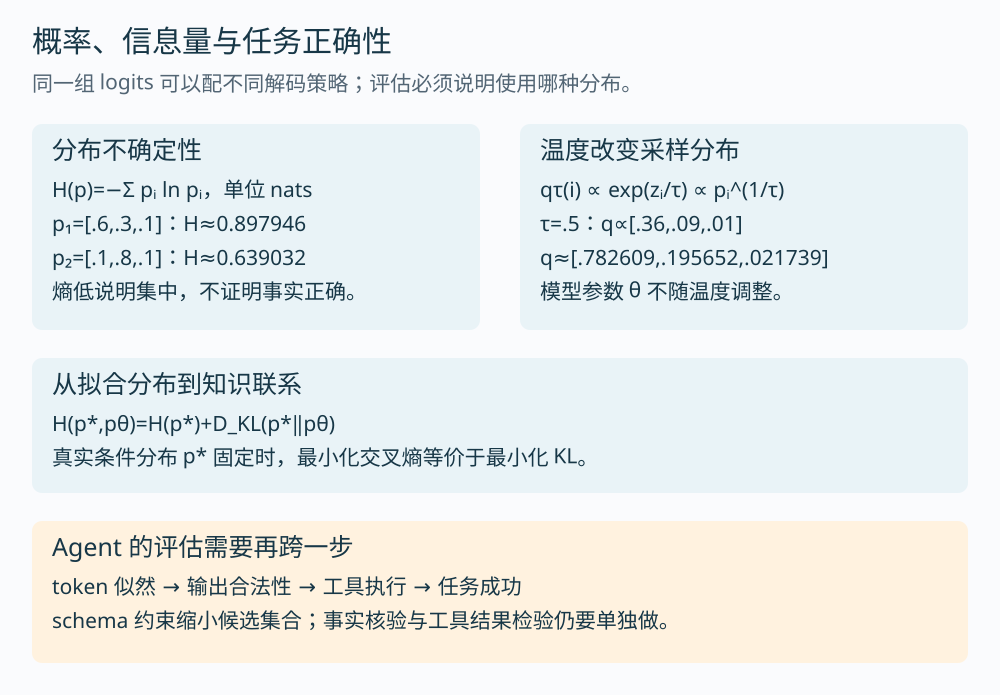

# 第 1 课：从条件分布到生成、训练与解码

“根据前文预测下一个 token”描述了任务，却没有解释它为什么能工作。要理解大模型，至少还要回答：前文怎样影响内部表示？表示怎样决定词表上的概率？训练为何能改变这些概率？生成程序又怎样使用它们？

这一课把这些关系接起来。我们沿用“天气很热，我想喝一杯”作为可追踪输入，计算会落到矩阵、条件概率和梯度上。例子保持小，是为了能把每个中间值算清楚。



图中只对输出层给出了完整数值。h₁、h₂ 和输出矩阵 W 都是手工设定，不能据此声称已经算完上游 Transformer。正文第 3 节会单独算一次小型因果注意力，第 4 节再接回输出层。

建议分三次聊天完成：先读第 1～4 节，算通前向过程；再读第 5～7 节，推导训练与解码；最后运行代码、做面试追问。整课约需 90～120 分钟，具体看数学基础。公式采用行向量约定，并用纯文本保留，下载 Markdown 后也可直接阅读。

## 1. 先定义：究竟在建模什么？

### 1.1 从文本空间到 token 空间

分词器将文本编码为离散编号序列。设词表为 𝒱，大小为 V；当前上下文经过编码后为 C=(x₁,…,xT)。我们要建模的是：

```text
pθ(y | C)，其中 y ∈ 𝒱
```

θ 是模型参数的集合。每个具体 C 对应一个 V 维概率向量，各项非负、总和为 1。它是一个条件分类分布。

这与“检索一个现成答案”有明显的计算差别：模型输出层为词表候选计算分数，再由生成程序选取 token。至于模型是否记忆了某段训练文本，要另做实验，不能从生成接口本身判断。

本文假设“冰水、热茶、果汁”分别是单个 token，并将词表缩至这三项。真实分词器未必这样切分；这个假设只服务于手算。下一课会研究分词边界、BPE 以及编码长度怎样改变计算成本。

### 1.2 自回归是分解方式，不是 Transformer 的同义词

设目标序列 Y=(y₁,…,yN)。由条件概率的定义：

```text
p(A,B | C) = p(A | C) · p(B | C,A)
```

反复使用这个等式，就有：

```text
pθ(Y | C) = ∏ₜ₌₁ᴺ pθ(yₜ | C,y₁,…,yₜ₋₁)
```

每一项仍然可以依赖全部可见前文；没有假设 token 彼此独立，也没有强行采用一阶马尔可夫假设。实际模型通常只保留有限长度的上下文，那是实现和资源约束带来的限制。

如果要描述“完整输出到此结束”的概率，需要将结束 token 也纳入 Y。只乘正文 token，得到的是该前缀路径的概率。



概率链式法则告诉我们“要计算哪些项”。RNN、Transformer 等网络则决定“用什么函数计算这些项”。这一区分很有用：训练目标、网络结构、解码策略是三层不同的设计，不能把它们混成一个概念。

**自检：**“自回归模型只能看前一个 token”错在哪里？

<details>
<summary>展开分析</summary>

式子中第 t 项的条件是整个前缀，不只是 yₜ₋₁。“自回归”表示将已有输出作为后续条件，不限制条件必须只有一个 token。有限窗口会截断更早的上下文，但窗口内仍可利用多个位置。

</details>

## 2. 一个条件分布怎样被神经网络参数化？

下面忽略 batch 维，所有 token 向量按行存放。

| 对象 | 形状 | 用途 |
| --- | --- | --- |
| token ID | T | 输入的离散编号 |
| 嵌入矩阵 E | V×d | 每个编号对应一个 d 维向量 |
| 输入表示 X | T×d | 查表得到各位置的向量，并按架构处理位置信息 |
| 最后一层表示 H | T×d | 各位置融合可见前文后的状态 |
| 最后位置 h=H[T,:] | 1×d | 为当前完整前缀预测下一项 |
| 输出矩阵 W | d×V | 将表示投影到词表分数 |
| logits z=hW+b | 1×V | 未归一化的候选分数 |
| pθ=softmax(z) | 1×V | 模型的下一 token 分布 |

若用 S 表示输入 ID 对应的 one-hot 矩阵，`S∈R^(T×V)`，嵌入查表等价于 `X=SE`。实际实现不必物化巨大稀疏矩阵 S，直接按 ID 取行即可。

把 Transformer 主体记作 fθ，就得到一条完整的函数组合：

```text
C → ID → X → H=fθ(X) → h=H[T,:] → z=hW+b → pθ
```

这里将位置处理包含在 fθ 及其输入约定中。绝对位置向量可以加到嵌入上，RoPE 则作用在注意力中的 Q/K 上；不能把所有模型都写成同一种“嵌入加位置向量”。

如果输入嵌入与输出权重共享，常见关系是 `W=Eᵀ`。于是同一参数既参与输入查表，也参与输出打分。这是一个架构选择，不是概率模型要求的恒等式。

**关联知识：**查表连接离散编码与线性代数；输出层连接神经表示与多分类逻辑回归；共享权重连接参数效率与表示约束。它们会在后续分词、矩阵和训练课程分别展开。

## 3. 为什么同一个词，在不同前文下会得到不同表示？

输入查表时，同一个 token ID 对应同一行 E。不同的是上下文计算：其他位置会通过注意力影响当前表示。

### 3.1 单头因果注意力

设 `X∈R^(T×d)`，使用三个可训练的投影矩阵：

```text
Q=XWQ，K=XWK，Vv=XWV
Q,K ∈ R^(T×dₖ)，Vv ∈ R^(T×dᵥ)

S = QKᵀ / √dₖ + M          # T×T
A = softmax_rows(S)          # 每一行对来源位置归一化
O = AVv                     # T×dᵥ
```

这里写 Vv 表示 value 矩阵，以免与词表大小 V 混淆。Q、K 决定来源权重，Vv 提供被汇总的内容。

因果遮罩规定 `Mᵢⱼ=0`（j≤i），否则为 `−∞`。在 softmax 中，`exp(−∞)=0`，所以未来位置不会进入当前汇总。位置机制表达顺序，遮罩限制可见范围；这两个作用不能互相替代。[原始 Transformer 论文第 3 节](https://arxiv.org/html/1706.03762v7#S3)给出了缩放点积注意力和解码器遮罩的定义。



### 3.2 算一个两位置例子

为了孤立注意力操作，暂时不加位置编码、残差、归一化和 MLP，并设 WQ、WK、WV 都是单位矩阵：

```text
X=Q=K=Vv = [[1,0],
           [0,1]]

QKᵀ/√2 + M = [[1/√2, −∞],
               [0,    1/√2]]
```

第一行 softmax 为 `[1,0]`。第二行：

```text
a₂₁ = 1 / (1+exp(1/√2)) ≈ 0.330238
a₂₂ = exp(1/√2) / (1+exp(1/√2)) ≈ 0.669762

O₂ = a₂₁·[1,0] + a₂₂·[0,1]
   ≈ [0.330238,0.669762]
```

第二个位置原本是 `[0,1]`，现在汇入了第一个位置的信息。权重由输入计算出来；它不是手工指定“天气占七成、饮料占三成”。

`1/√dₖ` 的动机也能从统计量看出来。在 q、k 各分量独立、零均值、单位方差等简化条件下，点积为 dₖ 个乘积之和，方差为 dₖ。除以 √dₖ 后方差回到 1，减少维度增长带来的分数尺度变化。这是依赖假设的尺度分析，不保证训练后的分量严格满足独立同分布。

真正的 Transformer 还会对注意力输出做投影，并结合多头、残差、归一化和非线性 MLP，逐层形成 H。这次小算例不代替整层网络。注意力权重也不应直接当作模型决策的完整因果解释。

### 3.3 最后一个位置为何能预测下一项？

训练时，位置 i 的表示只看见 x₁…xᵢ，并被用于预测 xᵢ₊₁。到了生成阶段，最后位置 T 恰好看过整个当前前缀，因此取 H[T,:] 来预测下一个 token。

这建立了“遮罩、标签错位、最后位置输出”三者的联系。只背“取最后一行”而不知道它为何对应下一项，很容易写错训练标签。

## 4. 输出层的几何：一组向量怎样变成候选偏好？

本节回到图 1 的独立算例。注意力例子的输出不会直接接入这里；我们另外指定两个最终表示，分析同一输出头如何处理它们。

```text
h₁=[1,0]，h₂=[0,1]，b=0

W = [[ln6, ln3, 0],
     [0,   ln8, 0]]       # 2×3
```

列依次对应冰水、热茶、果汁。矩阵乘法得到：

```text
z₁=h₁W=[ln6,ln3,0]
z₂=h₂W=[0,ln8,0]
```

softmax 定义为 `pᵢ=exp(zᵢ)/Σⱼexp(zⱼ)`。因此：

```text
p₁=[6,3,1]/10=[0.6,0.3,0.1]
p₂=[1,8,1]/10=[0.1,0.8,0.1]
```



### 4.1 为什么说输出头类似多分类逻辑回归？

设 wᵢ 为 W 的第 i 列，`zᵢ=h·wᵢ+bᵢ`。对任意两个候选：

```text
pᵢ/pⱼ = exp(zᵢ)/exp(zⱼ)
log(pᵢ/pⱼ) = zᵢ−zⱼ
            = h·(wᵢ−wⱼ)+(bᵢ−bⱼ)
```

公共分母消掉了。两个候选的对数概率比，是 h 的线性函数；这就是逻辑回归式的输出结构。上游 Transformer 的非线性使 h 可以依赖复杂上下文。

对 h₁，冰水与热茶的概率比为 `0.6/0.3=2`，其对数等于 `ln6−ln3=ln2`。对 h₂，这个比变成 `0.1/0.8=1/8`。参数 W 没变，h 的方向变了。

### 4.2 logits 没有唯一的绝对零点

给所有分数加同一常数 c：

```text
exp(zᵢ+c) / Σⱼexp(zⱼ+c)
= exp(c)exp(zᵢ) / [exp(c)Σⱼexp(zⱼ)]
= pᵢ
```

所以 `softmax(z+c·1)=softmax(z)`。实现时可先减最大值，避免指数溢出；概率保持不变。

更进一步，若收集多个上下文的表示组成 H，则 `Z=HW+1b`，故去掉偏置后的分数矩阵秩不超过 d。这个事实关联到输出表示能力的讨论，但不能直接说“概率矩阵的秩也不超过 d”，因为 softmax 是非线性变换。

**推导练习：**如果希望两个候选概率相等，h 需要满足什么条件？

<details>
<summary>展开解答</summary>

令 `pᵢ=pⱼ`，等价于 `h·(wᵢ−wⱼ)+(bᵢ−bⱼ)=0`。在 h 的空间中，这是线性决策边界；若两组权重和偏置相同，则它们对所有 h 都有相同分数。边界在线性输出空间成立，不表示原始文本空间的边界也是线性的。

</details>

## 5. 从最大似然到梯度：模型如何把目标概率推高？

### 5.1 训练目标来自序列概率

对固定训练数据集 D，最大化样本的条件似然。通常把各样本的似然相乘，再取对数，将乘积变成求和：

```text
maxθ ∏ₛ ∏ₜ pθ(xₛ,ₜ | xₛ,<ₜ)
⇔ maxθ Σₛ Σₜ log pθ(xₛ,ₜ | xₛ,<ₜ)
⇔ minθ L = −Σₛ Σₜ log pθ(xₛ,ₜ | xₛ,<ₜ)
```

实际实现常对有效 token 求平均，并通过 loss mask 忽略 padding 或不参与目标的位置。目标 token 是训练文本在该位置出现的值；不意味着这个上下文只有一种合法续写。



### 5.2 逐步推导 ∂L/∂z=p−y

单位置的目标类别为 k，one-hot 目标向量记为 y。负对数似然：

```text
L = −log pₖ
  = −log [exp(zₖ)/Σⱼexp(zⱼ)]
  = −zₖ + log Σⱼexp(zⱼ)
```

对第 j 个 logit 求导：

```text
∂(−zₖ)/∂zⱼ = −1[j=k]
∂log Σₘexp(zₘ)/∂zⱼ = exp(zⱼ)/Σₘexp(zₘ) = pⱼ

∴ ∂L/∂zⱼ = pⱼ−1[j=k]
```

写成向量就是 `g=∂L/∂z=p−y`。目标类的梯度为负，其他类为正。若直接对 logits 做梯度下降，目标分数上升，其他分数下降。

真实训练更新的是共享参数，不是给每个训练样本永久存一份 logits。共享参数更新还会改变其他样本的预测，因此一次局部改善并不保证所有样本同时改善。

### 5.3 沿输出矩阵反传

对行向量计算 `z=hW+b`，链式法则给出：

```text
∂L/∂W = hᵀg      # (d×1)(1×V) = d×V
∂L/∂b = g        # 1×V
∂L/∂h = gWᵀ     # (1×V)(V×d) = 1×d
```

以 h₁ 和目标“冰水”为例：

```text
p=[0.6,0.3,0.1]，y=[1,0,0]
g=[−0.4,0.3,0.1]

∂L/∂W = [[−0.4,0.3,0.1],
          [0,   0,  0]]
∂L/∂h ≈ [−0.387120,0.623832]
L=−ln0.6≈0.510826
```

只更新 W、保持 h 和 b 不变，学习率 η=0.1：

```text
W′=W−0.1·∂L/∂W
p′≈[0.615485,0.286937,0.097578]
L′≈0.485345
```

代码会复算这些值，并对 W 和 h 使用有限差分：

```text
∂L/∂a ≈ [L(a+ε)−L(a−ε)]/(2ε)，ε=10⁻⁶
```

解析梯度与数值梯度一致，才说明推导和实现至少在这个例子上对得上。对 h 的梯度随后还能传回 Transformer 各层，后续课程会继续拆这条路径。

## 6. 同一概率目标，为何训练并行、生成逐步？

训练时一段真实文本已经全部给定，可以将输入设为 `[x₁,x₂,x₃]`，目标设为 `[x₂,x₃,x₄]`。用因果遮罩限制每行可见的位置，一次前向便能计算多个位置的损失。这常被称为 teacher forcing：预测时使用真实前缀。

生成时 y₁ 尚未选出，下一步需要的前缀也尚未确定。基本自回归过程因此逐步推进。训练中使用真实前缀、推理中使用模型自己的输出，会造成前缀分布差异；错误续写可能把后续计算带到训练中少见的条件下。



### 6.1 缓存省掉什么？

推理中 θ 通常固定。因果网络追加新 token 时，旧位置的表示不会因未来位置出现而改变，因此各层过去位置的 K/V 可以保留。新 token 的 query 与已有 K/V 计算注意力，再追加自己的 K/V。

缓存保存的是中间计算结果，不是改变了模型参数。具体实现会受位置处理、滑动窗口和缓存策略影响；这里讨论常规追加式因果解码。[Hugging Face 缓存说明](https://huggingface.co/docs/transformers/en/cache_explanation)解释了这类复用方式。

标准注意力对长度 T 的所有位置计算分数，乘法量约为 `O(T²d)`；缓存后的单步 query 对前缀做注意力，约为 `O(Td)`。这是注意力部分的估算，完整层还包括投影与 MLP，不能把它直接当作端到端延迟公式。

### 6.2 手算一份 KV cache

只计算 K 和 V 张量，忽略分配器和其他开销：

```text
bytes = 2 × L × B × T × n_kv × d_head × s
```

2 表示 K、V 两份；L 是层数，B 是 batch，T 是缓存长度，n_kv 是每层 KV 头数，d_head 是头维度，s 是每元素字节数。

取 `L=32,B=1,T=4096,n_kv=8,d_head=128,s=2`，得到 `536870912 bytes=512 MiB`。如果相同条件下使用 32 个 KV 头，则为 2048 MiB。这关联到 GQA/MQA 的缓存节省，但不包含模型权重本身。

## 7. 信息论与解码：高概率究竟代表什么？

### 7.1 softmax 分布与实际采样分布要分开

模型输出 pθ。生成程序可以使用温度 τ>0 改变分布：

```text
qτ(i)=exp(zᵢ/τ)/Σⱼexp(zⱼ/τ)
     =pθ(i)^(1/τ)/Σⱼpθ(j)^(1/τ)
```

对 `[0.6,0.3,0.1]`，τ=0.5 就是先平方再归一化：

```text
[0.36,0.09,0.01]/0.46
≈[0.782609,0.195652,0.021739]
```

在唯一最大 logit 的情况下，τ 趋向 0 时分布集中到最大项；有限 logits、未做其他过滤时，τ 趋向无穷大趋于均匀。温度没有更新 θ。top-k、top-p 或 grammar/schema 约束会进一步改变候选支持集并重新归一化。

因此，拿模型原始概率相乘得到的路径似然，不一定等于某个改写过的解码策略实际产生该路径的概率。



### 7.2 局部最优为何不保证整段最优？

假设第一步 A、B 的概率为 0.6、0.4；第二步目标后续分别为 0.1、0.9。两条两步路径的概率是 0.06、0.36。第一步贪心选 A，却错过更高概率的 B 路径。

这说明局部 argmax 与全序列 argmax 不等价。即使找到最高似然序列，也不等于它最真实、最有用或最符合任务约束，后者取决于训练分布和评价标准。

### 7.3 从交叉熵看“学到分布”

给定某个上下文，设真实目标分布为 p*，模型分布为 pθ：

```text
H(p*,pθ) = −Σᵢp*(i) log pθ(i)
H(p*)    = −Σᵢp*(i) log p*(i)
D_KL(p*‖pθ) = Σᵢp*(i) log[p*(i)/pθ(i)]

H(p*,pθ) = H(p*) + D_KL(p*‖pθ)
```

最后一行把 KL 展开即可验证。当 p* 固定时，H(p*) 与 θ 无关，所以最小化期望交叉熵等价于最小化这个方向的 KL。实际训练只能用有限数据估计目标，还受到优化、模型容量和分布变化的限制。

预测分布本身的熵 `H(p)=−Σpᵢlnpᵢ` 衡量分布集中程度。图 1 的两组概率，其熵约为 0.897946 和 0.639032 nats。第二组更集中，但这不能证明它更符合事实。

平均 token NLL 的指数是常见的 perplexity 定义；比较它需要控制评测数据、tokenizer 和计分方式。不同分词粒度下直接比较每 token perplexity，可能比较的是不同单位。

## 8. 为什么预测任务可能支持复杂能力？哪些还没有被解释？

到这里，我们已经建立了可计算的链路，但还不能从交叉熵公式直接推出“智能必然出现”。

如果文本中的后续取决于变量绑定、事实关系或程序状态，那么能利用这些结构的模型，有机会比只依靠表面词频的模型预测得更好。训练梯度会奖励能降低损失的表示。这给出了能力形成的一个动机，并不保证模型学到的机制与人类完全相同，也不保证它在分布外可靠。

上下文学习提供了一个具体观察：模型参数固定时，提示中的任务说明和示例仍可改变行为。GPT-3 的[少样本研究](https://arxiv.org/abs/2005.14165)就在不做任务梯度更新的设置下评估这种能力。解释它时应区分“输出行为改变”和“参数学习”，再进一步研究模型如何利用上下文。

“涌现”还涉及评测方式。例如，一个长度为 m 的答案必须全部正确才得分，若各步成功率在简化独立假设下为 r，完整成功率为 r^m。r 平滑提高，长答案的完全正确率也可能变化很陡；这一玩具模型说明阈值指标会放大视觉上的跳变。独立假设未必适用于真实推理，因此它是解释可能性，不是实证结论。

[Schaeffer 等人的研究](https://arxiv.org/abs/2304.15004)分析了指标选择如何造成某些看似突然出现的能力。它不能一笔抹去所有能力进步；它提醒我们，看到曲线跳变时要检查连续指标、样本量和任务定义。

后续讨论“为什么能推理”，会围绕机制证据、泛化测试和失败例子进行，避免把“规模变大”当作完整解释。

## 9. 跑一次实验：核对前向、反传和缓存量

[下载并运行 lesson01_math.py](code/lesson01_math.py)。只用 Python 标准库，无需下载模型或申请 API key。

```bash
python3 lesson01_math.py
```

实验会核对：两组输出分布、softmax 平移不变性、对数概率比、W 和 h 的解析梯度与有限差分、一次梯度更新、两位置因果注意力、温度、熵和缓存量。

预期重点输出：

```text
p₁=[0.6,0.3,0.1]；p₂=[0.1,0.8,0.1]
L≈0.510826 → 更新一次 W → L′≈0.485345
梯度有限差分最大误差 < 10⁻⁷
KV cache=512 MiB
```

这个程序验证的是拆出来的数学部件，并没有训练完整 Transformer。建议再做两个改动：将目标从冰水改成热茶，检查梯度符号如何变化；把 h 改成 `[0.5,0.5]`，预测输出分布后再运行。

## 10. 面试与复述：能推到哪一步？

### 题 1：为什么最后位置输出能预测下一个 token？

<details>
<summary>答题要点与追问</summary>

因果遮罩保证位置 i 只依赖 x≤i，训练标签又将该位置对齐到 xᵢ₊₁。最后位置 T 的条件就是完整前缀 x≤T。追问：若训练时把标签与输入同位置对齐，模型可能学到什么捷径？若取消因果遮罩，训练损失为何可能很好却不适合逐步生成？

</details>

### 题 2：从 L=−log pₖ 推导对 logits、W 和 h 的梯度

<details>
<summary>答题要点</summary>

先展开为 `−zₖ+logΣexp(z)`，逐项求导得到 `p−y`。令 g=p−y，在行向量约定下，`dW=hᵀg`、`dh=gWᵀ`。说明每一步形状，并用有限差分核对。若推不出，回到第 5 节补链式法则，不只背最终结果。

</details>

### 题 3：把所有 logits 同时加 1000，概率与数值稳定性怎样变化？

<details>
<summary>答题要点</summary>

数学概率不变，朴素计算 exp 则可能溢出。先减最大值可保持概率并控制指数范围。追问：概率只确定分数差，因此相同概率分布并不唯一对应一组绝对 logits。

</details>

### 题 4：GQA 为什么能减少 KV cache？

<details>
<summary>答题要点</summary>

缓存量与 KV 头数 n_kv 成正比，query 头数不直接出现在 K/V 存储公式中。给出层数、batch、长度、头维度、数据类型再估算字节数。追问：为什么单步注意力仍随前缀长度增长？为什么模型权重不计在这份 512 MiB 中？

</details>

### 题 5：工具调用概率很高，是否可以认为 Agent 执行可靠？

<details>
<summary>答题要点</summary>

候选 token 的似然、完整调用结构合法性、参数是否满足业务约束、工具是否实际执行成功，以及最终任务是否完成，是不同层面的指标。先检查 schema 与参数，再看执行结果和任务验收。低熵只能说明模型分布集中，不能替代权限、幂等和结果验证。

</details>

### 题 6：你会怎样向别人解释“预测下一个 token 与智能”的关系？

<details>
<summary>参考组织方式</summary>

先说明这是条件分布学习目标，再解释模型通过上下文表示和输出头计算它，训练用似然梯度改进参数。复杂预测可能要求利用语法、知识或程序状态，因此学到的表示能支持多种任务。最后明确：训练目标本身不是智能充分性定理，能力与涌现需要任务评测和机制证据来支撑。

</details>

## 本课验收与下一课

本课讲义已改为研究生入门深度，个人掌握情况仍由复述和计算来检验。完成标准是：能画出带形状的前向图，推导输出头梯度，解释训练并行与生成依赖，并说清似然、解码和任务正确性的边界。

下一课从输入端继续：分词算法怎样决定离散变量、序列长度和词表大小？这些选择又怎样影响 Embedding、输出头参数量与每 token 的评测结果？

[返回 32 节课程计划](00-课程计划.md)
