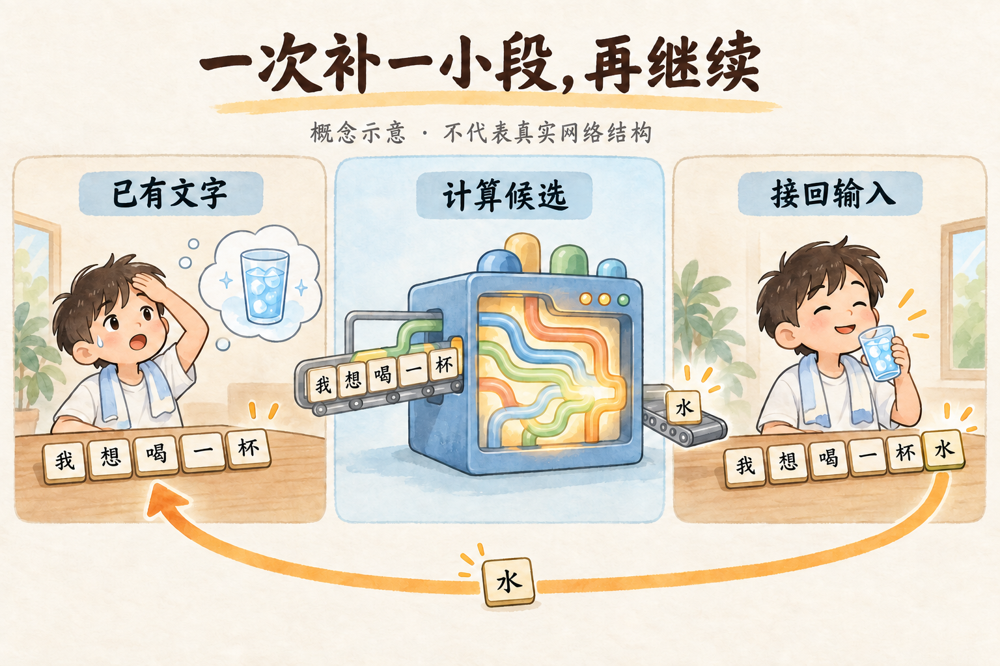
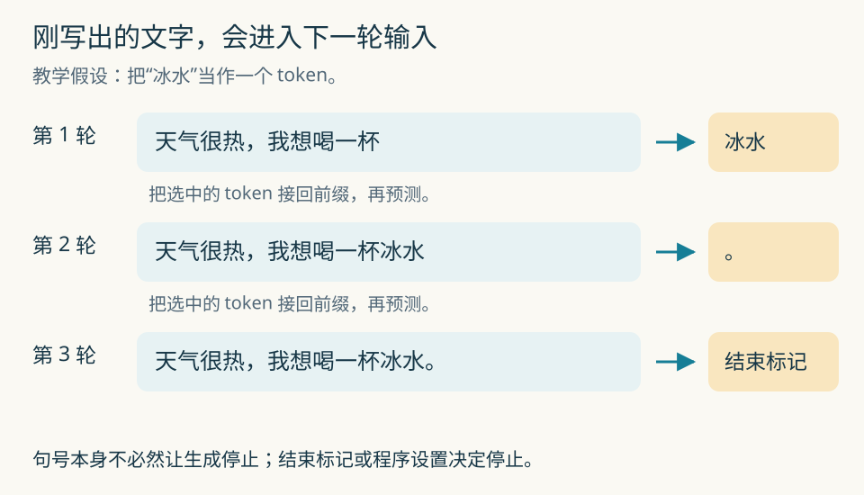
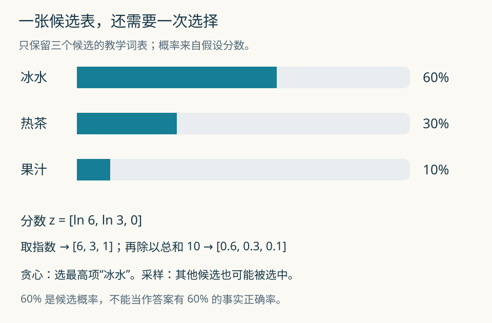
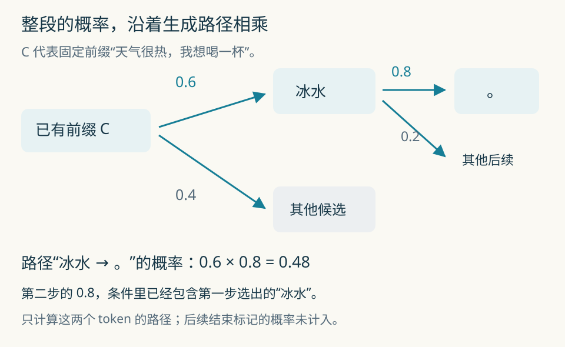
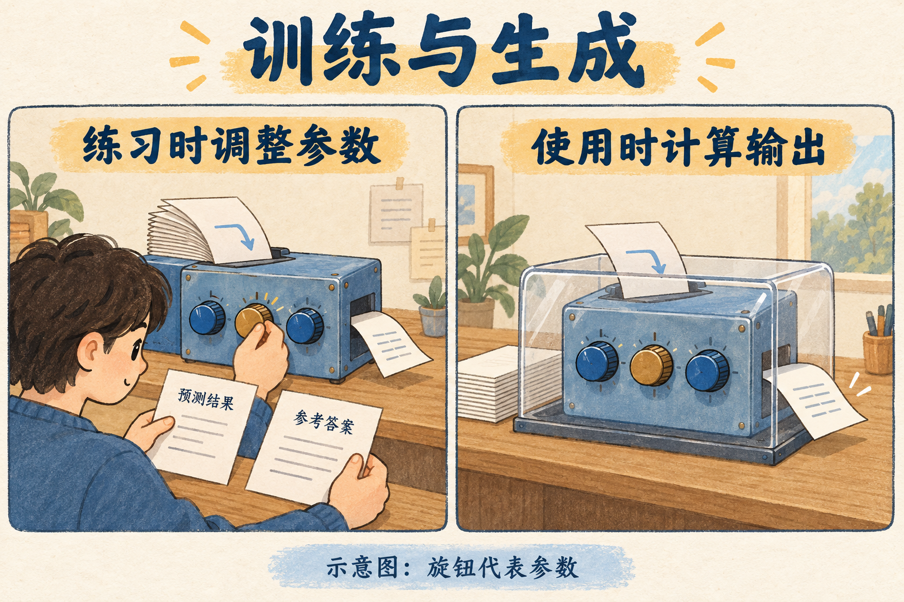
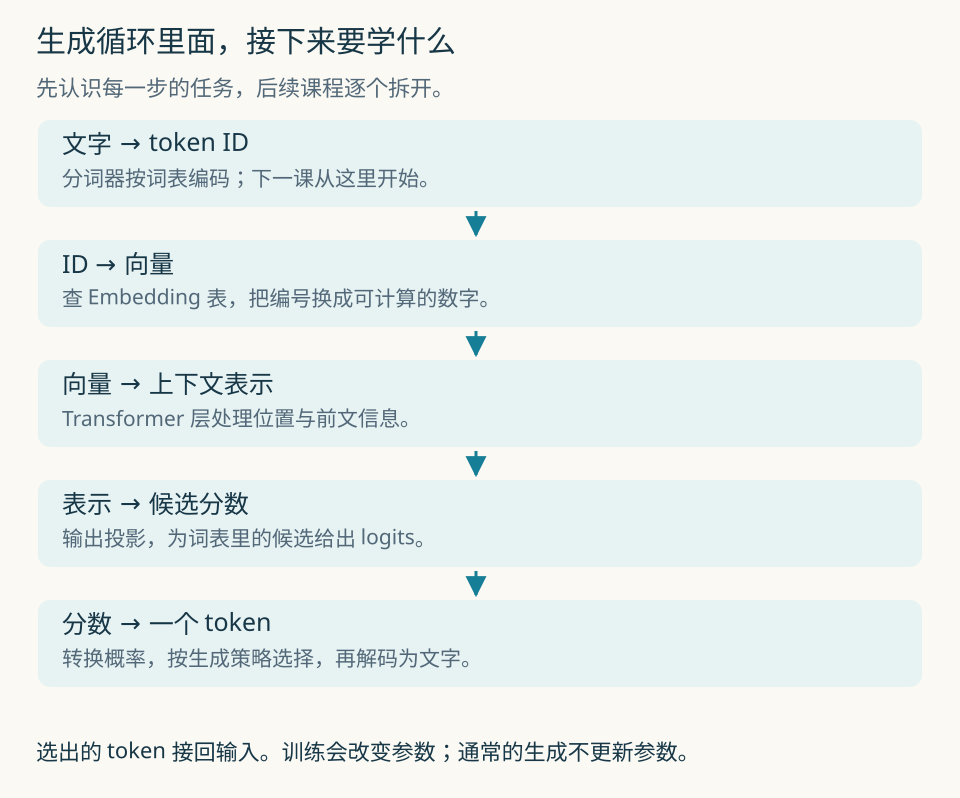

# 第 1 课：模型怎样生成下一个 token

你输入“天气很热，我想喝一杯”，模型接出“冰水”。这两个字是怎么来的？

先别急着背 Transformer 的结构图。我们从屏幕上能看到的接话开始，顺着一次生成往里走。这节课读完，你应该能解释模型每一步算什么、刚写出的文字去了哪里，以及训练和生成有什么区别。

全文约需 40 分钟。第一次读到“停下来想一想”时，先自己回答，再展开解析。图里的概率和分词都是教学设定，不是某个模型的实测输出。

## 1. 接出“冰水”以后，题目就变了

先用人的接话习惯打个比方。朋友说“天气很热，我想喝一杯……”，你大概能想到几种饮料。如果前半句换成“天气很冷”，你想到的候选和偏好可能就不同了。


这张图只帮助我们理解“前文会影响后文”。模型没有口渴的感觉，也不需要先在脑中想象一杯水。它处理的是文字对应的数字，最后给出一组候选分数。

我们先假设它选中了“冰水”。接下来，输入便成了：

> 天气很热，我想喝一杯冰水

第二次预测时，“冰水”已经是题目的一部分。模型可以接句号，也可能接逗号，继续补充内容。



图中把字画在小木块上，只是为了看清顺序。真实模型一次处理的单位叫 **token**，可以是一个字、词的一部分，或标点等片段。具体怎么切，取决于分词器。第二课会专门拆开这件事。

先把循环记下来：

```text
已有文字 → 计算下一项的候选 → 选一个 token → 接回已有文字
             ↑                              │
             └──────── 继续下一轮 ───────────┘
```

这个过程叫自回归生成：自己前面写出的内容，也参与后面的预测。Hugging Face 的[文本生成说明](https://huggingface.co/docs/transformers/en/llm_tutorial)将它描述为根据提示和已生成内容继续生成 token。

### 停下来想一想

这一轮如果选中的是“热茶”，下一轮应该根据什么文字接着写？

<details>
<summary>想好后看解析</summary>

下一轮的前文是“天气很热，我想喝一杯热茶”。模型需要沿着实际选出的内容继续。即使“冰水”原先概率更高，只要这一轮选了“热茶”，后续条件就包含“热茶”。

这也是为什么一句话开头稍有变化，后面可能越写越不一样。

</details>

## 2. 每次接回去，到什么时候停？

把刚才的循环展开。为了便于演示，下面暂时将“冰水”作为一个 token。



第一轮接“冰水”，第二轮接“。”。句号并不保证回答结束：模型也可能再写一句。生成程序通常会在遇到指定的结束 token、达到长度上限，或满足其他停止条件时结束循环。

屏幕上逐渐出现文字，叫流式显示。它是把已经产生的输出及时送给界面；仅凭“一个字一个字出现”，无法判断内部每次算了多少。这里先学标准的逐步自回归流程，后面再讲缓存和加速方法。

还有一个容易漏掉的细节：聊天模型收到的前文通常比用户最后一句话长。系统指令、对话历史，以及程序放进来的检索资料或工具结果，都可能出现在输入中。我们暂时把它们统称为“当前上下文”。

## 3. 模型给出的是一张候选表

“模型选了冰水”这句话省略了中间的计算。我们把它补回来。

假设现在只有三个候选：冰水、热茶、果汁。真实词表远不止这么小，这里是为了能手算。模型先输出三个分数，叫 **logits**，然后可以通过 softmax 转成概率。



别急着记 softmax 的名字。先算一次：

```text
候选       冰水       热茶       果汁
分数       ln(6)      ln(3)       0
取指数       6          3         1
除以总和    6/10       3/10      1/10
概率        0.6        0.3       0.1
```

`ln` 是自然对数。这里用到的关系是 `e^(ln a)=a`，以及 `e^0=1`。所以三个指数值恰好是 6、3、1，总和为 10。每一项除以 10，便得到总和为 1 的概率。

一般写成：

```text
                 exp(zᵢ)
pᵢ = ─────────────────────────
       exp(z₁) + … + exp(zᵥ)
```

`zᵢ` 是第 i 个候选的分数，`pᵢ` 是它的概率，V 是词表大小。`exp(z)` 就是 `e` 的 z 次方。指数把分数变成正数，再除以总和，就完成了归一化。

这次只是认识它如何计算。为什么选这个函数、它的梯度有什么便利，会在第 8 和第 20 课继续推。分数从哪里来，要等我们拆开 Transformer 和输出投影。

### 有概率以后，还没选完

有两种容易理解的办法：

- 贪心选择：取概率最大的候选。本例会选“冰水”。
- 按概率采样：像转动一个按 60%、30%、10% 分区的转盘，也可能落在“热茶”或“果汁”。

采样不保证抽十次恰好出现六次冰水。每次抽取都有随机性；次数很多时，比例才会趋向这些概率。

本例给“冰水”分配了 60% 的概率，这不等于“回答有 60% 的事实正确率”。前者是下一项的分布，后者需要另做事实核查。把两者混在一起，做 Agent 时很容易误判工具调用或答案的可靠性。

### 手算一下

如果另一次计算取指数后得到 `[2, 2, 6]`，三个概率分别是多少？

<details>
<summary>查看计算</summary>

总和是 10，所以概率是 `[0.2, 0.2, 0.6]`。它们都非负，总和为 1。若使用贪心选择，就选第三项；若按概率采样，前两项仍可能被选中。

</details>

## 4. 一条竖线，表示“已经知道什么”

现在把“根据前文猜后文”写成数学：

```text
P(下一个 token = 冰水 | 当前上下文)
```

`P` 表示概率，竖线 `|` 读作“在……条件下”。这句话读作：在给定当前上下文的条件下，下一个 token 是“冰水”的概率。

如果用 C 代替“天气很热，我想喝一杯”，就可以简写成：

```text
P(冰水 | C) = 0.6
```

补上“冰水”后，下一次问的是：

```text
P(。 | C, 冰水)
```

看竖线右边，多了一个“冰水”。这正是刚才循环里“把输出接回输入”的数学写法。

“天气很冷”对应的是另一个条件，因此可以有另一组概率。这里没有规定热天一定喝冰水，也没有规定冷天一定喝热茶。我们只是在说：条件变了，模型算出的分布可以跟着变。

## 5. 两个 token 连起来，概率怎么算？

再往前走半步。假设：

```text
P(冰水 | C)       = 0.6
P(。 | C, 冰水)   = 0.8
```

那么连续生成“冰水”“。”这两个 token 的概率是多少？



答案是 `0.6 × 0.8 = 0.48`。这里有一个可以推出来的关系，不用靠记忆。

在给定 C 的情况下，设事件 A 为“第一项是冰水”，事件 B 为“第二项是句号”。条件概率的定义是：

```text
                 P(A 且 B | C)
P(B | C, A) = ──────────────────
                    P(A | C)
```

意思是：在已经落入 A 的那些情况里，再看 B 占多大比例。假设 `P(A|C)>0`，两边乘以分母：

```text
P(A 且 B | C) = P(A | C) × P(B | C, A)
```

代回刚才的词：

```text
P(冰水, 。 | C)
  = P(冰水 | C) × P(。 | C, 冰水)
  = 0.6 × 0.8
  = 0.48
```

注意第二项的条件必须包含“冰水”。如果写成 `P(冰水|C) × P(。|C)`，就把第一步对第二步的影响丢掉了。我们没有假设两个 token 独立。

三个 token 也一样，多乘一项：

```text
P(y₁, y₂, y₃ | C)
  = P(y₁ | C)
  × P(y₂ | C, y₁)
  × P(y₃ | C, y₁, y₂)
```

一般形式是：

```text
P(y₁,…,yₙ | C) = ∏ₜ₌₁ⁿ P(yₜ | C, y₁,…,yₜ₋₁)
```

`∏` 表示把各项乘起来；下标 t 表示当前生成第几项。这就是概率的链式法则，也说明了为什么可以把序列概率分解成一步步的条件概率。

它本身并没有告诉我们怎样计算每一项。神经网络负责学出这些条件分布，Transformer 是常用的实现结构。

本例的 0.48 只对应这两个 token；如果还要求第三项为结束标记，需要再乘上相应的条件概率。另外，这条路径概率按这里给定的采样分布计算；若生成程序改用贪心或过滤候选，实际选择过程也会随之改变。

### 停下来算一算

如果 `P(热茶|C)=0.3`，而 `P(。|C,热茶)=0.9`，两项路径“热茶、句号”的概率是多少？

<details>
<summary>查看计算与易错点</summary>

结果是 `0.3×0.9=0.27`。第二项使用的是已经选出“热茶”后的 0.9，不能套用“冰水”分支的 0.8。

</details>

## 6. 这些概率，是怎么学出来的？

到这里，我们一直假设手边已经有一台能给候选打分的模型。它最初的参数通常是随机初始化的；仅仅接上生成循环，并不会自动拥有语言能力。

训练时，把真实文本拆成“前面的内容”和“紧接着出现的目标 token”。模型先预测，再比较它给目标分配的概率，通过损失和梯度调整参数。



图里的旋钮代表参数。真实模型不是靠人逐个拧旋钮，而是让优化算法同时调整大量数值。后面的课程会手算一次更新。

看一个教学片段，暂时按方括号里的单位切分：

```text
训练文本：[我] [想] [喝] [水]

给模型的前文          对应目标
[我]                  [想]
[我] [想]             [喝]
[我] [想] [喝]        [水]
```

“目标”表示这段训练文本在这里实际出现的 token，不表示语言世界里只有这一种合理续写。大量不同文本会提供不同的上下文和后续，模型据此调整条件分布。因果语言建模的训练任务可参见 [Hugging Face 教程](https://huggingface.co/docs/transformers/en/tasks/language_modeling)。

生成时，模型使用已经训练好的参数，为新的前文计算输出。通常的一次聊天推理不执行梯度更新。

| 对比 | 训练 | 通常的生成 / 推理 |
| --- | --- | --- |
| 输入有什么 | 文本前缀，以及对应的训练目标 | 当前上下文 |
| 主要做什么 | 预测、计算损失、更新参数 | 计算分数、选择 token、继续生成 |
| 参数怎样变化 | 优化步骤会调整参数 | 通常保持不变 |
| 内容变多意味着什么 | 更多训练样本可能参与学习 | 上下文变长，后续预测条件改变 |

如果你告诉助手“我喜欢热茶”，它后面可能据此推荐热茶。这可以由上下文变化解释，不必意味着模型参数刚刚被训练了。产品把偏好存进数据库，又是另一种记忆机制。上下文、外部存储、参数更新，要分开讨论。

## 7. 打开模型这个盒子：先认路

候选分数要经过哪些步骤才能算出来？



下节从最上面开始：文字如何切成 token，再换成编号。随后我们学习向量与矩阵，才有足够的工具把 Transformer 里的计算展开。

今天可以把模型参数统称为 θ，θ 读作“西塔”。模型要表达的东西写成：

```text
Pθ(下一个 token | 当前上下文)
```

θ 提醒我们：同一句话放进参数不同的模型，会得到不同的分布。生成循环提供运行方式，训练塑造模型用来预测的参数。

### 那智能从哪里来？

预测任务会对模型提出不一样的要求。补全“法国的首都是……”需要相关知识；补全一段程序可能需要跟踪变量和语法；要在陌生例子上答对，还需要一定的泛化能力。大规模训练可以让模型学到支持这些任务的表示和计算方式。

但“能分解成下一个 token 的预测”还不足以解释所有推理表现，更不能单独证明模型具备某种通用智能。第 21～22 课会用任务、数据和评测来讨论能力形成与所谓“涌现”。这节先把问题留清楚：我们已经知道它怎么往外写，还没有完整解释它怎样学会写对。

## 8. 面试练习：先说自己的答案

下面的问题都可以用本课内容回答。建议先口述 60～90 秒，再展开参考。参考答案是表达示例，不是已经完成的学习记录。

### 问题一：大模型怎么生成一段回答？

<details>
<summary>参考表达</summary>

以 decoder-only 语言模型的基本自回归生成为例，程序先将输入编码成 token ID。模型根据当前上下文计算下一 token 的分数，生成策略从候选中选择一个，将它接到已有序列后面，再继续。遇到指定结束标记、长度上限或其他停止条件时结束。通常生成期间不更新模型参数。

追问“每次都选概率最大的那个吗”：贪心选择会这样做，按概率采样则允许选中其他候选。

</details>

### 问题二：为什么训练能学东西，聊天时却通常不更新参数？

<details>
<summary>参考表达</summary>

训练会利用目标 token 计算损失，再通过反向传播和优化步骤更新参数。通常的聊天推理只使用已有参数计算输出。新的对话内容加入上下文，会改变输出，但不等同于更新参数。外部记忆也应与模型参数区分。

追问“告诉它我的名字后，它为什么记得”：先检查名字是否还在上下文中，或是否由产品从外部存储重新提供，不能仅凭回答就推断参数发生变化。

</details>

### 问题三：屏幕上逐字出现，是否说明整段答案早就准备好了？

<details>
<summary>参考表达</summary>

逐字显示只是界面的呈现方式。基本自回归过程是在已生成内容的条件下继续预测；界面可以将新内容流式展示，也可以积累后一起显示。只观察显示速度和方式，无法确定内部实现。

</details>

### Agent 场景题：为什么相同任务有时会调用不同工具？

<details>
<summary>参考表达</summary>

先检查实际输入是否相同，包括系统指令、历史、工具描述和工具返回；再看模型版本与生成配置。采样也可能使输出发生变化。模型产生工具调用请求后，程序仍要解析、校验并执行，不能把“模型写出了工具名”当作工具已经成功运行。

本课只要求分清模型输出与程序执行。工具 schema、重试和幂等会在 Agent 阶段实作。

</details>

### 手算题：两步生成概率

给定 `P(A|C)=0.4` 和 `P(B|C,A)=0.25`，求路径 A→B 的概率，并说明为什么不能直接使用 `P(B|C)`。

<details>
<summary>答案</summary>

`0.4×0.25=0.1`。第二步的条件包含第一步已经选出的 A，使用 `P(B|C)` 会漏掉这个条件；除非另有适用的独立性假设，否则不能替换。

</details>

## 9. 讲给别人听，可以这样开头

> 你可以先把大模型看成一个根据前文给后续文字打分的系统。它每次选出一个 token，把这个 token 接回输入，再继续计算后面的候选。训练负责调整模型里的参数，让它更能预测文本；平时生成回答时，通常使用的是已经训练好的参数。要解释它为什么能做复杂任务，还得继续看训练数据、模型内部计算和评测结果。

能把这段话讲顺，再自己举一个“选出的词改变后续条件”的例子，就有了本课的基本理解。接下来检查：

- 能写出两轮生成的前文，且第二轮包含第一轮的输出。
- 能读懂 `P(y|C)`，算出两个连续 token 的路径概率。
- 能区分候选概率、事实正确率和实际选择策略。
- 能解释参数更新与上下文变化的区别。

本文是第一课讲义，个人练习与面试回答仍待实际完成。下一课《文字怎样切成 token》将从分词器和词表开始，回答“为什么字数不等于 token 数”。

[返回 32 节课程计划](00-课程计划.md)
