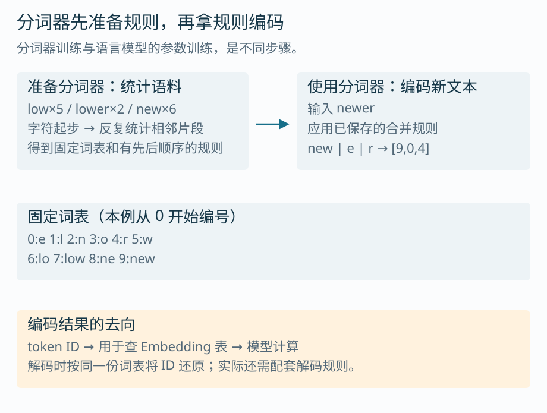
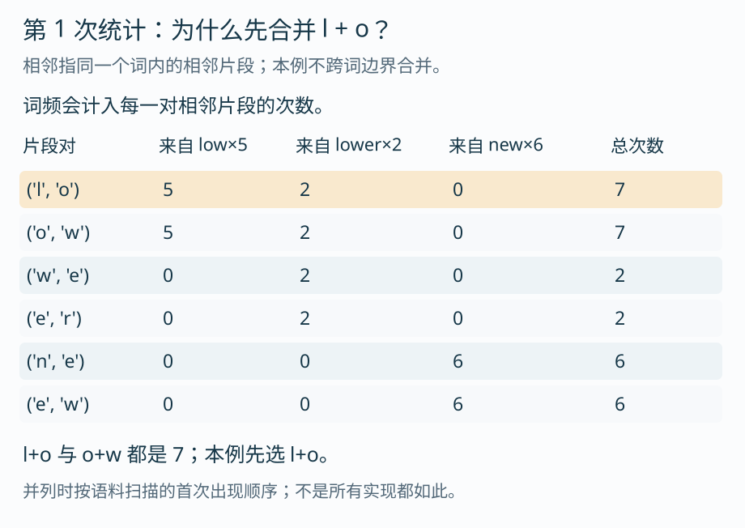
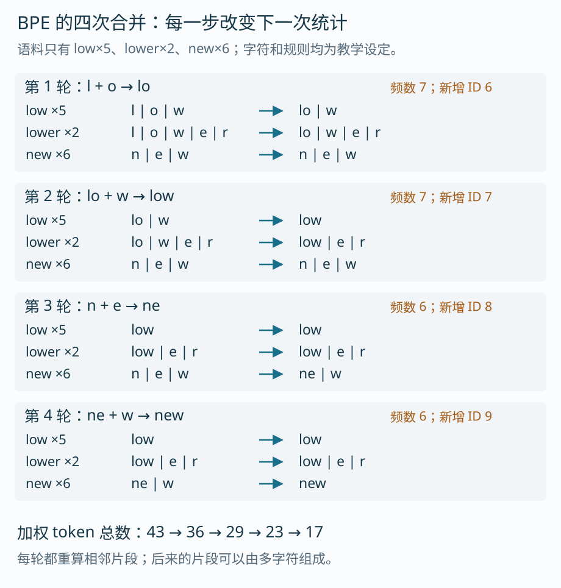
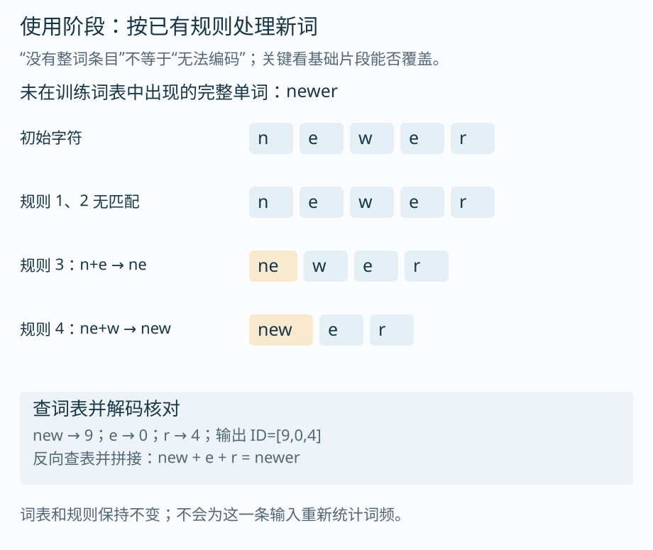
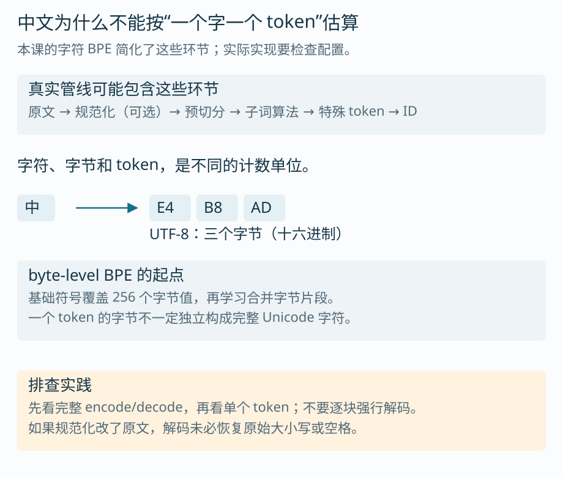
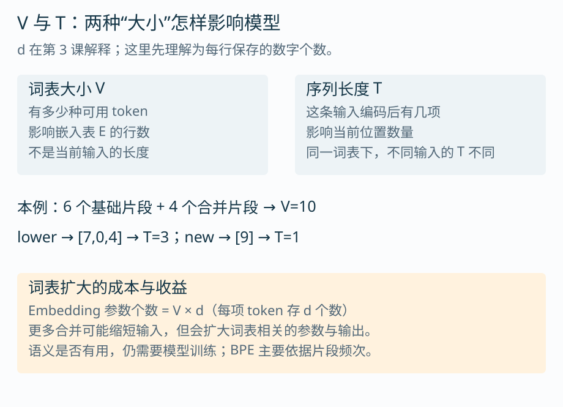

# 第 2 课：文字怎样切成 token

上一课我们把“冰水”暂时当成一个 token。这只是为了看清生成循环。实际输入模型前，必须先决定：这段文字切成哪些块，每一块用什么编号表示。

这一课把分词器拆开。先看它保存什么，再手算一次 BPE，最后解释中文、空格和特殊标记为何会影响实际结果。建议约 40～50 分钟，重点是跟上合并前后的变化。

## 1. 分词器不只是一把“切词的刀”

分词器负责将文字编码成 ID，也负责配合解码规则将 ID 还原为文本。要做到这件事，通常不只需要一张“词 → 编号”的表，还需要知道怎么处理空格、大小写、边界以及特殊标记。



词表可以看成两列：左边是允许使用的 token，右边是对应编号。这里的“词”不一定是完整单词，可能只是 `lo`、`w` 这样的片段。

词表和切分规则各有用途：词表规定“有哪些块、各自编号是多少”，规则规定“给定原文应该选哪些块”。同一个词表，在不同切分规则下，不一定得到同样的编码。

> [!TIP] 先分清两种“训练”
> 分词器训练从语料统计切分规则；语言模型训练调整向量、网络层等参数。它们会一起配套使用，但不是同一个过程。普通聊天不会为每条输入重新训练一份分词器。

## 2. 为什么要用比“整词”和“单字”更灵活的片段？

如果把每个完整单词都收进词表，新词、人名、变量名会不断增加，词表很难覆盖。若只按单个字符切，覆盖容易些，但一个长词会变成许多位置，需要模型处理更长的序列。

子词分词采用中间粒度：经常出现的片段可以合在一起，不常见的词则由已有的小片段组成。BPE 是其中一种算法，英文全称是 Byte Pair Encoding。用于文本时，它也可以从字符等基础符号出发；名称里的 byte 不表示本课必须直接按字节演示。

它的核心操作很具体：统计当前相邻片段对，选择最常见的一对，合成一个新片段，再继续统计。Hugging Face 的 [BPE 教程](https://huggingface.co/docs/course/en/chapter6/5)给出了训练和应用规则的实现方法。

## 3. 用 13 个词的语料，亲手训练四轮

为了看清算法，使用这个小语料。数字表示完整单词出现了几次：

| 单词 | 出现次数 | 初始切分 |
| --- | --- | --- |
| low | 5 | l · o · w |
| lower | 2 | l · o · w · e · r |
| new | 6 | n · e · w |

约定如下：

- 从字符开始，基础词表按字母顺序编号：`e:0, l:1, n:2, o:3, r:4, w:5`。
- 每次合并后，为新片段追加一个编号，不删除基础字符。
- 本例不跨单词边界合并，不做规范化、空格处理或特殊 token 处理。
- 频数相同时，选语料扫描中最先出现的片段对。扫描顺序是 low、lower、new，再从词内左向右扫描。真实实现可能采用别的并列规则。

这些约定决定了算例可重复；它不是某个现成模型的真实词表。

### 3.1 第一轮：次数要乘上词频

`l + o` 在 low 里出现一次，在 lower 里也出现一次，但两种单词分别出现 5 次和 2 次。因此这个片段对的总次数是 `5+2=7`。



`o + w` 同样是 7。按照本例的并列规则，先合并 `l + o → lo`，新片段 lo 的编号为 6。

```text
合并前                  合并后
l | o | w        →      lo | w
l | o | w | e | r →      lo | w | e | r
n | e | w        →      n | e | w
```

> [!TIP] 数的是出现次数，不是“有几个词含有它”
> low 和 lower 只占两种词形，却为 l+o 提供 7 次出现。如果一个词内有多处相同相邻片段，也应计入其出现位置。本例特意使用简单单词，避免重叠匹配干扰主线。

### 3.2 第二轮：重算之后，lo 和 w 成了相邻片段

第一轮合并后，`lo + w` 在 low、lower 里都出现，总次数仍为 7。于是：

```text
lo + w → low，新 ID 为 7
```

不要沿用第一轮的旧相邻关系。现在参与统计的单位已经是 `lo`，不是最初的单个字符 `l` 和 `o`。

### 3.3 第三、四轮：new 也逐步合出来

第二轮后，new 仍为 `n | e | w`。`n+e` 与 `e+w` 各出现 6 次，本例先选 `n+e → ne`，然后合并 `ne+w → new`。



四轮之后，规则按顺序保存为：

```text
1. l  + o → lo    ID 6
2. lo + w → low   ID 7
3. n  + e → ne    ID 8
4. ne + w → new   ID 9
```

最终编码：

```text
low   → [low]       → [7]
lower → [low,e,r]   → [7,0,4]
new   → [new]       → [9]
```

这个语料最初共有 `5×3+2×5+6×3=43` 个字符位置。四轮后共有 `5×1+2×3+6×1=17` 个 token 位置。词表从 6 项增加到 10 项，语料编码变短了。这只是当前语料的结果，不能把这个缩短比例直接推广到其他文本。

> [!TIP] 合并的依据是频率，不是词义
> low 恰好是完整单词，lo 则只是片段。BPE 不需要先判断它们的语义或语法身份。不要把“合成一个 token”理解成“已经知道这个词是什么意思”。

## 4. 使用阶段：新词会怎样编码？

现在冻结词表与合并规则，输入一个训练中没有作为完整词出现过的 `newer`。



按顺序看：

```text
初始：n | e | w | e | r
规则 1、2：没有可合并的 l+o 或 lo+w
规则 3：ne | w | e | r
规则 4：new | e | r
编码：[9,0,4]
```

虽然词表里没有完整的 newer，但它能由已有片段组成。解码时查回 `new、e、r`，在本例中直接拼接就能恢复 newer。

> [!TIP] “未见过整词”与“无法编码”要分开
> 只要基础片段能覆盖，新词通常可以拆成已有 token。本课简化词表没有字符 z，输入包含 z 时配套代码会明确报错；真实系统可能使用未知标记、字节级覆盖或其他回退机制，要看配置。

### 规则顺序为何需要保存？

BPE 使用已有合并优先级，不能笼统地替换成“从左到右找最长 token”。看一个独立反例：

```text
基础字符：a、b、c
规则 1：b+c → bc
规则 2：a+b → ab
输入：abc

按规则：a | b | c → a | bc
若从左到右取最长词表项：ab | c
```

两者使用的片段集合可以相同，切分结果却不同。工程上更稳妥的做法是加载模型配套的 tokenizer，而不是凭词表自己拼一个近似切分器。

> [!TIP] 每轮重新统计，只发生在训练规则时
> 编码一条新输入时，使用的是保存下来的规则顺序。输入中某个片段突然出现很多次，不会自动获得更高的合并优先级。

## 5. 中文、空格和标点为什么更容易让人误判？

本课用英文字符把算法拆清楚。真实文本管线还可能有规范化、预切分、字节处理和特殊 token。

- 规范化：例如统一某些字符形式，是否启用取决于配置。它可能改变原文表示。
- 预切分：在应用子词算法之前，先按空格、标点或其他模式划定片段边界。
- 特殊 token：为序列边界、填充或对话角色等目的预留的编号，具体用途依模型而定。



`中` 是一个 Unicode 字符，在 UTF-8 下对应三个字节：`E4 B8 AD`。字节级 BPE 从字节表示开始学习片段；某个 token 保存的字节不一定独立构成完整字符。因此，单独解码一个 token 可能看到不完整字符，合起来解码却是正确文本。

这不是说“中文固定三个 token”。三个字节可以参与合并，最终数量仍由具体词表和规则决定。不同算法和处理步骤的区别可参考 [Hugging Face 分词算法说明](https://huggingface.co/docs/transformers/en/tokenizer_summary)。

> [!TIP] 空格也可能属于 token 的内容
> `word` 与带前导空格的 ` word` 可能有不同编码。排查时同时打印原始字符串的可见转义、token 字符串和 ID；只看人眼显示出来的单词，容易漏掉差别。

> [!TIP] 解码能恢复到哪一步，取决于整个管线
> 本例对可覆盖的单词可以精确往返。若实际分词器先做了不可逆规范化，就不能要求 decode 必然恢复原始大小写、空格或字符形式。

## 6. 词表大小 V 和序列长度 T，别混在一起

V 表示一共有多少种 token；T 表示当前输入用了多少个 token。它们回答的不是同一个问题。



本例固定 `V=10`，编码 lower 时 `T=3`，编码 new 时 `T=1`。词表不因输入换了一个词就变大。

更多合并往往能缩短某些输入，但扩大词表也有成本。下课会看到：如果每个 token 保存 d 个数字，嵌入表就有 `V×d` 个数；输出时也要考虑词表候选。不能只用“token 越少越好”决定词表大小。

> [!TIP] Agent 的上下文预算要在拼装完成后计算
> 用户问题只是输入的一部分。系统说明、工具定义、检索段落、历史对话及对话模板都会影响最终编码长度。用模型配套的 tokenizer 计算完整输入，再预留输出空间，比按汉字数估算更可靠。

## 7. 运行复算，查看实际中间值

[配套代码：lesson02_03_lab.py](code/lesson02_03_lab.py) 只依赖 Python 标准库：

```bash
python3 lesson02_03_lab.py
```

代码会检查四轮合并、词表编号、lower/newer 的编码和解码。它也包含下一课的查表计算。想逐步看变化，可以打开[交互演示](visuals/token-embedding-lab.html)，对照每轮切分和对应 ID。

这不是生产级 tokenizer：它只接受一个由基础词表字符组成的单词，不处理空格、特殊 token、规范化或字节回退。这个范围是为了让实现与图上的步骤一一对应。

## 面试提示：把排查顺序说具体

**场景一：同一句话在两个服务里 token 数不同。** 先确认原文是否逐字符一致，再比较 tokenizer 版本、词表、合并规则、规范化和特殊 token 配置，最后检查是否应用了不同对话模板。不要直接归因于“模型更聪明”或“中文处理更好”。

**场景二：想换成更省 token 的分词器。** 不只是替换切分程序。ID 对应的输入嵌入、输出候选以及特殊 token 约定都与原模型绑定。下一课会用查表演示为什么编号映射一错，计算入口就变了。

**场景三：面试官让你讲 BPE。** 用“统计相邻片段频数 → 合并最高频片段对 → 重算 → 保存规则顺序”解释训练，再补一句“使用时按已有规则编码”。能明确区分这两个阶段，比背算法全称更有用。

## 接到下一课

现在 `lower` 已经变成 `[7,0,4]`。这些编号只告诉我们选中了哪些词表项，模型还没有拿到用来表示它们的向量。

[第 3 课：从 token ID 到向量](03-从编号到向量.md)将沿着这三个编号继续：查什么表、表的行列是什么意思，以及为什么查表等价于一次特殊的矩阵乘法。

[上一课](01-模型怎样生成下一个Token.md) · [课程计划](00-课程计划.md)
