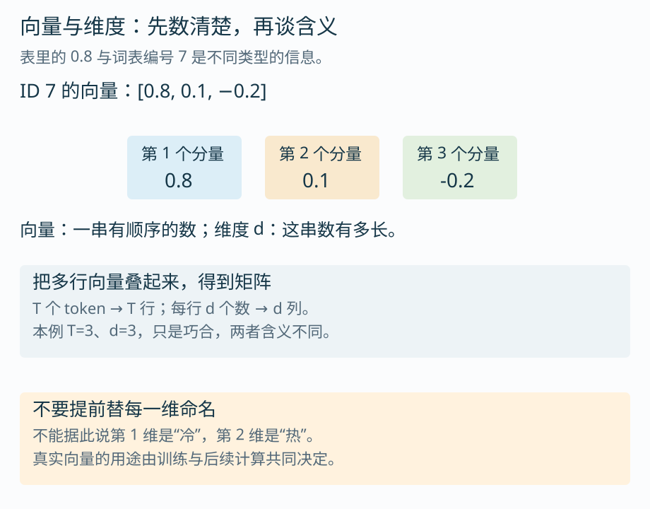
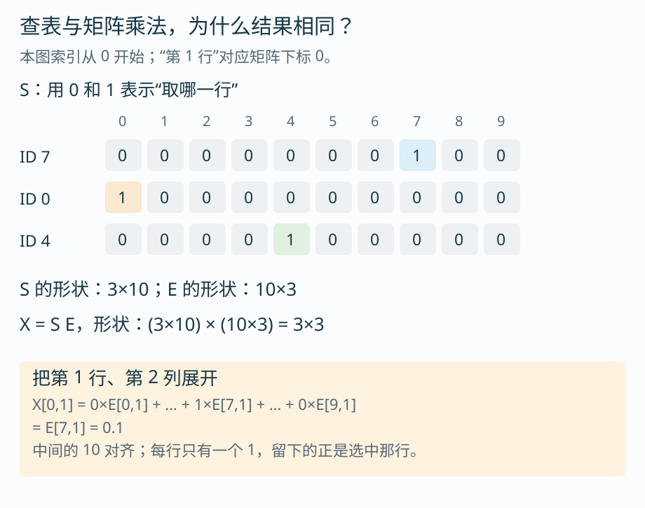
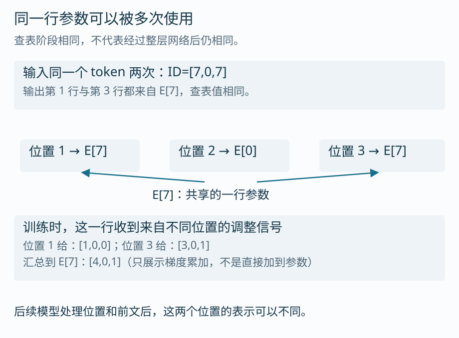
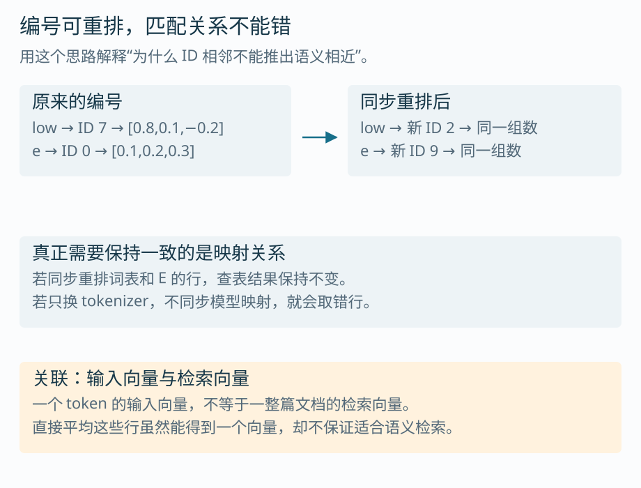

# 第 3 课：从 token ID 到向量

上一课得到：

```text
lower → [low, e, r] → [7, 0, 4]
```

这三个整数只是词表里的编号。模型需要利用编号取出一串可以参加后续计算的数字，这一步叫 Embedding，中文常译作“嵌入”。本课会把查表过程完整算一遍，再解释它和矩阵乘法的关系。

不需要先熟练掌握线性代数。我们会只用到“有顺序的一串数”和“按行列摆放的数表”，接着从一个具体元素推到一般写法。建议约 40 分钟，先看图中的行与箭头。

## 1. 为什么不能直接把 7 当作 low 的含义？

编号 7 可以说明“去词表找编号为 7 的项”，却没有定义 low 应该具有什么特征。对编号做加减也不能稳定表达词义：ID 8 不是“比 ID 7 多一份语义”。

编号最适合承担索引作用。模型另外保存一张数值表 E，每个词表项占一行。读到 ID 7，就取 E 中下标为 7 的行；读到 ID 0，就取下标为 0 的行。

> [!TIP] 下标从 0 开始
> 本课沿用 Python 的编号习惯。E[0] 是表里的第一行，E[7] 是第八行。文字说“第一个输入位置”时，它在代码里的下标也是 0。注意区分自然语言的序号与程序下标。

## 2. 把一次 Embedding 查表展开

延续上一课的十项词表，我们为每个 token 手工指定三个数字。它们只用于算清过程，不是经过训练的真实词向量。

![图 1：完整十行 Embedding 表，按输入 [7,0,4] 取出三行，并保持输入顺序](images/l03-01-lookup.svg)

读图时跟着箭头走：

```text
输入第 1 项：ID 7 → E[7] = [ 0.8, 0.1, −0.2]
输入第 2 项：ID 0 → E[0] = [ 0.1, 0.2,  0.3]
输入第 3 项：ID 4 → E[4] = [−0.2, 0.4,  0.1]
```

把取出的行按输入顺序叠起来，得到 X：

```text
X = [[ 0.8, 0.1, −0.2],
     [ 0.1, 0.2,  0.3],
     [−0.2, 0.4,  0.1]]
```

这里没有把编号 7 乘到某个向量上，也没有按编号大小重新排序。查表就做一件事：根据 ID 选行，并保持输入顺序。

在实现中，Embedding 也是可学习的查表参数；PyTorch 的[嵌入函数说明](https://docs.pytorch.org/docs/stable/generated/torch.nn.functional.embedding.html)将输入描述为索引、权重描述为二维嵌入表。

> [!TIP] 查表值不是概率
> 向量里可以有负数，各分量不必加起来等于 1。本例的 −0.2 没有违反任何概率要求，因为这里根本还不是候选概率。输出候选的概率转换要到后面才发生。

## 3. 向量、矩阵、维度，分别在说什么？

向量先理解为一串有顺序的数，例如 `[0.8,0.1,−0.2]`。这串数有 3 个分量，就说它是 3 维向量。这里的“维”只是分量数量，不要求我们在脑中画出三维空间。

矩阵是一张按行列排列的数表。E 有 10 行、3 列；刚取出的 X 有 3 行、3 列。



将具体数量换成符号：

| 符号 | 含义 | 本例 |
| --- | --- | --- |
| V | 词表有多少项 | 10 |
| d | 每个 token 的向量有多少个数 | 3 |
| T | 当前输入有多少个 token | 3 |
| E | 嵌入表，形状 V×d | 10×3 |
| X | 当前输入取出的向量，形状 T×d | 3×3 |

例如，换成上一课的 `new → [9]`，词表 V 仍是 10，向量维度 d 仍是 3，但当前长度 T 变成 1，X 就只有一行。

> [!TIP] T 和 d 相等只是巧合
> T 随输入长度变化，d 是模型配置中的向量宽度。本例都取 3 是为了省掉大表格，不代表每句话的 token 数必须等于向量维度。

> [!TIP] 不要先替每一维取语义名字
> 图中没有规定“第一维表示冷、第二维表示热”。真实嵌入表通常通过训练学到，很多信息会分散在多个分量及后续变换中。给每一维硬贴上一个人类概念，容易让类比变成误解。

## 4. 为什么说查表等价于矩阵乘法？

这一节不要求先背乘法规则。我们先用 0 和 1 表示“只取下标为 7 的那一行”。

可以写一个长度为 10 的向量，只有下标 7 的位置为 1，其余位置为 0：

```text
ID 7 → [0,0,0,0,0,0,0,1,0,0]
```

这种只有一个位置为 1 的表示叫 one-hot，常译作“独热编码”。它是一种表示编号的方式，不是学到的词义。

对 `[7,0,4]` 分别写出 one-hot，按行组成选择矩阵 S：



### 4.1 从一行的加权求和开始

将 S 的第一行看作十个权重，用它们分别乘 E 的十行，再相加：

```text
X 的第一行
= 0×E[0] + 0×E[1] + … + 1×E[7] + … + 0×E[9]
= E[7]
= [0.8,0.1,−0.2]
```

乘 0 的项全部消失，只有选中的那一行留下。第二行的 1 在下标 0，便取出 E[0]；第三行取 E[4]。

### 4.2 再看某一个元素如何算

以输出的第一行、第二列为例，对应代码下标 `X[0,1]`：

```text
X[0,1]
= S[0,0]×E[0,1] + S[0,1]×E[1,1] + … + S[0,9]×E[9,1]
= 0×0.2 + 0×0.0 + … + 1×0.1 + … + 0×0.9
= 0.1
```

计算同一输出行的其他列，就还原整行向量。这正是矩阵乘法的“左边取一行、右边取一列、对应相乘后求和”。

整个过程简写为：

```text
X = S E
形状：(T×V) × (V×d) = T×d
本例：(3×10) × (10×3) = 3×3
```

中间的 V 对齐，因为 S 的每个权重都要对应 E 的一行；左边剩下 T 行，右边剩下 d 列。下一课会将这些 0/1 权重换成一般数值，正式学习线性变换。

> [!TIP] 数学等价，不等于实现时必须造 one-hot
> 如果词表很大，S 中几乎全是 0，显式保存并计算它很浪费。实际通常直接按 ID 取行。one-hot 的价值在于帮助我们证明查表与乘法的关系，而不是要求所有实现照着建一个大矩阵。

## 5. 这张表为什么能“学到”东西？

查表只是前向计算时怎么使用 E；训练则决定 E 里的数值如何变化。模型预测产生误差后，调整信号可以沿着计算过程传回这些被取出的行，帮助下一次预测做得更好。

这里先看信号去哪里，不展开损失和导数。

假设输入编号为 `[7,0,7]`。第一个和第三个位置都取 E[7]，因此两处都依赖同一行参数。



若两个位置传回的梯度分别为 `[1,0,0]` 和 `[3,0,1]`，这条查表路径汇总到 E[7] 的梯度就是 `[4,0,1]`。梯度可以暂时理解为“用于决定参数怎样调整的信号”；它不是直接加到 E 上的更新量，实际还要由优化方法处理。

> [!TIP] “查表”不意味着参数不能训练
> 编号选择的是哪一行；被选中行里的浮点数可以学习。重复出现的 ID 会共享同一行参数，不能为它们各自更新一份互不相干的向量。

> [!TIP] 未出现的行，是否一定不变？
> 只看普通输入查表路径，未被取用的行没有来自这条路径的梯度。如果嵌入表还与输出层共享、使用权重衰减或采用其他训练设置，就不能据此断言这些行一定不会变化。当前课程只需要先分清“这条路径的信号”和“整个训练步骤”。

## 6. 编号、词义和上下文，分别在哪一层？

有一个简单的检验：假设把全部 ID 重新编号，同时把 E 的行也按同样规则搬过去，查表结果会不会变？



只要 token 到向量的对应关系保持不变，输入查表的结果就不变。这说明编号承担的是地址作用，语义不能直接从 ID 的大小或相邻关系推出。

对于完整语言模型，若真的重排词表，还必须同步输出候选编号、特殊 token 和其他相关映射。图里只证明输入查表这一步。

### 同一个 token，遇到不同句子会怎样？

同一个 ID 在查表时通常得到同一行 E。但后续网络还会处理位置信息和前文，因此最终表示可以不同。例如“苹果很好吃”和“苹果发布手机”里的同一 token，在查表以后才有机会结合不同上下文形成不同表示。

这也是输入嵌入与上下文表示的区别：前者是查到的初始向量，后者是经过后续网络处理的结果。第 5 课会沿着这个区别继续。

> [!TIP] 不要把所有叫 Embedding 的向量当作同一种东西
> token 的输入向量、整句或整篇文档用于检索的向量，表示对象和训练目标可能不同。对若干 token 向量直接求平均，确实会得到一个向量，但不保证它适合做语义检索。到 Agent 的 RAG 课程再结合检索任务验证。

## 7. 参数量和张量形状：写代码前先检查这几项

一张 V 行、d 列的普通嵌入表，含有 `V×d` 个参数。本例是 `10×3=30`。

若假设 `V=10000,d=512`，则有 5,120,000 个参数；每个参数占 2 字节时，仅参数数值约占 10.24 MB。这个数不包含梯度、优化器状态、其他网络层和运行时开销。

> [!TIP] 一次编码后的三类数据不要混用
> token 字符串便于人读，ID 是离散整数，Embedding 是可计算的浮点数。调用库时要检查输入类型、编号范围和最后一维的含义；不要把 ID 当作已经是向量的浮点特征传给后续层。

若同时处理 B 条等长或填充后的输入，常见形状是：

```text
ID：B×T
查表结果：B×T×d
```

这里 B 是一次放在一起计算的样本数。先把最后一维看成“每个 token 的向量宽度”，前两维保留样本和位置，就不容易把不同样本或词表行混起来。

## 8. 复算与面试提示

继续运行[两课共用的实验代码](code/lesson02_03_lab.py)，或打开[交互演示](visuals/token-embedding-lab.html)。代码会验证直接取行与 `S E` 相同，并检查重排 ID 后查表结果保持不变。

```text
lower → ID=[7,0,4]
X=[[0.8,0.1,−0.2],[0.1,0.2,0.3],[−0.2,0.4,0.1]]
```

**面试追问一：Embedding 为什么等价于 one-hot 乘权重矩阵？** 从“只有一个系数是 1，其余都是 0”展开一行，比只说“本质是查表”更完整。再补充实际实现通常直接索引，不物化大规模 one-hot。

**面试追问二：换 tokenizer 后，程序还能跑，为什么效果却差了？** 编号可能仍在合法范围内，却对应了错误的向量；运行不报错不能证明映射正确。检查 tokenizer 与模型是否配套，以及词表和特殊 token 是否一致。

**面试追问三：句子里同一 token 出现两次，向量相同吗？** 要先说比较哪个阶段。输入查表通常取相同的一行；加入位置并经过上下文计算后，表示可以不同。若处于训练模式，还应考虑后续随机操作等具体设置。

## 接到下一课

这一课拿到了 X，也用 one-hot 看懂了一种特殊矩阵乘法。下一课会把权重从 0、1 换成一般数值，解释 `y=xW+b` 怎样组合输入分量。这一步接通后，Q、K、V 的投影就有了计算基础。

[上一课：分词与词表](02-分词与词表.md) · [课程计划](00-课程计划.md)
