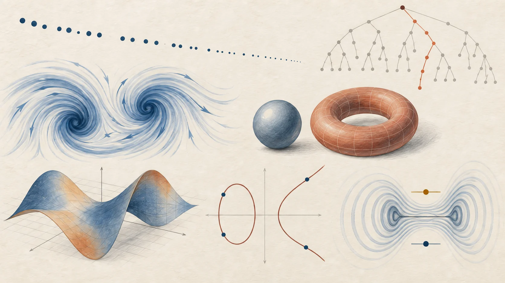
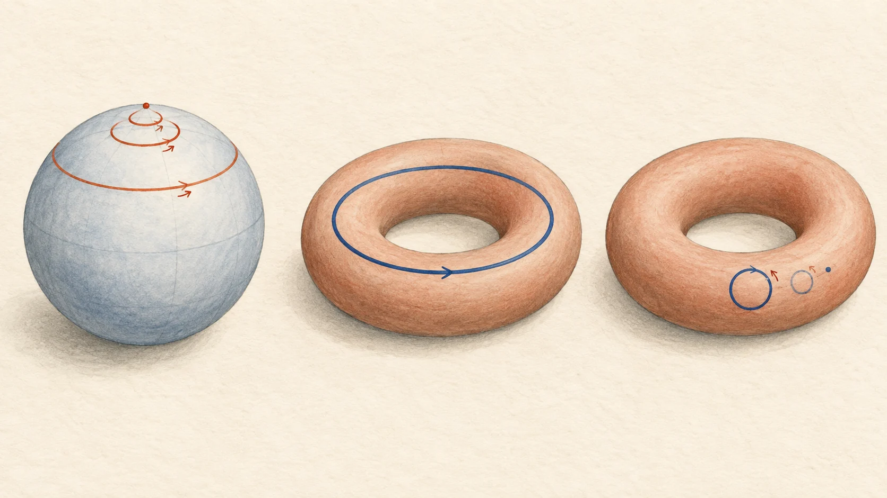

# 千禧年七大数学难题：它们到底在问什么？

上学时的数学题，通常有一个默认前提：答案已经有人知道，只是轮到你来算。千禧年难题没有这份保证。你可以把题目看懂，把电脑跑上很久，甚至找到无数个支持它的例子，仍然不知道它对所有情况是否成立。

2000 年 5 月 24 日，克雷数学研究所（Clay Mathematics Institute，简称 CMI）公布七道“千禧年大奖难题”，每题设立 100 万美元奖金。它们选自当时长期未解的重要问题，涵盖数论、几何、计算和数学物理。[名单与设奖背景](https://www.claymath.org/millennium-problems/)

*文中配图都是概念插画，帮助理解题意。*

## 先认一遍名字

可以先看中间一列，再挑最有兴趣的那道往下读。

| 难题 | 用普通话说，它大致在问什么 | 状态（2026-09-11 核对） |
| --- | --- | --- |
| P 与 NP 问题 | 答案容易检查的问题，是否也都能高效求解？ | 未解决（Unsolved） |
| 黎曼猜想 | 素数分布偏离平均趋势的程度，能否被精确约束？ | 未解决（Unsolved） |
| 纳维–斯托克斯存在性与光滑性 | 三维流体方程的光滑解，会不会在有限时间内失效？ | 已公布解答；Clay 标为 Active |
| 庞加莱猜想 | 满足特定条件的三维空间，能否由“所有绳圈都能缩成一点”认出？ | 已解决（Solved） |
| 霍奇猜想 | 一类空间中某些抽象的形状信息，是否都有代数几何的来源？ | 未解决（Unsolved） |
| 贝赫和斯维讷通–戴尔猜想（BSD） | 椭圆曲线上的有理数解有多少种独立的生成方向？ | 未解决（Unsolved） |
| 杨–米尔斯存在性与质量间隙 | 能否严格建出这类量子场，并证明激发它需要跨过一个正的能量门槛？ | 未解决（Unsolved） |

状态这里要多说一句：Clay 的已解决栏目目前列出庞加莱猜想；2026 年 9 月 8 日，OpenAI 公布了 Navier–Stokes 问题的解答及 Lean 形式化证明，Clay 对应页面当前标为 Active，尚未列为 Solved。文章因此将“公布解答”和“Clay 列为已解决”分别记录，具体范围见第三节。[Clay 名单](https://www.claymath.org/millennium-problems/) · [Navier–Stokes 页面](https://www.claymath.org/millennium/navier-stokes-equation/) · [9 月 8 日的发布说明](https://openai.com/index/navier-stokes-solution/)

## 1. P 与 NP：检查答案容易，找答案也一定容易吗？

想象你在安排一张考试表：有些学生同时选了几门课，这些考试就不能撞时间；考场又只有几个。你试了好几版，改掉一个冲突，又冒出另一个。

但如果别人递来一张排好的表，检查它就直接多了。逐项核对同一名学生是否要同时参加两场考试、同一间考场是否被重复使用，就能判断这张表合不合规。

这种“找起来费劲，检查起来顺手”的落差，就是理解 P 与 NP 的入口。[Clay 通俗介绍](https://www.claymath.org/millennium/p-vs-np/)

数学上的“快”有专门含义。它看的是：随着输入规模变大，计算步骤怎样增长。步数被输入长度的某个多项式限制住，叫多项式时间。比较的对象是一整类问题：考生、科目和约束不断增加，算法是否依然满足这个时间界限。

- P：能在多项式时间内回答的判断题，例如“有没有符合条件的方案”。
- NP：如果答案是“有”，就存在一份长度受到多项式限制的证据，让计算机在多项式时间内核对。

P 中的问题都在 NP 里。悬而未决的是反过来是否也成立，也就是 P 是否等于 NP。NP 的字母并不表示“非多项式”或“注定很难”。[Stephen Cook 的正式问题说明](https://www.claymath.org/wp-content/uploads/2022/06/pvsnp.pdf)

*从零开始拼图，与核对已经拼好的图案，是两种不同的工作。这里借用的是日常直觉。*

真正难的地方也在这里：暴力枚举很慢，只说明这个办法很慢。要证明 P 不等于 NP，得证明至少有一个 NP 问题不存在任何多项式时间算法，连人类还没想到的算法也要排除。

多项式时间也有实际使用上的限度。即使某天证明 P 等于 NP，算法中的多项式次数仍可能很高，慢得无法使用。[正式说明中的效率讨论](https://www.claymath.org/wp-content/uploads/2022/06/pvsnp.pdf)

## 2. 黎曼猜想：素数的分布到底能有多不整齐？

2、3、5、7、11、13……这些是素数：大于 1，正因数只有 1 和自身。任何大于 1 的整数都能分解成素数的乘积，比如 60 = 2 × 2 × 3 × 5。

素数的间隔很不整齐。11 和 13 只差 2，23 和 29 却差 6。往更大的数走，素数总体会变稀疏，但局部又常常挤在一起。

把范围拉大，规律就浮现了。已经得到证明的素数定理，给出了素数数量的平均趋势。黎曼猜想关心的是更细的事情：实际数量会偏离这个趋势多少？[Clay 对问题的概括](https://www.claymath.org/millennium/riemann-hypothesis/)

奇怪的是，正式题目没有直接谈某两个素数相差多少。它说：黎曼 ζ 函数的所有非平凡零点，实部都等于 1/2。

先把术语拆开。“零点”就是让函数输出为零的输入；这里的输入允许是复数，可以画在一个平面上。“实部等于 1/2”表示这些点全都落在同一条竖线上。“非平凡”用来排除另一批位置已经知道的零点。

一个函数上的点，为什么能管到素数？因为 ζ 函数在合适区域内既能写成对正整数求和，也能写成对所有素数取乘积。这把函数的性质和素数的分布联系了起来。研究零点，可以得到素数计数误差的信息。[Enrico Bombieri 的正式说明](https://www.claymath.org/wp-content/uploads/2022/05/riemann.pdf)

要证明的是对全部非平凡零点成立的结论。电脑核对再多，也仍然只核对了其中有限的一部分。

## 3. 纳维–斯托克斯：水流会不会把方程推到失效？

把一点牛奶倒进咖啡，白色纹路会被拉长、卷起，再分成更细的纹路。纳维–斯托克斯方程描述的，就是流体速度和压力怎样随时间变化。

你可以把其中的一股“拉扯”想成这样：流动会把自己的速度变化搬到别处，三维涡旋还可能被拉伸；黏性则倾向于抹平过于剧烈的变化。问题是，这种抹平作用到底能不能一直兜住局面。

大奖题考察三维、不可压缩、有正黏性的流体，在规定的全空间或周期空间里，从满足条件的光滑初始状态出发，解能否一直保持光滑并满足能量要求；或者，能否构造出使这种要求失效的例子。“光滑”说的是速度等数学量足够规则，能持续做方程需要的微分，并不是水面看着平不平。[Charles Fefferman 的正式题目](https://www.claymath.org/wp-content/uploads/2022/06/navierstokes.pdf)

“爆破”指方程的解在有限时间内出现奇异性，例如某些量变得无界。数学模型把液体视为连续介质；模型出现无穷大，不能直接理解成现实中的某滴水真的达到了无限速度。

### 2026 年 9 月的新进展

OpenAI 在 9 月 8 日宣布，其系统给出了解析证明和 Lean 形式化证明：在施加光滑外力的条件下，一开始静止的三维不可压缩流体，可以在有限时间内形成奇异性，并在到达该时刻的过程中保持有限能量。发布方称这满足 Clay 正式题目的 C、D 两种表述。[原始发布说明](https://openai.com/index/navier-stokes-solution/)

“有外力”这个条件不能省。官方题目有不同的证明或反例版本，C、D 允许符合规定的外力；这个结果不能直接改写成“已经证明无外力流动也会爆破”。截至本笔记核对日，Clay 页面显示 Active，尚未放入 Solved 栏目。[官方题目中的四种表述](https://www.claymath.org/wp-content/uploads/2022/06/navierstokes.pdf) · [Clay 当前页面](https://www.claymath.org/millennium/navier-stokes-equation/)

## 4. 庞加莱猜想：用一根绳圈认出一个空间

先看球的表面。想象上面贴着一根可以自由变形的闭合绳圈，只许它在表面移动，不许撕开表面。无论开始时怎样绕，它都能慢慢缩成一个点。

再换成甜甜圈的表面。有些绳圈绕住了洞，怎样挪都缩不成一点，除非离开表面或者把表面撕开。当然，甜甜圈表面上随手画的一个小圆圈仍然可以缩掉。区别在于“所有圈都行”和“存在缩不掉的圈”。[Clay 的绳圈解释](https://www.claymath.org/millennium/poincare-conjecture/)

*图画的是二维表面。庞加莱猜想把类似的问题推进到了三维空间。*

我们平时说“球是三维的”，指的是它放在三维空间里。但只在球的表面活动，局部只需要两个方向来定位，因此球面本身是二维的。

庞加莱把问题往上推进了一维：一个封闭、连通的三维流形，如果里面的每一条闭合曲线都能连续缩成一点，它是不是一定与三维球面 S³ 同胚？

“流形”表示局部看起来像普通空间；“封闭”在这里指紧致且没有边界；“同胚”表示拓扑上相同，允许连续变形，但必须有连续的逆变换。S³ 可以理解成四维空间里到原点距离固定的点组成的集合，它自身有三个维度。[John Milnor 的正式说明](https://www.claymath.org/wp-content/uploads/2022/06/poincare.pdf)

答案是肯定的。佩雷尔曼在 2002—2003 年公布的工作解决了这个问题，使用并推进了汉密尔顿的里奇流方法。粗略地说，里奇流让空间的几何随时间演化，再分析演化中出现的结构和奇异性。Clay 将庞加莱猜想列为已解决。[解题历史](https://www.claymath.org/millennium/poincare-conjecture/)

## 5. 霍奇猜想：算出来的形状信息，能找到几何来源吗？

圆可以写成一个方程：x² + y² = 1。更复杂的多项式方程组也会确定几何对象，有的生活在高维空间里，已经没法画出完整模样。

怎么研究看不见的形状？数学家会把它的一些性质转换成可以计算、比较的代数信息。拓扑里的同调、上同调就是这样的工具：它们记录空间的某些整体结构。“洞”可以帮助入门，但这些工具记录的内容远不止日常意义的洞。

问题随之而来：从这种抽象计算里识别出来的某些信息，能不能在原来的空间中找到由多项式方程定义的几何对象来解释？[Clay 通俗介绍](https://www.claymath.org/millennium/hodge-conjecture/)

正式命题说，光滑复射影代数簇上的有理霍奇类，可以表示成代数循环所对应上同调类的有理线性组合。暂时不熟悉这些名词也没关系，先抓住两点：它只针对某一类空间、某一类信息；“组合”允许使用分数系数。[Pierre Deligne 的正式说明](https://www.claymath.org/wp-content/uploads/2022/06/hodge.pdf)

分数系数这个条件尤其要保留：把它收紧成整数，命题就会出现反例。这也解释了为什么正式题目里有那么多限定词。[整数版本的反例](https://www.claymath.org/wp-content/uploads/2022/06/hodge.pdf)

## 6. BSD 猜想：分数解之间，藏着什么结构？

先看一个能亲手试的方程：y² = x³ − 2。代入 x = 3、y = 5，两边都是 25，所以（3，5）是一个解。

现在允许坐标使用分数，比如 1/2、7/3，连同整数在内，都叫有理数。问题一下子变了：这样的解到底有多少？如果有无穷多个，它们之间有什么组织方式？

BSD 的全名是贝赫和斯维讷通–戴尔猜想，研究对象是椭圆曲线。虽然名字带“椭圆”，它通常并不是我们画的椭圆；在合适条件下，可以用 y² = x³ + ax + b 这样的三次方程描述。[Clay 的问题介绍](https://www.claymath.org/millennium/birch-and-swinnerton-dyer-conjecture/)

椭圆曲线上的有理点有一套“加法”，其中还要加上一个充当零元素的“无穷远点”。两个点按规则组合，可以产生另一个点。更进一步，所有有理点可以由有限个基本点通过反复相加、相减生成。其中那些能够不断生成新点、彼此又独立的方向，数量叫作“秩”。还会有一部分反复相加后兜回原处的点，它们不计入秩。

所以“有无穷多个解”还不够细。一个独立方向与两个独立方向，都是无穷多个点，但组织结构不同。[Andrew Wiles 的正式说明](https://www.claymath.org/wp-content/uploads/2022/05/birchswin.pdf)

BSD 给出了一条出人意料的对应：把曲线放到不同素数的“取余数世界”里数点，用这些计数构造 L 函数；这个函数在 s = 1 处的零点阶数，应当等于曲线有理点的秩。

“阶数”可以先看简单例子：s − 1 在 1 处是一阶零点，(s − 1)² 是二阶零点。BSD 声称，用许多有限世界的计数得到的函数，能告诉我们分数解有多少个独立方向。完整猜想还规定了函数在该点附近首项系数与其他算术量的关系。[正式猜想及背景](https://www.claymath.org/wp-content/uploads/2022/05/birchswin.pdf)

难处在于：给定一个分数点，代入验证很容易；想证明自己已经掌握了全部有理点的结构，就要处理分子、分母都没有上限的情况。

## 7. 杨–米尔斯：为什么激发一个场，需要最低限度的能量？

“场”听起来很抽象，可以先想想天气图：每个地点有一个温度，整张图记录了温度在空间中的分布。量子场当然比温度场复杂得多，但“空间各处都有东西需要描述”这个起点还算直观。

杨–米尔斯理论是一类描述场及其相互作用的理论，也是现代粒子物理使用的数学框架之一。难题关注它的严格数学构造，以及量子版本中的质量间隙。[Clay 的问题介绍](https://www.claymath.org/millennium/yang-mills-the-maths-gap/)

场的最低能量状态叫作真空。把真空的能量定为零，“质量间隙”说的是：允许的能谱在零之上有一段空档。能谱记录系统允许的能量取值，这段空档里没有能级。

如果把能量高度画出来，可以把它想成地面和上方可到达区域之间，有一段跨不过去的空档。这个比方只表示“门槛为正”，不表示所有更高的能量都排成等距台阶。[Arthur Jaffe 与 Edward Witten 的正式说明](https://www.claymath.org/wp-content/uploads/2022/06/yangmills.pdf)

正式任务要求：对任意紧致单规范群，在四维时空里严格构造非平凡的量子杨–米尔斯理论，并证明存在正的质量间隙。研究范围是没有额外物质场的纯规范理论。

麻烦的地方在于，写下形式上的方程、做数值模拟，与证明满足要求的量子理论确实存在，是不同层次的工作。物理上的成功提供了理由去相信这条路，数学证明还得把定义、极限和能谱等环节接起来。[正式问题的存在性要求](https://www.claymath.org/wp-content/uploads/2022/06/yangmills.pdf)

## 读完以后，可以留给自己的两个小问题

如果电脑找到了一百万个符合猜想的例子，它证明了多少？它证明这些例子没有反驳猜想。要推出所有情况成立，还需要能覆盖所有情况的论证。

反过来，如果找到一个反例呢？对于声称“所有对象都满足某性质”的命题，一个真正符合题目条件的反例就足够推翻它。因此判断新成果时，先看它究竟证明了哪个版本、使用了哪些条件，往往比先看标题中的“破解”更有用。第三节里“是否允许外力”的区别，就是现成的例子。

正文中的链接通向 Clay 的介绍、正式题目和新结果的原始发布说明。先读通俗页面即可；PDF 里的定义更完整，也需要相应的大学数学基础。配图由 imagegen 生成，用于概念说明。
