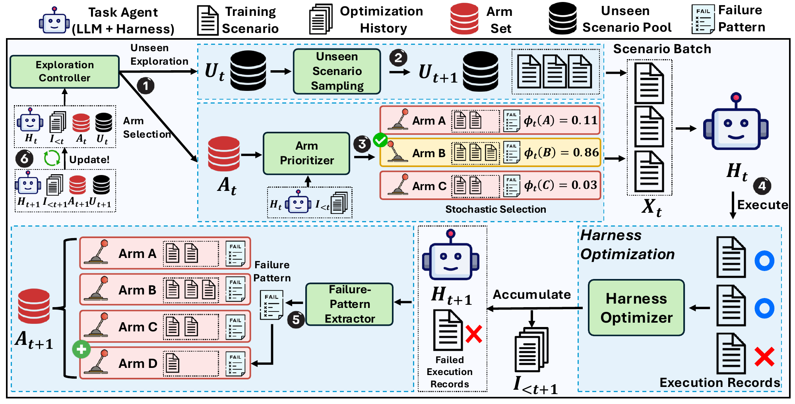

# ActiveSaddler：按失败模式安排代理改进课程

作者：Park, Sungho、Kim, Wonjoong、Zhang, Jue、Han, Wook-Shin、Gao, Pengfei、Park, Chanyoung、Yao, Yongqiang、Fu, Rao、Nallipogu, Elsie、Lin, Qingwei、Rühle, Victor。arXiv:2610.00906 v1，提交日期 2026-10-01（原站日期）。预印本，未据模板推断录用。

为什么现在值得看：这项新近实用 / 新近创新研究把“下一步修哪种失败”变成可适应的课程，而不仅优化补丁生成。作者实验；本站未运行，热度待验证。论文称项目与代码将提供于项目页，不能把预告写成已验证可安装。

ActiveSaddler 改的是代理的提示词、工具接口和控制逻辑，不更新底层模型权重。系统把反复出现的问题抽象成可复用的失败模式，例如工具输出解释错误或证据遗漏，再在“探索未见场景”和“修复已知弱点”之间分配预算。模式的严重度、可修复性、覆盖面和回归情况都会影响后续优先级；同一种任务类别中也可能出现不同模式。

实验沿用 AutoSaddler 的优化器，并使用 GPT-5.5 的既定任务与优化推理档。GAIA2 测试 300 个任务，Terminal-Bench 2.0 使用 89 个任务中的 40 个子集。最终代理运行三次，不等于整个优化过程独立训练了三次。测试 Pass@1，GAIA2 为 59.8±1.0，对固定课程对照的 55.4±1.2；Terminal-Bench 为 80.0±2.5，对照为 72.5±0.0。

消融中，去掉动态模式或探索步骤会损失收益，这比单一最高分更能支持课程设计的作用。论文的美元开销来自当时开发实验与调用设置，不是今天使用服务的报价。它只覆盖两个基准和一种主要底座，动态“多臂老虎机”的表述也不应被理解成已证明所有代理都有最优后悔界。实用启发是把失败日志整理成可重复触发的类别，并保留回归集，而不是每轮都只追逐最新失败。

Park, Sungho 等，Figure 2，先选择探索新场景或重访已知失败，再改提示词、工具接口和控制逻辑；反馈更新优先级。来源论文原图，CC BY 4.0；用于解释本段方法或实验。（[来源原图](https://arxiv.org/abs/2610.00906v1)；[查看原尺寸](../../../frontiers/2026/10/2026-10-04/images/paper-active.png)。）

[原始论文](https://arxiv.org/abs/2610.00906v1) · [版本许可](http://creativecommons.org/licenses/by/4.0/) · [归档 PDF](2610.00906v1.pdf)

英文摘要：Automated harness optimization can substantially improve LLM agents by iteratively updating their prompts, tool interfaces, and control logic from execution feedback. However, existing methods primarily optimize how the harness is updated while largely fixing which training scenarios generate the feedback that drives those updates. As the harness evolves, the scenarios most useful for further optimization can change, suggesting that the training curriculum itself should adapt alongside the harness. We formulate this missing dimension of harness optimization as an automated curriculum learning problem and introduce ActiveSaddler. ActiveSaddler models the evolving curriculum as a non-stationary bandit with dynamically instantiated optimization targets. It abstracts recurring failures into reusable failure-pattern arms, estimates the potential learning progress from further targeting each pattern, and adaptively balances revisiting known weaknesses with exploring unseen scenarios for new ones. Optimization outcomes continually update both the set of discovered failure patterns and their priorities, allowing the curriculum to co-evolve with the harness. Experiments on GAIA2 and Terminal-Bench 2.0 show that ActiveSaddler consistently discovers stronger harnesses, improving test Pass@1 by 4.4 and 7.5 percentage points over the same harness optimizer using a scenario order fixed before optimization, respectively. Ablations further show that these gains depend on dynamically constructing optimization targets, estimating their evolving utility, and balancing continued optimization with new failure discovery. Together, these results establish automated curriculum learning as a new crucial optimization dimension for harness optimization.

归档为未改动的 v1 PDF；再分发依据该版本 CC BY 4.0，作者署名与许可保留。

[返回本期论文精选](../../../frontiers/2026/10/2026-10-04/03-论文精选.md)
