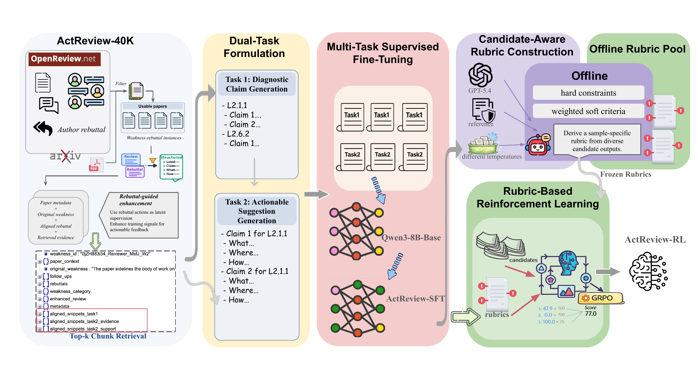

# ActReview: Rebuttal-Guided Training Data and Rubric Rewards for Actionable Peer Review Generation

**2026-09-08 · arXiv 2609.09076v1 · 预印本。** 作者：Ma, Yiling; Zhao, Yilun; Wu, Sihong; Chen, Ziyu; Patwardhan, Manasi; Cohan, Arman。

训练信号怎样让“实验不足”变成具体的补实验方案。

“缺少实验”不能告诉作者下一步做什么。ActReview 从审稿意见与作者 rebuttal 构建训练数据，将建议组织为做什么、在哪里改、如何执行。论文正文和指定的弱点类型参与输入；rebuttal 用来构造训练信号，不能在评测时偷偷把作者答案喂给模型。

模型以 Qwen3-8B 为基础，先做监督微调，再用 GRPO 根据固定的弱点专属评分规则优化建议。规则在训练前构造并冻结，目的是减少奖励随着模型输出漂移。检索论文局部内容用于部分训练数据构造，但正式评测给所有比较模型完整论文上下文，这一点需要与方法图一起看。

自动评价由模型评分，作者还抽取 200 个实例，让两名研究生在打乱顺序且不显示模型名的条件下标注。报告的 93% 是标注者一致率，不是审稿意见的技术正确率。训练规则和自动评测都使用 GPT-5.4，也意味着评价偏好可能相关，人工抽样规模不足以消除全部偏差。

这项工作的复现价值在于检查建议能否定位到真实段落、补出的实验是否回答原弱点，而不是让审稿措辞更长。实际使用时仍需核对论文是否已经做过所建议的实验，以及新增成本是否合理；可执行性和科学判断正确是两个维度。

Yiling Ma 等的流程原图。训练数据构造与最终推断分开读：rebuttal 属于监督材料。评测阶段所有模型看到完整论文，不能从训练图推出对照组只得到检索片段。（[论文原图](https://arxiv.org/abs/2609.09076v1)；[查看大图](../../../frontiers/2026/09/2026-09-14/images/paper-actreview.png)。）

来源：[arXiv 版本页面](https://arxiv.org/abs/2609.09076v1)。

## 版本与归档

原文采用 [CC BY 4.0](https://creativecommons.org/licenses/by/4.0/)，本站于 2026-09-14 保存未修改的 v1 PDF：[站内原文](2609.09076v1.pdf)。

本卡依据 v1 的方法、实验及限制整理，阅读日期为 2026-09-14，未复现训练或评测。原图仅栅格化为 PNG，未改写数据和关系。
