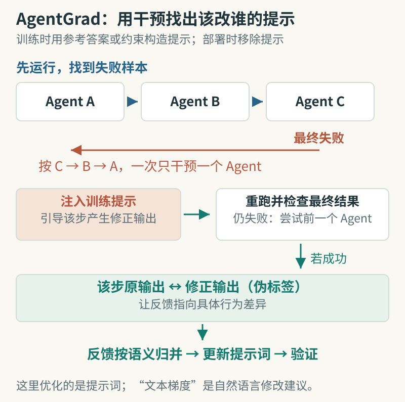

# AgentGrad：先定位出错的 Agent，再改提示词

[arXiv:2609.08572v1](https://arxiv.org/abs/2609.08572v1)，2026-09-08 提交，v1 预印本。阅读记录日期：2026-09-11。

原题：AgentGrad: Intervention-guided Prompt Optimization for Multi Agent Systems。

作者：Jaewon Chu、Jinwoo Seo、Jaewon Cho、Jeehye Na、Yunyang Xiong、Youngdae Kim、Hyunwoo J. Kim。

## 研究问题与摘要

多 Agent 流程失败后，应该改谁的提示词？AgentGrad 在训练时按执行顺序从后往前，为单个 Agent 注入参考答案或约束构造的提示，寻找哪次干预能挽救最终结果，再把修正输出当成该 Agent 的伪标签。部署时移除这些训练提示。它还按语义把相似错误归类，避免把互不相关的反馈简单拼在一起。

作者用 GPT-5-mini、Qwen3-8B，在 HotpotQA、HoVer、IFBench、PUPA、MATH 五组任务上比较 TextGrad、GEPA 等方法，并报告三个随机种子的均值及标准误。GPT-5-mini 的 HotpotQA 结果为 73.89，对照 GEPA 为 68.33；整体优化耗时相对次快基线平均减少约 2.5 倍。

关键限制是干预需要额外执行，修正标签本身也可能不可靠。它优化提示词，并未证明识别出了唯一的真实错误原因；具体成本还取决于任务拓扑和模型延迟。

图：按“失败样本 → 一次干预一处 → 结果是否恢复 → 对比该步输出”阅读。本站依据[论文第 4 节](https://arxiv.org/html/2609.08572v1#S4)绘制方法简图；训练提示在部署时移除，干预成功也不等于找到了唯一因果解释。

## 原文怎么读

先读第 3—4 节的干预与反馈抽象，再看第 5.2 节主结果和第 5.3 节消融。所谓“文本梯度”是用自然语言描述应如何改变行为，并不是对提示词做普通数值求导。

消融分别加入目标识别、Agent 级监督与语义抽象，在 HotpotQA、PUPA 上观察增量，有助于区分“找对修改对象”和“写好反馈”两个作用。论文的用时比较也有运行条件；如果工具本身耗时很长，不能直接沿用其倍数。

可以从一个三步资料问答流程开始做小实验：冻结检索结果，只替换某一步的结构化输出，然后重跑后续步骤。把能挽救任务与无法挽救任务的情况都保留，最后用独立验证集检查新提示词。这是复现设计建议，本期没有调用模型进行优化。

## 原文与归档

[原始 PDF](https://arxiv.org/pdf/2609.08572v1) · [HTML](https://arxiv.org/html/2609.08572v1)。本页是原创阅读笔记；未核实本站全文再分发许可，因此归档原创阅读卡，保留 arXiv 原文及固定版本 PDF 入口。

[返回 9 月 11 日论文精选](../../../frontiers/2026/09/2026-09-11/03-论文精选.md)
