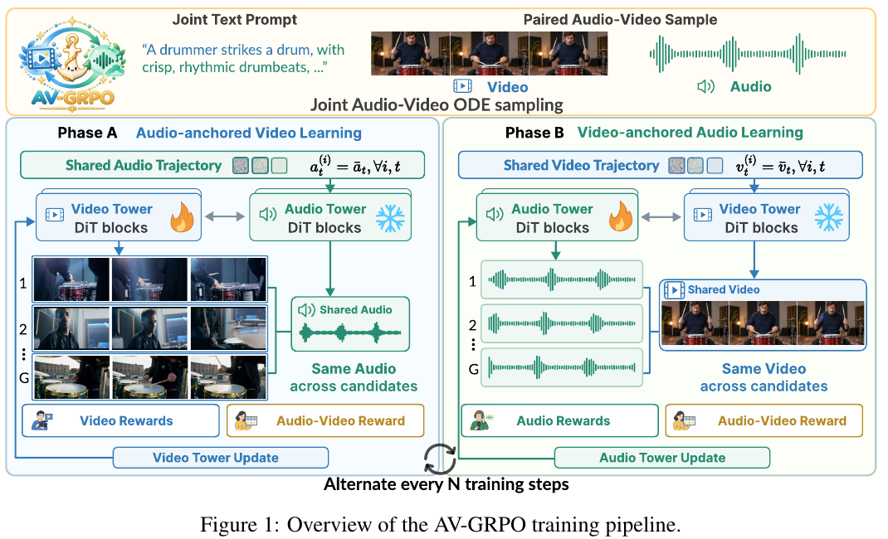

# AV-GRPO：音画一起训练时，先把比较的一侧固定

作者：Xu, Zhiyu、Yan, Weilong、Shi, Yufei、Li, Shiyang、Liu, Yihao、Lam, Kin-Man、Cao, Yuewen。arXiv:2609.29816 v1，首发2026-09-24。预印本。

新近创新 / 新近实用；热度待验证。已读核心原文，本站未复现。

联合音视频生成需要同时优化画面、声音和二者同步。若一组候选连声音和画面都各不相同，很难分清奖励变化来自哪一侧。AV-GRPO每次固定一条音频轨迹，采样多条视频来比较；另一阶段反过来固定视频、训练音频。共享锚点让同组候选面对相近的同步难度。

实验使用LTX-2.3 22B、5760条5DAV提示、8张A800 80GB，输出544×960、97帧、24fps，采样15步。论文比较了2、4、8步的交替间隔，并选择4步设置；这不是每个视频帧简单交替更新，也不是仅训练一个完全独立的音频后处理器。

在Javis评测中，完整微调的AQ由5.097升至5.798，CLAP由0.408到0.468，DeSync由0.757降至0.607。LoRA版本的DeSync更低，却在部分画面指标上回落；完整版本也并非所有视觉指标都优于基座。数字来自自动代理指标，不能直接等同于所有人听感或观感提升。

为什么现在值得看：它提供了多模态奖励归因的具体处理办法，并保留联合训练与交替训练的对照。理论分析依赖理想化核与假设，不是给实际神经网络训练作无条件收敛保证。本期源码包下载中断后改读完整PDF，未执行昂贵训练；复现还应补真实用户偏好与不同声音事件的误差分析。

Zhiyu Xu等人的图1（CC BY 4.0），裁取PDF第3页完整方法图与图注；[完整原页](https://arxiv.org/pdf/2609.29816v1#page=3)。左半固定音频比较多条视频，右半固定视频比较多条音频；看雪花与火焰以及共享轨迹，理解奖励比较的条件。（[作者原图](https://arxiv.org/abs/2609.29816v1)；[查看大图](../../../frontiers/2026/09/2026-09-27/images/avgrpo-method.png)。）

[原始论文](https://arxiv.org/abs/2609.29816v1) · [版本许可](http://creativecommons.org/licenses/by/4.0/)

采用CC BY 4.0，归档未改动的原版PDF，保留作者、版本和许可。
[归档PDF](2609.29816v1.pdf)

[返回本期论文精选](../../../frontiers/2026/09/2026-09-27/03-论文精选.md)
