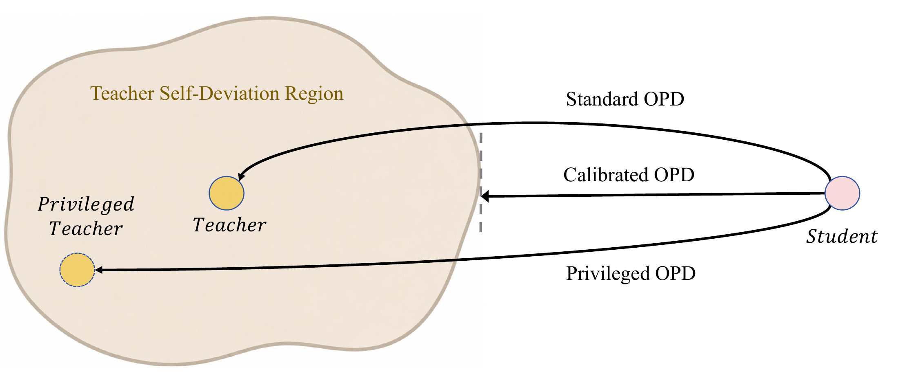

# Cal-OPD：教师自己会波动，学生不必学习全部差异

作者：He, Qiangqiang、Li, Jin、Chen, MingCai。arXiv:2609.21619 v1，2026-09-18。预印本，未宣称录用。

入选：新近创新；热度待验证。已读核心原文，本站未复现。

在策略蒸馏让学生先生成轨迹，再比较教师和学生对这些 token 的概率。Cal-OPD 提醒我们：差异不全来自学生能力不足，教师的概率也会因上下文或评价提示而变动。直接学完整差异，可能把这部分教师自身波动一起学进去。

方法固定问题和学生轨迹，给教师正、负两种评价干预，估计每个 token 的对数概率偏移范围，再用系数放宽这个区间。学生落在区间内时该 token 的优势设为零；落在外面时只保留到最近边界的距离。额外信息用于校准教师参考，而不是直接把带提示的教师概率当训练目标。

作者在两组 Qwen3 教师—学生组合、六个数学集上比较，训练 100 步、每步 256 条轨迹，使用八张 H20。指标为每题采样 16 次后的平均正确率 Avg@16，不是 16 次中答对一次即成功。4B→1.7B 设置由标准 OPD 的 50.8 到 53.1；30B→4B 由 65.9 到 69.0。不是每一个数据集都最好。

主要配置保留约 52%–65% 的原始差异，但这只是观测到的信号比例。区间放得过宽会丢掉有用监督；答案或完整解法作为干预也未必优于简单评价。作者报告轨迹缩短抵消了额外教师计算，在该设置中训练约快 1.26 倍，不能推成普遍定律。[本期技术实践](../../../frontiers/2026/09/2026-09-22/05-技术实践.md)仅复现区间残差的算术直觉。

作者 Figure 1，CC BY 4.0。阴影区间代表估计的教师自身偏移，Cal-OPD 只保留学生落在区间外的那一段距离；这不是教师真值的统计置信区间。（[作者原图](https://arxiv.org/abs/2609.21619v1)；[查看大图](../../../frontiers/2026/09/2026-09-22/images/calopd-method.png)。）

[原始论文](https://arxiv.org/abs/2609.21619v1) · [版本许可](http://creativecommons.org/licenses/by/4.0/)

此版本为 CC BY 4.0，本站保存未经修改的原始 PDF，保留作者、版本和来源。
[归档 PDF](2609.21619v1.pdf)

[返回本期论文精选](../../../frontiers/2026/09/2026-09-22/03-论文精选.md)
