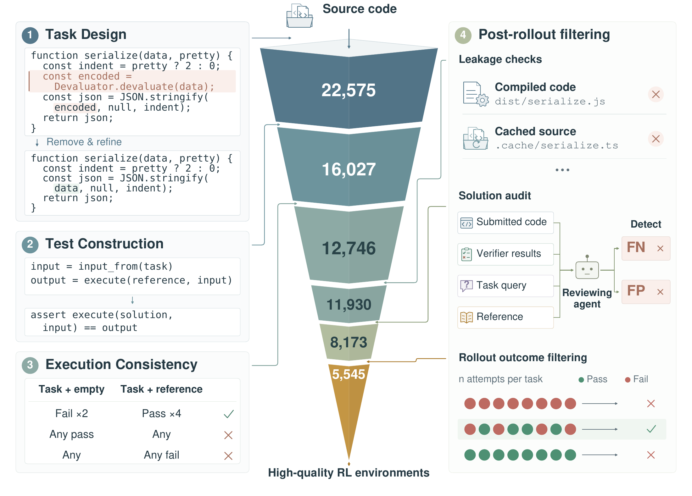

# CodeMidas：从已有源码构造有执行反馈的训练题

作者：Ye, Bowen、Li, Lei、Li, Shicheng、Yue, Zihao、Zhang, Linghao、Lv, Hanglong、Liu, Yuanxin、Ma, Wenhan、Tian, Hao、Li, Rang、Dong, Jinhao、Zhao, Yikai、Deng, Xiangwei、Zhang, Hailin、Zhao, Liang、Liu, Qi、Kong, Lingpeng、Yang, Tong、Luo, Fuli。arXiv:2609.22068 v1，2026-09-18。预印本，未宣称录用。

入选：新近创新；热度待验证。已读核心原文，本站未复现。

代码 Agent 的训练题不一定要从 Issue 或提交记录中找。CodeMidas 先让构造 Agent 阅读现有实现，确定公开输入输出和行为要求，再移除核心实现，让解题 Agent 把缺失功能补回去。原代码是参考实现，不是最终题面中的现成答案。

测试用例通过运行参考代码获得预期结果，还要检查断言是否额外限制了题面没要求的细节。例如只要求抛出某类异常，就不应绑定偶然的报错措辞。环境需在两个初始容器中失败、四个放回参考解的容器中通过；后续再用解题轨迹排查残留代码泄漏、误判和难度异常。这些步骤比“自动出了一道题”更接近可用的训练环境。

作者从 3185 个仓库得到 5545 道训练题，以 MiMo-V2.5 做 GRPO。相同评测设置下，DeepSWE 从 10.0% 到 21.7%，Terminal-Bench 2.1 从 63.7% 到 72.2%。ProgramBench 从 4.5 到 21.5 的指标是至少通过 95% 测试的 Almost Solved，不能写成完整解决率；这些增量都是百分点。

值得复现的对照是质量过滤与数量扩展：未经同等清理的约 8000 题并没有因为更多就更好。但作者还观察到轨迹变长，效果与计算预算不能分开看；参考测试也不保证覆盖所有合法实现。原文提供了可检查的环境构造流程，本期没有把论文中的训练规模当作已下载完整环境的证明。

作者方法总览图。先看左到右的任务设计、执行定标和筛选，再看保留题目的数量；多级检查的目的在于避免有题面却没有可靠判题器。限本条方法评论引用。（[作者原图](https://arxiv.org/abs/2609.22068v1)；[查看大图](../../../frontiers/2026/09/2026-09-22/images/codemidas-method.png)。）

[原始论文](https://arxiv.org/abs/2609.22068v1) · [版本许可](http://arxiv.org/licenses/nonexclusive-distrib/1.0/)

此版本采用 arXiv 非独占分发许可，不能据此推断本站获准再分发全文；本站只保存阅读卡，PDF 请到原站阅读。方法图在本页针对性技术评论中作有限引用，未改动数据或关系，不表示可任意再分发。
[返回本期论文精选](../../../frontiers/2026/09/2026-09-22/03-论文精选.md)
