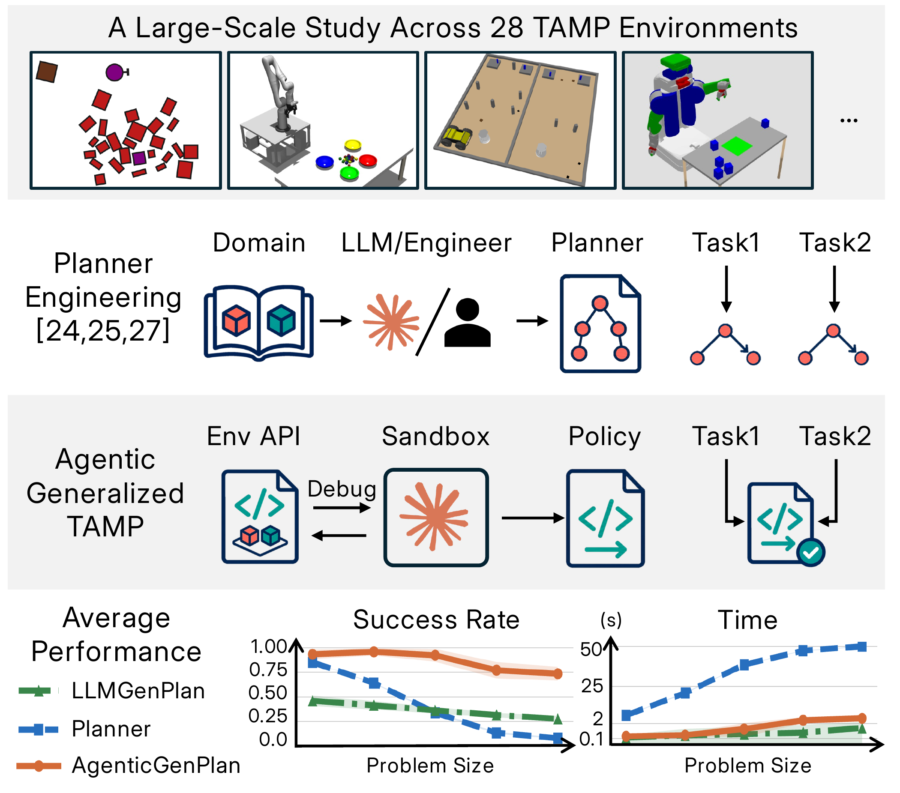

# 编码Agent做任务与运动规划：先写策略，再冻结测试

作者：Merler, Matteo、Li, Bowen、Roy, Josh、Liang, Yichao、Wang, Qianwei、Huang, Yixuan、Silver, Tom。arXiv:2609.30233 v1，首发2026-09-24。预印本。

新近创新 / 新近实用；热度待验证。已读核心原文，本站未复现。

传统任务与运动规划（TAMP）通常需要人工设计谓词、操作和采样器。本文让现成编码Agent得到任务说明与模拟器接口，在预算内自己编写Python、NumPy、SciPy代码，调用reset、step、render做试验，最终交出一份策略程序。测试阶段冻结程序，不再让大模型为每个动作持续思考。

研究覆盖28个环境、七种程序合成方法、每配置五次运行，每个程序测试100个留出实例，共980份程序、98000回合。主要设置不提供环境源代码，也没有互联网；另设提供源代码的条件用于比较。新增价值是把代理的调试能力转成可重复执行的规划产物，而不是把一个成功演示当作泛化。

总体上，Opus配置无源码约74%、有源码约84%；Astra约86%与95%。但动态三维任务更难，Astra相应组约65%，不能由均值推断每类场景都接近解决。与LLMGenPlan的对照还存在反馈方式、推理配置等差异，因此改进不宜全部归因于单一组件。

论文报告的约1.3毫秒每动作，来自15个满足特定成功条件的环境子集，不是全部实例、更不是含真实视觉感知和硬件通信的控制延迟。现在值得借鉴的是冻结产物、留出测试与源代码可见性的分开评估；本研究仍是模拟器中的有限分布泛化，本站未连接真实机器人。

Matteo Merler等人的图1（CC BY 4.0）。中间对比人工规划组件与通过环境API生成策略程序；下方曲线只聚合有规划器、且有多个物体数量设置的环境，横轴问题规模与上文全28环境平均值的口径不同。（[作者原图](https://arxiv.org/abs/2609.30233v1)；[查看大图](../../../frontiers/2026/09/2026-09-27/images/tamp-method.png)。）

[原始论文](https://arxiv.org/abs/2609.30233v1) · [版本许可](http://creativecommons.org/licenses/by/4.0/)

采用CC BY 4.0，归档未改动的原版PDF，保留作者、版本和许可。
[归档PDF](2609.30233v1.pdf)

[返回本期论文精选](../../../frontiers/2026/09/2026-09-27/03-论文精选.md)
