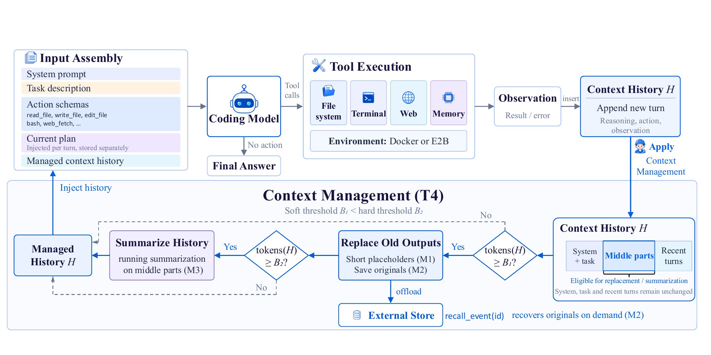

# 编码 Agent 框架实证：压缩、规划和工具接口，谁真正省钱

作者：Fan, Run-Ze、Zhang, Zihao、Ma, Simin、Hu, Yebowen、Wang, Shouju、Song, Kaiqiang、Liu, Fei、Zamani, Hamed、Wang, Xiaoyang。arXiv:2609.20804 v1，2026-09-17；按预印本阅读，不宣称录用。

[原始论文](https://arxiv.org/abs/2609.20804v1) · [版本许可](http://arxiv.org/licenses/nonexclusive-distrib/1.0/)

入选：近期热门讨论＋新近创新。已读原文核心方法与结果；本站未复现训练或大型评测。

论文比较运行框架如何影响编码 Agent：上下文太长时怎样保留信息，是否显式规划，以及使用专用工具还是只用终端。它在9月18日HF列表获得37票，HN讨论快照为203点；mini-SWE-agent维护者和其他读者讨论其结论与适用范围。这构成两类近期关注，但不是两份独立性能复现。

实验覆盖三种Nemotron 3规模和Mistral Medium 3.5，在SWE-bench Verified的500项任务与Terminal-Bench 2.1的89项任务上比较。20组上下文配置加规划、bash-only变体，总计176个模型／框架／基准设置，每任务一次运行。没有测试GPT、Claude、Qwen或DeepSeek，不能把结论直接套到所有编码模型。

原图中的上下文控制先做低成本内容省略和外部保存，接近预算后再摘要，最近交互与固定说明得到保留。最完整的T4方案在八个模型／基准组合中七个平均费用最低、成绩总体相近。成本下降有清楚条件，不等于每个配置的成功率都提高。

另外两个结果更适合指导自己的对照实验：按需取回被省略内容没有稳定收益；规划对小模型较有帮助，对大模型可能降低费用但略损成绩。bash-only对照同时改变工具、说明、文件跟踪和诊断，无法把所有差异归因于工具数量。小基准、单次运行以及不少不显著对照，都限制了普遍化结论。

复现时应先固定模型、任务和预算，再一次改变一个机制；直接更换整套框架很难知道收益来自哪里。本期未核验可运行的作者发布包，也未重复评测，阅读重点是实验设计与条件。[HN技术讨论](https://news.ycombinator.com/item?id=49753878)与[当日论文榜](https://huggingface.co/papers/date/2026-09-18)保留为关注证据。

作者框架图：沿输入、工具交互与上下文管理阅读。压缩、外部存储和摘要承担不同工作；框架示意不表示每个模块都单独证明有效。（[作者原图](https://arxiv.org/abs/2609.20804v1)；[查看大图](../../../frontiers/2026/09/2026-09-19/images/harness-overview.png)。）

原版本仅授予arXiv非独占分发权，本站不再分发全文PDF；原图限本条研究评论所需引用，保留作者与来源。

[返回本期论文精选](../../../frontiers/2026/09/2026-09-19/03-论文精选.md)
