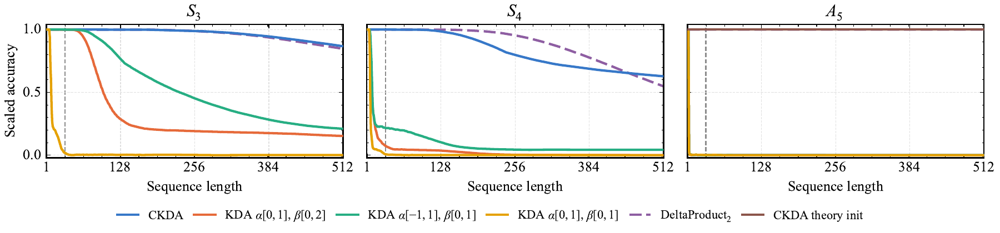

# Complex KDA：两次反射，让线性状态真正转起来

作者：Siems, Julien、Grazzi, Riccardo、Pöppel, Korbinian、Singh, Jaisidh、Zela, Arber、Carstensen, Timur、Jitsev, Jenia、Hutter, Frank、Cevher, Volkan、Orvieto, Antonio、Klein, Aaron。arXiv:2609.24797 v1，2026-09-21。预印本，未宣称录用。

入选：新近创新；热度待验证。已读核心原文，本站未复现。

标准 KDA 将通道衰减门与低秩更新组合。CKDA 同时允许门取 −1 到 1、更新系数 β 取 0 到 2：带负号的门可以作一次坐标反射，β=2 时的 Householder 更新再作一次反射。两次方向不同的反射合起来就是旋转，于是状态能保存相位，而不只是沿实特征方向衰减。

这个变化仍保持对角加秩一形式和非扩张条件。论文给出正交转移矩阵的刻画及群状态跟踪结论，但可表达不等于训练一定学得会：普通训练未学好 A5，靠近理论构造的初始化才得到更好外推，而且该实验连架构和训练计划也变了，不能只归功于初始化。

状态跟踪实验训练长度到 32，图中报告三种种子的最佳结果，并将随机猜测到完美表现缩放为 0–1；不是种子平均原始准确率。S3、S4 外推在两项范围同时扩展时最好，S4 长序列仍下降。周期波形任务中，非线性 GRU 依然更准确，不能从特定 Transformer 对照推导它全面领先。

语言建模的 1.3B 参数、100B FineWeb-Edu token 实验里，循环 CKDA 与匹配 KDA 的平均准确率为 54.06% 和 54.09%，基本相当。实现保留约 96–97% 的 KDA 内核吞吐，而不是零开销。它现在值得读的核心是表达能力解释及可运行实现，不是一个夸大的通用语言性能突破。技术实践用二维算例演示这两次反射。

作者状态跟踪图（Figure 6）。比较同时放宽两个范围与只改一个范围；结果是最佳种子的缩放准确率，A5 使用不同的理论附近初始化设置。请结合正文条件阅读，CC BY 4.0。（[作者原图](https://arxiv.org/abs/2609.24797v1)；[查看大图](../../../frontiers/2026/09/2026-09-23/images/paper-ckda.png)。）

[原始论文](https://arxiv.org/abs/2609.24797v1) · [版本许可](http://creativecommons.org/licenses/by/4.0/)

此版本许可允许再分发（CC BY 4.0 或 CC0，见下方原始许可），本站保存未经修改的原始 PDF，保留作者、版本和来源。
[归档 PDF](2609.24797v1.pdf)

[返回本期论文精选](../../../frontiers/2026/09/2026-09-23/03-论文精选.md)
